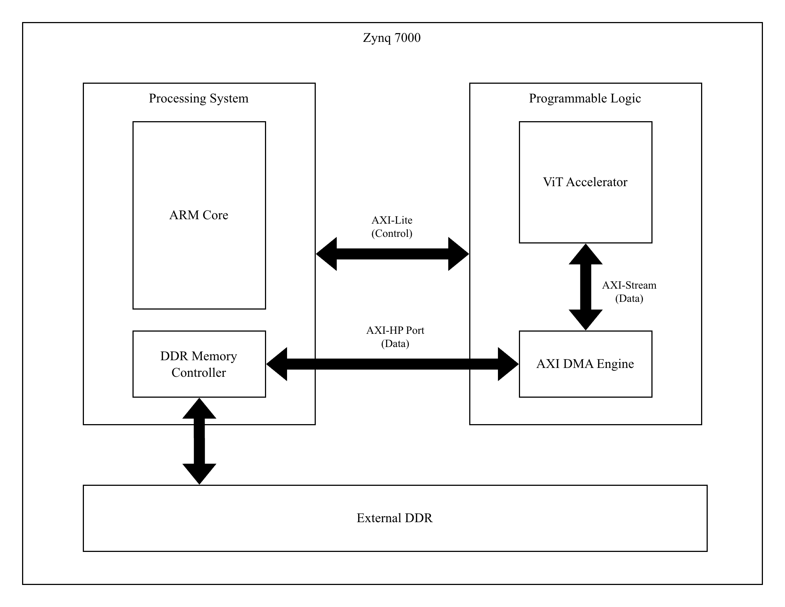

# Vision Transformer (Tiny-ViT) Accelerator on Zynq-7000

## Table of Contents

- [1. Abstract](#1-abstract)
- [2. System Overview](#2-system-overview)
  - [2.1. Goals & Metrics](#21-goals--metrics)
  - [2.2. Hardware/Software Partition](#22-hardwaresoftware-partition)
  - [2.3. Top-Level Architecture](#23-top-level-architecture)
    - [2.3.1. Processing System (PS)](#231-processing-system-ps)
    - [2.3.2. Programmable Logic (PL)](#232-programmable-logic-pl)
- [3. TinyViT-5M Model Architecture](#3-tinyvit-5m-model-architecture)
  - [3.1. Model Parameters (TinyViT-5M)](#31-model-parameters-tinyvit-5m)
  - [3.2. Architectural Stages](#32-architectural-stages)
    - [1. Convolutional Stem (PatchEmbed)](#1-convolutional-stem-patchembed)
    - [2. Stage 1 – Convolutional Layer](#2-stage-1--convolutional-layer)
    - [3. Stages 2–4 – Transformer Layers](#3-stages-24--transformer-layers)
      - [a. Windowed Multi-Head Self-Attention (MSA)](#a-windowed-multi-head-self-attention-msa)
      - [b. Residual Connection 1](#b-residual-connection-1)
      - [c. Local Convolution](#c-local-convolution)
      - [d. MLP Block (Feed-Forward Network)](#d-mlp-block-feed-forward-network)
      - [e. Residual Connection 2](#e-residual-connection-2)
    - [4. Downsampling (PatchMerging)](#4-downsampling-patchmerging)
    - [5. Classifier Head](#5-classifier-head)
  - [3.3. Hardware Relevance Summary](#33-hardware-relevance-summary)
- [4. Global Design Constraints](#4-global-design-constraints)
  - [4.1. Clocking & Reset](#41-clocking--reset)
  - [4.2. Numerics & Data Representation](#42-numerics--data-representation)
  - [4.3. Interface Standards](#43-interface-standards)
- [5. Accelerator Architecture (PL)](#5-accelerator-architecture-pl)
  - [5.1. Module Inventory](#51-module-inventory)
- [6. Functional Block Descriptions](#6-functional-block-descriptions)
  - [6.1. axi_lite_regs](#61-axi_lite_regs)
  - [6.2. scheduler_tiler](#62-scheduler_tiler)
  - [6.3. axi_dma_shim](#63-axi_dma_shim)
  - [6.4. gemm_core](#64-gemm_core)
  - [6.5. requant_unit](#65-requant_unit)
  - [6.6. residual](#66-residual)
- [7. Attention Block](#7-attention-block)
  - [7.1. Interfaces](#71-interfaces)
  - [7.2. Phase Map](#72-phase-map)
  - [7.3. Control FSM (summary)](#73-control-fsm-summary)
- [8. MLP Block](#8-mlp-block)
- [9. Dataflow & Pipeline](#9-dataflow--pipeline)
- [10. Interfaces & Register Map (AXI-Lite)](#10-interfaces--register-map-axi-lite)
- [11. Verification Plan](#11-verification-plan)
  - [11.1. Unit Tests](#111-unit-tests)
  - [11.2. Integration Tests](#112-integration-tests)
  - [11.3. System Tests](#113-system-tests)
- [12. Risks & Mitigations](#12-risks--mitigations)
- [13. Tools & Environment](#13-tools--environment)
- [Appendix A. Requantization Details](#appendix-a-requantization-details)
- [Appendix B. Signal Dictionary (excerpt)](#appendix-b-signal-dictionary-excerpt)

## 1. Abstract

We implement a TinyViT-5M accelerator on Xilinx Zynq-7000 (Arty Z7) in pure Verilog. Target: **>=1 FPS** on 224×224 input with **INT8** weights/activations and **INT32** accumulation; accuracy within **1–2%** of an INT8 software baseline. Data moves via **AXI-HP + AXI DMA**; control via **AXI-Lite**.

## 2. System Overview

### 2.1 Goals & Metrics

- **Throughput:** >=1 FPS baseline; stretch 2–5 FPS on Z7-20.  
- **Accuracy:** <=2% drop vs. INT8 golden model.  
- **Implementation:** Verilog RTL

### 2.2 Hardware/Software Partition

- **PS (ARM):** config, DMA setup, I/O management, post-processing.  
- **PL:** compute kernels (GEMM, Softmax, GELU, Norm), buffers, control FSMs.  
- **Memory:** External DDR for images/weights/results.

### 2.3 Top-Level Architecture

*Figure 1: Top level diagram*

#### 2.3.1 Processing System (PS)

The PS runs the main control firmware on its ARM core. Its primary responsibilities include:

- **Memory Management:** Allocating and managing DDR memory buffers for input images, model weights, and output results.
- **Accelerator Control:** Programming the accelerator's control registers via the AXI-Lite interface to set parameters and start computation.
- **Data Movement:** Configuring AXI DMA transfer descriptors to move data between DDR and the PL.
- **Supervision:** Handling interrupts, monitoring for timeouts, and managing error recovery.
- **Post-processing:** Optionally performing final computations on the results, such as argmax to find the classification.

#### 2.3.2 Programmable Logic (PL)

The PL contains the custom hardware for the ViT computation.

- **ViT Accelerator Core:** A dedicated RTL module containing the compute engines (GEMM, Softmax, Norm, GELU), on-chip tile buffers, and control FSMs that orchestrate the layer computations.
- **AXI DMA Engine:** Provides high-bandwidth data transfer between the external DDR and the accelerator core over AXI-Stream interfaces.
  - **MM2S (Memory-to-Stream):** Reads input tokens and weights from DDR and streams them into the accelerator.
  - **S2MM (Stream-to-Memory):** Captures processed results from the accelerator and writes them back to DDR.

## 3. TinyViT-5M Model Architecture

To understand the hardware requirements, it is essential to first analyze the target neural network.  
The accelerator is designed for **TinyViT-5M**, a compact, high-performance hybrid vision model.

Unlike the original **Vision Transformer (ViT)** which relies purely on self-attention, **TinyViT** employs a *hybrid architecture* that strategically combines:

- **Convolution** for efficient low-level feature extraction, and  
- **Windowed self-attention** for global information mixing.

This hybrid design is key to TinyViT’s computational efficiency — and maps directly to our hardware modules (Attention Block, MLP Block, GEMM, and Scheduler).

The model is organized into a **convolutional stem**, **four sequential stages**, and a **classifier head**.

### 3.1 Model Parameters (TinyViT-5M)

The target variant is `tiny_vit_5m_224`, which determines the compute and memory footprint of the accelerator.

| Parameter | Description | Value |
|------------|--------------|--------|
| **Input Resolution** | Image size | 224 × 224 |
| **Stages (Layers)** | Sequential depth | 4 |
| **Blocks per Stage** | Depth per stage | [2, 2, 6, 2] |
| **Embedding Dims** | Feature width per stage | [64, 128, 160, 320] |
| **Attention Heads** | Multi-head attention configuration | [2, 4, 5, 10] |
| **Attention Windows** | Window sizes per stage | [7, 7, 14, 7] |

### 3.2 Architectural Stages

The data flows through the network as follows:

#### 1. Convolutional Stem (PatchEmbed)

The model begins with a **PatchEmbed** module.  
Instead of a single large convolution, TinyViT uses **two sequential 3×3 convolutions** (each with stride 2, followed by BatchNorm and GELU).  
This down-samples the image by 4× and forms the initial token embeddings.

#### 2. Stage 1 – Convolutional Layer

This stage is **purely convolutional**, built from **MBConv** (Mobile Inverted Bottleneck) blocks inspired by MobileNetV2.  
It efficiently processes high-resolution, low-level features without the quadratic cost of self-attention.

#### 3. Stages 2–4 – Transformer Layers

These are the **core transformer stages**.  
Each stage is a stack of **TinyViTBlock** modules — the primary target of our accelerator.

For an input token $X_{in}$, the computation proceeds as follows:

##### a. Windowed Multi-Head Self-Attention (MSA)

Each block begins with normalization and a windowed attention operation:

$$
\begin{aligned}
X_{\text{norm1}} &= \text{LayerNorm}(X_{in}) \\
Q, K, V &= \text{Linear}(X_{\text{norm1}}) \\
\text{AttnMatrix} &= \text{softmax}\left(\frac{QK^T}{\sqrt{d_k}} + B\right) \\
X_{\text{attn}} &= \text{Linear}(\text{AttnMatrix} \cdot V)
\end{aligned}
$$

- **Hardware mapping:** The `attention_block` orchestrates this flow using the `gemm_core` for:
  - Three linear projections (Q, K, V)
  - $QK^T$ multiplication
  - $\text{AttnMatrix} \times V$ multiplication  
  - $B$ represents the learned relative position bias.

##### b. Residual Connection 1

A skip connection adds the attention output to its input:

$$
X' = X_{in} + X_{\text{attn}}
$$

Handled by the **Residual** module in hardware.

##### c. Local Convolution

After the first residual, a **3×3 depthwise convolution** (LocalConv) refines local features:

$$
X'' = \text{LocalConv}(X')
$$

##### d. MLP Block (Feed-Forward Network)

This stage applies a two-layer MLP with GELU activation:

$$
\begin{aligned}
X_{\text{norm2}} &= \text{LayerNorm}(X'') \\
X_{\text{mlp}} &= \text{Linear}(\text{GELU}(\text{Linear}(X_{\text{norm2}})))
\end{aligned}
$$

- **Hardware mapping:** Implemented in the `mlp_block`, which uses:
  - `gemm_core` for both linear layers  
  - A lightweight LUT-based GELU approximation.

##### e. Residual Connection 2

A second skip connection merges the MLP output with the LocalConv result:

$$
X_{\text{out}} = X'' + X_{\text{mlp}}
$$

#### 4. Downsampling (PatchMerging)

Between stages, **PatchMerging** reduces spatial resolution while increasing channel width.  
It consists of **1×1**, **3×3 (stride=2)**, and **1×1** convolutions.  
Example transitions:

- 56×56 → 28×28 spatially  
- 64 → 128 channels

#### 5. Classifier Head

Finally, all token outputs are **average pooled**, passed through a **LayerNorm**, and a final **Linear layer** (GEMM) produces the classification logits.

$$
\text{logits} = \text{Linear}(\text{AvgPool}(\text{LayerNorm}(X_{\text{out}})))
$$

This is the only layer executed on the **ARM core** (optional) or the **GEMM hardware unit** for full acceleration.

### 3.3 Hardware Relevance Summary

| Model Component | Hardware Module | Operation Type |
|------------------|------------------|----------------|
| PatchEmbed / PatchMerging | Scheduler + AXI DMA | Convolution / Data Movement |
| Attention (Q, K, V, MSA) | Attention Block + GEMM Core | Matrix Multiply + Softmax |
| MLP (fc1, GELU, fc2) | MLP Block + GEMM Core | Matrix Multiply + Non-linear |
| Residual / LayerNorm | Residual + Norm Units | Elementwise Add / Normalization |
| Classifier Head | GEMM Core | Fully Connected Layer |

## 4. Global Design Constraints

### 4.1 Clocking & Reset

- Single PL clock domain (**aclk**).  
- **Initial Fmax:** 150 MHz; **Optimization target:** 180–200 MHz.  
- **aresetn:** active-low, synchronous; deterministic reset state.

### 4.2 Numerics & Data Representation

- **INT8** activations/weights (symmetric −128..127); **INT32** accumulators.  
- **Requantization:** `y_int8 = saturate(round((acc * M)/2^s) + zp)` (zp≈0).  
- **Scales:** per-channel (weights) + per-tensor (activations).

### 4.3 Interface Standards

- **AXI4-Stream:** default 128-bit (16×INT8), full tvalid/tready back-pressure, `tlast` on packet end.  
- **AXI4-Lite:** 32-bit CSRs, 32-bit aligned; W1C status flags.

## 5. Accelerator Architecture (PL)

*Figure 2: ViT PL Block Diagram, you can look at more detailed version at [google drive](https://drive.google.com/file/d/162GrEpLs2getctECauzURsrsy7bRrSK8/view?usp=sharing)*

### 5.1 Module Inventory

- **axi_lite_regs** – CSR bank (config, status, perf counters).  
- **scheduler_tiler** – master FSM: tiling loops, op sequencing.
- **axi_dma_shim** – DMA command/stream bridge; sustains >= 80% bus bandwidth.  
- **gemm_core** – 8×8 INT8 MAC systolic array (INT32 accumulate).  
- **requant_unit** – INT32->INT8 conversion.
- **residual** - Adds two INT8 vectors, handling potential differences in quantization scales before saturation.
- **attention_block**, **mlp_block** – integrators that sequence shared kernels.

## 6. Functional Block Descriptions

### 6.1 `axi_lite_regs`

**Purpose:** Serves as the single memory-mapped interface between the Processing System (PS) and the Programmable Logic (PL) accelerator.

**Key Functionality:**

- PS-to-PL (Configuration): Receives configuration data from the ARM core via the AXI-Lite bus. It holds registers for base addresses (addr_a_base, addr_b_base, addr_c_base), layer parameters (tile_cfg, layer_cfg), and quantization values (requant_scale, requant_shift).
- PS-to-PL (Control): Provides control signals to the accelerator, most notably the start signal to begin computation, a soft_reset for the FSMs, and an irq_enable flag.
- PL-to-PS (Status): Receives status flags (status[2:0]) from the scheduler_tiler, allowing the PS to poll for accelerator state (e.g., idle, busy, done). This register bank is the central point for all software control and monitoring

**Interface**
<!-- # Module axi_lite_regs (AXI4-Lite Slave Interface) -->

| **Signal Name**               | **Signal Width**   | **Direction** | **Destination**        | **Description**                                                                 |
| ----------------------------- | ------------------ | ------------- | ---------------------- | ------------------------------------------------------------------------------- |
| **AXI Stream**                |                    |               |                        |                                                                                 |
| `axi_lite[146:0]`             | 147 bits           | Input         | `Processing System`    | This is the bus to control AXI Regs                                             |
| **w/ Scheduler**              |                    |               |                        |                                                                                 |
| `status[2:0]`                 | 3 bits             | Output        | `scheduler_tiler`      | Scheduler status flags (e.g., `idle`, `busy`, `done`, or `error`)               |
| `start`                       | 1 bit              | Input         | `scheduler_tiler`      | Start signal - triggers the Scheduler to begin operation sequence               |
| `soft_reset`                  | 1 bit              | Input         | `scheduler_tiler`      | Soft reset control for internal FSMs                                            |
| `irq_enable`                  | 1 bit              | Input         | `scheduler_tiler`      | Interrupt enable flag for completion/status interrupts                          |
| `tile_cfg[31:0]`              | 32 bits            | Input         | `scheduler_tiler`      | Tile configuration word (defines tiling dimensions, size, etc.)                 |
| `addr_a_base[31:0]`           | 32 bits            | Input         | `scheduler_tiler`      | Base DDR address for Matrix A                                                   |
| `addr_b_base[31:0]`           | 32 bits            | Input         | `scheduler_tiler`      | Base DDR address for Matrix B                                                   |
| `addr_c_base[31:0]`           | 32 bits            | Input         | `scheduler_tiler`      | Base DDR address for Matrix C (output buffer)                                   |
| `requant_scale[31:0]`         | 32 bits            | Input         | `scheduler_tiler`      | Requantization multiplier (scaling factor for INT8 conversion)                  |
| `requant_shift[31:0]`         | 32 bits            | Input         | `scheduler_tiler`      | Requantization right-shift value for scaling adjustment                         |
| `layer_cfg[31:0]`             | 32 bits            | Input         | `scheduler_tiler`      | Layer configuration register (defines layer type, sequence, etc.)               |

### 6.2 `scheduler_tiler`

**Purpose:** Acts as the global sequencer and master controller for the entire accelerator. It orchestrates the full computation of a Transformer layer, issuing commands to all other blocks.

**Key Functionality:**

- **Top-Level Control:** Responds to the start signal from axi_lite_regs to begin its main FSM. It manages the overall operation sequence (e.g., Attention block, then MLP block).
- **DMA Coordination:** Issues high-level commands to the axi_dma_shim (e.g., dma_start_transfer, dma_ddr_addr, dma_length_bytes, dma_direction) to move data tiles from DDR into the PL or write results back. It waits for the dma_transfer_done signal before proceeding.
- **Compute Block Orchestration:** Controls the attention_block and mlp_block by asserting compute_start_op and setting the compute_op_select signal. It waits for their respective attn_block_op_done or mlp_block_op_done flags to synchronize operations.
- **Data Path Configuration:** Dynamically configures the accelerator's internal data path by driving the sel lines for all multiplexers (e.g., gemm_a_mux_sel, requant_in_sel, residual_b_mux_sel, dma_sel). This allows it to route data streams between the correct source and destination modules for each computational phase.
- **Status Reporting:** Provides its current state (status[2:0]) back to the axi_lite_regs for the PS to read.

**Interface**
<!-- # Module scheduler_tiler -->

| **Signal Name**             | **Signal Width**   | **Direction** | **Destination**            | **Description**                                                           |
| --------------------------- | ------------------ | ------------- | -------------------------- | ------------------------------------------------------------------------- |
| **w/ AXI Lite Regs**        |                    |               |                            |                                                                           |
| `status[2:0]`               | 3 bits             | Output        | `axi_lite_regs`            | Scheduler status flags (e.g., idle, busy, done).                          |
| `start`                     | 1 bit              | Input         | `axi_lite_regs`            | Trigger to start the scheduler operation.                                 |
| `soft_reset`                | 1 bit              | Input         | `axi_lite_regs`            | Soft reset for internal FSM reset.                                        |
| `irq_enable`                | 1 bit              | Input         | `axi_lite_regs`            | Interrupt enable flag.                                                    |
| `tile_cfg[31:0]`            | 32 bits            | Input         | `axi_lite_regs`            | Tile configuration (defines M, N, K sizes).                               |
| `addr_a_base[31:0]`         | 32 bits            | Input         | `axi_lite_regs`            | Base DDR address for matrix A.                                            |
| `addr_b_base[31:0]`         | 32 bits            | Input         | `axi_lite_regs`            | Base DDR address for matrix B.                                            |
| `addr_c_base[31:0]`         | 32 bits            | Input         | `axi_lite_regs`            | Base DDR address for matrix C (output buffer).                            |
| `requant_scale[31:0]`       | 32 bits            | Input         | `axi_lite_regs`            | Requantization scaling factor for INT8.                                   |
| `requant_shift[31:0]`       | 32 bits            | Input         | `axi_lite_regs`            | Requantization shift value.                                               |
| `layer_cfg[31:0]`           | 32 bits            | Input         | `axi_lite_regs`            | Layer configuration register.                                             |
| **w/ AXI DMA Shim**         |                    |               |                            |                                                                           |
| `dma_start_transfer`        | 1 bit              | Input         | `axi_dma_shim`             | Command to start the DMA transfer.                                        |
| `dma_ddr_addr[31:0]`        | 32 bits            | Input         | `axi_dma_shim`             | DDR address for DMA operation.                                            |
| `dma_length_bytes[31:0]`    | 32 bits            | Input         | `axi_dma_shim`             | Data length for DMA transfer.                                             |
| `dma_direction`             | 1 bit              | Input         | `axi_dma_shim`             | Direction for DMA operation (0 = read, 1 = write).                        |
| `dma_transfer_done`         | 1 bit              | Output        | `axi_dma_shim`             | Flag indicating DMA transfer completion.                                  |
| **w/ AXI DMA IP**           |                    |               |                            |                                                                           |
| `mm2s_introut`              | 32 bits            | Input         | `axi_dma_ip`               | Interrupt output for the memory-to-stream (MM2S) transfer completion.        |
| `s2mm_introut`              | 32 bits            | Input         | `axi_dma_ip`               | Interrupt output for the stream-to-memory (S2MM) transfer completion.       |
| **w/ Attention & MLP**      |                    |               |                            |                                                                           |
| `compute_start_op`          | 1 bit              | Input         | `attention_block`, `mlp_block` | Start signal for compute operations.                                      |
| `compute_op_select[3:0]`    | 4 bits             | Input         | `attention_block`, `mlp_block` | Select operation type (e.g., Attention, MLP, GEMM, Requant).              |
| `mlp_block_op_done`         | 1 bit              | Output        | `mlp_block`                | Operation done signal from MLP block.                                     |
| `attn_block_op_done`        | 1 bit              | Output        | `attention_block`          | Operation done signal from Attention block.                               |
| **w/ requant_in_mux**       |                    |               |                            |                                                                           |
| `requant_in_sel`            | 1 bit              | Input         | `requant_in_mux`           | Select input source for the Requantization Unit.                          |
| **w/ requant_out_demux**    |                    |               |                            |                                                                           |
| `requant_out_sel`           | 1 bit              | Input         | `requant_out_demux`        | Select output destination for the Requantization Unit.                    |
| **w/ gemm_a_mux**           |                    |               |                            |                                                                           |
| `gemm_a_mux_sel`            | 1 bit              | Input         | `gemm_a_mux`               | Select data stream for GEMM input A.                                      |
| **w/ gemm_b_mux**           |                    |               |                            |                                                                           |
| `gemm_b_mux_sel`            | 1 bit              | Input         | `gemm_b_mux`               | Select data stream for GEMM input B.                                      |
| **w/ residual_in_a_mux**    |                    |               |                            |                                                                           |
| `residual_a_mux_sel`        | 1 bit              | Input         | `residual_in_a_mux`        | Select first operand for Residual Add.                                    |
| **w/ residual_in_b_mux**    |                    |               |                            |                                                                           |
| `residual_b_mux_sel`        | 1 bit              | Input         | `residual_in_b_mux`        | Select second operand for Residual Add.                                   |
| **w/ GEMM done demux & GEMM start mux** |               |               |                            |                                                                           |
| `sel`                       | 1 bit              | Input         | `gemm_start_mux`, `gemm_done_demux` | Select GEMM start/done routing for parallel compute paths.                |
| **w/ DMA Demux**            |                    |               |                            |                                                                           |
| `dma_sel`                   | 1 bit              | Input         | `dma_demux`                 | Select data path or buffer for DMA read/write.                             |

### 6.3 axi_dma_shim

**Purpose:** Acts as a simplified hardware-friendly interface to the complex AXI DMA IP. It translates high-level commands from the scheduler_tiler into the necessary AXI protocol signals to manage data transfers between DDR and the PL's AXI-Streams.
**Key Functionality:**

- **Command Interface:** Receives simple commands (dma_start_transfer, dma_ddr_addr, dma_length_bytes, dma_direction) from the scheduler_tiler.
- **Stream Interface (MM2S):** When dma_direction is 0 (DDR to PL), it fetches data from the specified dma_ddr_addr and streams it out as an AXI-Stream (axis_in) to the dma_demux.
- **Stream Interface (S2MM):** When dma_direction is 1 (PL to DDR), it consumes an AXI-Stream and writes the data to the target DDR address.
- **Synchronization:** Asserts dma_transfer_done back to the scheduler_tiler upon completion of the requested byte transfer, allowing the main FSM to proceed.

### 6.4 `gemm_core`

**Purpose:** The primary compute engine of the accelerator, performing high-throughput tiled General Matrix Multiplication (GEMM) with INT8 inputs and INT32 accumulation.
**Key Functionality:**

- **Compute Kernel:** Implements the core $C_{int32} = A_{int8} \times B_{int8}$ operation as an 8x8 systolic array.
- **Handshake:** Receives a start_tile pulse from the gemm_start_mux to begin computation on a new tile.
- **Data Inputs:** Consumes two parallel AXI-Streams: axis_gemm_a (from gemm_a_mux) and axis_gemm_b (from gemm_b_mux). These streams carry the packed INT8 data for the A and B matrices.
- **Data Output:** Produces an AXI-Stream (axis_0) containing the INT32 accumulator results, which is fed to the requant_in_mux.
- **Synchronization:** Asserts tile_done to the gemm_done_demux once it has finished processing the current tile, signaling it is ready for new data.

### 6.5 `requant_unit`

**Purpose:** Converts the 32-bit integer accumulator values from the gemm_core back into 8-bit integers.

**Key Functionality:**

- **Data Input:** Receives an AXI-Stream (axis_in) from the requant_in_mux. This stream can be either INT32 data from the gemm_core or INT8 data from the residual block.
- **Quantization:** When processing INT32 data, it applies the per-tensor or per-channel requantization formula (acc * M >> s) + zp using the scale (M) and shift (s) values provided by the scheduler_tiler (via axi_lite_regs).
- **Saturation:** Saturates the result to the valid INT8 range (e.g., -128 to 127).
- **Data Output:** Emits the final AXI-Stream (axis_out) of requantized INT8 data to the requant_out_demux.

### 6.6 `residual`

**Purpose:** Performs the element-wise addition required for skip connections ($X_{out} = \text{Layer}(X_{in}) + X_{in}$).

**Key Functionality:**

- **Data Inputs:** Receives two AXI-Streams, axis_residual_a and axis_residual_b, from their respective input multiplexers. These represent the two tensors to be added.
- **Element-wise Add:** Performs INT8 addition on the incoming streams. As noted in the report, this operation must handle potential mismatches in quantization scales between the two inputs before saturating the final result.
- **Data Output:** Produces an AXI-Stream (axis_1) containing the INT8 sum, which is routed to the requant_in_mux. This allows the result of the residual add to be passed through the requant_unit for a final normalization or scaling step before being written to DDR.

## 7. Attention Block

**Role:** orchestrates Q/K/V projections on shared `gemm_core`, computes QKᵀ -> Softmax -> Attn×V; owns tile buffers for Q/K/V and uses `norm_unit`, `softmax_unit`.

### 7.1 Interfaces

### 7.2 Phase map

| Phase   | DMA mode (`dma_mode`) | A-side (`axis_0`) | B-side (`axis_1`) | Requant-A usage |
|---|---|---|---|---|
| **Q-proj** | 0 = tokens | `norm_out` | `axis_wgt` (Wq) | `cap_en=1, cap=Q` |
| **K-proj** | 0 = tokens | `norm_out` | `axis_wgt` (Wk) | `cap_en=1, cap=K` |
| **V-proj** | 0 = tokens | `norm_out` | `axis_wgt` (Wv) | `cap_en=1, cap=V` |
| **QKᵀ** | (no DMA) | `Q_buf` | `Kᵀ` (from buf) | `sfm_en=1` -> **Softmax** |
| **Attn×V** | (no DMA) | `softmax_out` | `V` (from buf) | normal requant -> residual |

> Implementation note: Q/K/V projection phases stream **tokens (A)** against **weights (B)**; intermediate Q & K are captured into tile buffers. QKᵀ result goes through `softmax_unit`; the softmax output tiles multiply **V** to produce the head output (then residual path).  

### 7.3 Control FSM (summary)

1. **Normalize** tokens -> enable Q/K/V projections (three GEMM jobs).  
2. **Sync** when Q/K buffers ready -> schedule **QKᵀ** matmul; gate to Softmax.  
3. **Schedule** **Softmax×V** GEMM; write tiles to output/residual mux.  
4. **Assert** `attn_block_op_done`.

---

## 8. MLP Block

Two GEMM stages with `gelu_pwl` between them, plus optional residual add. Uses weight buffer and tile buffer; orchestrated by local FSM and `scheduler_tiler`.

## 9. Dataflow & Pipeline

1. **DDR -> DMA (MM2S)** streams tokens/weights to tile buffers.  
2. **Scheduler** kicks **Attention** phases per §6.2, then **MLP**.  
3. **GEMM** outputs (INT32) -> **requant_unit** -> INT8.  
4. **Residual add** and write-back via **DMA (S2MM)** to DDR.  
5. **PS** reads logits, computes argmax.

## 10. Interfaces & Register Map (AXI-Lite)

| Offset | Register | Dir | Description |
|---:|---|---|---|
| 0x00 | CONTROL | R/W | `[0]=start, [1]=soft_reset, [2]=irq_enable` |
| 0x04 | STATUS | R | `[0]=done_tick, [1]=busy, [2]=error_flag` |
| 0x10 | TILE_CFG | R/W | M/N/K, strides |
| 0x20 | ADDR_A_BASE | R/W | DDR base for A |
| 0x24 | ADDR_B_BASE | R/W | DDR base for B |
| 0x28 | ADDR_C_BASE | R/W | DDR base for C |
| 0x40 | REQUANT_SCALE | R/W | integer `M` |
| 0x44 | REQUANT_SHIFT | R/W | shift `s` |
| 0x70 | LAYER_CFG | R/W | layer index, heads, d, tokens N |

---

## 11. Verification Plan

### 11.1 Unit Tests

- **gemm_core:** vector tests vs NumPy golden; stall + back-pressure.  
- **requant_unit:** exhaustive sweep for rounding/saturation edges.  
- **softmax_unit:** L1 error <=1.5% vs FP target; sum≈1.0 (quantized).  
- **elementwise_ops:** GELU <=2 LSB; Norm cosine sim >=0.995.

### 11.2 Integration Tests

- **attention_block / mlp_block:** end-to-end match vs PyTorch INT8 tensors within MSE tolerance.

### 11.3 System Tests

- DMA loopback; GEMM microbenchmark; PS<->PL regression.

## 12. Risks & Mitigations

- **DDR bandwidth bottleneck:** double-buffering, larger bursts, on-chip reuse.  
- **Timing closure @ 180–200 MHz:** extra pipelining, floorplanning, temp smaller PE array.  
- **Quantization accuracy:** per-channel scales, larger LUTs, post-quant calibration.

## 13. Tools & Environment

Vivado/Vitis 2024.x, Verilator/xsim, Python 3.10 reference model; Arty Z7-20 board; XDC constraints.

## Appendix A. Requantization Details

Derive `M,s,zp` from INT8 calibration; discuss per-channel vs per-tensor trade-offs.

## Appendix B. Signal Dictionary (excerpt)

- `axis_0`, `axis_1`: dual compute paths (A/B) from blocks.  
- `dma_mode`: 0=tokens, 1=weights.  
- `cap_en`: capture enable into phase buffer (Q/K/V).  
- `sfm_en`: route to softmax pipeline.
