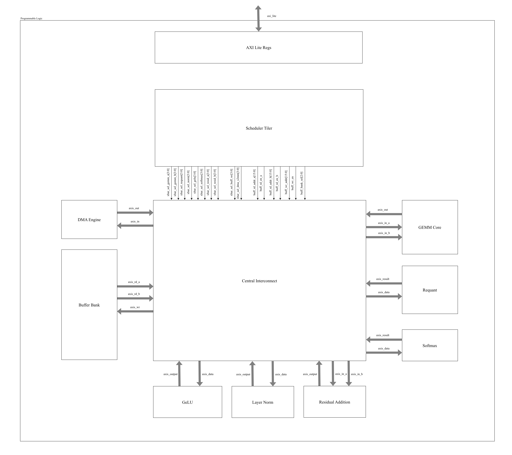
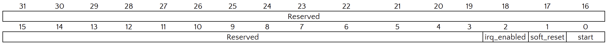
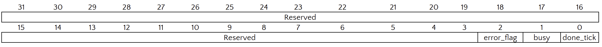
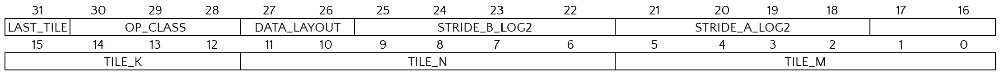
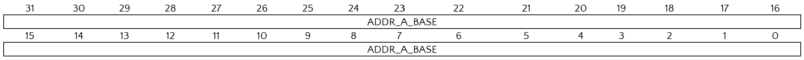
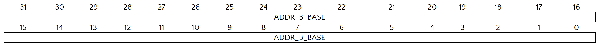
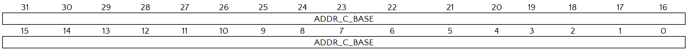
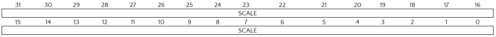
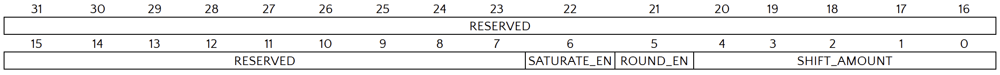
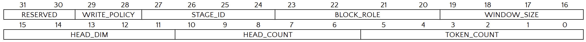

# Vision Transformer (Tiny-ViT) Accelerator on Zynq-7000

## Table of Contents

- [Vision Transformer (Tiny-ViT) Accelerator on Zynq-7000](#vision-transformer-tiny-vit-accelerator-on-zynq-7000)
  - [Table of Contents](#table-of-contents)
  - [1. Abstract](#1-abstract)
  - [2. Theory and Background](#2-theory-and-background)
    - [2.1 Architectural Paradigm: The Hybrid Transformer](#21-architectural-paradigm-the-hybrid-transformer)
    - [2.2 Core Components](#22-core-components)
      - [2.2.1 The Convolutional Stem](#221-the-convolutional-stem)
      - [2.2.2 The TinyViT Block (Hybrid Attention)](#222-the-tinyvit-block-hybrid-attention)
      - [2.2.3 Convolutional Patch Merging](#223-convolutional-patch-merging)
    - [2.3 Data Flow and Dimensionality Analysis](#23-data-flow-and-dimensionality-analysis)
      - [Step 1: The Stem (4x Downsampling)](#step-1-the-stem-4x-downsampling)
      - [Step 2: Stage 0 (Convolutional Processing)](#step-2-stage-0-convolutional-processing)
      - [Step 3: Stage 1 (Transformer / TinyViT Block)](#step-3-stage-1-transformer--tinyvit-block)
      - [Step 4: Stage 2 (Deep Semantic Processing)](#step-4-stage-2-deep-semantic-processing)
      - [Step 5: Stage 3 \& Classifier Head](#step-5-stage-3--classifier-head)
    - [2.4 Mathematical Formulation](#24-mathematical-formulation)
      - [2.4.1 Decoupled Window Attention](#241-decoupled-window-attention)
      - [2.4.2 Symmetric Relative Position Bias](#242-symmetric-relative-position-bias)
      - [2.4.3 Batch Normalization Fusion](#243-batch-normalization-fusion)
    - [2.5 Hardware-Oriented Quantization Scheme](#25-hardware-oriented-quantization-scheme)
    - [2.6 TinyViT-5M Model Architecture](#26-tinyvit-5m-model-architecture)
      - [2.6.1 Model Parameters (TinyViT-5M)](#261-model-parameters-tinyvit-5m)
      - [2.6.2 Architectural Stages](#262-architectural-stages)
        - [1. Convolutional Stem (PatchEmbed)](#1-convolutional-stem-patchembed)
        - [2. Stage 1 – Convolutional Layer](#2-stage-1--convolutional-layer)
        - [3. Stages 2–4 – Transformer Layers](#3-stages-24--transformer-layers)
        - [4. Downsampling (PatchMerging)](#4-downsampling-patchmerging)
        - [5. Classifier Head](#5-classifier-head)
      - [2.6.3 Hardware Relevance Summary](#263-hardware-relevance-summary)
  - [3. System Overview](#3-system-overview)
    - [3.1 Goals \& Metrics](#31-goals--metrics)
    - [3.2 Hardware/Software Partition](#32-hardwaresoftware-partition)
    - [3.3 Top-Level Architecture](#33-top-level-architecture)
      - [3.3.1 Processing System (PS)](#331-processing-system-ps)
      - [3.3.2 Programmable Logic (PL)](#332-programmable-logic-pl)
  - [4. Global Design Constraints](#4-global-design-constraints)
    - [4.1 Clocking \& Reset](#41-clocking--reset)
    - [4.2 Numerics \& Data Representation](#42-numerics--data-representation)
    - [4.3 Interface Standards](#43-interface-standards)
  - [5. Accelerator Architecture (PL)](#5-accelerator-architecture-pl)
    - [5.1 Design Principles](#51-design-principles)
    - [5.2 Module Inventory](#52-module-inventory)
    - [5.3 Central Interconnect Routing](#53-central-interconnect-routing)
  - [6. Functional Block Descriptions](#6-functional-block-descriptions)
    - [6.1 AXI Lite Register](#61-axi-lite-register)
    - [6.2 Scheduler Tiler](#62-scheduler-tiler)
    - [6.3 AXI DMA Shim](#63-axi-dma-shim)
    - [6.4 AXI DMA IP](#64-axi-dma-ip)
    - [6.5 GEMM Core](#65-gemm-core)
    - [6.6 Residual](#66-residual)
    - [6.7 Requant Unit](#67-requant-unit)
    - [6.8 Softmax Unit](#68-softmax-unit)
    - [6.9 ReLU Unit](#69-relu-unit)
    - [6.10 Layer Norm Unit](#610-layer-norm-unit)
  - [7. Operation Sequencing](#7-operation-sequencing)
    - [7.1 Attention Phase Sequence](#71-attention-phase-sequence)
    - [7.2 MLP Phase Sequence](#72-mlp-phase-sequence)
  - [8. Dataflow \& Pipeline](#8-dataflow--pipeline)
  - [9. Verification Plan](#9-verification-plan)
    - [9.1 Unit Tests](#91-unit-tests)
    - [9.2 Integration Tests](#92-integration-tests)
    - [9.3 System Tests](#93-system-tests)
  - [10. Risks \& Mitigations](#10-risks--mitigations)
  - [11. Tools \& Environment](#11-tools--environment)
  - [Appendix A. Requantization Details](#appendix-a-requantization-details)
  - [Appendix B. Signal Dictionary (excerpt)](#appendix-b-signal-dictionary-excerpt)

## 1. Abstract

Recent advances in Vision Transformers (ViTs) have established them as a powerful architecture for visual recognition tasks; however, their quadratic computational complexity and high memory demand pose significant challenges for deployment on embedded hardware. TinyViT, a hybrid transformer model that integrates convolutional feature extraction with windowed self-attention, offers a more efficient alternative but still requires careful optimization to achieve practical inference performance on resource-constrained platforms.

This work presents a hardware accelerator design for TinyViT-5M inference, implemented entirely in Verilog RTL on the Xilinx Zynq-7000 SoC. The proposed system restructures TinyViT’s hierarchical architecture into a quantized and tiled dataflow tailored for FPGA execution. Core computational components—including patch embedding, windowed multi-head self-attention, and MLP feed-forward layers—are mapped to a unified integer pipeline employing INT8 arithmetic with INT32 accumulation. A centralized scheduling finite state machine coordinates computation, data movement, and quantization across stages via AXI4 streaming interfaces and on-chip tiling buffers, minimizing off-chip bandwidth usage.

## 2. Theory and Background

### 2.1 Architectural Paradigm: The Hybrid Transformer

Standard Vision Transformers (ViT) process images by flattening them into a sequence of patches and applying global self-attention. While powerful, this approach has two major limitations for embedded deployment:

1. **Quadratic Complexity:** Global attention scales as $O(N^2)$ with the number of pixels.
2. **Lack of Inductive Bias:** ViTs lack the inherent understanding of locality and translation invariance that Convolutional Neural Networks (CNNs) possess, requiring massive datasets to train effectively.

**TinyViT** addresses these by adopting a **Hybrid Hierarchical Architecture**. It reintroduces Convolutions for early feature extraction (the "Stem") and uses Window-based Attention for semantic reasoning. This structure creates a multi-scale representation similar to a ResNet ($H/4 \to H/8 \to H/16 \to H/32$), making it highly suitable for dense prediction tasks and efficient hardware implementation.

### 2.2 Core Components

#### 2.2.1 The Convolutional Stem

Unlike the standard ViT which "chops" an image into non-overlapping patches, TinyViT uses a **Convolutional Stem**. This consists of two stacked $3 \times 3$ convolutions with stride 2. This approach preserves local continuity at the pixel level and stabilizes training by providing a robust feature map to the subsequent Transformer layers.

#### 2.2.2 The TinyViT Block (Hybrid Attention)

The fundamental building block of the network replaces the complex "Shifted Window" mechanism of Swin Transformers with a simpler, hardware-efficient design. A single block consists of three sequential operations:

1. **Window Attention:** Captures long-range dependencies within a local $7 \times 7$ grid.
2. **Local Convolution:** A $3 \times 3$ Depthwise Convolution is inserted between the Attention and MLP layers. This "leaks" information across the isolated window boundaries, effectively connecting the global receptive field without requiring memory-intensive window-shifting operations.
3. **MLP:** A standard feed-forward network for feature transformation.

#### 2.2.3 Convolutional Patch Merging

To reduce resolution between stages, the model uses a strided convolution layer. Unlike the Swin Transformer (which uses pixel-unshuffling/concatenation), this implementation uses a $3 \times 3$ Depthwise Convolution with `stride=2` followed by a $1 \times 1$ pointwise projection. This is computationally friendlier for the FPGA's systolic array as it avoids complex memory addressing logic.

### 2.3 Data Flow and Dimensionality Analysis

This section details the transformation of the input tensor through the network's four stages. The configuration follows the `tiny_vit_5m_224` specification found in the codebase.

**Input:** RGB Image tensor of shape $(B, 3, 224, 224)$.

#### Step 1: The Stem (4x Downsampling)

The input passes through the `PatchEmbed` module, which contains two `Conv2d_BN` layers with stride 2.

- Input: $224 \times 224 \times 3$
- Conv 1 (Stride 2): $112 \times 112 \times 32$
- Conv 2 (Stride 2): $56 \times 56 \times 64$
- **Output Stage 0 Start:** $56 \times 56$ resolution with $C=64$ channels.

#### Step 2: Stage 0 (Convolutional Processing)

This stage uses `MBConv` blocks (MobileNet-style) rather than Transformers. This is an optimization for high-resolution feature maps where Attention is too expensive.

- **Processing:** The $56 \times 56$ feature map passes through 2 MBConv blocks. Resolution remains constant.
- **Downsample:** At the end of Stage 0, a `PatchMerging` layer is applied.
  - Math: Resolution $/ 2$, Channels $64 \to 128$.
- **Output Stage 1 Start:** $28 \times 28$ resolution with $C=128$ channels.

#### Step 3: Stage 1 (Transformer / TinyViT Block)

This stage processes features using the Hybrid TinyViT Block.

- **Windowing:** The $28 \times 28$ image is logically partitioned into sixteen $7 \times 7$ windows.
- **Processing:** Features pass through 2 layers of TinyViT blocks.
- **Downsample:** `PatchMerging` is applied.
  - Math: Resolution $/ 2$, Channels $128 \to 160$.
- **Output Stage 2 Start:** $14 \times 14$ resolution with $C=160$ channels.

#### Step 4: Stage 2 (Deep Semantic Processing)

This is typically the deepest stage (6 blocks).

- **Windowing:** The $14 \times 14$ image is treated as a single $14 \times 14$ window (Window Size = 14).
- **Processing:** Features pass through 6 layers of TinyViT blocks.
- **Downsample:** `PatchMerging` is applied.
  - Math: Resolution $/ 2$, Channels $160 \to 320$.
- **Output Stage 3 Start:** $7 \times 7$ resolution with $C=320$ channels.

#### Step 5: Stage 3 & Classifier Head

The final stage operates on the coarsest semantic features.

- **Processing:** The $7 \times 7$ grid is treated as a single window.
- **Pooling:** A Global Average Pooling (GAP) operation collapses the spatial dimensions:
    $$\frac{1}{H \times W} \sum_{h, w} X_{h,w,c} \rightarrow (1, 1, 320)$$
- **Classification:** A final Linear Layer projects the 320 features to the class logits (e.g., 1000 classes).
- **Final Output:** A vector of size $(1, 1000)$.

### 2.4 Mathematical Formulation

#### 2.4.1 Decoupled Window Attention

For the FPGA implementation, we utilize a decoupled attention mechanism where the dimension of the Value head ($d_v$) is decoupled from the Query/Key heads ($d_k$). The attention score for a window is calculated as:

$$\text{Attn} = \text{Softmax}\left(\frac{Q K^T}{\sqrt{d_k}} + B_{relative}\right) V$$

This separation allows us to keep the costly $QK^T$ matrix multiplication small (saving DSP slices) while transporting a larger payload in $V$ (preserving accuracy).

#### 2.4.2 Symmetric Relative Position Bias

Instead of absolute position embeddings, which fail when image resolution changes, we utilize a learnable relative bias $B$. For any two pixels $i$ and $j$ in a window, their attention score is modulated by their spatial distance $(\Delta x, \Delta y)$.

In our implementation, this is optimized via a **Lookup Table (LUT)** approach. During inference, the bias matrix is pre-calculated and added directly to the attention logits prior to the Softmax operation.

#### 2.4.3 Batch Normalization Fusion

To maximize inference throughput, all `Conv2d_BN` blocks defined in the training code are mathematically fused. The batch normalization parameters ($\gamma, \beta, \mu, \sigma$) are absorbed into the convolution weights ($W$) and bias ($b$) offline:

$$W_{fused} = W \cdot \frac{\gamma}{\sqrt{\sigma^2 + \epsilon}}, \quad b_{fused} = \beta - \mu \cdot \frac{\gamma}{\sqrt{\sigma^2 + \epsilon}}$$

This removes the Batch Norm layer entirely from the FPGA runtime, reducing memory bandwidth requirements.

### 2.5 Hardware-Oriented Quantization Scheme

The Zynq-7000 FPGA architecture favors fixed-point arithmetic. The model is quantized to **INT8** for weights and activations, using **INT32** for accumulation to prevent overflow.

The quantization function is defined as:
$$q = \text{clamp}\left(\lfloor \frac{r}{S} \rfloor + Z, -128, 127 \right)$$

Where $r$ is the real value, $S$ is the scale factor, and $Z$ is the zero-point. The system employs **Per-Tensor Quantization** for activations (one scale per tensor) and **Per-Channel Quantization** for weights (one scale per output channel) to balance hardware complexity with model accuracy. Re-quantization (converting INT32 back to INT8) occurs after every Residual Addition block.

### 2.6 TinyViT-5M Model Architecture

To understand the hardware requirements, it is essential to first analyze the target neural network.  
The accelerator is designed for **TinyViT-5M**, a compact, high-performance hybrid vision model.

Unlike the original **Vision Transformer (ViT)** which relies purely on self-attention, **TinyViT** employs a *hybrid architecture* that strategically combines:

- **Convolution** for efficient low-level feature extraction, and  
- **Windowed self-attention** for global information mixing.

This hybrid design is key to TinyViT’s computational efficiency — and maps directly to our hardware modules (Attention Block, MLP Block, GEMM, and Scheduler).

The model is organized into a **convolutional stem**, **four sequential stages**, and a **classifier head**.

#### 2.6.1 Model Parameters (TinyViT-5M)

The target variant is `tiny_vit_5m_224`, which determines the compute and memory footprint of the accelerator.

| **Parameter**          | **Description**                       | **Value**           |
| ---------------------- | ------------------------------------- | ------------------- |
| **Input Resolution**   | Image size                            | 224 × 224           |
| **Stages (Layers)**    | Sequential depth                      | 4                   |
| **Blocks per Stage**   | Depth per stage                       | [2, 2, 6, 2]        |
| **Embedding Dims**     | Feature width per stage               | [64, 128, 160, 320] |
| **Attention Heads**    | Multi-head attention configuration    | [2, 4, 5, 10]       |
| **Attention Windows**  | Window sizes per stage                | [7, 7, 14, 7]       |

#### 2.6.2 Architectural Stages

The data flows through the network as follows:

##### 1. Convolutional Stem (PatchEmbed)

The model begins with a **PatchEmbed** module.  
Instead of a single large convolution, TinyViT uses **two sequential 3×3 convolutions** (each with stride 2, followed by BatchNorm and GELU).  
This down-samples the image by 4× and forms the initial token embeddings.

##### 2. Stage 1 – Convolutional Layer

This stage is **purely convolutional**, built from **MBConv** (Mobile Inverted Bottleneck) blocks inspired by MobileNetV2.  
It efficiently processes high-resolution, low-level features without the quadratic cost of self-attention.

##### 3. Stages 2–4 – Transformer Layers

These are the **core transformer stages**.  
Each stage is a stack of **TinyViTBlock** modules — the primary target of our accelerator.

For an input token $X_{in}$, the computation proceeds as follows:

**a. Windowed Multi-Head Self-Attention (MSA):**

Each block begins with normalization and a windowed attention operation:

$$
\begin{aligned}
X_{\text{norm1}} &= \text{LayerNorm}(X_{in}) \\
Q, K, V &= \text{Linear}(X_{\text{norm1}}) \\
\text{AttnMatrix} &= \text{softmax}\left(\frac{QK^T}{\sqrt{d_k}} + B\right) \\
X_{\text{attn}} &= \text{Linear}(\text{AttnMatrix} \cdot V)
\end{aligned}
$$

- **Hardware mapping:** The `attention_block` orchestrates this flow using the `gemm_core` for:
  - Three linear projections (Q, K, V)
  - $QK^T$ multiplication
  - $\text{AttnMatrix} \times V$ multiplication  
  - $B$ represents the learned relative position bias.

**b. Residual Connection 1:**

A skip connection adds the attention output to its input:

$$
X' = X_{in} + X_{\text{attn}}
$$

Handled by the **Residual** module in hardware.

**c. Local Convolution:**

After the first residual, a **3×3 depthwise convolution** (LocalConv) refines local features:

$$
X'' = \text{LocalConv}(X')
$$

**d. MLP Block (Feed-Forward Network):**

This stage applies a two-layer MLP with GELU activation:

$$
\begin{aligned}
X_{\text{norm2}} &= \text{LayerNorm}(X'') \\
X_{\text{mlp}} &= \text{Linear}(\text{GELU}(\text{Linear}(X_{\text{norm2}})))
\end{aligned}
$$

- **Hardware mapping:** Implemented in the `mlp_block`, which uses:
  - `gemm_core` for both linear layers  
  - A lightweight LUT-based GELU approximation.

**e. Residual Connection 2:**

A second skip connection merges the MLP output with the LocalConv result:

$$
X_{\text{out}} = X'' + X_{\text{mlp}}
$$

##### 4. Downsampling (PatchMerging)

Between stages, **PatchMerging** reduces spatial resolution while increasing channel width.  
It consists of **1×1**, **3×3 (stride=2)**, and **1×1** convolutions.  
Example transitions:

- 56×56 → 28×28 spatially  
- 64 → 128 channels

##### 5. Classifier Head

Finally, all token outputs are **average pooled**, passed through a **LayerNorm**, and a final **Linear layer** (GEMM) produces the classification logits.

$$
\text{logits} = \text{Linear}(\text{AvgPool}(\text{LayerNorm}(X_{\text{out}})))
$$

This projects the final 320-dimensional feature vector to the 1000 class scores. This is the only layer executed on the **ARM core** (optional) or the **GEMM hardware unit** for full acceleration.

#### 2.6.3 Hardware Relevance Summary

| **Model Component**       | **Hardware Module**           | **Operation Type**               |
| ------------------------- | ----------------------------- | -------------------------------- |
| PatchEmbed / PatchMerging | Scheduler + AXI DMA           | Convolution / Data Movement      |
| Attention (Q, K, V, MSA)  | Attention Block + GEMM Core   | Matrix Multiply + Softmax        |
| MLP (fc1, GELU, fc2)      | MLP Block + GEMM Core         | Matrix Multiply + Non-linear     |
| Residual / LayerNorm      | Residual + Norm Units         | Elementwise Add / Normalization  |
| Classifier Head           | GEMM Core                     | Fully Connected Layer            |

## 3. System Overview

### 3.1 Goals & Metrics

- **Throughput:** >=1 FPS baseline; stretch 2–5 FPS on Z7-20.  
- **Accuracy:** <=2% drop vs. INT8 golden model.  
- **Implementation:** Verilog RTL

### 3.2 Hardware/Software Partition

- **PS (ARM):** config, DMA setup, I/O management, post-processing.  
- **PL:** compute kernels (GEMM, Softmax, GELU, Norm), buffers, control FSMs.  
- **Memory:** External DDR for images/weights/results.

### 3.3 Top-Level Architecture


*Figure 1: Top level diagram*

#### 3.3.1 Processing System (PS)

The PS runs the main control firmware on its ARM core. Its primary responsibilities include:

- **Memory Management:** Allocating and managing DDR memory buffers for input images, model weights, and output results.
- **Accelerator Control:** Programming the accelerator's control registers via the AXI-Lite interface to set parameters and start computation.
- **Data Movement:** Configuring AXI DMA transfer descriptors to move data between DDR and the PL.
- **Supervision:** Handling interrupts, monitoring for timeouts, and managing error recovery.
- **Post-processing:** Optionally performing final computations on the results, such as argmax to find the classification.

#### 3.3.2 Programmable Logic (PL)

The PL contains the custom hardware for the ViT computation.

- **ViT Accelerator Core:** A dedicated RTL module containing the compute engines (GEMM, Softmax, Norm, GELU), on-chip tile buffers, and control FSMs that orchestrate the layer computations.
- **AXI DMA Engine:** Provides high-bandwidth data transfer between the external DDR and the accelerator core over AXI-Stream interfaces.
  - **MM2S (Memory-to-Stream):** Reads input tokens and weights from DDR and streams them into the accelerator.
  - **S2MM (Stream-to-Memory):** Captures processed results from the accelerator and writes them back to DDR.

## 4. Global Design Constraints

### 4.1 Clocking & Reset

- Single PL clock domain (**aclk**).  
- **Initial Fmax:** 150 MHz; **Optimization target:** 180–200 MHz.  
- **aresetn:** active-low, synchronous; deterministic reset state.

### 4.2 Numerics & Data Representation

- **INT8** activations/weights (symmetric −128..127); **INT32** accumulators.  
- **Requantization:** `y_int8 = saturate(round((acc * M)/2^s) + zp)` (zp≈0).  
- **Scales:** per-channel (weights) + per-tensor (activations).

### 4.3 Interface Standards

- **AXI4-Stream:** default 64-bit (8×INT8), full tvalid/tready back-pressure, `tlast` on packet end.  
- **AXI4-Lite:** 32-bit CSRs, 32-bit aligned; W1C status flags.

## 5. Accelerator Architecture (PL)


*Figure 2: ViT PL Block Diagram - Central Interconnect Architecture*

The accelerator uses a **Central Interconnect** architecture where a unified **Scheduler/Tiler** FSM directly coordinates all compute modules. This replaces the previous hierarchical Attention Block / MLP Block design, simplifying control flow and improving resource sharing.

> [!NOTE]
> There are some signal I still haven't connected in the figure above. But since most of them are from the AXI lite reg to the scheduler, it should be easy to add them later.

### 5.1 Design Principles

1. **Centralized Control:** The Scheduler/Tiler FSM orchestrates all operations (Q/K/V projection, QK^T, Softmax, MLP, etc.) without intermediate block controllers.
2. **Unified Data Routing:** The Central Interconnect routes AXI-Streams between modules based on the current operation class.
3. **On-chip Buffering:** The Buffer Bank stores intermediate tiles (activations, Q/K/V matrices) to minimize DDR bandwidth.
4. **ReLU Activation:** ReLU is used instead of GELU for MLP activation. For INT8 quantized inputs, the behavioral difference is minimal while significantly reducing hardware complexity.

### 5.2 Module Inventory

| Module | Status | Description |
|--------|--------|-------------|
| **axi_lite_regs** | Implemented | CSR bank (config, status, perf counters) |
| **scheduler_tiler** | Planned | Master FSM: tiling loops, operation sequencing |
| **central_interconnect** | Planned | AXI-Stream routing hub between all modules |
| **buffer_bank** | Planned | On-chip tile storage (dual-read, single-write BRAM) |
| **dma_engine** | Implemented | DMA command/stream bridge via AXI DMA IP |
| **gemm_core** | Implemented | 8×8 INT8 MAC systolic array (INT32 accumulate) |
| **requant_unit** | Planned | INT32→INT8 conversion with scale/shift/saturate |
| **softmax_unit** | Implemented | Attention probability computation |
| **layer_norm** | Implemented | Token normalization with mean/variance |
| **relu_unit** | Implemented | ReLU activation for MLP (replaces GELU) |
| **residual_add** | Implemented | Saturating INT8 addition for skip connections |

### 5.3 Central Interconnect Routing

The Central Interconnect routes data based on the `op_class` field in `TILE_CFG`:

| Operation Class | GEMM A Source | GEMM B Source | Result Destination |
|-----------------|---------------|---------------|-------------------|
| `000` Q/K/V Projection | Buffer Bank (tokens) | DMA (weights) | Requant → Buffer Bank |
| `001` QK^T | Buffer Bank (Q) | Buffer Bank (K) | Softmax |
| `010` Softmax×V | Softmax output | Buffer Bank (V) | Requant → Buffer Bank |
| `011` MLP FC1 | Buffer Bank (tokens) | DMA (weights) | Requant → ReLU → Buffer Bank |
| `100` MLP FC2 | Buffer Bank (activated) | DMA (weights) | Requant → Residual Add |
| `101` Residual | N/A | N/A | Buffer Bank → DDR |

## 6. Functional Block Descriptions

### 6.1 AXI Lite Register

**Purpose:** Serves as the single memory-mapped interface between the Processing System (PS) and the Programmable Logic (PL) accelerator.

**Interface:**

| **Signal Name**               | **Signal Width**   | **Direction** | **Source/Destination** | **Description**                                                                 |
| ----------------------------- | ------------------ | ------------- | ---------------------- | ------------------------------------------------------------------------------- |
| **AXI Stream**                |                    |               |                        |                                                                                 |
| `axi_lite[146:0]`             | 147 bits           | Input         | `Processing System`    | This is the bus to control AXI Regs                                             |
| **Scheduler**                 |                    |               |                        |                                                                                 |
| `status[2:0]`                 | 3 bits             | Input         | `axi_lite_regs`        | Scheduler status flags                                                          |
| `start`                       | 1 bit              | Output        | `scheduler_tiler`      | Start signal - triggers the Scheduler to begin operation sequence               |
| `soft_reset`                  | 1 bit              | Output        | `scheduler_tiler`      | Soft reset control for internal FSMs                                            |
| `irq_enable`                  | 1 bit              | Output        | `scheduler_tiler`      | Interrupt enable flag for completion/status interrupts                          |
| `tile_cfg[31:0]`              | 32 bits            | Output        | `scheduler_tiler`      | Tile configuration word (defines tiling dimensions, size, etc.)                 |
| `addr_a_base[31:0]`           | 32 bits            | Output        | `scheduler_tiler`      | Base DDR address for Matrix A                                                   |
| `addr_b_base[31:0]`           | 32 bits            | Output        | `scheduler_tiler`      | Base DDR address for Matrix B                                                   |
| `addr_c_base[31:0]`           | 32 bits            | Output        | `scheduler_tiler`      | Base DDR address for Matrix C (output buffer)                                   |
| `requant_scale[31:0]`         | 32 bits            | Output        | `scheduler_tiler`      | Requantization multiplier (scaling factor for INT8 conversion)                  |
| `requant_shift[31:0]`         | 32 bits            | Output        | `scheduler_tiler`      | Requantization right-shift value for scaling adjustment                         |
| `layer_cfg[31:0]`             | 32 bits            | Output        | `scheduler_tiler`      | Layer configuration register (defines layer type, sequence, etc.)               |

**Key Functionality:**

- PS-to-PL (Configuration): Receives configuration data from the ARM core via the AXI-Lite bus. It holds registers for base addresses (addr_a_base, addr_b_base, addr_c_base), layer parameters (tile_cfg, layer_cfg), and quantization values (requant_scale, requant_shift).
- PS-to-PL (Control): Provides control signals to the accelerator, most notably the start signal to begin computation, a soft_reset for the FSMs, and an irq_enable flag.
- PL-to-PS (Status): Receives status flags (status[2:0]) from the scheduler_tiler, allowing the PS to poll for accelerator state (e.g., idle, busy, done). This register bank is the central point for all software control and monitoring

**Register:**

| **Offset** | **Abbreviation**  | **Description**                      |
| ---------- | ----------------- | -------------------------------- |
| 0x00       | CONTROL           | Control Register                 |
| 0x04       | STATUS            | Status Register                  |
| 0x10       | TILE_CFG          | Tile Configuration Register      |
| 0x20       | ADDR_A_BASE       | Base Address Register A (Input)  |
| 0x24       | ADDR_B_BASE       | Base Address Register B (Weight) |
| 0x28       | ADDR_C_BASE       | Base Address Register C (Output) |
| 0x40       | REQUANT_SCALE     | Requantization Scale Register    |
| 0x44       | REQUANT_SHIFT     | Requantization Shift Register    |
| 0x70       | LAYER_CFG         | Layer Configuration Register     |
| Others     | Reserved          | Reserved Register                |

`CONTROL (0x00)`

**Default:** `32'h0000_0000`



| **Bit**  | **Name**        | **Type** | **Default value** | **Description**                                                     |
| -------- | --------------- | -------- | ----------------- | ------------------------------------------------------------------- |
| 31:3     | Reserved        | RO       | 29'b0             | Reserved                                                            |
| 2        | irq_enabled     | RW       | 1'b0              | Interrupt enable. 1 = Enabled, 0 = Disabled.                        |
| 1        | soft_reset      | RW       | 1'b0              | Soft reset. Write 1 to reset the accelerator to its IDLE state.     |
| 0        | start           | RW       | 1'b0              | Task start. Write 1 to begin the operation.                         |

`STATUS (0x04)`

**Default:** `32'h0000_0000`



| **Bit**  | **Name**       | **Type** | **Default value** | **Description**                                                       |
| -------- | -------------- | -------- | ----------------- | --------------------------------------------------------------------- |
| 31:3     | Reserved       | RO       | 29'b0             | Reserved                                                              |
| 2        | error_flag     | RW1C     | 1'b0              | Error flag. 1 = Error occurred. Write 1 to clear this bit to 0.       |
| 1        | busy           | RO       | 1'b0              | Busy flag. 1 = Accelerator is running. 0 = IDLE state.                |
| 0        | done_tick      | RW1C     | 1'b0              | Completion flag. 1 = Task is done. Write 1 to clear this bit to 0.    |

`TILE_CFG (0x10)`

**Default:** `32'h0000_0000`

**Purpose:** Defines tiling dimensions, data layout, and compute phase for the current GEMM or sub-block operation.



| **Bits**  | **Name**           | **Type** | **Default**   | **Description**                                                                                                                                                                                                                                    |
| --------- | ------------------ | -------- | ------------- | -------------------------------------------------------------------------------------------------------------------------------------------------------------------------------------------------------------------------------------------------- |
| 31        | LAST_TILE_HINT     | RW       | 1’b0          | Marks the final tile of a layer or block. Triggers `done_tick` if `WRITE_POLICY` = `10`.                                                                                                                                                           |
| 30:28     | OP_CLASS           | RW       | 3’b000        | High-level operation phase:<br>000 = Q/K/V projection<br>001 = Attention score (QKᵀ)<br>010 = Attention apply (softmax×V)<br>011 = MLP FC1<br>100 = MLP FC2<br>101 = Residual or writeback<br>110 = PatchMerging / Conv stem<br>111 = Reserved     |
| 27:26     | DATA_LAYOUT        | RW       | 2’b00         | Operand routing:<br>00 = tokens×weights<br>01 = Q×Kᵀ<br>10 = softmax×V<br>11 = reserved.                                                                                                                                                           |
| 25:22     | STRIDE_B_LOG2      | RW       | 4’b0000       | log₂(bytes) stride for weight (B) tiles in DDR.                                                                                                                                                                                                    |
| 21:18     | STRIDE_A_LOG2      | RW       | 4’b0000       | log₂(bytes) stride for activation (A) tiles in DDR.                                                                                                                                                                                                |
| 17:12     | TILE_K             | RW       | 6’b000000     | Depth of K dimension (elements).                                                                                                                                                                                                                   |
| 11:6      | TILE_N             | RW       | 6’b000000     | Width of N dimension (elements).                                                                                                                                                                                                                   |
| 5:0       | TILE_M             | RW       | 6’b000000     | Height of M dimension (elements).                                                                                                                                                                                                                  |

**Behavioral notes:**

- `(TILE_M, TILE_N, TILE_K)` are interpreted in elements, not bytes. The hardware knows elements are INT8 on input and INT32 internally. Data mover computes byte counts as `elements * 1 byte (INT8)` or `elements * 4 bytes (INT32)` depending on which stream it is moving.
- `STRIDE_A_LOG2 / STRIDE_B_LOG2` let us define packed vs strided layouts without needing extra stride registers.
- `OP_CLASS + DATA_LAYOUT` let firmware tell the scheduler_tiler “which subroutine to run” and “which mux topology to use” without having to hand-toggle internal select lines like gemm_a_mux_sel, requant_out_sel, etc.
- `LAST_TILE_HINT` is optional for production but useful for bring-up and unit test modes, to line up with STATUS.done_tick and PS polling.

`ADDR_A_BASE (0x20)`

**Default:** `32'h0000_0000`



| **Bit**  | **Name**        | **Type** | **Default value** | **Description**                             |
| -------- | --------------- | -------- | ----------------- | ------------------------------------------- |
| 31:0     | ADDR_A_BASE     | RW       | 32'h0             | Base address in DDR for input matrix A.     |

`ADDR_B_BASE (0x24)`
Default value: 32'h0000_000



| **Bit**  | **Name**        | **Type** | **Default value** | **Description**                              |
| -------- | --------------- | -------- | ----------------- | -------------------------------------------- |
| 31:0     | ADDR_B_BASE     | RW       | 32'h0             | Base address in DDR for weight matrix B.     |

`ADDR_C_BASE (0x28)`
Default value: 32'h0000_000



| **Bit**  | **Name**        | **Type** | **Default value** | **Description**                              |
| -------- | --------------- | -------- | ----------------- | -------------------------------------------- |
| 31:0     | ADDR_C_BASE     | RW       | 32'h0             | Base address in DDR for output matrix C.     |

`REQUANT_SCALE (0x40)`

**Default:** `32'h0000_0000`

**Purpose:** Fixed-point multiplier for converting INT32 accumulators to INT8 activations.



| **Bits** | **Name**      | **Type** | **Default**      | **Description**                                                                                                |
| -------- | ------------- | -------- | ---------------- | -------------------------------------------------------------------------------------------------------------- |
| 31:0     | SCALE_Q31     | RW       | 32’h00000000     | Signed Q1.31 multiplier. Real multiplier = `SCALE_Q31 / 2³¹`. Applied to each accumulator before shifting.     |

**Hardware behavior:**

```text
product_64 = acc_32 * SCALE_Q31   // signed 32x32→64
aligned_32 = product_64 >>> 31     // align back to integer domain
```

`REQUANT_SHIFT (0x44)`

**Default:** `32'h0000_0000`

**Purpose:** Configures right-shift amount, rounding, and saturation policy after `REQUANT_SCALE`.



| **Bits** | **Name**         | **Type** | **Default** | **Description**                                        |
| -------- | ---------------- | -------- | ----------- | ------------------------------------------------------ |
| 31:7     | RESERVED         | RW       | 25’b0       | Reserved.                                              |
| 6        | SATURATE_EN      | RW       | 1’b1        | Clamp result to [–128, 127].                           |
| 5        | ROUND_EN         | RW       | 1’b1        | Add rounding bias before shift (round-to-nearest).     |
| 4:0      | SHIFT_AMOUNT     | RW       | 5’d0        | Arithmetic right-shift count (0–31).                   |

**Hardware behavior:**

```text
aligned_32 = product_64 >>> 31
if (ROUND_EN) aligned_32 += (1 << (SHIFT_AMOUNT-1))
scaled_32  = aligned_32 >>> SHIFT_AMOUNT
if (SATURATE_EN) scaled_32 = clamp(scaled_32, -128, 127)
y_int8 = scaled_32[7:0]
```

`LAYER_CFG (0x70)`

**Default:** `32'h0000_0000`

**Purpose:** Describes the semantic layer context of the current block of work: where in TinyViT we are (stage), what block we’re running (Attention vs MLP vs PatchMerging), how many tokens/heads/head_dim to iterate, and what to do with the output (keep on-chip or commit to DDR). scheduler_tiler uses this to pick which FSM to run (attention_block vs mlp_block, etc.), how many loops to execute, and whether to arm the DMA S2MM writeback at the end.



| **Bits**  | **Name**         | **Type** | **Default**   | **Description**                                                                                                                                         |
| --------- | ---------------- | -------- | ------------- | ------------------------------------------------------------------------------------------------------------------------------------------------------- |
| 31:30     | RESERVED         | RW       | 2’b00         | Reserved.                                                                                                                                               |
| 29:28     | WRITE_POLICY     | RW       | 2’b00         | Post-block output handling:<br>00 = Keep on-chip<br>01 = Write to DDR<br>10 = Write & signal completion<br>11 = Reserved                                |
| 27:24     | STAGE_ID         | RW       | 4’b0000       | TinyViT stage / resolution level:<br>0 = Stem / PatchEmbed<br>1 = Stage 1 (MBConv / conv-only)<br>2 = Stage 2 (Transformer)<br>3 = Stage 3 (Transformer)<br>4 = Stage 4 (Transformer)<br>5 = Classifier head<br>others reserved. Used by scheduler to select per-stage embedding dims, quant scales, and attention window parameters.                                                          |
| 23:20     | BLOCK_ROLE       | RW       | 4’b0000       | 0000 = PatchEmbed / Stem<br>0001 = Conv / Stage1<br>0010 = Attention<br>0011 = MLP<br>0100 = PatchMerging<br>0101 = Classifier<br>others = reserved     |
| 19:16     | WINDOW_SIZE      | RW       | 4’b0000       | `(window_len – 1)` for local self-attention (e.g. 6 for 7×7 windows).                                                                                   |
| 15:11     | HEAD_DIM         | RW       | 5’b00000      | `(dim_per_head – 1)` — per-head embedding dimension.                                                                                                    |
| 10:6      | HEAD_COUNT       | RW       | 5’b00000      | `(num_heads – 1)` — number of attention heads.                                                                                                          |
| 5:0       | TOKEN_COUNT      | RW       | 6’b000000     | `(num_tokens – 1)` — token count at current stage.                                                                                                      |

**Behavioral notes:**

- `BLOCK_ROLE` and `STAGE_ID` together describe what part of TinyViT we're running (e.g. “Stage 3 attention vs Stage 3 MLP vs PatchMerging between Stage 3->4”). That directly selects which sub-block FSM to kick (attention_block or mlp_block) and which fixed function units (softmax, GELU, residual add, etc.) to activate.
- `TOKEN_COUNT`, `HEAD_COUNT`, `HEAD_DIM`, and `WINDOW_SIZE` tell that FSM how many loops to run for each of those structures (tokens per window, heads per block, etc.) so the scheduler_tiler can autonomously drive all phases (Q-proj -> K-proj -> V-proj -> QKᵀ -> softmax -> Attn×V, then MLP FC1 -> GELU -> FC2 -> residual) without firmware micromanaging every step.
- `WRITE_POLICY` controls whether the result of this block is immediately pushed back to DDR via S2MM and whether we notify the PS (STATUS.done_tick + optional IRQ), matching the flow where after attention we keep data on-chip for MLP, but after MLP we commit and let PS read logits / continue the network

**Programming Sequences:**

1.Provide task configuration: Before the accelerator can run, the PS must fill out a work order by writing to these register:

- `ADDR_A/B/C_BASE` (0x20, 0x24, 0x28): Specifies the addresses in DDR. The DMA module uses these to know where to fetch the input matrix (A) and weights (B) from, and where to store the final result (C).
- `LAYER_CFG` (0x70): Provides parameters for the current layer, such as the number of heads, tokens (N), dimensions (d), etc. The `scheduler_tiler` reads this to determine the correct sequence of operations.
- `TILE_CFG` (0x10): Defines the dimensions (M, N, K) of the data "tiles". Because the matrices are too large, the `scheduler_tiler` uses this to break the job into smaller pieces.
- `REQUANT_SCALE/REQUANT_SHIFT` (0x40, 0x44): Provides the mathematical constants, integer multiplier (M) and post-scaling shift (s), that the `requant_unit` needs to convert the internal INT32 results back to the required INT8 format.

2.Provide control commands: After the configuration is set, the PS commands the accelerator by writing to the `CONTROL` register (0x00):

- `[0] start` : This is the "Go" button. Writing a 1 to this bit signals the `scheduler_tiler` to begin executing the task.
- `[1] soft_reset` : This is a "soft reset". Writing a 1 forces the `scheduler_tiler` and all child modules to abandon their current task and return to the IDLE state, without requiring a full PL reset.
- `[2] irq_enable` : This bit enables (1) or disables (0) the interrupt mechanism. If enabled, the accelerator will send an interrupt signal to the PS upon completion (`done_tick`).

3.Report accelerator status: While the accelerator is running or after it finishes, the PS can read the `STATUS` register (0x04) to monitor it:

- `[0] done_tick` (RW1C): The accelerator sets this bit to 1 when it is successfully completes a task. The PS reads this, processes the result, and must then write a 1 to this bit to clear it back to 0 as an acknowledgement, making it ready for the next run.
- `[1] busy` (RO): This bit is 1 for the entire duration the accelerator is processing a task. The PS can poll this bit to know when it is safe to send a new job.
- `[2] error_flag` (RW1C): The accelerator sets this bit to 1 if an error occurs. Similar to `done_tick`, the PS must write a 1 to clear this error flag.

### 6.2 Scheduler Tiler

**Purpose:** Acts as the global sequencer and master controller for the entire accelerator. It orchestrates the full computation of a Transformer layer, issuing commands to all other blocks.

**Interface:**

| **Signal Name**                      | **Signal Width**   | **Direction** | **Source/Destination**              | **Description**                                                           |
| ------------------------------------ | ------------------ | ------------- | ----------------------------------- | ------------------------------------------------------------------------- |
| **AXI Lite Regs**                   |                    |               |                                     |                                                                           |
| `status[2:0]`                        | 3 bits             | Output        | `axi_lite_regs`                     | Scheduler status flags (e.g., idle, busy, done).                          |
| `start`                              | 1 bit              | Input         | `axi_lite_regs`                     | Trigger to start the scheduler operation.                                 |
| `soft_reset`                         | 1 bit              | Input         | `axi_lite_regs`                     | Soft reset for internal FSM reset.                                        |
| `irq_enable`                         | 1 bit              | Input         | `axi_lite_regs`                     | Interrupt enable flag.                                                    |
| `tile_cfg[31:0]`                     | 32 bits            | Input         | `axi_lite_regs`                     | Tile configuration (defines M, N, K sizes).                               |
| `addr_a_base[31:0]`                  | 32 bits            | Input         | `axi_lite_regs`                     | Base DDR address for matrix A.                                            |
| `addr_b_base[31:0]`                  | 32 bits            | Input         | `axi_lite_regs`                     | Base DDR address for matrix B.                                            |
| `addr_c_base[31:0]`                  | 32 bits            | Input         | `axi_lite_regs`                     | Base DDR address for matrix C (output buffer).                            |
| `requant_scale[31:0]`                | 32 bits            | Input         | `axi_lite_regs`                     | Requantization scaling factor for INT8.                                   |
| `requant_shift[31:0]`                | 32 bits            | Input         | `axi_lite_regs`                     | Requantization shift value.                                               |
| `layer_cfg[31:0]`                    | 32 bits            | Input         | `axi_lite_regs`                     | Layer configuration register.                                             |
| **AXI DMA Shim**                    |                    |               |                                     |                                                                           |
| `dma_start_transfer`                 | 1 bit              | Output        | `axi_dma_shim`                      | Command to start the DMA transfer.                                        |
| `dma_ddr_addr[31:0]`                 | 32 bits            | Output        | `axi_dma_shim`                      | DDR address for DMA operation.                                            |
| `dma_length_bytes[31:0]`             | 32 bits            | Output        | `axi_dma_shim`                      | Data length for DMA transfer.                                             |
| `dma_direction`                      | 1 bit              | Output        | `axi_dma_shim`                      | Direction for DMA operation (0 = read, 1 = write).                        |
| `dma_transfer_done`                  | 1 bit              | Input         | `axi_dma_shim`                      | Flag indicating DMA transfer completion.                                  |
| **AXI DMA IP**                       |                    |               |                                     |                                                                           |
| `m_axis_mm2s[74:0]`                 | 75 bits            | Output        | `axi_dma_ip`                         | Data stream from memory to accelerator (MM2S).                              |
| `s_axis_s2mm[74:0]`                 | 75 bits            | Output        | `axi_dma_ip`                         | Data stream from accelerator to memory (S2MM).                              |
| `axi_lite[146:0]`                   | 147 bits           | Output        | `axi_dma_ip`                         | AXI-Lite interface for control and status register communication.           |

**Key Functionality:**

- **Top-Level Control:** Responds to the start signal from axi_lite_regs to begin its main FSM. It manages the overall operation sequence (e.g., Attention block, then MLP block).
- **DMA Coordination:** Issues high-level commands to the axi_dma_shim (e.g., dma_start_transfer, dma_ddr_addr, dma_length_bytes, dma_direction) to move data tiles from DDR into the PL or write results back. It waits for the dma_transfer_done signal before proceeding.
- **Compute Block Orchestration:** Controls the attention_block and mlp_block by asserting compute_start_op and setting the compute_op_select signal. It waits for their respective attn_block_op_done or mlp_block_op_done flags to synchronize operations.
- **Data Path Configuration:** Dynamically configures the accelerator's internal data path by driving the sel lines for all multiplexers (e.g., gemm_a_mux_sel, requant_in_sel, residual_b_mux_sel, dma_sel). This allows it to route data streams between the correct source and destination modules for each computational phase.
- **Status Reporting:** Provides its current state (status[2:0]) back to the axi_lite_regs for the PS to read.

### 6.3 AXI DMA Shim

**Purpose:** Acts as a simplified hardware-friendly interface to the complex AXI DMA IP. It translates high-level commands from the scheduler_tiler into the necessary AXI protocol signals to manage data transfers between DDR and the PL's AXI-Streams.

**Interface:**

| **Signal Name**               | **Signal Width**   | **Direction** | **Source/Destination**   | **Description**                                                                 |
| ----------------------------- | ------------------ | ------------- | ------------------------ | ------------------------------------------------------------------------------- |
| **Scheduler tiler**           |                    |               |                          |                                                                                 |
| `dma_start_transfer`          | 1 bit              | Input         | `scheduler_tiler`        | Trigger to start a DMA read/write operation.                                    |
| `dma_ddr_addr[31:0]`          | 32 bits            | Input         | `scheduler_tiler`        | Base DDR address for the DMA transaction.                                       |
| `dma_length_bytes[31:0]`      | 32 bits            | Input         | `scheduler_tiler`        | Total data length in bytes for the DMA transfer.                                |
| `dma_direction`               | 1 bit              | Input         | `scheduler_tiler`        | DMA direction control: 0 = MM2S (DDR -> PL), 1 = S2MM (PL -> DDR).              |
| `dma_transfer_done`           | 1 bit              | Output        | `scheduler_tiler`        | Indicates DMA transaction completion.                                           |
| **DMA Demux**                 |                    |               |                          |                                                                                 |
| `axis_in[66:0]`               | 67 bits            | Output        | `dma_demux`              | AXI4-Stream data output for DMA Demux.                                          |
| **AXI DMA IP**                |                    |               |                          |                                                                                 |
| `m_axis_mm2s[74:0]`           | 75 bits            | Output        | `axi_dma_ip`             | Data stream from memory to accelerator (MM2S).                                  |
| `s_axis_s2mm[74:0]`           | 75 bits            | Output        | `axi_dma_ip`             | Data stream from accelerator to memory (S2MM).                                  |
| `axi_lite[146:0]`             | 147 bits           | Output        | `axi_dma_ip`             | AXI-Lite interface for control and status register communication.               |

**Key Functionality:**

- **Command Interface:** Receives simple commands (dma_start_transfer, dma_ddr_addr, dma_length_bytes, dma_direction) from the scheduler_tiler.
- **Stream Interface (MM2S):** When dma_direction is 0 (DDR to PL), it fetches data from the specified dma_ddr_addr and streams it out as an AXI-Stream (axis_in) to the dma_demux.
- **Stream Interface (S2MM):** When dma_direction is 1 (PL to DDR), it consumes an AXI-Stream and writes the data to the target DDR address.
- **Synchronization:** Asserts dma_transfer_done back to the scheduler_tiler upon completion of the requested byte transfer, allowing the main FSM to proceed.

### 6.4 AXI DMA IP

**Purpose:** The Xilinx AXI DMA IP is a high-performance IP block from AMD/Xilinx, responsible for high-bandwidth data movement between external DDR memory and the Programmable Logic (PL) via AXI4-Stream interfaces.

**Interface:**

| **Signal Name**            | **Signal Width**   | **Direction** | **Source/Destination**    | **Description**                                                                 |
| -------------------------- | ------------------ | ------------- | ------------------------- | ------------------------------------------------------------------------------- |
| **AXI DMA Shim**           |                    |               |                           |                                                                                 |
| `m_axis_mm2s[74:0]`        | 75 bits            | Input         | `axi_dma_shim`            | Data stream from memory to accelerator (MM2S).                                  |
| `s_axis_s2mm[74:0]`        | 75 bits            | Input         | `axi_dma_shim`            | Data stream from accelerator to memory (S2MM).                                  |
| `axi_lite[146:0]`          | 147 bits           | Input         | `axi_dma_shim`            | AXI-Lite interface for control and status register communication.               |
| **Scatter Gather**         |                    |               |                           |                                                                                 |
| `m_axi_sg_*`               | 188 bits           | Input/Output  | `DDR`                     | AXI4 master interface for autonomous descriptor management.                     |
| **Scheduler Tiler**        |                    |               |                           |                                                                                 |
| `mm2s_introut`             | 1 bit              | Output        | `scheduler_tiler`         | Indicates DMA transaction completion.                                           |
| `s2mm_introut`             | 1 bit              | Output        | `scheduler_tiler`         | Indicates DMA transaction completion.                                           |

**Key Functionality:**

- **Control Flow**: The AXI DMA IP in **Scatter Gather Mode** is controlled through descriptor chains in memory. In this accelerator design, the AXI-Lite interface is managed by the custom `axi_dma_shim` module, which provides a hardware-friendly interface for the accelerator's main controller (`scheduler_tiler`). The specific data flow is:
  - The PS (ARM Core) writes high-level parameters to the `axi_lite_regs` and sets up descriptor chains in DDR memory.
  - The `scheduler_tiler` (the master FSM) reads these parameters and decides when data transfers are needed.
  - The `scheduler_tiler` issues commands to the `axi_dma_shim` to manage descriptor chains.
  - The `axi_dma_shim` handles descriptor allocation, initialization, and DMA register programming for Scatter Gather operations.

- **Scatter Gather Architecture**: This project uses the AXI DMA in **Scatter Gather Mode**, which enables:
  - **Autonomous Operation**: Once started, the DMA manages complex transfer sequences without CPU intervention
  - **Descriptor Chains**: Multiple buffers can be processed with a single DMA command
  - **Packet Management**: Support for Start-of-Frame (SOF) and End-of-Frame (EOF) flags for packet delineation
  - **Interrupt Coalescing**: Reduced CPU overhead through intelligent interrupt generation
  - **Parallel Processing**: Descriptor fetching/updating occurs in parallel with data transfers

**Scatter Gather Descriptor Structure:**

Each descriptor is 64-byte aligned and contains the following fields:

| **Field**             | **Offset** | **Size** | **Description**                               |
| --------------------- | ---------- | -------- | --------------------------------------------- |
| `NXTDESC_PTR`         | 0x00       | 8 bytes  | Address of next descriptor in chain           |
| `BUFFER_ADDRESS`      | 0x08       | 8 bytes  | Physical address of data buffer               |
| `RESERVED`            | 0x10       | 8 bytes  | Reserved for future use                       |
| `CONTROL`             | 0x18       | 8 bytes  | Buffer length, SOF/EOF flags, control bits    |
| `STATUS`              | 0x20       | 8 bytes  | Completion status, error flags, bytes transferred |
| `APP0-APP4`           | 0x28-0x38  | 20 bytes | User application data (optional)              |

**Key Registers for Scatter Gather Mode:**

| **Register (Offset)** | **Channel**      | **Purpose**                                          |
| --------------------- | ---------------- | ---------------------------------------------------- |
| `0x00`                | MM2S_DMACR       | Control (start, interrupt enables, cyclic mode).     |
| `0x04`                | MM2S_DMASR       | Status (halted, idle, errors, interrupt flags).      |
| `0x08`                | MM2S_CURDESC     | Current descriptor pointer (lower 32 bits).          |
| `0x0C`                | MM2S_CURDESC_MSB | Current descriptor pointer (upper 32 bits).          |
| `0x10`                | MM2S_TAILDESC    | Tail descriptor pointer (lower 32 bits).             |
| `0x14`                | MM2S_TAILDESC_MSB| Tail descriptor pointer (upper 32 bits).             |
| `0x30`                | S2MM_DMACR       | Control register for write channel.                  |
| `0x34`                | S2MM_DMASR       | Status for write channel.                            |
| `0x38`                | S2MM_CURDESC     | Current descriptor pointer (lower 32 bits).          |
| `0x3C`                | S2MM_CURDESC_MSB | Current descriptor pointer (upper 32 bits).          |
| `0x40`                | S2MM_TAILDESC    | Tail descriptor pointer (lower 32 bits).             |
| `0x44`                | S2MM_TAILDESC_MSB| Tail descriptor pointer (upper 32 bits).             |

**Programming Sequence for Scatter Gather Mode:**

**Prerequisite**: Build descriptor chain in DDR memory (64-byte aligned addresses)

**MM2S (Read from DDR to Accelerator)**

1. **Set Current Descriptor**: Write address of first descriptor to `MM2S_CURDESC` (and `MSB` if using >32-bit addressing)
2. **Start Channel**: Set Run/Stop bit: `MM2S_DMACR.RS = 1`
3. **Enable Interrupts**: Configure `MM2S_DMACR.IOC_IrqEn`, `Err_IrqEn` as needed
4. **Trigger Processing**: Write tail descriptor address to `MM2S_TAILDESC` - **this triggers SG Engine to start processing**

**S2MM (Write from Accelerator to DDR)**

1. **Set Current Descriptor**: Write address of first descriptor to `S2MM_CURDESC` (and `MSB` if using >32-bit addressing)
2. **Start Channel**: Set Run/Stop bit: `S2MM_DMACR.RS = 1`
3. **Enable Interrupts**: Configure `S2MM_DMACR.IOC_IrqEn`, `Err_IrqEn` as needed
4. **Trigger Processing**: Write tail descriptor address to `S2MM_TAILDESC` - **this triggers SG Engine to start processing**

**Autonomous DMA Operation:**

Once triggered, the AXI DMA autonomously manages the entire transfer:

1. **Descriptor Fetching**: Uses `M_AXI_SG` interface to read descriptors from DDR memory
2. **Data Transfer**: Processes each descriptor to transfer data via `M_AXI_MM2S` (read) or `M_AXI_S2MM` (write)
3. **Descriptor Updating**: Writes back status information (completion flags, error status, actual bytes transferred)
4. **Chain Traversal**: Automatically follows the descriptor chain using `NXTDESC_PTR` values
5. **Completion**: Stops when reaching the tail descriptor or on error condition

### 6.5 GEMM Core

**Purpose:** The primary compute engine of the accelerator, performing high-throughput tiled General Matrix Multiplication (GEMM) with INT8 inputs and INT32 accumulation.

**Interface:**

| **Signal Name**             | **Signal Width**   | **Direction** | **Source/Destination**    | **Description**                                                                 |
| --------------------------- | ------------------ | ------------- | ------------------------- | ------------------------------------------------------------------------------- |
| **GEMM start mux**          |                    |               |                           |                                                                                 |
| `start_tile`                | 1 bit              | Input         | `gemm_start_mux`          | Start signal for the current tile computation.                                  |
| **GEMM done demux**         |                    |               |                           |                                                                                 |
| `tile_done`                 | 1 bit              | Output        | `gemm_done_demux`         | Tile computation completion signal.                                             |
| **GEMM a mux**              |                    |               |                           |                                                                                 |
| `axis_gemm_a[66:0]`         | 67 bits            | Input         | `gemm_a_mux`              | Input matrix tile A (INT8 elements packed, 64-bit per beat).                    |
| **GEMM b mux**              |                    |               |                           |                                                                                 |
| `axis_gemm_b[66:0]`         | 67 bits            | Input         | `gemm_b_mux`              | Input matrix tile B (INT8 elements packed, 64-bit per beat).                    |
| **Requant in mux**          |                    |               |                           |                                                                                 |
| `axis_0[66:0]`              | 67 bits            | Output        | `requant_in_mux`          | Output data stream of GEMM result (INT32 partial sums or accumulated INT8).     |

**Key Functionality:**

- **Compute Kernel:** Implements the core $C_{int32} = A_{int8} \times B_{int8}$ operation as an 8x8 systolic array.
- **Handshake:** Receives a start_tile pulse from the gemm_start_mux to begin computation on a new tile.
- **Data Inputs:** Consumes two parallel AXI-Streams: axis_gemm_a (from gemm_a_mux) and axis_gemm_b (from gemm_b_mux). These streams carry the packed INT8 data for the A and B matrices.
- **Data Output:** Produces an AXI-Stream (axis_0) containing the INT32 accumulator results, which is fed to the requant_in_mux.
- **Synchronization:** Asserts tile_done to the gemm_done_demux once it has finished processing the current tile, signaling it is ready for new data.

More detailed implementation documentation can be found in [GEMM docs](./fpga/docs/gemm_core.md)

### 6.6 Residual

**Purpose:** Performs the element-wise addition required for skip connections ($X_{out} = \text{Layer}(X_{in}) + X_{in}$).

**Interface;**

| **Signal Name**            | **Signal Width**   | **Direction** | **Source/Destination**    | **Description**                                                                  |
| -------------------------- | ------------------ | ------------- | ------------------------- | -------------------------------------------------------------------------------- |
| **Requant In Mux**         |                    |               |                           |                                                                                  |
| `axis_1[66:0]`             | 67 bits            | Output        | `requant_in_mux`          | Output data stream (sum of input A and B, element-wise INT8 addition result).    |
| **Residual in a mux**      |                    |               |                           |                                                                                  |
| `axis_residual_a[66:0]`    | 67 bits            | Input         | `residual_in_a_mux`       | First input tensor (skip path or previous layer output).                         |
| **Residual in b mux**      |                    |               |                           |                                                                                  |
| `axis_residual_b[66:0]`    | 67 bits            | Input         | `residual_in_b_mux`       | Second input tensor (current sublayer output or activation).                     |

**Key Functionality:**

- **Data Inputs:** Receives two AXI-Streams, axis_residual_a and axis_residual_b, from their respective input multiplexers. These represent the two tensors to be added.
- **Element-wise Add:** Performs INT8 addition on the incoming streams. As noted in the report, this operation must handle potential mismatches in quantization scales between the two inputs before saturating the final result.
- **Data Output:** Produces an AXI-Stream (axis_1) containing the INT8 sum, which is routed to the requant_in_mux. This allows the result of the residual add to be passed through the requant_unit for a final normalization or scaling step before being written to DDR.

### 6.7 Requant Unit

**Purpose:** Converts the 32-bit integer accumulator values from the gemm_core back into 8-bit integers.

**Interface:**

| **Signal Name**            | **Signal Width**   | **Direction** | **Source/Destination**    | **Description**                                                                 |
| -------------------------- | ------------------ | ------------- | ------------------------- | ------------------------------------------------------------------------------- |
| **Requant in mux**         |                    |               |                           |                                                                                 |
| `axis_in[66:0]`            | 67 bits            | Input         | `requant_in_mux`          | Input activation data stream (INT32 or INT8, 64-bit per beat).                  |
| **Requant out demux**      |                    |               |                           |                                                                                 |
| `axis_out[66:0]`           | 67 bits            | Output        | `requant_out_demux`       | Requantized output data stream (INT8, 64-bit per beat, packed tensor output).   |

**Key Functionality:**

- **Data Input:** Receives an AXI-Stream (axis_in) from the requant_in_mux. This stream can be either INT32 data from the gemm_core or INT8 data from the residual block.
- **Quantization:** When processing INT32 data, it applies the per-tensor or per-channel requantization formula (acc * M >> s) + zp using the scale (M) and shift (s) values provided by the scheduler_tiler (via axi_lite_regs).
- **Saturation:** Saturates the result to the valid INT8 range (e.g., -128 to 127).
- **Data Output:** Emits the final AXI-Stream (axis_out) of requantized INT8 data to the requant_out_demux.

### 6.8 Softmax Unit

**Purpose:** Computes the softmax probability distribution over attention scores. Implements numerically stable softmax using max-subtraction and a multi-pass architecture for FPGA efficiency.

**Interface:**

| **Signal Name** | **Signal Width** | **Direction** | **Source/Destination** | **Description** |
|-----------------|------------------|---------------|------------------------|-----------------|
| **Control** | | | | |
| `start` | 1 bit | Input | `scheduler_tiler` | Start pulse to begin softmax computation |
| `num_tokens[31:0]` | 32 bits | Input | `scheduler_tiler` | Number of tokens in the sequence (must be multiple of 8) |
| `done` | 1 bit | Output | `scheduler_tiler` | Completion flag, asserted for one cycle |
| **AXI-Stream Input** | | | | |
| `s_axis_tdata[63:0]` | 64 bits | Input | `central_interconnect` | INT8 logits (8 lanes packed) |
| `s_axis_tvalid` | 1 bit | Input | `central_interconnect` | Input data valid |
| `s_axis_tlast` | 1 bit | Input | `central_interconnect` | Last beat of input sequence |
| `s_axis_tready` | 1 bit | Output | `central_interconnect` | Ready to accept input |
| **AXI-Stream Output** | | | | |
| `m_axis_tdata[63:0]` | 64 bits | Output | `central_interconnect` | UINT8 probabilities (8 lanes, 0-255 scale) |
| `m_axis_tvalid` | 1 bit | Output | `central_interconnect` | Output data valid |
| `m_axis_tlast` | 1 bit | Output | `central_interconnect` | Last beat of output sequence |
| `m_axis_tready` | 1 bit | Input | `central_interconnect` | Downstream ready |

**5-State FSM:**

| **State** | **Description** |
|-----------|-----------------|
| `S_IDLE` | Wait for `start` pulse; initialize counters and FIFOs |
| `S_FIND_MAX` | Pass 1: Stream input through max-finding tree, buffer in FIFO |
| `S_ACCUMULATE` | Pass 2: Read FIFO, compute exp(x - max), accumulate sum |
| `S_CALC_RECIP` | Compute 1/sum using MSR (Multiply-Shift-Reciprocal) LUT |
| `S_NORMALIZE` | Pass 3: Read exp FIFO, multiply by reciprocal, output UINT8 |

**Key Functionality:**

- **Numerical Stability:** Subtracts global maximum from all logits before exponentiation to prevent overflow.
- **LUT-based Exponentiation:** Uses 8 parallel exp ROMs (Q4.16 format) for hardware-efficient exp() approximation.
- **MSR Reciprocal:** Computes 1/sum using LUT + shift normalization (2-cycle pipeline).
- **Pipelined Datapath:** 3-stage normalize pipeline (FIFO read, multiply, shift/saturate) for improved Fmax.
- **Back-pressure:** Full AXI-Stream handshaking with internal FIFOs to handle stalls.

More detailed implementation documentation can be found in [Softmax docs](./fpga/docs/softmax_unit.md)

### 6.9 ReLU Unit

**Purpose:** Applies the Rectified Linear Unit activation function to INT8 data. Used in MLP blocks as a hardware-efficient approximation of GELU.

**Design Decision:** ReLU is used instead of GELU because for INT8 quantized inputs, the behavioral difference is minimal (primarily affects small negative values near zero), while ReLU requires zero clock cycles and zero DSP resources.

**Interface:**

| **Signal Name** | **Signal Width** | **Direction** | **Source/Destination** | **Description** |
|-----------------|------------------|---------------|------------------------|-----------------|
| `s_axis_tdata[63:0]` | 64 bits | Input | `central_interconnect` | INT8 input (8 lanes packed) |
| `s_axis_tvalid` | 1 bit | Input | `central_interconnect` | Input data valid |
| `s_axis_tlast` | 1 bit | Input | `central_interconnect` | Last beat of sequence |
| `s_axis_tready` | 1 bit | Output | `central_interconnect` | Ready (pass-through from downstream) |
| `m_axis_tdata[63:0]` | 64 bits | Output | `central_interconnect` | INT8 output (8 lanes) |
| `m_axis_tvalid` | 1 bit | Output | `central_interconnect` | Output valid (pass-through) |
| `m_axis_tlast` | 1 bit | Output | `central_interconnect` | Last beat (pass-through) |
| `m_axis_tready` | 1 bit | Input | `central_interconnect` | Downstream ready |

**Mathematical Operation:**

For each INT8 element in the 8-lane beat:
$$y_i = \max(0, x_i) = \begin{cases} x_i & \text{if } x_i \geq 0 \\ 0 & \text{if } x_i < 0 \end{cases}$$

**Implementation Details:**

- **Zero Latency:** Pure combinational logic with no pipeline registers.
- **Sign Bit Check:** Each lane checks MSB (bit 7) of the signed INT8 value. If MSB=1 (negative), output is forced to zero.
- **Pass-through Handshaking:** `tvalid`, `tlast`, and `tready` signals pass through unchanged.
- **Resource Usage:** 8 multiplexers only; no DSP, no BRAM, no registers.

### 6.10 Layer Norm Unit

**Purpose:** Performs Layer Normalization on token sequences. Computes mean and variance across the embedding dimension, then normalizes and applies learned affine parameters (gamma, beta).

**Mathematical Operation:**

For input vector $x$ with $N$ elements:
$$\mu = \frac{1}{N} \sum_{i=1}^{N} x_i, \quad \sigma^2 = \frac{1}{N} \sum_{i=1}^{N} x_i^2 - \mu^2$$
$$y_i = \gamma \cdot \frac{x_i - \mu}{\sqrt{\sigma^2 + \epsilon}} + \beta$$

**Interface:**

| **Signal Name** | **Signal Width** | **Direction** | **Source/Destination** | **Description** |
|-----------------|------------------|---------------|------------------------|-----------------|
| `s_axis_tdata[63:0]` | 64 bits | Input | `central_interconnect` | INT8 input tokens (8 lanes) |
| `s_axis_tvalid` | 1 bit | Input | `central_interconnect` | Input valid |
| `s_axis_tlast` | 1 bit | Input | `central_interconnect` | Last beat of token sequence |
| `s_axis_tready` | 1 bit | Output | `central_interconnect` | Ready (stalls if internal FIFOs full) |
| `cfg_gamma[31:0]` | 32 bits | Input | `scheduler_tiler` | Affine scale parameter (Q16.16) |
| `cfg_beta[31:0]` | 32 bits | Input | `scheduler_tiler` | Affine offset parameter (Q16.16) |
| `m_axis_tdata[63:0]` | 64 bits | Output | `central_interconnect` | INT8 normalized output (8 lanes) |
| `m_axis_tvalid` | 1 bit | Output | `central_interconnect` | Output valid |
| `m_axis_tlast` | 1 bit | Output | `central_interconnect` | Last beat of output |
| `m_axis_tready` | 1 bit | Input | `central_interconnect` | Downstream ready |

**Architecture:**

The Layer Norm unit uses a **dual-FIFO streaming architecture** to compute statistics and apply normalization in a single pass through the data

**Pipeline Stages:**

| **Stage** | **Module** | **Function** |
|-----------|------------|--------------|
| 1 | Input Splitter | Writes input to both Stats FIFO and Data FIFO simultaneously |
| 2 | Accumulator | 5-stage pipelined adder tree: computes sum and sum-of-squares per sequence |
| 3 | Stats Buffer | FIFO to decouple accumulator from downstream |
| 4 | Avg/Var Calc | Computes mean and variance from accumulated sums |
| 5 | Recip Sqrt | LUT-based 1/sqrt(var) using Peano approximation (12-bit mantissa) |
| 6 | Final Norm Calc | Applies (x - mean) * inv_sqrt * gamma + beta, requantizes to INT8 |
| 7 | Output FIFO | Buffers output for back-pressure handling |

**Implementation Details:**

- **FIFO Depth:** 512 beats (supports sequences up to 4096 tokens at 8 tokens/beat).
- **Fixed-Point Precision:** Internal computations use Q16.16 format (32-bit).
- **Pipelined Accumulator:** 5-stage pipeline with DSP48 multipliers for sum-of-squares.
- **Synchronization:** Mean is delayed by 2 cycles to align with Recip Sqrt output.
- **Built-in Requantization:** Final stage clamps output to INT8 range [-128, 127].

## 7. Operation Sequencing

### 7.1 Attention Phase Sequence

1. **Layer Norm** → normalize input tokens
2. **Q/K/V Projection** → three GEMM operations with projection weights
3. **QK^T** → GEMM between Q and K tiles
4. **Softmax** → compute attention probabilities
5. **Softmax×V** → GEMM to apply attention to V
6. **Residual Add** → add skip connection

### 7.2 MLP Phase Sequence

1. **Layer Norm** → normalize post-attention tokens
2. **MLP FC1** → GEMM with expansion weights (C → 4C)
3. **ReLU** → activation function
4. **MLP FC2** → GEMM with contraction weights (4C → C)
5. **Residual Add** → add skip connection

## 8. Dataflow & Pipeline

1. **DDR → DMA (MM2S)** streams tokens/weights to Buffer Bank.  
2. **Scheduler/Tiler** sequences operations: Attention phases → MLP phases per §7.  
3. **GEMM** outputs (INT32) → **requant_unit** → INT8.  
4. **ReLU** applied after MLP FC1; **Residual add** after blocks.  
5. **DMA (S2MM)** writes results to DDR; **PS** reads logits, computes argmax.

## 9. Verification Plan

### 9.1 Unit Tests

- **gemm_core:** vector tests vs NumPy golden; stall + back-pressure.  
- **requant_unit:** exhaustive sweep for rounding/saturation edges.  
- **softmax_unit:** L1 error <=1.5% vs FP target; sum≈1.0 (quantized).  
- **relu_unit:** verify max(0, x) for INT8 range; Norm cosine sim >=0.995.

### 9.2 Integration Tests

- End-to-end Attention/MLP phases vs PyTorch INT8 tensors within MSE tolerance.

### 9.3 System Tests

- DMA loopback; GEMM microbenchmark; PS<->PL regression.

## 10. Risks & Mitigations

- **DDR bandwidth bottleneck:** double-buffering, larger bursts, on-chip reuse.  
- **Timing closure @ 180–200 MHz:** extra pipelining, floorplanning, temp smaller PE array.  
- **Quantization accuracy:** per-channel scales, larger LUTs, post-quant calibration.

## 11. Tools & Environment

Vivado/Vitis 2024.x, Verilator/xsim, Python 3.10 reference model; Arty Z7-20 board; XDC constraints.

## Appendix A. Requantization Details

Derive `M,s,zp` from INT8 calibration; discuss per-channel vs per-tensor trade-offs.

## Appendix B. Signal Dictionary (excerpt)

- `axis_0`, `axis_1`: dual compute paths (A/B) from blocks.  
- `dma_mode`: 0=tokens, 1=weights.  
- `cap_en`: capture enable into phase buffer (Q/K/V).  
- `sfm_en`: route to softmax pipeline.
