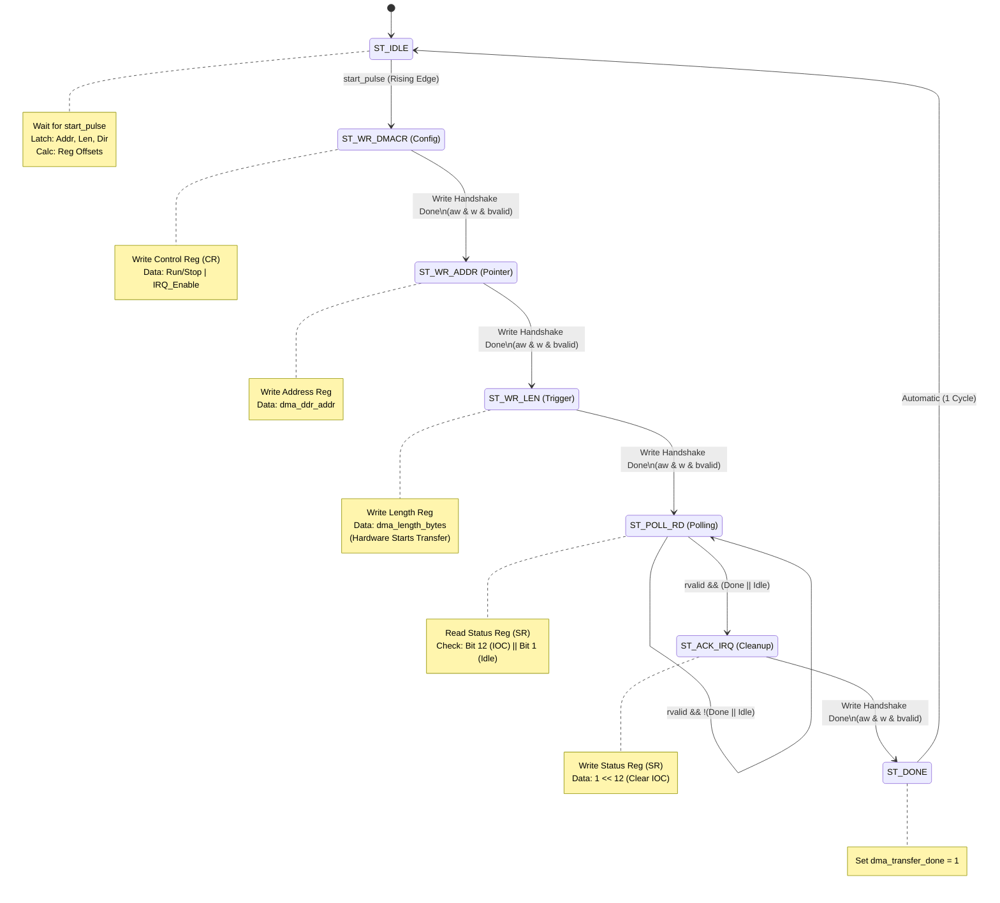

# Module Documentation: `axi_dma_shim`

## 1. Overview

The **`axi_dma_shim`** is a hardware control bridge and data router designed for a Vision Transformer (ViT) Programmable Logic (PL) system. It serves two primary purposes:

1. **Control Plane Abstraction:** It acts as an **AXI-Lite Master**, converting high-level, "friendly" commands from a system Scheduler into precise AXI-Lite transactions required to configure and trigger a Xilinx AXI DMA IP core.
    
2. **Data Plane Routing:** It acts as an **AXI-Stream Passthrough**, routing high-bandwidth data streams (64-bit) between the AXI DMA and the ViT Accelerator.
    

This module allows the Scheduler to operate purely on "Tasks" (Address, Length, Direction) without managing the complex state machine required to configure the DMA registers.

---

## 2. System Integration

The Shim sits in the middle of the control and data hierarchy:

- **Upstream:** A **Scheduler** sends a start pulse and transfer parameters.
    
- **Downstream Control:** The Shim writes to the **AXI DMA** (S_AXI_LITE) to start transfers.
    
- **Downstream Data:**
    
    - **MM2S (Read):** DMA $\to$ Shim $\to$ ViT Accelerator.
        
    - **S2MM (Write):** ViT Accelerator $\to$ Shim $\to$ DMA.
        

## 3. Parameters

| **Parameter**           | **Value**     | **Description**                                                                 |
| ----------------------- | ------------- | ------------------------------------------------------------------------------- |
| `M_AXI_LITE_ADDR_WIDTH` | 32            | Width of the AXI-Lite address bus.                                              |
| `M_AXI_LITE_DATA_WIDTH` | 32            | Width of the AXI-Lite data bus (Control registers are 32-bit).                  |
| `AXIS_DATA_WIDTH`       | **64**        | Width of the stream data. **Crucial:** Configured for high-throughput ViT data. |
| `AXIS_TKEEP_WIDTH`      | 8             | Calculated as `AXIS_DATA_WIDTH / 8`.                                            |
| `DMA_BASE_ADDR`         | `0x41E0_0000` | The physical base address of the AXI DMA IP in the memory map.                  |

## 4. Interface Description

### 4.1. Friendly Interface (Scheduler $\leftrightarrow$ Shim)

This is the simplified interface used by your custom logic to request DMA transfers.

|**Signal**|**Direction**|**Width**|**Description**|
|---|---|---|---|
|`clk`, `resetn`|Input|1|System clock and active-low reset.|
|`dma_start_transfer`|Input|1|Rising-edge trigger. Starts the configuration FSM.|
|`dma_direction`|Input|1|`1` = MM2S (DRAM to ViT).<br><br>  <br><br>`0` = S2MM (ViT to DRAM).|
|`dma_ddr_addr`|Input|32|The Source (MM2S) or Destination (S2MM) address in DDR.|
|`dma_length_bytes`|Input|30|Number of bytes to transfer.|
|`dma_transfer_done`|Output|1|Pulses high when the DMA has completed the transfer and interrupts are cleared.|

### 4.2. AXI-Lite Master (Shim $\to$ AXI DMA)

This interface is the "Control Plane." The Shim acts as a Master to write configuration data to the AXI DMA Slave. The signals below follow the AMBA AXI4-Lite protocol.

| **Signal Name**            | **Dir** | **Width** | **AXI Standard Definition**                                 | **Usage in axi_dma_shim**                                                           |
| -------------------------- | ------- | --------- | ----------------------------------------------------------- | ----------------------------------------------------------------------------------- |
| **Write Address Channel**  |         |           |                                                             |                                                                                     |
| `m_axi_lite_awaddr`        | Out     | 32        | Write Address. The address of the register to be written.   | driven by the FSM to point to DMA registers (e.g., `0x00` for CR, `0x18` for Addr). |
| `m_axi_lite_awprot`        | Out     | 3         | Protection type (Privileged/Secure/Instruction).            | Hardcoded to `3'b000` (Unprivileged, Non-secure, Data access).                      |
| `m_axi_lite_awvalid`       | Out     | 1         | Write Address Valid. Indicates valid address is on the bus. | Asserted by FSM in `ST_WR_*` states; de-asserted after handshake (`awready`).       |
| `m_axi_lite_awready`       | In      | 1         | Write Address Ready. Slave is ready to accept address.      | Used by FSM to detect `aw_done`.                                                    |
| **Write Data Channel**     |         |           |                                                             |                                                                                     |
| `m_axi_lite_wdata`         | Out     | 32        | Write Data. The actual configuration value.                 | Driven by FSM with config values (e.g., Start Bit, Address, Length).                |
| `m_axi_lite_wstrb`         | Out     | 4         | Write Strobe. Indicates which byte lanes are valid.         | Hardcoded to `4'b1111` (All 4 bytes are always valid/written).                      |
| `m_axi_lite_wvalid`        | Out     | 1         | Write Data Valid. Indicates valid data is on the bus.       | Asserted by FSM in `ST_WR_*` states; de-asserted after handshake (`wready`).        |
| `m_axi_lite_wready`        | In      | 1         | Write Data Ready. Slave is ready to accept data.            | Used by FSM to detect `w_done`.                                                     |
| **Write Response Channel** |         |           |                                                             |                                                                                     |
| `m_axi_lite_bresp`         | In      | 2         | Write Response. Status of the write (OKAY, ERROR, etc.).    | **Ignored.** The Shim assumes all writes to the DMA succeed.                        |
| `m_axi_lite_bvalid`        | In      | 1         | Write Response Valid. Slave has processed the write.        | Required to complete the transaction step before moving to the next FSM state.      |
| `m_axi_lite_bready`        | Out     | 1         | Write Response Ready. Master is ready to accept response.   | Asserted by FSM after address/data handshakes complete to close the transaction.    |
| **Read Address Channel**   |         |           |                                                             |                                                                                     |
| `m_axi_lite_araddr`        | Out     | 32        | Read Address. Address of register the shim want to read.    | Used only in `ST_POLL_RD` to point to the Status Register (`0x04` or `0x34`).       |
| `m_axi_lite_arprot`        | Out     | 3         | Protection type.                                            | Hardcoded to `3'b000`.                                                              |
| `m_axi_lite_arvalid`       | Out     | 1         | Read Address Valid.                                         | Asserted during polling state.                                                      |
| `m_axi_lite_arready`       | In      | 1         | Read Address Ready (the DMA ready to be read)               | Used to detect `ar_done`.                                                           |
| **Read Data Channel**      |         |           |                                                             |                                                                                     |
| `m_axi_lite_rdata`         | In      | 32        | Read Data. The value read from the register.                | Evaluated in `ST_POLL_RD`. Bits 12 and 1 are checked to determine DMA status.       |
| `m_axi_lite_rresp`         | In      | 2         | Read Response.                                              | **Ignored.**                                                                        |
| `m_axi_lite_rvalid`        | In      | 1         | Read Data Valid.                                            | Indicates valid `rdata` is available for evaluation.                                |
| `m_axi_lite_rready`        | Out     | 1         | Read Ready. Master accepts the read data.                   | Asserted by FSM to complete the read transaction.                                   |

### 4.3. AXI-Stream Passthrough

The module routes two separate stream paths based on `dma_direction`.

**Path A: MM2S (Memory to Stream)**

- **Source:** `s_axis_*` (Connected to DMA MM2S Port)
    
- **Dest:** `m_axis_accel_*` (Connected to ViT Accelerator Input)
    
- **Logic:** Full Combinational passthrough (Data, Keep, Last, Valid, Ready).
        

**Path B: S2MM (Stream to Memory)**

- **Source:** `s_accel_axis_*` (Connected to ViT Accelerator Output)
    
- **Dest:** `m_axis_*` (Connected to DMA S2MM Port)
    
- **Logic:** Full combinational passthrough (Data, Keep, Last, Valid, Ready).
    

---

## 5. Functional Description (FSM)

The core logic is a Finite State Machine that automates the register programming sequence required by the Xilinx AXI DMA IP (Direct Register Mode).

### 5.1. Register Map Logic

Depending on the `dma_direction` input, the FSM selects the appropriate register offsets.

| **Register**     | **MM2S Offset (dma_direction=1)** | **S2MM Offset (dma_direction=0)** |
| ---------------- | --------------------------------- | --------------------------------- |
| **Control (CR)** | `0x00` (`MM2S_DMACR`)             | `0x30` (`S2MM_DMACR`)             |
| **Status (SR)**  | `0x04` (`MM2S_DMASR`)             | `0x34` (`S2MM_DMASR`)             |
| **Address**      | `0x18` (`MM2S_SA`)                | `0x48` (`S2MM_DA`)                |
| **Length**       | `0x28` (`MM2S_LENGTH`)            | `0x58` (`S2MM_LENGTH`)            |
### 5.2 AXI Handshake Flags

```verilog
// Handshake flag
reg aw_done, w_done, ar_done;
```

**Purpose:** These flags manage the **independent channel nature** of the AXI4-Lite protocol.

- **The Challenge:** In AXI4-Lite, the **Write Address Channel (AW)** and **Write Data Channel (W)** operate in parallel. The Slave (DMA) might accept the Address first, the Data first, or both simultaneously.
    
- **The Solution:** The FSM asserts both `awvalid` and `wvalid`.
    
    - When `awready` goes high, `aw_done` is latched to `1`.
        
    - When `wready` goes high, `w_done` is latched to `1`.
        
- **State Transition:** The FSM only moves to the next step (checking for Write Response `bvalid`) when `(aw_done && w_done)` is true. This ensures the transaction is fully compliant regardless of the Slave's timing.
    
- **`ar_done`:** Used similarly for the **Read Address Channel (AR)** during the polling state (`ST_POLL_RD`). It ensures the read address is accepted before we wait for the data.
### 5.2. State Machine Sequence



1. **`ST_IDLE`**:
    
    - Waits for `dma_start_transfer` rising edge.
        
    - Latches `dma_ddr_addr`, `dma_length_bytes`, and `dma_direction`.
        
    - Calculates target register addresses based on direction.
        
2. **`ST_WR_DMACR` (Start DMA)**:
    
    - Writes to the Control Register (CR).
        
    - **Data:** `Run/Stop (Bit 0)` | `IRQ Enable (Bit 12)`.
        
    - This enables the DMA engine and allows it to generate interrupts (internal status bits).
        
3. **`ST_WR_ADDR` (Set Pointer)**:
    
    - Writes the DDR Address to the Source Address (SA) or Destination Address (DA) register.
        
4. **`ST_WR_LEN` (Trigger Transfer)**:
    
    - Writes the length in bytes.
        
    - **Hardware Behavior:** In Xilinx AXI DMA, writing the length register immediately initiates the data transfer.
        
5. **`ST_POLL_RD` (Wait for Completion)**:
    
    - Continuously reads the Status Register (SR) via AXI-Lite Read channel.
        
    - **Checks:** Bit 12 (`IOC_Irq` - Transfer Complete) OR Bit 1 (`Idle`).
        
    - Loops until one of these bits is high.
        
6. **`ST_ACK_IRQ` (Clear Status)**:
    
    - Writes to the Status Register (SR).
        
    - **Data:** Writes `1` to Bit 12 (`IOC_Irq`) to clear the interrupt status, ensuring the DMA is clean for the next run.
        
7. **`ST_DONE`**:
    
    - Asserts `dma_transfer_done` high.
        
    - Returns to `ST_IDLE`.
        

---

## 6. Usage Guide for Scheduler

To use this shim effectively in your scheduler state machine:

1. **Setup:** Ensure `dma_direction`, `dma_ddr_addr`, and `dma_length_bytes` are valid.
    
2. **Trigger:** Pulse `dma_start_transfer` high for at least one clock cycle.
    
3. **Wait:** Enter a wait state. Do not change inputs while the Shim is busy (though inputs are latched internally).
    
4. **Finish:** Wait for `dma_transfer_done` to go high. This indicates the data has fully moved (S2MM) or has been fully requested (MM2S) and the DMA controller is idle.
    

---

## 7. Important Hardware Notes

1. **64-bit Axis Data Width:**
    
    - The Shim uses `parameter AXIS_DATA_WIDTH = 64`.
        
    - **Requirement:** Ensure the AXI DMA IP core in Vivado/Block Design is configured for a **64-bit Stream Data Width**. If the IP is 32-bit, data packing/alignment issues will occur.
    
2. **Address Alignment:**
    
    - AXI DMA usually requires addresses to be aligned (often 4-byte aligned). Ensure `dma_ddr_addr` from the scheduler meets the alignment requirements of the specific DMA configuration (DRE - Data Realignment Engine status).