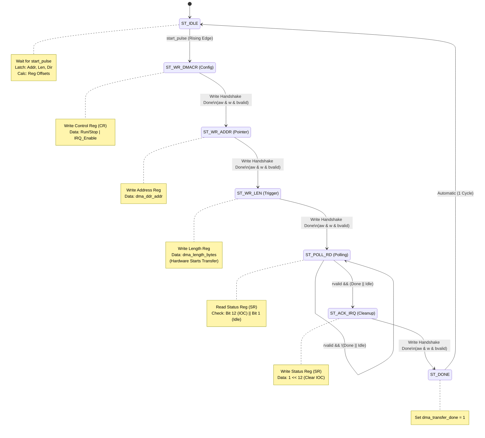
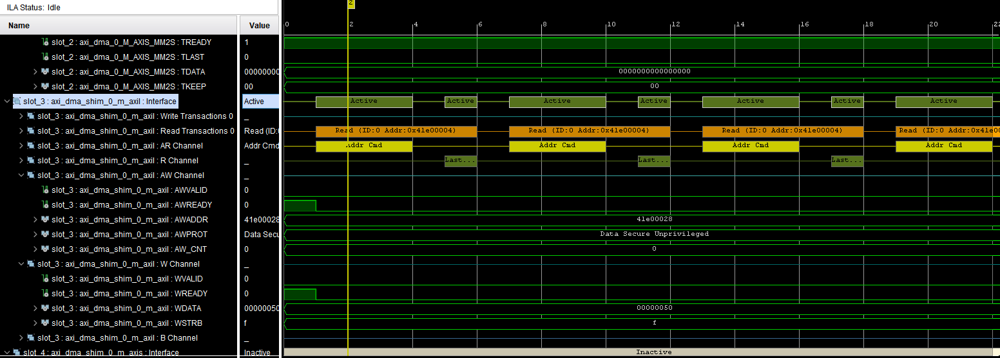
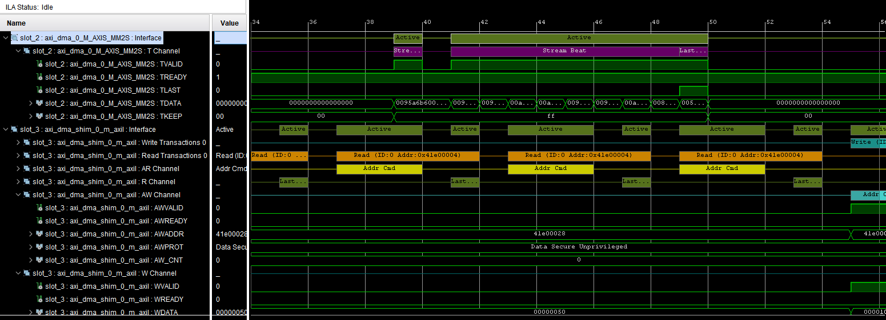
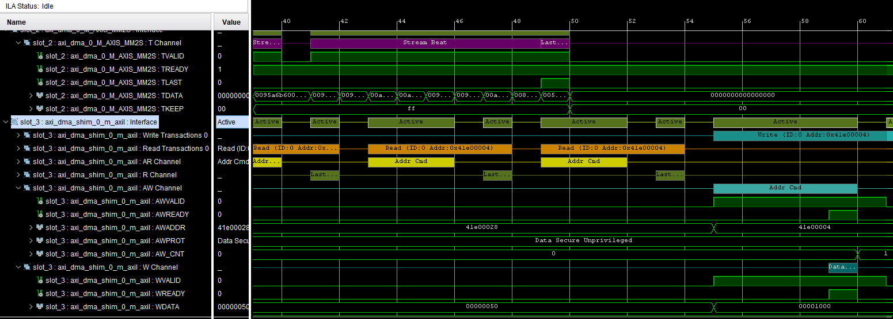

# AXI DMA Shim

| **Document Information** |                                               |
| ------------------------ | --------------------------------------------- |
| **Module Name**          | axi_dma_shim                                  |
| **Version**              | 1.0                                           |
| **Design Status**        | In development                                |
| **Last Updated**         | January 02 2026                               |
| **Source Location**      | `fpga/rtl/axi_dma_shim/`                      |
| **Testbench**            | `sw/sources/axi_dma_vdma.c` (PS App with test)|
| **Author**               | Nguyen Bui Tuan Anh                           |

## 1. Overview

The **`axi_dma_shim`** is a hardware control bridge and data router designed for a Vision Transformer (ViT) Programmable Logic (PL) system. It serves two primary purposes:

1. **Control Plane Abstraction:** It acts as an **AXI-Lite Master**, converting high-level, "friendly" commands from a system Scheduler into precise AXI-Lite transactions required to configure and trigger a Xilinx AXI DMA IP core.
    
2. **Data Plane Routing:** It acts as an **AXI-Stream Passthrough**, routing high-bandwidth data streams (64-bit) between the AXI DMA and the ViT Accelerator.
    

This module allows the Scheduler to operate purely on "Tasks" (Address, Length, Direction) without managing the complex state machine required to configure the DMA registers.

---

## 2. System Integration

The Shim sits in the middle of the control and data hierarchy:

- **Upstream:** A **Scheduler** sends a start pulse and transfer parameters.
    
- **Downstream Control:** The Shim writes to the **AXI DMA** (S_AXI_LITE) to start transfers.
    
- **Downstream Data:**
    
    - **MM2S (Read):** DMA $\to$ Shim $\to$ ViT Accelerator.
        
    - **S2MM (Write):** ViT Accelerator $\to$ Shim $\to$ DMA.
        

## 3. Parameters

| **Parameter**           | **Value**     | **Description**                                                                 |
| ----------------------- | ------------- | ------------------------------------------------------------------------------- |
| `M_AXI_LITE_ADDR_WIDTH` | 32            | Width of the AXI-Lite address bus.                                              |
| `M_AXI_LITE_DATA_WIDTH` | 32            | Width of the AXI-Lite data bus (Control registers are 32-bit).                  |
| `AXIS_DATA_WIDTH`       | **64**        | Width of the stream data. **Crucial:** Configured for high-throughput ViT data. |
| `AXIS_TKEEP_WIDTH`      | 8             | Calculated as `AXIS_DATA_WIDTH / 8`.                                            |
| `DMA_BASE_ADDR`         | `0x41E0_0000` | The physical base address of the AXI DMA IP in the memory map.                  |

## 4. Interface Description

### 4.1. Friendly Interface (Scheduler $\leftrightarrow$ Shim)

This is the simplified interface used by your custom logic to request DMA transfers.

|**Signal**|**Direction**|**Width**|**Description**|
|---|---|---|---|
|`clk`, `resetn`|Input|1|System clock and active-low reset.|
|`dma_start_transfer`|Input|1|Rising-edge trigger. Starts the configuration FSM.|
|`dma_direction`|Input|1|`1` = MM2S (DRAM to ViT).<br><br>  <br><br>`0` = S2MM (ViT to DRAM).|
|`dma_ddr_addr`|Input|32|The Source (MM2S) or Destination (S2MM) address in DDR.|
|`dma_length_bytes`|Input|30|Number of bytes to transfer.|
|`dma_transfer_done`|Output|1|Pulses high when the DMA has completed the transfer and interrupts are cleared.|

### 4.2. AXI-Lite Master (Shim $\to$ AXI DMA)

This interface is the "Control Plane." The Shim acts as a Master to write configuration data to the AXI DMA Slave. The signals below follow the AMBA AXI4-Lite protocol.

| **Signal Name**            | **Dir** | **Width** | **AXI Standard Definition**                                 | **Usage in axi_dma_shim**                                                           |
| -------------------------- | ------- | --------- | ----------------------------------------------------------- | ----------------------------------------------------------------------------------- |
| **Write Address Channel**  |         |           |                                                             |                                                                                     |
| `m_axi_lite_awaddr`        | Out     | 32        | Write Address. The address of the register to be written.   | driven by the FSM to point to DMA registers (e.g., `0x00` for CR, `0x18` for Addr). |
| `m_axi_lite_awprot`        | Out     | 3         | Protection type (Privileged/Secure/Instruction).            | Hardcoded to `3'b000` (Unprivileged, Non-secure, Data access).                      |
| `m_axi_lite_awvalid`       | Out     | 1         | Write Address Valid. Indicates valid address is on the bus. | Asserted by FSM in `ST_WR_*` states; de-asserted after handshake (`awready`).       |
| `m_axi_lite_awready`       | In      | 1         | Write Address Ready. Slave is ready to accept address.      | Used by FSM to detect `aw_done`.                                                    |
| **Write Data Channel**     |         |           |                                                             |                                                                                     |
| `m_axi_lite_wdata`         | Out     | 32        | Write Data. The actual configuration value.                 | Driven by FSM with config values (e.g., Start Bit, Address, Length).                |
| `m_axi_lite_wstrb`         | Out     | 4         | Write Strobe. Indicates which byte lanes are valid.         | Hardcoded to `4'b1111` (All 4 bytes are always valid/written).                      |
| `m_axi_lite_wvalid`        | Out     | 1         | Write Data Valid. Indicates valid data is on the bus.       | Asserted by FSM in `ST_WR_*` states; de-asserted after handshake (`wready`).        |
| `m_axi_lite_wready`        | In      | 1         | Write Data Ready. Slave is ready to accept data.            | Used by FSM to detect `w_done`.                                                     |
| **Write Response Channel** |         |           |                                                             |                                                                                     |
| `m_axi_lite_bresp`         | In      | 2         | Write Response. Status of the write (OKAY, ERROR, etc.).    | **Ignored.** The Shim assumes all writes to the DMA succeed.                        |
| `m_axi_lite_bvalid`        | In      | 1         | Write Response Valid. Slave has processed the write.        | Required to complete the transaction step before moving to the next FSM state.      |
| `m_axi_lite_bready`        | Out     | 1         | Write Response Ready. Master is ready to accept response.   | Asserted by FSM after address/data handshakes complete to close the transaction.    |
| **Read Address Channel**   |         |           |                                                             |                                                                                     |
| `m_axi_lite_araddr`        | Out     | 32        | Read Address. Address of register the shim want to read.    | Used only in `ST_POLL_RD` to point to the Status Register (`0x04` or `0x34`).       |
| `m_axi_lite_arprot`        | Out     | 3         | Protection type.                                            | Hardcoded to `3'b000` (Unprivileged - Secure - Data access)                         |
| `m_axi_lite_arvalid`       | Out     | 1         | Read Address Valid.                                         | Asserted during polling state.                                                      |
| `m_axi_lite_arready`       | In      | 1         | Read Address Ready (the DMA ready to be read)               | Used to detect `ar_done`.                                                           |
| **Read Data Channel**      |         |           |                                                             |                                                                                     |
| `m_axi_lite_rdata`         | In      | 32        | Read Data. The value read from the register.                | Evaluated in `ST_POLL_RD`. Bits 12 and 1 are checked to determine DMA status.       |
| `m_axi_lite_rresp`         | In      | 2         | Read Response.                                              | Assume internal connections are reliable, so ignore rresp, keep the FSM lightweight |
| `m_axi_lite_rvalid`        | In      | 1         | Read Data Valid.                                            | Indicates valid `rdata` is available for evaluation.                                |
| `m_axi_lite_rready`        | Out     | 1         | Read Ready. Master accepts the read data.                   | Asserted by FSM to complete the read transaction.                                   |

### 4.3. AXI-Stream Passthrough

The module routes two separate stream paths based on `dma_direction`.

**Path A: MM2S (Memory to Stream)**

- **Source:** `s_axis_*` (Connected to DMA MM2S Port)
    
- **Dest:** `m_axis_accel_*` (Connected to ViT Accelerator Input)
    
- **Logic:** Full Combinational passthrough (Data, Keep, Last, Valid, Ready).
        

**Path B: S2MM (Stream to Memory)**

- **Source:** `s_accel_axis_*` (Connected to ViT Accelerator Output)
    
- **Dest:** `m_axis_*` (Connected to DMA S2MM Port)
    
- **Logic:** Full combinational passthrough (Data, Keep, Last, Valid, Ready).
    

---

## 5. Functional Description (FSM)

The core logic is a Finite State Machine that automates the register programming sequence required by the Xilinx AXI DMA IP (Direct Register Mode).

### 5.1. Register Map Logic

Depending on the `dma_direction` input, the FSM selects the appropriate register offsets.

| **Register**     | **MM2S Offset (dma_direction=1)** | **S2MM Offset (dma_direction=0)** |
| ---------------- | --------------------------------- | --------------------------------- |
| **Control (CR)** | `0x00` (`MM2S_DMACR`)             | `0x30` (`S2MM_DMACR`)             |
| **Status (SR)**  | `0x04` (`MM2S_DMASR`)             | `0x34` (`S2MM_DMASR`)             |
| **Address**      | `0x18` (`MM2S_SA`)                | `0x48` (`S2MM_DA`)                |
| **Length**       | `0x28` (`MM2S_LENGTH`)            | `0x58` (`S2MM_LENGTH`)            |
### 5.2 AXI Handshake Flags

```verilog
// Handshake flag
reg aw_done, w_done, ar_done;
```

**Purpose:** These flags manage the **independent channel nature** of the AXI4-Lite protocol.

- **The Challenge:** In AXI4-Lite, the **Write Address Channel (AW)** and **Write Data Channel (W)** operate in parallel. The Slave (DMA) might accept the Address first, the Data first, or both simultaneously.
    
- **The Solution:** The FSM asserts both `awvalid` and `wvalid`.
    
    - When `awready` goes high, `aw_done` is latched to `1`.
        
    - When `wready` goes high, `w_done` is latched to `1`.
        
- **State Transition:** The FSM only moves to the next step (checking for Write Response `bvalid`) when `(aw_done && w_done)` is true. This ensures the transaction is fully compliant regardless of the Slave's timing.
    
- **`ar_done`:** Used similarly for the **Read Address Channel (AR)** during the polling state (`ST_POLL_RD`). It ensures the read address is accepted before we wait for the data.
### 5.2. State Machine Sequence



1. **`ST_IDLE`**:
    
    - Waits for `dma_start_transfer` rising edge.
        
    - Latches `dma_ddr_addr`, `dma_length_bytes`, and `dma_direction`.
        
    - Calculates target register addresses based on direction.
        
2. **`ST_WR_DMACR` (Start DMA)**:
    
    - Writes to the Control Register (CR).
        
    - **Data:** `Run/Stop (Bit 0)` | `IRQ Enable (Bit 12)`.
        
    - This enables the DMA engine and allows it to generate interrupts (internal status bits).
        
3. **`ST_WR_ADDR` (Set Pointer)**:
    
    - Writes the DDR Address to the Source Address (SA) or Destination Address (DA) register.
        
4. **`ST_WR_LEN` (Trigger Transfer)**:
    
    - Writes the length in bytes.
        
    - **Hardware Behavior:** In Xilinx AXI DMA, writing the length register immediately initiates the data transfer.
        
5. **`ST_POLL_RD` (Wait for Completion)**:
    
    - Continuously reads the Status Register (SR) via AXI-Lite Read channel.
        
    - **Checks:** Bit 12 (`IOC_Irq` - Transfer Complete) OR Bit 1 (`Idle`).
        
    - Loops until one of these bits is high.
        
6. **`ST_ACK_IRQ` (Clear Status)**:
    
    - Writes to the Status Register (SR).
        
    - **Data:** Writes `1` to Bit 12 (`IOC_Irq`) to clear the interrupt status, ensuring the DMA is clean for the next run.
        
7. **`ST_DONE`**:
    
    - Asserts `dma_transfer_done` high.
        
    - Returns to `ST_IDLE`.
        

## 6. Verification

For testing this `axi_dma_shim` module, I used a block design containing ZYNQ7 Processing System, AXI DMA, AXI GPIO IP from Vivado and my module `axi_dma_shim` which is placed between the PS and the AXI DMA. The block design script is at fpga/scripts/bd/AXI_DMA_VDMA_system.tcl

The main processing flow: 
```
Processing System -> AXI GPIO -> axi_dma_shim <-> AXI DMA
										|
										v
									  ViT PL		
```

The AXI GPIO is used to convert the master interface M_AXI_GP0 of PS to the friendly interface command signals (`dma_start_transfer, dma_ddr_addr, dma_length_byte...`) mentioned above.

### 6.1 PS Testing Application

A PS application will control the PS and send command signals  to `axi_dma_shim`. These are the core functions:

a. Command Initiation: `dma_start_transfer`

This function acts as the bridge between the processor and your hardware FSM. It performs a specific sequence of GPIO writes to satisfy the signal protocol required by the `axi_dma_shim`.

- **Address Configuration:** It first writes the target DDR buffer address to the `GPIO_ADDR_CHANNEL`. This corresponds to the `dma_ddr_addr` input on your module.
    
- **Control Configuration:** It packs the transaction length (bytes) and the direction bit (MM2S vs S2MM) into a single 32-bit integer and writes it to the `GPIO_LEN_CHANNEL`.
    
- **Pulse Generation:** The crucial step is the generation of the `start_pulse`. The function sets the designated start bit high, waits for a short duration (`usleep`) to ensure the shim's edge detector (`start_d1` / `start_d2`) captures the signal, and then clears the bit. This transition triggers the Verilog FSM to move from `ST_IDLE` to `ST_WR_DMACR`.

```c
// Activate dma_start_transfer
void dma_start_transfer(u32 addr, u32 length_bytes, u8 direction) {
    u32 control_value;
    // 1. Set address
    XGpio_DiscreteWrite(&GpioOut, GPIO_ADDR_CHANNEL, addr);
    // 2. Set length + direction
    control_value = (length_bytes << 2) | (direction << LENGTH_DIR_BIT);
    XGpio_DiscreteWrite(&GpioOut, GPIO_LEN_CHANNEL, control_value);
    // 3. Create start pulse (set bit start)
    control_value |= (1 << LENGTH_START_BIT);
    XGpio_DiscreteWrite(&GpioOut, GPIO_LEN_CHANNEL, control_value);
    // 4. Hold start for some cycles
    usleep(1000);
    // 5. Clear start bit
    control_value &= ~(1 << LENGTH_START_BIT);
    XGpio_DiscreteWrite(&GpioOut, GPIO_LEN_CHANNEL, control_value);
}
```

b. Status Polling: `dma_wait_for_completion`

Since the `axi_dma_shim` handles the AXI4-Lite configuration autonomously, the PS must wait for the hardware to report completion.

- This function continuously polls the `GPIO_STATUS_CHANNEL`, which is connected to the `dma_transfer_done` output of your module.
    
- The function implements a software timeout mechanism. It reads the GPIO status bit in a loop with a 1ms delay. If the `axi_dma_shim` FSM reaches the `ST_DONE` state and asserts the done signal within the timeout window, the function returns success; otherwise, it flags a timeout error.

```c
// Function to wait for dma_transfer_done
int dma_wait_for_completion(int timeout_ms) {
    int timeout = 0;
    while (timeout < timeout_ms) {
        if (XGpio_DiscreteRead(&GpioIn, GPIO_STATUS_CHANNEL) & 0x1) {
            return 1; // Done
        }
        usleep(1000); // 1ms
        timeout++;
    }
    return 0; // Timeout
}
```

c. Integration Test: `test_mm2s`

This high-level function orchestrates a complete Memory-to-Stream transfer with packet length TEST_PKT_LEN_BYTES = 10.

- **The source buffer**: TX_BUFFER_BASE will store the pixel data of a 224x224 image. 

- **Cache Management:** It performs `Xil_DCacheFlushRange` on the source buffer. This is critical in Zynq systems to ensure the physical DDR memory contains the data the CPU wrote, as the AXI DMA reads directly from DDR, bypassing the CPU cache.

- **Execution:** It calls `dma_start_transfer` with the address of the transmission buffer (`TxBuffer`) and the packet length (`TEST_PKT_LEN_BYTES`), setting the direction to `1` (MM2S).

- **Verification:** It waits for the hardware handshake using `dma_wait_for_completion`. A successful return confirms that the shim correctly configured the DMA registers via AXI-Lite and that the DMA controller successfully processed the data stream.

```c
/*********************************************************************
 * Test 1: MM2S (Memory → Stream)
 * Require: s_axis_tready = 1
 ********************************************************************/
int test_mm2s()
{
    xil_printf("\r\n--- Test MM2S (Mem → Stream) ---\r\n");
    u8 *TxBuffer = (u8 *)TX_BUFFER_BASE;
    Xil_DCacheFlushRange((UINTPTR)TxBuffer, FRAME_SIZE);
    
    xil_printf("Start MM2S: addr=0x%08X, len=%d bytes\r\n",
               (unsigned)TxBuffer, TEST_PKT_LEN_BYTES);

    dma_start_transfer((u32)TxBuffer, TEST_PKT_LEN_BYTES, 1); // 1 = MM2S

    if (!dma_wait_for_completion(5000)) {  // 5s
        xil_printf("MM2S timeout (check stream sink / tready)\r\n");
        return XST_FAILURE;
    }

    xil_printf("MM2S completed (dma_transfer_done=1)\r\n");

    return XST_SUCCESS;
}
```

d. Integration Test: `test_s2mm`

This function verifies the Stream-to-Memory (S2MM) path, ensuring data flows correctly from the accelerator (or data stream), through the shim, to the AXI DMA, and finally into system memory.

- **Buffer Preparation:** The function begins by manually zeroing out the receive buffer (`RxBuffer`) and performing a **Data Cache Flush** (`Xil_DCacheFlushRange`). This guarantees that the physical DDR memory actually contains zeros before the hardware attempts to write to it, preventing false positives where the verification step might read old data from a previous run.
    
- **Execution:** It initiates the transfer by calling `dma_start_transfer` with the direction bit set to `0`. This instructs the `axi_dma_shim` FSM to target the S2MM control registers (offsets `0x30`–`0x58`) rather than the MM2S registers used in the previous test.
    
- **Cache Invalidation (Critical):** Once `dma_wait_for_completion` returns (indicating the hardware has finished writing to DDR), the function executes `Xil_DCacheInvalidateRange`.
    
    - _Reasoning:_ The AXI DMA writes directly to physical DDR memory, bypassing the CPU's L1/L2 cache. Without invalidation, the CPU would continue to see the "stale" zero values it cached during the preparation phase. This function forces the CPU to discard those cache lines and re-fetch the new, valid data from DDR.
        
- **Data Verification:** Finally, the function reads the buffer - now guaranteed to be fresh from DDR, and prints the bytes to the console. This allows for manual inspection to confirm the received pattern matches the expected output from the accelerator.

```c
/*********************************************************************
 * Test 2: S2MM (Stream → Memory)
 * Require: AXIS source send TEST_PKT_LEN_BYTES to S2MM
 ********************************************************************/
int test_s2mm()
{
    xil_printf("\r\n--- Test S2MM (Stream → Mem) ---\r\n");
    u8 *RxBuffer = (u8 *)RX_BUFFER_BASE;

    // Clear buffer before receiving
    for (int i = 0; i < TEST_PKT_LEN_BYTES; ++i) {
        RxBuffer[i] = 0x00;
    }

    Xil_DCacheFlushRange((UINTPTR)RxBuffer, TEST_PKT_LEN_BYTES);

    xil_printf("Start S2MM: addr=0x%08X, len=%d bytes\r\n",
               (unsigned)RxBuffer, TEST_PKT_LEN_BYTES);

    dma_start_transfer((u32)RxBuffer, TEST_PKT_LEN_BYTES, 0); // 0 = S2MM

    if (!dma_wait_for_completion(5000)) {  // 5s
        xil_printf("S2MM timeout (check AXIS source)\r\n");
        debug_gpio_status();
        return XST_FAILURE;
    }

    xil_printf("S2MM completed, reading back buffer...\r\n");
    // invalidate cache to read new data from DDR
    Xil_DCacheInvalidateRange((UINTPTR)RxBuffer, TEST_PKT_LEN_BYTES);
    // print test packet bytes
    for (int i = 0; i < TEST_PKT_LEN_BYTES; ++i) {
        xil_printf("0x%02X ", RxBuffer[i]);
        if ((i & 0x0F) == 0x0F) xil_printf("\r\n");
    }
    
    xil_printf("\r\n");
    return XST_SUCCESS;

}
```


### 6.2 Waveform

I used the Integrated Logic Analyzer (ILA) IP from Vivado to capture the signal while running on real time Arty Z7 board.

a. MM2S test:

- In this picture, the `axi_dma_shim` module has written the `dma_length_byte` data (80 bytes = 0x50) to the register MM2S_LENGTH (offset 0x28). We can see that the AWADDR is 0x41e00028 and WDATA is 0x50
- Then the shim immediately change to the Polling State (POLL_RD) and keep reading the MM2S_DMASR to check for the IOC (bit 12) or Idle (bit 1) which indicate the completion



- After several clock cycles, the AXI DMA start sending the Data Stream which has 10 beats (10 beats x 8 bytes = 80 bytes) as expected



- Finally, after the last stream beat, the MM2S_DMASR IOC_Irq bit will be 1 (indicate a complete transfer). So the `axi_dma_shim` move to state ST_ACK_IRQ to write 1 to the IOC Interrupt bit (bit 12) to clear the interrupt. In the waveform we can see that at the cycle 56, the AWADDR is 0x41E0004 (MM2S_DMASR with 0x04 offset) and the WDATA is 0x0001000



## 6. Usage Guide for Scheduler

To use this shim effectively in your scheduler state machine:

1. **Trigger:** Pulse `dma_start_transfer` high for at least one clock cycle.
    
2. **Wait:** Enter a wait state. Do not change inputs while the Shim is busy (though inputs are latched internally).
    
3. **Finish:** Wait for `dma_transfer_done` to go high. This indicates the data has fully moved (S2MM) or has been fully requested (MM2S) and the DMA controller is idle.

4. Ensure the AXI DMA IP core in Vivado/Block Design is configured for a **64-bit Stream Data Width**. If the IP is 32-bit, data packing/alignment issues will occur.
