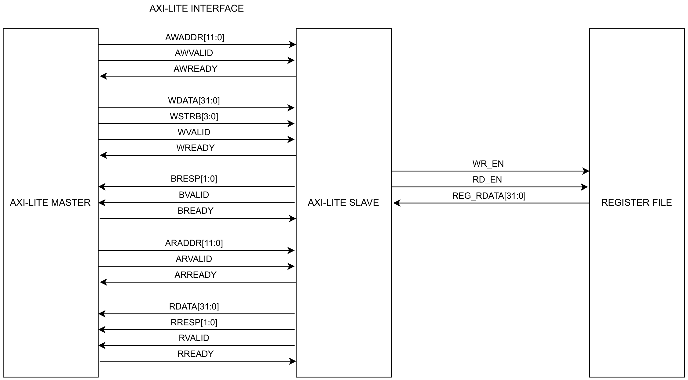
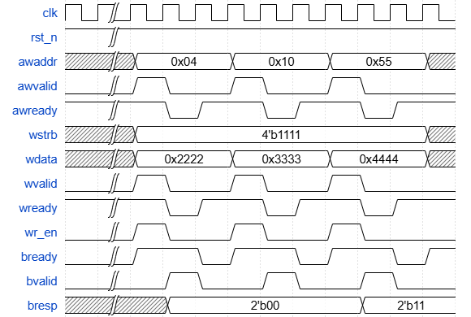
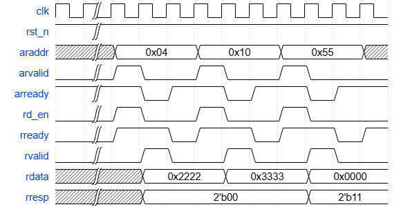

# AXI LITE INTERFACE UNIT

| **Document Information** |                                      |
| ------------------------ | ------------------------------------ |
| **Module Name**          | `axi_lite`                           |
| **Version**              | 1.0                                  |
| **Design Status**        | In development                       |
| **Last Updated**         | January 05 2026                      |
| **Source Location**      | `fpga/rtl/axi_lite/axi_lite.v`       |
| **Testbench**            | `fpga/tb/axi_lite/tb_axi_lite.v`     |
| **Author**               | Hoang Thuy Tram                      |

## Table Of Content

1. [Overview](#1-overview)
2. [Features Summary](#2-features-summary)
3. [Theory Of Operation](#3-theory-of-operation)
4. [Module Architecture](#4-module-architecture)
5. [Interface Specification](#5-interface-specification)
6. [Register Map And Address Decoding](#6-register-map-and-address-decoding)
7. [Verification](#7-verification)
8. [Design Performance](#8-design-performance)

## 1. Overview

### 1.1 Purpose

The `axi_lite` module implements a slave interface compliant with the **AMBA AXI4-Lite protocol**. It serves as the control bridge between the Zynq Processing System (PS) and the TinyVit Accelerator Programmable Logic (PL). It handles the handshake synchronization for control signals, address decoding and data routing to the internal configuration registers.

### 1.2 Functional Description

This module abtracts the complexity of the AXI protocol from the core accelerator logic. It performs the following functions:

1. **Protocol Managagement:** Manages the independent Write Address, Write Data, Write Response, Read Address and Read Data channels.
2. **Address Decoding:** Validates incoming addressses against a predefined memory map and generates `DECERR` (Decode Error) response for invalid accesses.
3. **Strobe Generation:** Generate single-cycle `wr_en` (write enable) and `rd_en` (read enable) signals for the downstream register bank.
4. **Response Handling:** Provides `OKAY` or `DECERR` responses based on transaction validity.

### 1.3 Design Philosophy

The design prioritized robutsness and low latency. It uses a look-ahead ready generation strategy where `AWREADY` and `ARREADY` are deasserted immediately after a handshake to prevent back-to-back transaction errors, ensuring stability when interafacing with the high-speed PS interconnect.

## 2. Features Summary

| **Feature**        | **Specification**                            |
| ------------------ | -------------------------------------------- |
| **Protocol**       | AMBA AXI4-Lite (Slave)                       |
| **Data Width**     | 32 bits                                      |
| **Address Width**  | 12 bits (4KB address space support)          |
| **Clocking**       | Single clock domain (synchronous)            |
| **Response Types** | OKAY (2'b00), DECERR (2'b11)                 |
| **Strobe Support** | Full 32-bit access if `wstrb[3:0] == 4'b1111`|
| **Throughput**     | 1 Read/Write per 2-3 clock cycles            |
| **Error Handling** | Automatic decode error generation            |

## 3. Theory Of Operation

### 3.1 Write Channel Logic

The write transaction is manged via three channels: Write Address (AW), Write Data (W), and Write Response (B).

1. **Handshake:** The module wait for both `AWVALID` and `WVALID` to be asserted. The design allows these to arrive in any order, but the `wr_en` strobe is only generated when both address and data handshakes are complete.
2. **Strobe Generation:**

    ```Verilog
    assign wr_en = (awvalid & awready) & (wvalid & wready);
    ```

    This signal indicates to the backend registers that valid data is available on `wdata` at adress `awaddr`.
3. **Response (B Channel)**: After the write occurs, `bvalid` is asserted. The `bresp` signal indicates status:
   - `2'b00` (OKAY): If `awaddr` matches a valid register offset.
   - `2'b11` (DECERR): If `awaddr` is unmapped.

### 3.2 Read Channel Logic

The read transaction uses two channels: Read Address (AR) and Read Data (R).

1. **Handshake**: Upon detecting `ARVALID`, the module asserts `ARREADY` to accept the address.
2. **Strobe Generation:**

   ```Verilog
   assign rd_en = arvalid & arready;
   ```

   This signals the backend to fetch data corresponding to `araddr`.
3. **Data Fetch:** The external register bank must provide `reg_rdata` in the next cycle.
4. **Response (R Channel):** The module drives `rdata` and asserts `rvalid`. Similar to writes, `rresp` indicates `OKAY` or `DECERR`.

### 3.3 Address Decoding Mechanism

Address validation is performed combinatorially to ensure fast response times. The valid address space is sparse, targeting specific control offsets.

```Verilog
assign valid_waddr = (awaddr == 12'h0 || awaddr == 12'h4 || awaddr == 12'h10 || awaddr == 12'h20 || awaddr == 12'h24 || awaddr == 12'h28 || awaddr == 12'h40 || awaddr == 12'h44 || awaddr == 12'h70);
assign bresp_next = wr_en ? (valid_waddr ? 2'b00 : 2'b11) : bresp;
```

This acts as a hardware firewall, preventing software from accidentally writing to reserved logic areas.

## 4. Module Architecture

### 4.1 Block Diagram



Figure 1: AXI-Lite Block Diagram.

- **Write Path:** PS -> AW/W Channels -> Handshake Logic -> Write Enable (`wr_en`) -> Register File
- **Read Path:** PS -> AR Channels -> Handshake Logic -> Read Enable (`rd_en`) -> Register File -> Read Data (`reg_rdata`) -> R channel -> PS

### 4.2 Module Hierarchy

```Text
axi_lite (top-level protocol bridge)
│
├── Write Channel Logic (Handshaking)
│   ├── AW Handshake Control   # Managing awready & aw_handshake_done
│   ├── W Handshake Control    # Managing wready & w_handshake_done
│   └── Write Strobe Generator # Combinational wr_en = AW & W handshakes
│
├── Read Channel Logic (Handshaking)
│   ├── AR Handshake Control   # Managing arready & ar_handshake_done
│   └── Read Enable Generator  # Combinational rd_en = AR handshake
│
├── Address Decoding & Validation
│   ├── Write Address Decode   # Validating AWADDR for bresp
│   └── Read Address Decode    # Validating ARADDR for rresp
│
└── Response & Output Stage
    ├── Write Response Stage   # Registered bvalid & bresp
    ├── Read Data Stage        # Registered rvalid, rdata & rresp
    └── Bus Buffer             # Multiplexing reg_rdata to AXI R-channel
```

### 4.3 Sample Waveform



Figure 2: AXI-Lite Write Sample Waveform.



Figure 3: AXI-Lite Read Sample Waveform.

## 5. Interface Specification

| **Port**                       | **Direction** | **Width** | **Description**                                                                            |
| ------------------------------ | ------------- | --------- | ------------------------------------------------------------------------------------------ |
| **Global Signals**             |               |           |                                                                                            |
| `clk`                          | Input         | 1         | System clock                                                                               |
| `rst_n`                        | Input         | 1         | Active-low asynchronous reset                                                              |
| **AXI Write Address Channel**  |               |           |                                                                                            |
| `awaddr`                       | Input         | 12        | Write address: Target write register offset                                                |
| `awvalid`                      | Input         | 1         | Write address valid: Asserted by master when `awaddr` is stable                            |
| `awready`                      | Output        | 1         | Write address ready: Asserted by slave when ready to accept address                        |
| **AXI Write Data Channel**     |               |           |                                                                                            |
| `wdata`                        | Input         | 32        | Write data: Contains 32-bit configuration value                                            |
| `wstrb`                        | Input         | 4         | Write strobe (byte enables): Each bit enables one byte of `wdata`                          |
| `wvalid`                       | Input         | 1         | Write data valid: Asserted by master when `wdata` is stable                                |
| `wready`                       | Output        | 1         | Write data ready: Asserted by slave when ready to accept data                              |
| **AXI Write Response Channel** |               |           |                                                                                            |
| `bresp`                        | Output        | 2         | Write response status: `2'b00` (OKAY) for valid address, `2'b11` (DECERR) for decode error |
| `bvalid`                       | Output        | 1         | Write response valid: Asserted by slave to indicate `bresp` is valid                       |
| `bready`                       | Input         | 1         | Write response ready: Asserted by master when ready to accept response                     |
| **AXI Read Address Channel**   |               |           |                                                                                            |
| `araddr`                       | Input         | 12        | Read address: Target read register offset                                                  |
| `arvalid`                      | Input         | 1         | Read address valid: Asserted by master when `araddr` is stable                             |
| `arready`                      | Output        | 1         | Read address ready: Asserted by slave when ready to accept address                         |
| **AXI Read Data Channel**      |               |           |                                                                                            |
| `rdata`                        | Output        | 32        | Read data: Contains register value from `araddr`                                           |
| `rresp`                        | Output        | 2         | Read response status: `2'b00` (OKAY) for valid address, `2'b11` (DECERR) for decode error  |
| `rvalid`                       | Output        | 1         | Read data valid: Asserted by slave when `rdata` and `rresp` are valid                      |
| `rready`                       | Input         | 1         | Read data ready: Asserted by master when ready to accept data                              |
| **Backend Register Interface** |               |           |                                                                                            |
| `wr_en`                        | Output        | 1         | Single-cycle write enable pulse to backend register bank (Active high)                     |
| `rd_en`                        | Output        | 1         | Single-cycle read enable pulse to backend register bank (Active high)                      |
| `reg_rdata`                    | Input         | 32        | Read data from backend register bank, must be valid one cycle after `rd_en` assertion      |

### 6. Register Map And Address Decoding

The `axi_lite` module strictly enforces the following address map based on internal decoding logic. Any access to addresses not listed below will result in a `DECERR` response.

| **Offset** | **Register Name** | **Access** | **Description**               |
| ---------- | ----------------- | ---------- | ----------------------------- |
| 0x00       | CONTROL           | RW         | Start, Reset, IRQ Enable      |
| 0x04       | STATUS            | RO/W1C     | Busy, Done, Error flags       |
| 0x10       | TILE_CFG          | RW         | Tiling configuration          |
| 0x20       | ADDR_A_BASE       | RW         | DDR Address for Input A       |
| 0x24       | ADDR_B_BASE       | RW         | DDR Address for Input B       |
| 0x28       | ADDR_C_BASE       | RW         | DDR Address for Output C      |
| 0x40       | REQUANT_SCALE     | RW         | Quantization Multiplier       |
| 0x44       | REQUANT_SHIFT     | RW         | Quantization Shift/Bias       |
| 0x70       | LAYER_CFG         | RW         | Layer configuration           |

## 7. Verification

### 7.1 Testbench Overview

The verification relies on a testbench that acts as an AXI4-Lite Master Verification IP (VIP). It drives the `axi_lite` bridge (DUT) which is connected to an instance of `axi_lite_reg` acting as the backend slave.
The primary goal is to verify protocol compliance, handshake robustness and signal integrity of the control strobes (`wr_en`, `rd_en`) generated for the backend.

### 7.2 Verified Protocol Features

| **Test Case ID** | **Protocol Feature** | **Verification** |
| --- | ---| --- |
| **Test 3** | Read/Write Handshake | Verified successful completion of standard transactions where `AWVALID/WVALID` and `ARVALID` are asserted and acknowledged by `READY` signals |
| **Test 6** | Reserved Space | Confirmed that writes and reads to undefined addresses return `DECERR (2'b11)` to `BRESP` and `RRESP`                                                                                                                                        |
| **Test 7** | Handshake Ordering (Write) | **Critical:** Verified robustness against out-of-order arrival of `AWVALID` and `WVALID` <br> 1. **Missing AWVALID:** Asserted `WVALID` only -> Verified no `wr_en` generated <br> 2. **Missing WVALID:** Asserted `AWVALID` only -> Verified no `wr_en` generated <br> Confirmed that the internal logic correctly waits for the logical AND of both address and data phases before committing a write |
| **Test 8** | Handshake Drops (Read) | Verified behavior when `ARVALID` is asserted but dropped before a transaction completes (or asserted without follow-up). Confirmed `rd_en` is not generated spuriously |
| **All Tests** | Strobe Generation | Checked that `wr_en` and `rd_en` are single-cycle pulses generated exactly when the protocol handshake completes, ensuring atomic register updates |
| **All Tests** | Response Signaling | Verified that `BRESP` and `RRESP` are driven correctly (`OKAY` or `DECERR`) depending on the address decoded, and `BVALID/RVALID` behave according to spec |

### 7.3 Signal Integrity Checks

The testbench includes monitors (`wr_sig_c`, `rd_sig_c`) that assert failures if:

- `wr_en` is asserted when `AWVALID` or `WVALID` is missing.
- `rd_en` is asserted when `ARVALID` is missing.
- Ready signals hang (timeout detection).

### 7.4 Simulation Summary

The testbench executes a total of 384 sub-tests, covering normal operations, edge cases (missing valids) and error injection.

```Text
TEST 7: NO AWVALID/WVALID CHECK
--------------------------------------------------------------------------
    1. NO AWVALID
--------------------------------------------------------------------------
WRITE -- Time = 20372 | AWADDR = 12'h020, WDATA = 32'h12345678
[OUTPUT] Time = 20391 | WR_EN = 0
[EXPECT] Time = 20391 | WR_EN = 0
======> PASSED
[OUTPUT] Time = 20411 | BVALID = 0, BRESP = 2'b00
[EXPECT] Time = 20411 | BVALID = 0, BRESP = 2'b00
======> PASSED
# [OUTPUT] Time = 20411 | BRESP = 2'b00
# [EXPECT] Time = 20411 | BRESP = 2'b00
======> PASSED
.
.
.
--------------------------------------------------------------------------
TEST 8: NO ARVALID
    ...
--------------------------------------------------------------------------
SUMMARY
--------------------------------------------------------------------------
TOTAL TESTS : 384
TOTAL PASSED: 384
TOTAL FAILED: 0
======> ALL TESTS PASSED
```

### 7.5 Typical Instantiation

```Verilog
axi_lite u_axi_lite (
    .clk(clk),
    .rst_n(rst_n),

    .awaddr(awaddr),
    .awvalid(awvalid),
    .awready(awready),

    .wdata(wdata), 
    .wstrb(wstrb),
    .wvalid(wvalid),
    .wready(wready),

    .bresp(bresp),
    .bvalid(bvalid),
    .bready(bready),

    .araddr(araddr),
    .arvalid(arvalid),
    .arready(arready),

    .rdata(rdata),
    .rresp(rresp),
    .rvalid(rvalid),
    .rready(rready),

    .reg_rdata(reg_rdata),
    .wr_en(wr_en),
    .rd_en(rd_en)
);
```

## 8. Design Performance

### 8.1 Timing Performance

| **Metric**                     | **Result**                    |
| ------------------------------ | ----------------------------- |
| **Target Clock**               | 5.000 ns (200.000 MHz)        |
| **WNS (Worst Negative Slack)** | -2.629 ns                     |
| **Estimated Fmax**             | 131.079 MHz                   |
| **Status**                     | Timing constrains are not met |

### 8.2 Resource Utilization

| **Resource** | **Utilization** | **Available** | **Utilization %** |
| ------------ | --------------- | ------------- | ----------------- |
| **LUT**      | 13              | 53,200        | 0.02              |
| **FF**       | 38              | 106,400       | 0.04              |
| **IO**       | 106             | 125           | 84.80             |

The large pin count (IO) is required to support AXI4-Lite's five independent parallel channels (AW, W, B, AR, R), needing its own address, data, and VALID/READY handshake signals.
