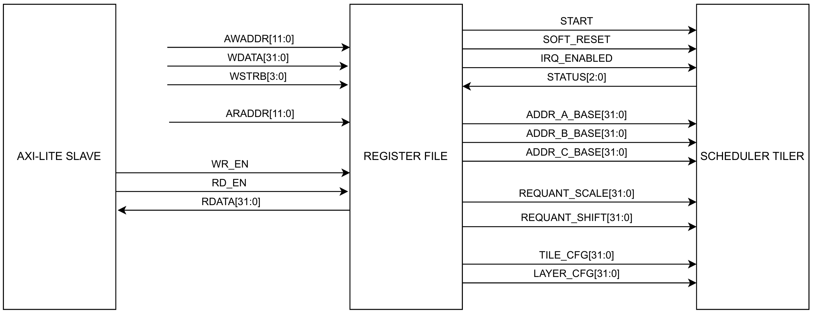
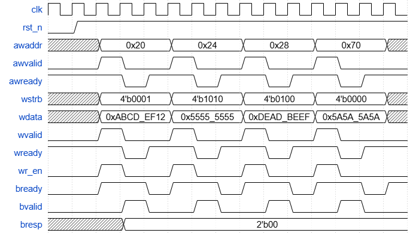
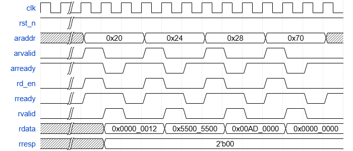

# AXI LITE INTERFACE UNIT

| **Document Information** |                                      |
| ------------------------ | ------------------------------------ |
| **Module Name**          | `axi_lite_reg`                       |
| **Version**              | 1.0                                  |
| **Design Status**        | In development                       |
| **Last Updated**         | January 05 2026                      |
| **Source Location**      | `fpga/rtl/axi_lite/axi_lite_reg.v`   |
| **Testbench**            | `fpga/tb/axi_lite/tb_axi_lite.v`     |
| **Author**               | Hoang Thuy Tram                      |

## Table of content

1. [Overview](#1-overview)
2. [Features Summary](#2-features-summary)
3. [Theory Of Operation](#3-theory-of-operation)
4. [Module Architecture](#4-module-architecture)
5. [Parameters](#5-parameters)
6. [Interface Specification](#6-interface-specification)
7. [Register Description (Memory Map)](#7-register-description-memory-map)
8. [Verification](#8-verification)
9. [Design Performance](#9-design-performance)

## 1. Overview

### 1.1 Purpose

The `axi_lite_reg` module functions as the configuration and status register bank for the TinyViT Accelerator. It provides the software-accessible interface that allows the Zynq Processing System (PS) to configure layer parameters, memory pointers and quantization factors, as well as control the execution flow.

### 1.2 Functional Description

This module sits behind the AXI-Lite Protocol bridge. It accepts decoded write/read strobes and implements the actual flip-flops for storage. Key functions include:

1. **Configuration Storage:** Stores 32-bit parameter for DMA addresses, tiling sizes and layer definitions.
2. **Control Signals:** Generates discrete control signals (start, soft_reset, IRQ enable) based on register writes.
3. **Status Reporting:** Muxes internal hardware status flags onto the read data bus.
4. **Byte Masking:** Implements `WSTRB` support to allow byte-granular writes (though full-word access is typical).

### 1.3 Design Philosophy

The register file is designed to be synchrounous and modular. It decouples the specific register implementation from the AXI bus protocol. This seperation allows the register map to evolve (for example, adding new bug registers) without modifying the bus handshake logic in the parent module.

## 2. Features Summary

| **Feature**        | **Specification**                              |
| ------------------ | ---------------------------------------------- |
| **Data Width**     | 32 bits                                        |
| **Address Space**  | Sparse decoding (Specific offsets supported)   |
| **Address Types**  | Read/Write (RW), Read-Only (RO)                |
| **Byte Support**   | Full `WSTRB` masking support                   |
| **Reset Value**    | All registers reset to 0x0000_0000             |
| **Control Logic**  | Direct wire outputs for control bits           |
| **Status Logic**   | Real-time reflection of hardware input signals |
| **Error Handling** | Automatic decode error generation              |

## 3. Theory of Operation

### 3.1 Write Access And Byte Masking

Writing to a register occurs when `wr_en` is high and the `awaddr` matches a valid offset. The module implements byte-lane masking using `wstrb`.

```Verilog
assign mask = { {8{wstrb[3]}}, {8{wstrb[2]}}, {8{wstrb[1]}}, {8{wstrb[0]}} };
assign wdata_mask = wdata & mask;
assign reg_next = reg_sel ? ((reg_current & ~mask) | wdata_mask) : reg_current;
```

This ensures that if software writes a single byte (for example, `wstrb == 4'b0001`), only the lowest 8 bits of the register are updated, preserving the upper 24 bits.

### 3.2 Read Access

Read access is purely combinational based on the `araddr` input. A large multiplexer selects the appropriate register value to drive `rdata`. If an invalid address is presented, `rdata` defualts to `32'b0`.

### 3.3 Control Signal Generation

Some registers are not just for storage but generate active control signals. The `start`, `soft_reset` and `irq_enabled` signals are level outputs directly driven by the register bits. The hardware FSM is responsible for clearing them.

## 4. Module Architecture

### 4.1 Block Diagram



Figure 1: AXI-Lite Register Block Diagram.

### 4.2 Module Hierarchy

```Text
axi_lite_reg (register file bank)
│
├── Write Byte-Masking Logic
│   ├── Mask Generator         # Expanding wstrb to 32-bit bitmask
│   └── Data Merge Logic       # (current_reg & ~mask) | (wdata & mask)
│
├── Register Storage Bank (FFs)
│   ├── Control Block          # start, soft_reset, irq_enabled logic
│   ├── DMA Address Block      # addr_a/b/c_base storage
│   ├── Quantization Block     # requant_scale & requant_shift (with padding)
│   └── Architecture Block     # tile_cfg & layer_cfg (with padding)
│
├── Status Monitor Interface
│   └── Status Bit Mapping     # Mapping hardware status (Done, Busy, Err)
│
└── Read Data Multiplexer
    └── Combinational Read Mux # araddr-based selection for rdata output
```

### 4.3 Sample Waveform



Figure 2: AXI-Lite Register Write Sample Waveform.



Figure 3: AXI-Lite Register Read Sample Waveform.

## 5. Parameters

The address map is defined via local parameters to ensure readability and easy modification.

| **Parameter**      | **Offset** | **Description**      |
| ------------------ | ---------- | -------------------- |
| `addr_control`     | 12'h00     | Control Register     |
| `addr_status`      | 12'h04     | Status Register      |
| `addr_tile`        | 12'h10     | Tile Configuration   |
| `addr_a`           | 12'h20     | Input A Address      |
| `addr_b`           | 12'h24     | Input B Address      |
| `addr_c`           | 12'h28     | Output C Address     |
| `addr_scale`       | 12'h40     | Requantization Scale |
| `addr_shift`       | 12'h44     | Requantization Shift |
| `addr_layer`       | 12'h70     | Layer Configuration  |

## 6. Interface Specification

| **Port**                        | **Direction** | **Width** | **Description**                       |
| ------------------------------- | ------------- | --------- | ------------------------------------- |
| **Global & Control Interface**  |               |           |                                       |
| `clk`                           | Input         | 1         | System clock                          |
| `rst_n`                         | Input         | 1         | Active-low asynchronous reset         |
| `wr_en`                         | Input         | 1         | Write enable strobe (from `axi_lite`) |
| `rd_en`                         | Input         | 1         | Read enable strobe (from `axi_lite`)  |
| **Address & Data Interface**    |               |           |                                       |
| `awaddr`                        | Input         | 12        | Write address                         |
| `wdata`                         | Input         | 32        | Write data                            |
| `wstrb`                         | Input         | 4         | Write byte strobes                    |
| `araddr`                        | Input         | 12        | Read address                          |
| `rdata`                         | Output        | 32        | Read data output                      |
| **Application Control Outputs** |               |           |                                       |
| `start`                         | Output        | 1         | Accelerator start signal              |
| `soft_reset`                    | Output        | 1         | Soft reset signal                     |
| `irq_enabled`                   | Output        | 1         | Interrupt enable mask                 |
| **Status Inputs**               |               |           |                                       |
| `status`                        | Input         | 3         | [2] Error, [1] Busy, [0] Done         |
| **Configuration Outputs**       |               |           |                                       |
| `addr_a/b/c_base`               | Output        | 32        | DDR base addresses (A, B, C)          |
| `requant_scale`                 | Output        | 32        | Quantization multiplier               |
| `requant_shift`                 | Output        | 32        | Quantization shift amount             |
| `tile_cfg`                      | Output        | 32        | Tiling configuration                  |
| `layer_cfg`                     | Output        | 32        | Layer configuration                   |

## 7. Register Description (Memory Map)

This section details the bit-field definitions:

### 7.1 CONTROL (0X00)

**Access:** Read/Write | **Reset:** 0x0000_0000

| **Bits** | **Name**      | **Description**                 |
| -------- | ------------- | ------------------------------- |
| 31:3     | Reserved      | Read as 0                       |
| 2        | `irq_enabled` | 1 = Enable interrupts           |
| 1        | `soft_reset`  | 1 = Force internal logic reset  |
| 0        | `start`       | 1 = Start accelerator operation |

### 7.2 STATUS (0X04)

**Access:** Read-Only | **Reset:** 0x0000_0000

| **Bits** | **Name** | **Description**               |
| -------- | -------- | ----------------------------- |
| 31:3     | Reserved | Read as 0                     |
| 2        | `error`  | 1 = Error condition detected  |
| 1        | `busy`   | 1 = Accelerator is processing |
| 0        | `done`   | 1 = Operation complete        |

### 7.3 TILE_CFG (0X10)

**Access:** Read/Write | **Reset:** 0x0000_0000

| **Bits** | **Name**   | **Description**                                         |
| -------- | ---------- | ------------------------------------------------------- |
| 31:0     | `tile_cfg` | Packed configuration for Tile M, N, K sizes and strides |

### 7.4 REQUANT_SHIFT (0x44)

**Access:** Read/Write | **Reset:** 0x0000_0000

| **Bits** | **Name** | **Description**               |
| -------- | -------- | ----------------------------- |
| 31:7     | Reserved | Read as 0                     |
| 6:0      | `shift`  | Shift amount for quantization |

### 7.5 LAYER_CFG (0X70)

**Access:** Read/Write | **Reset:** 0x0000_0000

| **Bits** | **Name**    | **Description**                                                  |
| -------- | ----------- | ---------------------------------------------------------------- |
| 31:30    | Reserved    | Read as 0                                                        |
| 29:0     | `layer_cfg` | Packed configuration for Heads, Tokens, Stage ID and Block Roles |

> *Note:* ADDR_A/B/C and REQUANT_SCALE are standard 32-bit RW registers and are omitted for brevity.

## 8. Verification

### 8.1 Testbench Overview

The verification is performed using a system-level testbench that integrates both the `axi_lite` protocol bridge and the `axi_lite_reg` module. This setup ensure that the Register File is verified under realistic bus transaction conditions driven by the bridge.

### 8.2 Verified Features

There are 8 main tests that 6 of them are focus on testing the `axi_lite_reg` behaviors.

| **Test Case ID** | **Feature Verified** | **Description** |
| --- | --- | --- |
| **Test 1** | Reset Values | Confirmed that all registers (CONTROL, STATUS, ADDR_A/B/C, etc) initialized to 0x0000_0000 after `rst_n` release |
| **Test 2** | Address Mapping | Verified distinct addressing by writing unique patterns (one-hot) to each offset and ensuring no aliasing occurs between registers |
| **Test 3** | Data Integrity | Performed rigorous read-after-write (RAW) checks on all RW registers with random patterns (0x5A5A, 0xA5A5, etc) to ensure bit-level storage accuracy |
| **Test 4** | Reset | Verified that asserting the hardware reset clears the register contents dynamically |
| **Test 5** | Byte Masking (WSTRB) | Verified that partial writes using `wstrb` correctly update only the targeted byte lanes while preserving the rest of the 32-bit word |
| **Test 6** | Reserved Space | Confirmed that writes to undefined addresses do not corrupt valid registers and read back as 0x00 |

### 8.3 Simulation Summary

The testbench performs self-checking using an expected output comparison model.

```Text
--------------------------------------------------------------------------
TEST 1: INITIAL VALUES CHECK
--------------------------------------------------------------------------
READ  -- Time = 132 | ARADDR = 12'h000
[OUTPUT] Time = 151 | RDATA = 32'h00000000, RRESP = 2'b00
[EXPECT] Time = 151 | RDATA = 32'h00000000, RRESP = 2'b00
======> PASSED
READ  -- Time = 192 | ARADDR = 12'h004
[OUTPUT] Time = 211 | RDATA = 32'h00000000, RRESP = 2'b00
[EXPECT] Time = 211 | RDATA = 32'h00000000, RRESP = 2'b00
======> PASSED
--------------------------------------------------------------------------
TEST 5: WSTRB CHECK
--------------------------------------------------------------------------
--------------------------------------------------------------------------
    1. WRITE WITH WSTRB = 4'b0001
--------------------------------------------------------------------------
WRITE -- Time = 8812 | AWADDR = 12'h000, WDATA = 32'hffffffff, WSTRB = 4'b0001
[OUTPUT] Time = 8831 | BRESP = 2'b00
[EXPECT] Time = 8831 | BRESP = 2'b00
======> PASSED
--------------------------------------------------------------------------
TEST 6: RESERVED ADDRESSES CHECK
    ...
--------------------------------------------------------------------------
SUMMARY
--------------------------------------------------------------------------
TOTAL TESTS : 384
TOTAL PASSED: 384
TOTAL FAILED: 0
======> ALL TESTS PASSED
```

### 8.4 Typical Instantiation

```Verilog
axi_lite_reg u_axi_lite_reg (
    .clk(clk),
    .rst_n(rst_n),
    .wr_en(wr_en),
    .rd_en(rd_en),

    .awaddr(awaddr),
    .wdata(wdata),
    .wstrb(wstrb),
    
    .araddr(araddr),
    .rdata(reg_rdata),

    .start(),
    .soft_reset(),
    .irq_enabled(),

    .status(3'b000),

    .addr_a_base(),
    .addr_b_base(),
    .addr_c_base(),

    .requant_scale(),
    .requant_shift(),

    .tile_cfg(),
    .layer_cfg()
);
```

## 9. Design Performance

### 9.1 Timing Performance

| **Metric**                     | **Result**                    |
| ------------------------------ | ----------------------------- |
| **Target Clock**               | 5.000 ns (200.000 MHz)        |
| **WNS (Worst Negative Slack)** | -4,573 ns                     |
| **Estimated Fmax**             | 104.460 MHz                   |
| **Status**                     | Timing constrains are not met |

### 9.2 Resource Utilization

| **Resource** | **Utilization** | **Available**| **Utilization %** |
| ------------ | --------------- | ------------ | ----------------- |
| **LUT**      | 225             | 53,200       | 0.42              |
| **FF**       | 200             | 106,400      | 0.19              |
| **IO**       | 325             | 125          | 260.00            |

The high I/O count in `axi_lite_reg` is a standard characteristic of a configuration and status register bank, which must export multiple 32-bit parameters to various hardware components simultaneously. During Out-of-Context (OOC) timing analysis, Vivado treats these internal ports as primary I/O pins, necessitating a comprehensive list of constraints in the `.xdc` file to accurately model the timing budget for each control path.
