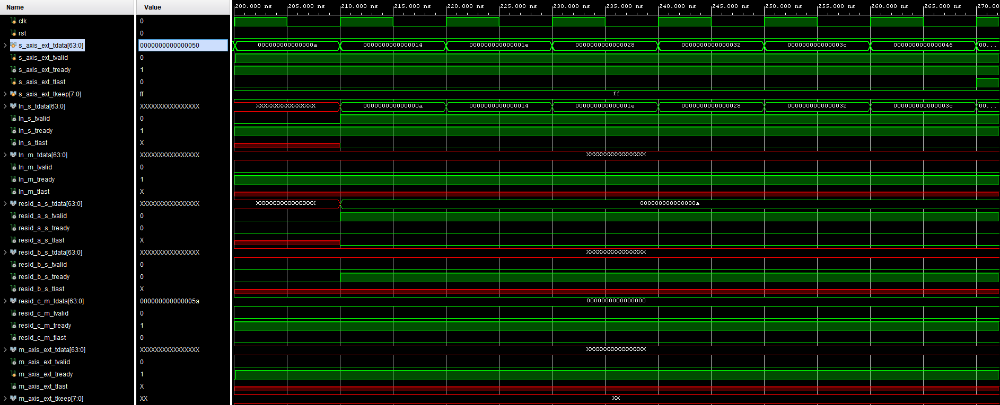
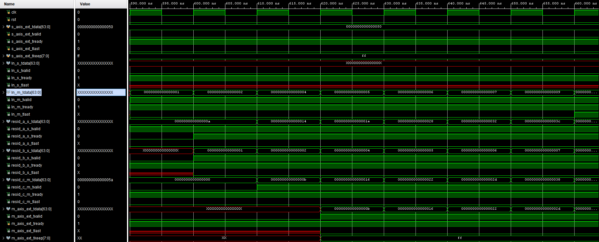
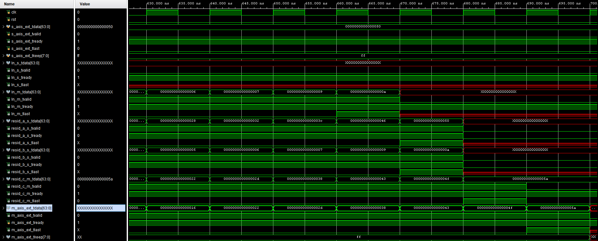

# AXI Stream Central Interconnect

## 1. Overview

The **`axis_central_interconnect`** is a configurable, many-to-many crossbar switch designed for AXI4-Stream interfaces. It allows dynamic routing of data streams between multiple processing sources (e.g., DMA, Memory) and multiple hardware acceleration modules (e.g., GEMM, ReLU, Normalization) required for Vision Transformer (ViT) inference.

### Key Features

- **Dynamic Topology:** Routing paths are selectable via runtime control signals (`sel_*`).
    
- **Broadcasting:** A single source can be routed to multiple destinations simultaneously (e.g., sending data to both a Residual block and a GEMM unit).
    
- **Backpressure Handling:** Includes "Ready Aggregation" logic to ensure a source only transmits when _all_ subscribed destination FIFOs are ready to receive.
    
- **Timing Decoupling:** Every output channel is buffered by an `axis_fifo` to prevent combinational path delays from spanning across the entire chip.
    

---

## 2. Top-Level Module: `axis_central_interconnect`

### 2.1 Parameters

This module uses Verilog parameters to scale the number of ports and buffer sizes.

|**Parameter**|**Default**|**Description**|
|---|---|---|
|`S_COUNT`|6|**Source Count.** Total number of input streams. Typically includes functional units + dummy/DMA inputs.|
|`M_COUNT`|7|**Master (Dest) Count.** Total number of output destinations (processing modules).|
|`DATA_WIDTH`|64|Bit width of the AXI Stream `tdata` bus.|
|`FIFO_DEPTH`|64|Depth of the output buffer for each destination channel.|

### 2.2 Interface Ports

#### Clock & Reset

|**Port Name**|**Direction**|**Description**|
|---|---|---|
|**`clk`**|Input|Global system clock.|
|**`rst`**|Input|Synchronous active-high reset.|

#### Source Inputs (Slave Interface)

These ports receive data **from** the processing modules (or DMA/Memory). All signals are flattened arrays containing all source channels.

|**Port Name**|**Direction**|**Width**|**Description**|
|---|---|---|---|
|**`s_axis_tdata`**|Input|$S\_COUNT \times DATA\_WIDTH$|Flattened data vector containing payload data from all sources.|
|**`s_axis_tvalid`**|Input|$S\_COUNT$|Asserted high when the corresponding source data is valid.|
|**`s_axis_tready`**|Output|$S\_COUNT$|**Backpressure Signal.** Asserted high only when **all** targeted destinations are ready to accept data.|
|**`s_axis_tlast`**|Input|$S\_COUNT$|Packet boundary delimiter; indicates the last beat of a frame/stream.|

#### Destination Outputs (Master Interface)

These ports send data **to** the processing modules.

|**Port Name**|**Direction**|**Width**|**Description**|
|---|---|---|---|
|**`m_axis_tdata`**|Output|$M\_COUNT \times DATA\_WIDTH$|Data routed to specific destinations based on the active selection.|
|**`m_axis_tvalid`**|Output|$M\_COUNT$|Asserted high when the interconnect has valid data for a destination.|
|**`m_axis_tready`**|Input|$M\_COUNT$|**Backpressure Signal.** Input from destination modules indicating availability.|
|**`m_axis_tlast`**|Output|$M\_COUNT$|Packet boundary delimiter routed to the destination.|
|**`m_axis_tkeep`**|Output|$M\_COUNT \times (DATA\_WIDTH/8)$|Byte enable signals (derived from data width).|

#### Control Inputs (Routing Configuration)

These signals configure the internal crossbar, determining which Source is connected to a specific Destination.

Note: Signal Width is $\lceil \log_2(S\_COUNT) \rceil$ bits.

| **Port Name**     | **Destination Module** | **Description**                                                     |
| ----------------- | ---------------------- | ------------------------------------------------------------------- |
| **`sel_ext`**     | External Interface     | Selects the source ID to route to the External (DMA/DDR) interface. |
| **`sel_norm`**    | Layer Norm             | Selects the source ID to route to the Layer Normalization module.   |
| **`sel_relu`**    | ReLU                   | Selects the source ID to route to the ReLU activation module.       |
| **`sel_gemm_a`**  | GEMM Input A           | Selects the source ID to route to the GEMM Matrix A input.          |
| **`sel_gemm_b`**  | GEMM Input B           | Selects the source ID to route to the GEMM Matrix B input.          |
| **`sel_resid_a`** | Residual Input A       | Selects the source ID to route to the Residual Adder Input A.       |
| **`sel_resid_b`** | Residual Input B       | Selects the source ID to route to the Residual Adder Input B.       |
| `sel_requant`     | Requant Input          | Select the source ID to route to the Requant module                 |
| `sel_softmax`     | Softmax Input          | Select the source ID to route to the Softmax module                 |

### 2.3 Internal Architecture & Logic

The module is constructed using a "Destination-Centric" approach. For every destination, we instantiate a Mux and a FIFO.

#### A. The Generation Loop (`genvar m`)

The code iterates `M_COUNT` times. Inside each iteration (representing one destination channel):

1. **`axis_mux_static`**: A multiplexer that looks at _all_ incoming source streams and picks one based on the `selects[m]` signal.
    
2. **`axis_fifo`**: The output of the mux goes immediately into a FIFO.
    
    - This breaks the critical timing path. Without this, the `tready` signal would have to propagate combinatorially from the destination, through the mux, back to the source, potentially creating long timing violations
    - Handle unaligned transfer in `gemm_core` or `residual_add` module when a single source want to send to both input stream A and B of those modules. 

#### B. Ready Signal Aggregation (Section `[4]`)

This is the most complex logic in the module. Since one source can be broadcast to multiple destinations (e.g., Source 0 goes to Destination 1 AND Destination 2), the Source must know when _both_ destinations are ready.

- Logic:
    
    $$Source_j.Ready = \bigwedge_{\forall i \text{ where } Dest_i \text{ selects } Source_j} (Dest_i.FIFO\_Ready)$$
    
- **Implementation:** The code uses a nested loop `always @*` block.
    
    1. It iterates through every Source ($j$).
        
    2. It defaults `combined_ready` to 1.
        
    3. It checks every Destination ($i$).
        
    4. If Destination $i$ is listening to Source $j$, it ANDs the current `combined_ready` with that Destination's FIFO ready signal.
        
    5. **Result:** If a Source is not selected by _anyone_, its Ready is `0` (safe default). If it is selected, it only flows if all consumers are ready.
        

---

## 3. Sub-Module: `axis_mux_static`

This module acts as a purely combinational switch, routing one of several input streams ($N$) to a single output stream based on a selection index. It handles the full AXI Stream handshake, ensuring that backpressure (`tready`) is correctly propagated only to the active source.

### 3.1 Parameters

|**Parameter**|**Default**|**Description**|
|---|---|---|
|**`S_COUNT`**|4|Number of source input streams to multiplex.|
|**`DATA_WIDTH`**|64|Bit width of the data bus.|

### 3.2 Interface Ports

#### Global & Control

|**Port Name**|**Direction**|**Width**|**Description**|
|---|---|---|---|
|**`clk`**|Input|1|Clock signal (included for standard interface, logic is combinational).|
|**`rst`**|Input|1|Reset signal.|
|**`select`**|Input|$\lceil \log_2(S\_COUNT) \rceil$|**Selector Index.** Determines which Source is routed to the Output.|
|**`enable`**|Input|1|Unused (kept for interface compatibility).|

#### Slave Interfaces (Inputs)

_Receives data from multiple sources. These are flattened arrays containing all channels._

|**Port Name**|**Direction**|**Width**|**Description**|
|---|---|---|---|
|**`s_axis_tdata`**|Input|$S\_COUNT \times W$|Flattened data vector from all sources.|
|**`s_axis_tvalid`**|Input|$S\_COUNT$|Valid signals from each source.|
|**`s_axis_tready`**|Output|$S\_COUNT$|**Demuxed Ready.** Only the bit corresponding to `select` receives `m_axis_tready`; others are driven `0`.|
|**`s_axis_tlast`**|Input|$S\_COUNT$|Packet boundaries from all sources.|
|**`s_axis_tkeep`**|Input|$S\_COUNT \times W/8$|Byte enables from all sources.|

#### Master Interface (Output)

_Sends the selected stream to the destination._

|**Port Name**|**Direction**|**Width**|**Description**|
|---|---|---|---|
|**`m_axis_tdata`**|Output|$W$|Selected data stream.|
|**`m_axis_tvalid`**|Output|1|Valid signal from the selected source.|
|**`m_axis_tready`**|Input|1|Backpressure signal from the destination.|
|**`m_axis_tlast`**|Output|1|Packet boundary from the selected source.|
|**`m_axis_tkeep`**|Output|$W/8$|Byte enables from the selected source.|

### 3.3 Functional Logic

- **Forward Path (Data Mux):** The module uses dynamic array slicing (`s_axis_tdata[select*WIDTH +: WIDTH]`) to route data, valid, last, and keep signals from the chosen input index directly to the output.
    
- **Backward Path (Ready Demux):** The `m_axis_tready` signal is routed back _only_ to the source index defined by `select`. All other sources receive a `0`, preventing them from sending data while they are not selected.

---

## 4. Sub-Module: `axis_fifo`

A synchronous, ring-buffer FIFO that decouples timing between the interconnect mux and the destination module. It ensures signal integrity by buffering `tdata`, `tlast`, and `tkeep` together.

### 4.1 Parameters

|**Parameter**|**Default**|**Description**|
|---|---|---|
|`DATA_WIDTH`|64|Bit width of the data bus.|
|`DEPTH`|64|FIFO capacity in words.|

### 4.2 Implementation Details

- **Signal Packing:** The module concatenates `tdata`, `tkeep`, and `tlast` into a single memory vector to ensure the "End of Packet" marker stays synchronized with its data word.
    
- **Backpressure:**
    
    - **Input (`s_axis_tready`):** High only when the buffer count is less than `DEPTH`.
        
    - **Output (`m_axis_tvalid`):** High whenever the buffer count is non-zero.
        
- **Memory Type:** The design uses asynchronous reads (`assign m_packed = mem[rd_ptr]`), which typically infers **Distributed RAM (LUTRAM)** rather than Block RAM, minimizing latency for shallow depths.
    
## 5. Verification

For testing this `axis_central_interconnect` module, I create a testbench with some kind of topology tests.

### 5.1 Diamond Topology Test:

This test idea is to use 1 source (External source) to simultanously drive 2 destination (2 path).

- The first path will be EXTERNAL INPUT -> RESIDUAL INPUT A
- The second path will be EXTERNAL INPUT -> LAYER_NORM -> RESIDUAL INPUT B
- And finally the RESIDUAL OUTPUT -> EXTERNAL OUTPUT

Althought that the `residual_add` module can handle unaligned Input sources, however it is only true if there are 2 distinct unaligned stream inputs, not 1 single stream driving 2 unaligned inputs.

- For 2 distinct unaligned streams input, this part of code in `residual_add` handle it perfectly
```verilog
 // Lock-step join: only assert ready on a side if the other side is valid, so pairs are consumed together
    assign s_axis_a_tready = ready_for_inputs && s_axis_b_tvalid;
    assign s_axis_b_tready = ready_for_inputs && s_axis_a_tvalid;
```
- For 1 single stream driving 2 unaligned inputs, the problem is that when stream A comes to Residual A first, its valid signal will assert Residual B's ready, but residual B is not valid so Residual A's ready is deasserted. Because of 1 unready signal, the `combined_ready` is 0, cause the source to stuck and never complete sending. 

So the solution is the `axis_fifo` connected to each destination of this interconnect. This helps the `combined_ready` signal assert whenever the FIFO is not full. And the single source can send to both Residual A and B, without losing data when A must wait for B to finish first.

Now, I will analyzed the waveform:

- The source data from testbench is 8 beats with value from 10 -> 80 (0x0a -> 0x50). We can see that the s_axis_ext_tdata is routed to the `ln_s_tdata` (`layer_norm` input) - second path, it also route to `resid_a_s_tdata` - first path, but `resid_a_s_tready` deassert so the residual does not receive now.



- After the `layer_norm` finish executing, the `ln_m_tdata` is routed to the `resid_b_s_tdata`, and the `resid_a_s_tdata` start receiving the raw data. Both input are aligned perfectly. Then, the `resid_c_m_tdata` start generating the output. Finally we can also see the `resid_c_m_tdata` is routed to the `m_axis_ext_tdata` and complete the test.





## 5. Summary of Data Flow

1. **Configuration:** The control unit (e.g., a state machine or MicroBlaze/RISC-V CPU) sets the `sel_*` wires to define the layer topology (e.g., "Connect DMA to GEMM_A").
    
2. **Transfer:** The Source (DMA) asserts `tvalid`.
    
3. **Muxing:** The `axis_mux_static` for GEMM_A selects the DMA channel.
    
4. **Buffering:** Data flows into the `axis_fifo` associated with GEMM_A.
    
5. **Delivery:** The FIFO pushes data to the actual GEMM hardware module via `m_axis_tdata`.
    
6. **Flow Control:** If the GEMM module halts (drops `tready`), the FIFO fills up. Once full, the FIFO drops its input `tready`. The `axis_mux_static` passes this drop back to the Ready Aggregation logic, which eventually drops the `tready` sent to the DMA, pausing the transfer.