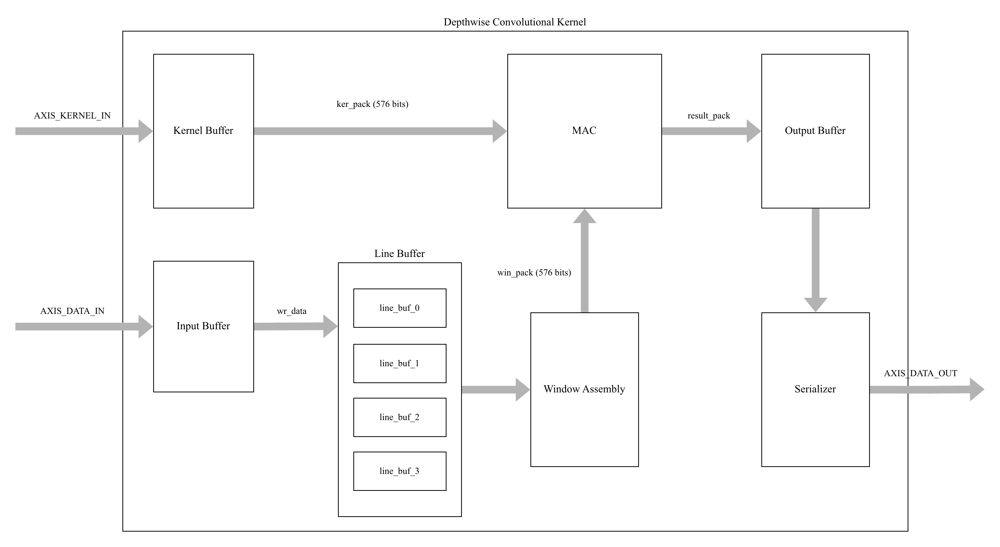
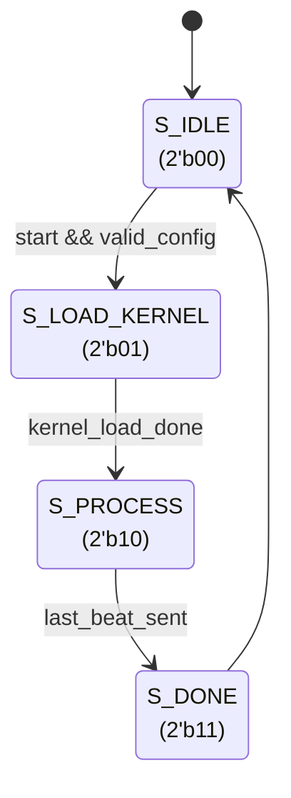
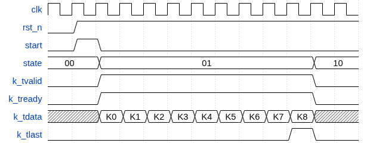
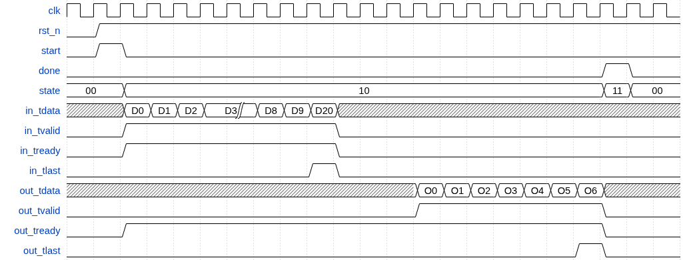
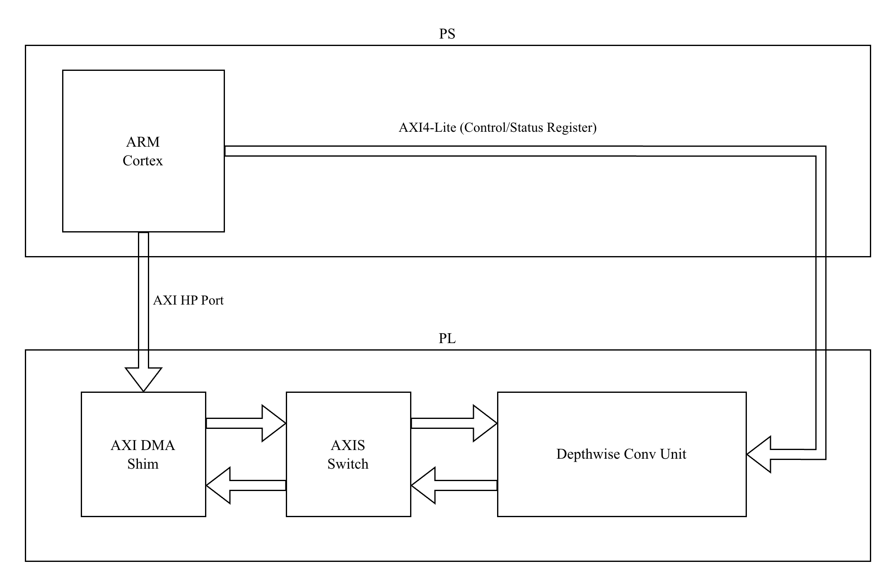

# Depthwise 3×3 Convolution Unit

| **Document Information** |                                                   |
| ------------------------ | ------------------------------------------------- |
| **Module Name**          | `depthwise_conv_unit`                             |
| **Version**              | 1.1                                               |
| **Design Status**        | In development                                    |
| **Last Updated**         | January 02 2025                                   |
| **Source Location**      | `fpga/rtl/depthwise_conv/`                        |
| **Testbench**            | `fpga/tb/depthwise_conv/tb_depthwise_conv_unit.v` |
| **Author**               | Le Phuc Khang                                     |

## Table of Contents

1. [Overview](#1-overview)
2. [Features Summary](#2-features-summary)
3. [Theory of Operation](#3-theory-of-operation)
4. [Module Architecture](#4-module-architecture)
5. [Parameters](#5-parameters)
6. [Interface Specification](#6-interface-specification)
7. [Data Formats](#7-data-formats)
8. [Finite State Machine](#8-finite-state-machine)
9. [Timing Diagrams](#9-timing-diagrams)
10. [Pipeline Architecture](#10-pipeline-architecture)
11. [Submodule Reference](#11-submodule-reference)
12. [Resource Utilization](#12-resource-utilization)
13. [Timing Analysis](#13-timing-analysis)
14. [Integration Guidelines](#14-integration-guidelines)
15. [Verification](#15-verification)
16. [Design Constraints](#16-design-constraints)
17. [Known Limitations](#17-known-limitations)

## 1. Overview

### 1.1 Purpose

The `depthwise_conv_unit` module implements a fully-pipelined 3×3 depthwise separable convolution accelerator optimized for INT8 inference on Vision Transformer architectures. It is a key component of the TinyViT-5M hardware accelerator, designed to efficiently process the local spatial mixing operations within the Attention with Spatial Reduction blocks.

### 1.2 Functional Description

Depthwise convolution applies an independent 3×3 filter to each input channel, producing a same-sized output feature map with zero-padding at boundaries. For each output pixel location `(row, col)` and channel `c`, the operation computes:

$$
\text{out}[r, c, ch] = \sum_{i=-1}^{1} \sum_{j=-1}^{1} \text{in}[r+i, c+j, ch] \cdot \text{ker}[ch, i+1, j+1]
$$

Where boundary pixels (`r+i < 0`, `r+i ≥ H`, `c+j < 0`, or `c+j ≥ W`) are treated as zero (implicit zero-padding).

### 1.3 Design Philosophy

Unlike standard convolution which can be efficiently mapped to GEMM-based systolic arrays, depthwise convolution has sparse connectivity (each filter operates on only one channel). This module uses a dedicated architecture with:

- **8 parallel lanes** processing 8 channels simultaneously per clock cycle
- **Circular line buffers** for efficient row-wise data reuse
- **Shift register banks** for column-wise sliding window extraction
- **Fully-pipelined MAC unit** achieving II=1 (initiation interval of 1 cycle)

## 2. Features Summary

| Feature                  | Specification                                      |
| ------------------------ | -------------------------------------------------- |
| **Kernel Size**          | 3×3 (fixed)                                        |
| **Input Precision**      | Signed INT8                                        |
| **Output Precision**     | Signed INT32 (pre-requantization)                  |
| **Parallel Lanes**       | 8 channels per beat                                |
| **Padding Mode**         | Implicit zero-padding (same output size)           |
| **Stride**               | 1 (fixed)                                          |
| **Max Image Width**      | Configurable (default: 28 pixels)                  |
| **Max Channels**         | Configurable (default: 128, must be multiple of 8) |
| **Throughput**           | 1 MAC result (8 channels) per cycle (steady-state) |
| **AXI-Stream Interface** | Kernel input, Data input, Data output              |
| **Backpressure Support** | Full backpressure on output stream                 |
| **Flow Control**         | Credit-based FIFO prevents overflow                |

## 3. Theory of Operation

### 3.1 Processing Flow

The module operates in three sequential phases:

```text
S_IDLE -> S_LOAD_KERNEL -> S_PROCESS -> S_DONE
```

1. **Idle/Configuration Phase (`S_IDLE`)**: Waits for `start` pulse; latches `cfg_height`, `cfg_width`, and `cfg_channels`.

2. **Kernel Loading Phase (`S_LOAD_KERNEL`)**: Receives 9 kernel coefficients per channel group via AXI-Stream. Total beats = `(channels/8) × 9`.

3. **Processing Phase (`S_PROCESS`)**: Streams input feature map while computing and outputting convolution results with continuous throughput.

4. **Done Phase (`S_DONE`)**: Asserts `done` signal for one cycle, then returns to `S_IDLE`.

### 3.2 Window Formation Strategy

The 3×3 convolution window is formed using a combination of:

- **Line Buffers (4 BRAMs)**: Store up to 4 complete rows of the input feature map in a circular fashion.
- **Shift Register Banks**: Maintain a 2-column sliding history to extract left, center, and right column values.
- **Lookahead Architecture**: The currently-read data serves as the "right" column, allowing continuous processing without stalls.

### 3.3 Boundary Handling

Zero-padding is applied implicitly:

- **Top row** (`row == 0`): Top kernel row contributions zeroed
- **Bottom row** (`row == H-1`): Bottom kernel row contributions zeroed
- **Left column** (`col == 0`): Left kernel column contributions zeroed
- **Right column** (`col == W-1`): Right kernel column contributions zeroed

## 4. Module Architecture

### 4.1 Block Diagram



### 4.2 Module Hierarchy

```text
depthwise_conv_unit (top-level)
│
├── kernel_buffer           # Stores 3×3 kernels for all channel groups
│   └── kernel_mem[16]      # 576-bit packed registers × 16 groups
│
├── line_buffer             # 4-row circular BRAM storage
│   ├── line_buf_0          # BRAM row 0 (448 × 64-bit)
│   ├── line_buf_1          # BRAM row 1
│   ├── line_buf_2          # BRAM row 2
│   └── line_buf_3          # BRAM row 3
│
├── mac_unit                # 9-stage fully-pipelined MAC
│   ├── Stage 0             # Capture + first product
│   ├── Stages 1-8          # Accumulate remaining products
│   └── Output stage        # Result valid + last flags
│
├── Input FIFO              # Decouples AXI input from line buffer writes
│
├── Shift Register Banks    # Dual-bank column history (ping-pong)
│   ├── row_*_shift_a[33]   # Bank A for current row processing
│   └── row_*_shift_b[33]   # Bank B for next-row prefetch
│
└── Output FIFO + Serializer
    ├── out_fifo[16]        # 256-bit MAC result buffer
    └── ser_buf             # 64-bit output slice register
```

## 5. Parameters

### 5.1 Top-Level Parameters

| Parameter      | Default | Range            | Description                                  |
| -------------- | ------- | ---------------- | -------------------------------------------- |
| `DATA_WIDTH`   | 8       | 1–16             | Input element bit-width (signed)             |
| `LANES`        | 8       | 4, 8, 16         | Parallel channels per beat                   |
| `INPUT_WIDTH`  | 64      | LANES×DATA_WIDTH | AXI-Stream data width for inputs             |
| `OUTPUT_WIDTH` | 64      | 32, 64, 128, 256 | AXI-Stream data width for outputs            |
| `MAX_WIDTH`    | 28      | 4–256            | Maximum supported image width (pixels)       |
| `MAX_CHANNELS` | 128     | 8–1024           | Maximum channels (must be multiple of LANES) |
| `ACC_WIDTH`    | 32      | 16–64            | Accumulator bit-width for MAC results        |

### 5.2 Derived Parameters (Computed Internally)

| Parameter           | Formula                    | Default Value | Description                 |
| ------------------- | -------------------------- | ------------- | --------------------------- |
| `KERNEL_SIZE`       | 9 (constant)               | 9             | 3×3 kernel positions        |
| `KERNEL_PACK_WIDTH` | KERNEL_SIZE × INPUT_WIDTH  | 576           | Packed kernel width in bits |
| `MAX_CHAN_BEATS`    | MAX_CHANNELS / LANES       | 16            | Max channel groups          |
| `SHIFT_DEPTH`       | 2 × MAX_CHAN_BEATS + 1     | 33            | Shift register depth        |
| `MAC_WIDTH`         | LANES × ACC_WIDTH          | 256           | Full MAC result width       |
| `OUT_SLICES`        | MAC_WIDTH / OUTPUT_WIDTH   | 4             | Output serialization factor |
| `OUT_FIFO_DEPTH`    | 16 (constant)              | 16            | Output FIFO entries         |
| `IN_FIFO_DEPTH`     | MAX_WIDTH × MAX_CHAN_BEATS | 448           | Input FIFO entries          |

### 5.3 Constraints and Requirements

1. **Channel Alignment**: `cfg_channels` must be a multiple of `LANES` (8 by default)
2. **Width Constraint**: `cfg_width` ≤ `MAX_WIDTH`
3. **Channel Limit**: `cfg_channels` ≤ `MAX_CHANNELS`
4. **Output Width**: `OUTPUT_WIDTH` must evenly divide `MAC_WIDTH` (256 bits)

## 6. Interface Specification

### 6.1 Port List

#### Clock and Reset

| Port    | Direction | Width | Description                            |
| ------- | --------- | ----- | -------------------------------------- |
| `clk`   | Input     | 1     | System clock (positive-edge triggered) |
| `rst_n` | Input     | 1     | Active-low asynchronous reset          |

#### Control Interface

| Port           | Direction | Width | Description                                    |
| -------------- | --------- | ----- | ---------------------------------------------- |
| `start`        | Input     | 1     | Pulse to begin new convolution job             |
| `done`         | Output    | 1     | Pulses when job completes                      |
| `cfg_height`   | Input     | 16    | Image height in pixels (rows)                  |
| `cfg_width`    | Input     | 16    | Image width in pixels (columns)                |
| `cfg_channels` | Input     | 16    | Number of channels (must be multiple of LANES) |

#### Kernel Input (AXI-Stream Slave)

| Port                    | Direction | Width       | Description                         |
| ----------------------- | --------- | ----------- | ----------------------------------- |
| `axis_kernel_in_tdata`  | Input     | INPUT_WIDTH | Packed kernel coefficients (8×INT8) |
| `axis_kernel_in_tvalid` | Input     | 1           | Data valid indicator                |
| `axis_kernel_in_tlast`  | Input     | 1           | End of kernel stream                |
| `axis_kernel_in_tready` | Output    | 1           | Ready to accept kernel data         |

#### Feature Map Input (AXI-Stream Slave)

| Port                  | Direction | Width       | Description                         |
| --------------------- | --------- | ----------- | ----------------------------------- |
| `axis_data_in_tdata`  | Input     | INPUT_WIDTH | Packed input pixels (8×INT8)        |
| `axis_data_in_tvalid` | Input     | 1           | Data valid indicator                |
| `axis_data_in_tlast`  | Input     | 1           | End of input stream (informational) |
| `axis_data_in_tready` | Output    | 1           | Ready to accept input data          |

#### Feature Map Output (AXI-Stream Master)

| Port                   | Direction | Width        | Description                      |
| ---------------------- | --------- | ------------ | -------------------------------- |
| `axis_data_out_tdata`  | Output    | OUTPUT_WIDTH | Serialized output data (2×INT32) |
| `axis_data_out_tvalid` | Output    | 1            | Data valid indicator             |
| `axis_data_out_tlast`  | Output    | 1            | End of output stream             |
| `axis_data_out_tready` | Input     | 1            | Downstream ready to accept       |

### 6.2 AXI-Stream Compliance

All AXI-Stream interfaces comply with ARM AMBA 4 AXI-Stream Protocol Specification:

- **Handshake Protocol**: Data transfer occurs when both `TVALID` and `TREADY` are asserted on the rising edge of `clk`.
- **TVALID Assertion Rules**: Once asserted, `TVALID` remains high until the transfer completes (handshake occurs).
- **TREADY Behavior**: May be asserted/deasserted independently of `TVALID`.
- **TLAST Semantics**: Indicates the last beat of a packet/frame.

## 7. Data Formats

### 7.1 Kernel Data Format

Kernels are loaded via `axis_kernel_in` in a specific order optimized for streaming access:

```text
For each channel_group (0 to C/8 - 1):
    For each coefficient (0 to 8):  # Raster order of 3×3 kernel
        Send 64-bit beat containing 8 kernel values

Beat layout:
  [63:56] = kernel[ch_group*8 + 7, coeff]
  [55:48] = kernel[ch_group*8 + 6, coeff]
  ...
  [ 7: 0] = kernel[ch_group*8 + 0, coeff]

Coefficient ordering (raster scan):
  ┌───┬───┬───┐
  │ 0 │ 1 │ 2 │  (top row)
  ├───┼───┼───┤
  │ 3 │ 4 │ 5 │  (center row, coeff 4 = center)
  ├───┼───┼───┤
  │ 6 │ 7 │ 8 │  (bottom row)
  └───┴───┴───┘
```

**Total Kernel Beats**: `(cfg_channels / 8) × 9`

### 7.2 Input Feature Map Format

Input data arrives row-major with channel interleaving within each pixel:

```text
Stream order:
  Row 0:
    Pixel(0,0): Beat 0  = ch[7:0],   Beat 1  = ch[15:8],  ...
    Pixel(0,1): Beat N  = ch[7:0],   Beat N+1 = ch[15:8], ...
    ...
  Row 1:
    Pixel(1,0): ...

Beat layout (64 bits):
  [63:56] = input[row, col, ch_group*8 + 7]  (signed INT8)
  [55:48] = input[row, col, ch_group*8 + 6]
  ...
  [ 7: 0] = input[row, col, ch_group*8 + 0]
```

**Total Input Beats**: `cfg_height × cfg_width × (cfg_channels / 8)`

### 7.3 Output Feature Map Format

Output data is serialized when `OUTPUT_WIDTH < MAC_WIDTH`. With default parameters (64-bit output, 256-bit MAC result), each MAC result is emitted across 4 consecutive beats:

```text
For each MAC result (8 × INT32 = 256 bits):
  Beat 0: [63:32] = out[row,col,ch+1], [31:0] = out[row,col,ch+0]
  Beat 1: [63:32] = out[row,col,ch+3], [31:0] = out[row,col,ch+2]
  Beat 2: [63:32] = out[row,col,ch+5], [31:0] = out[row,col,ch+4]
  Beat 3: [63:32] = out[row,col,ch+7], [31:0] = out[row,col,ch+6]

TLAST is asserted only on the final beat of the final MAC result.
```

**Total Output Beats**: `cfg_height × cfg_width × (cfg_channels / 8) × OUT_SLICES`

## 8. Finite State Machine

### 8.1 State Diagram



### 8.2 State Descriptions

| State           | Encoding | Entry Condition          | Exit Condition            | Actions                               |
| --------------- | -------- | ------------------------ | ------------------------- | ------------------------------------- |
| `S_IDLE`        | 2'b00    | Reset or S_DONE complete | `start` with valid config | Latch cfg\_\*, reset counters         |
| `S_LOAD_KERNEL` | 2'b01    | `start` accepted         | `kernel_load_done`        | Accept kernel stream, fill kernel_mem |
| `S_PROCESS`     | 2'b10    | Kernels loaded           | `last_beat_sent`          | Stream input, compute, emit output    |
| `S_DONE`        | 2'b11    | All outputs sent         | Always (1 cycle)          | Assert `done`, return to S_IDLE       |

### 8.3 Valid Configuration Check

The transition from `S_IDLE` to `S_LOAD_KERNEL` requires:

```verilog
start && (cfg_height > 0) && (cfg_width > 0) && (cfg_channels >= LANES)
```

## 9. Timing Diagrams

### 9.1 Kernel Loading Sequence



### 9.2 Steady-State Processing



## 10. Pipeline Architecture

### 10.1 End-to-End Pipeline Stages

| Stage | Name                  | Latency  | Description                                      |
| ----- | --------------------- | -------- | ------------------------------------------------ |
| 1     | Input FIFO            | 1 cycle  | Decouples AXI input from internal timing         |
| 2     | Line Buffer Write     | 1 cycle  | Write incoming data to circular BRAM             |
| 3     | Line Buffer Read      | 1 cycle  | Synchronous BRAM read (3 parallel reads)         |
| 4     | Row Mux Select        | 1 cycle  | Select above/center/below rows from BRAM outputs |
| 5     | Shift Register Insert | 1 cycle  | Shift new data into column history               |
| 6     | Window Assembly       | 1 cycle  | Form 3×3 window with boundary masking            |
| 7-15  | MAC Pipeline          | 9 cycles | 9-stage pipelined multiply-accumulate            |
| 16    | Output FIFO Write     | 1 cycle  | Buffer MAC result                                |
| 17+   | Serializer            | 4 cycles | Emit 4× 64-bit slices per MAC result             |

**Total Pipeline Latency**: ~18-20 cycles (first result appearance)

**Steady-State Throughput**: 1 MAC result (8 channels) per cycle after fill

### 10.2 MAC Unit Pipeline Detail

The `mac_unit` module implements a fully-unrolled 9-stage pipeline:

```text
Stage 0: Capture win_pack, ker_pack; compute product[0] for all 8 lanes
Stage 1: sum[1] = sum[0] + product[1]
Stage 2: sum[2] = sum[1] + product[2]
...
Stage 8: sum[8] = sum[7] + product[8] → result_pack
```

Each stage uses signed multiply with sign-extension to INT32:

```verilog
prod = $signed(win[pos][lane]) * $signed(ker[pos][lane]);  // 16-bit result
sum[stage] = sum[stage-1] + {{16{prod[15]}}, prod};        // Sign-extend to 32-bit
```

### 10.3 Backpressure Handling

The design uses credit-based flow control to prevent FIFO overflow:

```verilog
pending_count = in_flight + out_fifo_count + issue_pipe_count;
fifo_has_space = (pending_count < OUT_FIFO_DEPTH);  // 16

// Read issuance stalls when FIFO is nearly full
can_issue_real = ... && fifo_has_space;
```

When `axis_data_out_tready` deasserts:

1. Output serializer pauses
2. Output FIFO fills
3. `fifo_has_space` becomes false
4. Read scheduler stalls (no new windows issued)
5. Input FIFO can continue filling up to its depth
6. Eventually `axis_data_in_tready` deasserts

## 11. Submodule Reference

### 11.1 kernel_buffer

**Purpose**: Stores 3×3 kernel weights for all channel groups with single-cycle read access.

**Location**: `fpga/rtl/depthwise_conv/kernel_buffer.v`

#### Parameters

| Parameter      | Default | Description                |
| -------------- | ------- | -------------------------- |
| `DATA_WIDTH`   | 8       | Kernel element width       |
| `LANES`        | 8       | Channels per beat          |
| `INPUT_WIDTH`  | 64      | Input bus width            |
| `MAX_CHANNELS` | 128     | Maximum supported channels |
| `KERNEL_SIZE`  | 9       | Kernel coefficients (3×3)  |

#### Interface

| Port             | Direction | Width | Description                         |
| ---------------- | --------- | ----- | ----------------------------------- |
| `clk`, `rst_n`   | Input     | 1     | Clock and active-low reset          |
| `load_enable`    | Input     | 1     | High during kernel loading phase    |
| `num_chan_beats` | Input     | 16    | Number of channel groups to load    |
| `load_done`      | Output    | 1     | Pulses when loading completes       |
| `axis_kernel_*`  | Mixed     | -     | AXI-Stream kernel input interface   |
| `chan_group`     | Input     | 4     | Channel group index for read access |
| `kernel_pack`    | Output    | 576   | Packed 9×64-bit kernel coefficients |

#### Architecture

- **Storage**: 16 × 576-bit packed registers (not BRAM for single-cycle access)
- **Write Pipeline**: 2-stage for timing closure
  - Stage 1: Counter update, address generation
  - Stage 2: Data registration
  - Stage 3: Memory write
- **Read**: Combinational (single-cycle latency)

### 11.2 line_buffer

**Purpose**: Circular 4-row BRAM buffer for efficient sliding window data reuse.

**Location**: `fpga/rtl/depthwise_conv/line_buffer.v`

#### Parameters

| Parameter      | Default | Description         |
| -------------- | ------- | ------------------- |
| `DATA_WIDTH`   | 8       | Element width       |
| `LANES`        | 8       | Channels per beat   |
| `INPUT_WIDTH`  | 64      | Bus width           |
| `MAX_WIDTH`    | 28      | Maximum image width |
| `MAX_CHANNELS` | 128     | Maximum channels    |

#### Interface

| Port             | Direction | Width | Description                         |
| ---------------- | --------- | ----- | ----------------------------------- |
| `clk`, `rst_n`   | Input     | 1     | Clock and reset                     |
| `num_cols`       | Input     | 16    | Image width for address calculation |
| `num_chan_beats` | Input     | 16    | Channel groups per pixel            |
| `wr_en`          | Input     | 1     | Write enable                        |
| `wr_row_sel`     | Input     | 2     | Target row buffer (0-3)             |
| `wr_addr`        | Input     | 16    | Write address within row            |
| `wr_data`        | Input     | 64    | Write data                          |
| `rd_addr`        | Input     | 16    | Read address (same for all 4 rows)  |
| `rd_data_0..3`   | Output    | 64    | Read data from each row buffer      |

#### Architecture

- **Storage**: 4 × Block RAM (448 × 64-bit each)
- **RAM Attribute**: `(* ram_style = "block" *)` for BRAM inference
- **Write Port**: Single write to selected row buffer
- **Read Port**: Simultaneous read from all 4 buffers
- **Latency**: 1 cycle (synchronous BRAM read)

### 11.3 mac_unit

**Purpose**: Fully-pipelined 9-stage MAC computing 8 parallel 3×3 dot products.

**Location**: `fpga/rtl/depthwise_conv/mac_unit.v`

#### Parameters

| Parameter     | Default | Description                   |
| ------------- | ------- | ----------------------------- |
| `DATA_WIDTH`  | 8       | Input element width           |
| `LANES`       | 8       | Parallel channels             |
| `ACC_WIDTH`   | 32      | Accumulator width             |
| `KERNEL_SIZE` | 9       | Number of products per result |

#### Interface

| Port           | Direction | Width | Description                 |
| -------------- | --------- | ----- | --------------------------- |
| `clk`, `rst_n` | Input     | 1     | Clock and reset             |
| `data_valid`   | Input     | 1     | Window/kernel data ready    |
| `data_last`    | Input     | 1     | Last beat flag              |
| `win_pack`     | Input     | 576   | Packed 9×8-lane window data |
| `ker_pack`     | Input     | 576   | Packed 9×8-lane kernel data |
| `busy`         | Output    | 1     | Legacy signal (always 0)    |
| `result_valid` | Output    | 1     | Result available            |
| `result_last`  | Output    | 1     | Last result flag            |
| `result_pack`  | Output    | 256   | Packed 8×INT32 results      |

#### Architecture

- **Pipeline Depth**: 9 stages (one per kernel position)
- **Initiation Interval**: 1 cycle (fully pipelined)
- **Latency**: 9 cycles from input to output
- **Valid/Last Propagation**: `valid_pipe` and `last_pipe` shift registers track data through pipeline

## 12. Resource Utilization

### 12.1 Synthesis Results

**Target Device**: Xilinx Zynq-7020 (xc7z020clg400-1)  
**Tool Version**: Vivado 2025.2  
**Synthesis Mode**: Out-of-Context (OOC)

| Resource            | Used   | Available | Utilization |
| ------------------- | ------ | --------- | ----------- |
| **Slice LUTs**      | 27,892 | 53,200    | 52.43%      |
| - LUT as Logic      | 27,251 | 53,200    | 51.22%      |
| - LUT as Memory     | 641    | 17,400    | 3.68%       |
| **Slice Registers** | 33,692 | 106,400   | 31.67%      |
| **F7 Muxes**        | 3,458  | 26,600    | 13.00%      |
| **F8 Muxes**        | 1,537  | 13,300    | 11.56%      |
| **Block RAM**       | 5      | 140       | 3.57%       |
| **DSP Slices**      | 72     | 220       | 32.73%      |

### 12.2 Resource Breakdown by Component

| Component         | LUTs (est.) | Registers (est.) | BRAM | Notes                         |
| ----------------- | ----------- | ---------------- | ---- | ----------------------------- |
| kernel_buffer     | 2,500       | 9,500            | 0    | 576-bit × 16 packed regs      |
| line_buffer       | 500         | 300              | 5    | 4 × 448 × 64-bit BRAMs        |
| mac_unit          | 12,000      | 8,000            | 0    | 72 multipliers + accumulators |
| Shift registers   | 10,000      | 12,000           | 0    | 2 banks × 33 × 192 bits       |
| Output serializer | 2,000       | 3,000            | 0    | FIFO + slice muxing           |
| Control logic     | 5,000       | 2,000            | 0    | FSM, counters, flow control   |

### 12.3 Resource Optimization Notes

1. **DSP Usage Enabled**: 72 DSP48E1s inferred for MAC multiplies; LUT usage is reduced compared to the LUT-only build.

2. **High Register Count**: Dominated by shift register banks. Could use SRL16/SRL32 primitives for reduction.

3. **BRAM Efficiency**: Only 5 of 140 BRAMs used. Additional line buffering or larger channel support possible.

## 13. Timing Analysis

### 13.1 Post-Route Timing Summary

| Metric                         | Value              |
| ------------------------------ | ------------------ |
| **Target Clock Period**        | 5.000 ns (200 MHz) |
| **WNS (Worst Negative Slack)** | -1.189 ns          |
| **Achieved Clock Period**      | 6.189 ns           |
| **Estimated Fmax**             | 161.58 MHz         |
| **Timing Status**              | VIOLATED           |

### 13.2 Critical Path Analysis

The critical path is likely in one of these areas:

1. **MAC Pipeline Stage Transitions**: 8-bit × 8-bit → 32-bit accumulation chains
2. **Shift Register Muxing**: Large mux trees for column selection
3. **FIFO Space Calculation**: `pending_count` computation with multiple adders

### 13.3 Timing Optimization Recommendations

1. **DSP Inference**: Enabled for MAC multiplies; consider adding DSP input/output regs for better timing
2. **Pipeline Mux Selection**: Add register stages in row selection logic
3. **Reduce Shift Depth**: Use smaller `MAX_CHAN_BEATS` if application allows
4. **Retiming**: Enable `synth_design -retiming` for automatic register balancing

## 14. Integration Guidelines

### 14.1 System Integration



> [!NOTE]
> In the system diagram, this module is depicted as a standalone IP with standard AXI4 interfaces for integration. However, in the target architecture, this unit serves as a stage within a larger dataflow pipeline. Consequently, the configuration signals (cfg_*) are designed to be driven directly by a hardware scheduler ("sched tiler") rather than individual memory-mapped registers. The AXI4-Lite wrapper would only be implemented if deploying this unit as an independent IP core.

### 14.2 DMA Configuration

For continuous streaming:

| Parameter                  | Recommended Value |
| -------------------------- | ----------------- |
| **S2MM/MM2S Width**        | 64 bits           |
| **Burst Length**           | 16–256            |
| **Buffer Descriptor Mode** | Scatter-Gather    |
| **Data Realignment**       | Enabled           |

### 14.3 Software Driver Flow

```c
// 1. Configure dimensions
axi_lite_write(CTRL_BASE + CFG_HEIGHT, height);
axi_lite_write(CTRL_BASE + CFG_WIDTH, width);
axi_lite_write(CTRL_BASE + CFG_CHANNELS, channels);

// 2. Start kernel DMA transfer
dma_start_s2mm(kernel_dma, kernel_ptr, kernel_size);

// 3. Pulse start
axi_lite_write(CTRL_BASE + CTRL_REG, START_BIT);

// 4. Wait for kernel load (poll or interrupt)
while (!(dma_status(kernel_dma) & COMPLETE));

// 5. Start input/output DMA transfers
dma_start_s2mm(data_dma, input_ptr, input_size);
dma_start_mm2s(data_dma, output_ptr, output_size);

// 6. Wait for completion
while (!axi_lite_read(CTRL_BASE + STATUS_REG) & DONE_BIT);
```

### 14.4 Clock Domain Crossing

All interfaces are synchronous to `clk`. If crossing clock domains:

- Use asynchronous FIFOs on AXI-Stream interfaces
- Synchronize control signals (`start`, `done`) with dual-flop synchronizers
- Ensure `cfg_*` signals are stable before `start` assertion

## 15. Verification

### 15.1 Testbench Overview

**Location**: `fpga/tb/depthwise_conv/tb_depthwise_conv_unit.v`

The testbench provides comprehensive functional verification:

| Test Case | Configuration | Kernel Type | Input Type | Purpose                 |
| --------- | ------------- | ----------- | ---------- | ----------------------- |
| Test 1    | 4×4×8         | Identity    | Gradient   | Basic functionality     |
| Test 2    | 8×8×8         | Identity    | Random     | Larger image, identity  |
| Test 3    | 4×4×8         | Random      | Gradient   | Random kernel           |
| Test 4    | 8×8×16        | Random      | Random     | Multi-channel group     |
| Test 5    | 4×4×32        | Random      | Random     | More channels           |
| Test 6    | 7×7×64        | Random      | Random     | TinyViT-like dimensions |

### 15.2 Verification Methodology

1. **Golden Reference Generation**: Software model computes expected outputs in Verilog
2. **Streaming Interface Testing**: Full AXI-Stream handshaking with valid/ready toggling
3. **Boundary Condition Coverage**: Zero-padding at all four edges verified
4. **Output Comparison**: Bit-exact comparison against golden reference
5. **Timeout Protection**: Watchdog timer prevents infinite simulation

### 15.3 Running Simulations

```bash
# Using ModelSim
cd fpga/sim
make all TESTNAME=tb_depthwise_conv_unit

# View waveforms
make wave TESTNAME=tb_depthwise_conv_unit

# Generate VCD for other viewers
# (VCD dump enabled by default in testbench)
```

### 15.4 Expected Output

```text
==============================================
Depthwise Conv Unit Testbench
==============================================

========================================
TEST 1: 4x4x8
========================================
  Kernel type: Identity (center=1, others=0)
  Input type: Horizontal gradient (-64 to +63)
  Loaded 9 kernel beats
  Sent 16 input beats
  Received 64 output slices
  PASSED: All 128 elements match
...
==============================================
SUMMARY: 6/6 tests passed
ALL TESTS PASSED!
==============================================
```

## 16. Design Constraints

### 16.1 Timing Constraints (XDC)

**File**: `fpga/constraints/depthwise_conv_unit.xdc`

```tcl
## Clock constraint - 200 MHz target (adjust based on timing closure)
create_clock -period 5.000 -name clk -waveform {0.000 2.500} [get_ports clk]

## Asynchronous reset - false path
set_false_path -from [get_ports rst_n]
```

### 16.2 Recommended Constraints for Integration

```tcl
## Input delay constraints (adjust based on upstream module)
set_input_delay -clock clk -max 2.0 [get_ports axis_*_tdata]
set_input_delay -clock clk -max 2.0 [get_ports axis_*_tvalid]
set_input_delay -clock clk -min 0.5 [get_ports axis_*_tdata]
set_input_delay -clock clk -min 0.5 [get_ports axis_*_tvalid]

## Output delay constraints (adjust based on downstream module)
set_output_delay -clock clk -max 2.0 [get_ports axis_*_tdata]
set_output_delay -clock clk -max 2.0 [get_ports axis_*_tvalid]
set_output_delay -clock clk -min 0.5 [get_ports axis_*_tdata]
set_output_delay -clock clk -min 0.5 [get_ports axis_*_tvalid]
```

## 17. Known Limitations

### 17.1 Functional Limitations

| Limitation            | Impact                              | Workaround                              |
| --------------------- | ----------------------------------- | --------------------------------------- |
| Fixed 3×3 kernel size | Cannot support other kernel sizes   | Use multiple passes or different module |
| Fixed stride of 1     | Cannot support strided convolutions | Post-process with downsampler           |
| Channel multiple of 8 | Odd channel counts require padding  | Pad channels to multiple of 8           |
| No dilation support   | Dilated convolutions not possible   | Not applicable to TinyViT workload      |

### 17.2 Timing Limitations

| Issue                     | Current Status           | Mitigation                           |
| ------------------------- | ------------------------ | ------------------------------------ |
| Fmax < 200 MHz target     | 157 MHz achieved         | Reduce target or apply optimizations |
| Large combinational paths | In shift register muxing | Add pipeline stages                  |

### 17.3 Resource Limitations

| Issue                | Current Status               | Mitigation                            |
| -------------------- | ---------------------------- | ------------------------------------- |
| High LUT usage (60%) | Limits other logic on device | Enable DSP inference for MACs         |
| No DSP usage         | Underutilizes available DSPs | Add `use_dsp` attribute to multiplies |

## Appendix A: Quick Reference Card

### A.1 Port Summary

```text
depthwise_conv_unit #(
    .DATA_WIDTH   (8),      // INT8 elements
    .LANES        (8),      // 8 channels/beat
    .INPUT_WIDTH  (64),     // 64-bit input bus
    .OUTPUT_WIDTH (64),     // 64-bit output bus
    .MAX_WIDTH    (28),     // Max 28 pixels wide
    .MAX_CHANNELS (128),    // Max 128 channels
    .ACC_WIDTH    (32)      // INT32 accumulators
) u_dwconv (
    .clk                    (clk),
    .rst_n                  (rst_n),
    // Control
    .start                  (start),
    .done                   (done),
    .cfg_height             (cfg_height),
    .cfg_width              (cfg_width),
    .cfg_channels           (cfg_channels),
    // Kernel AXI-Stream
    .axis_kernel_in_tdata   (kernel_tdata),
    .axis_kernel_in_tvalid  (kernel_tvalid),
    .axis_kernel_in_tlast   (kernel_tlast),
    .axis_kernel_in_tready  (kernel_tready),
    // Input AXI-Stream
    .axis_data_in_tdata     (data_in_tdata),
    .axis_data_in_tvalid    (data_in_tvalid),
    .axis_data_in_tlast     (data_in_tlast),
    .axis_data_in_tready    (data_in_tready),
    // Output AXI-Stream
    .axis_data_out_tdata    (data_out_tdata),
    .axis_data_out_tvalid   (data_out_tvalid),
    .axis_data_out_tlast    (data_out_tlast),
    .axis_data_out_tready   (data_out_tready)
);
```

### A.2 Typical Dimensions for TinyViT

| Stage               | Height | Width | Channels | Kernel Beats | Input Beats | Output Slices |
| ------------------- | ------ | ----- | -------- | ------------ | ----------- | ------------- |
| Stage 1 (56×56×64)  | 56     | 56    | 64       | 72           | 25,088      | 100,352       |
| Stage 2 (28×28×128) | 28     | 28    | 128      | 144          | 12,544      | 50,176        |
| Stage 3 (14×14×160) | 14     | 14    | 160      | 180          | 3,920       | 15,680        |
| Stage 4 (7×7×320)   | 7      | 7     | 320      | 360          | 1,960       | 7,840         |
