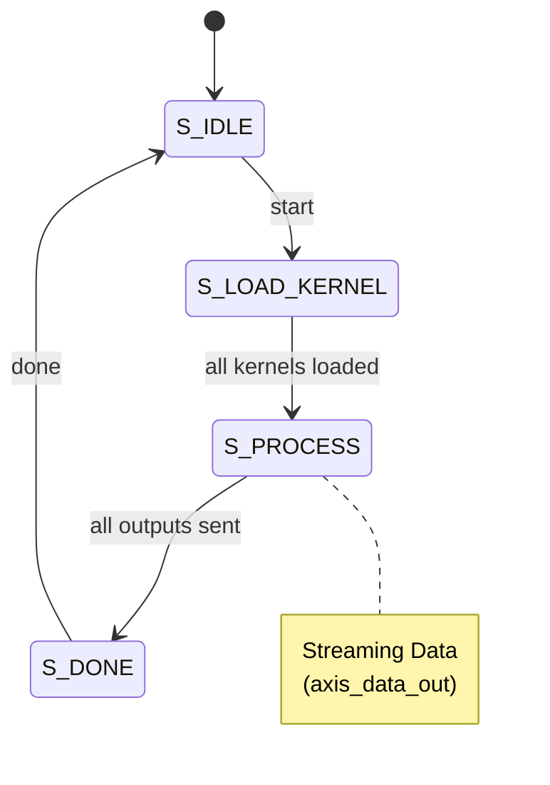

# Depthwise 3x3 Convolution Unit Documentation

This document describes the hardware depthwise 3x3 convolution implementation located at `fpga/rtl/depthwise_conv/depthwise_conv_unit.v`. It covers the algorithm design, architecture, I/O interfaces, internal pipeline, and testing methodology.

## Why Depthwise Convolution Needs a Dedicated Unit

### The GEMM Utilization Problem

Standard GEMM operates on dense matrices where every output depends on all inputs. Depthwise convolution is inherently sparse - each output channel depends on only ONE input channel:

| Operation | Weight Matrix | 8×8 Systolic Utilization |
|-----------|---------------|--------------------------|
| Standard Conv (3×3, Cin→Cout) | Dense (Cout × 9×Cin) | 100% |
| FC / Linear | Dense (Dout × Din) | 100% |
| **Depthwise Conv (3×3)** | Diagonal (C × 9) | **12.5% (1/8 PEs active)** |

Mapping depthwise to an 8×8 systolic array wastes 87.5% of compute resources. A dedicated unit with 8 parallel MAC units is much more efficient.

### Where This Sits In TinyViT

Depthwise 3×3 convolution appears in two places:

1. **MBConv Blocks (Stage 1)**: Mobile Inverted Bottleneck with depthwise separable conv
   - Channel dimensions: 64, 128 (after expansion)
   - Spatial size: 56×56, 28×28

2. **LocalConv (Stages 2-4)**: Applied after attention to refine local features
   - Applied within each window (7×7 or 14×14)
   - Maintains spatial structure

## Module Overview

The depthwise convolution unit applies a separate 3×3 filter to each input channel independently:

for each channel $c$:

$$
\text{output}[row, col, c] = \sum_{i=-1}^{1} \sum_{j=-1}^{1} \left( \text{input}[row+i, col+j, c] \times \text{kernel}[c, i, j] \right)
$$

### Key Features

- **8-lane parallel processing** (matches AXI-Stream bus width)
- **Internal line buffers** for sliding window (no external address generation)
- **Zero padding** for image borders
- **Pipelined datapath** for improved throughput
- **Outputs raw INT32** (requantization handled by external `requant_unit`)

## Block Diagram

> [!NOTE]
> I will add it in later, currently drawing it with drawio

## Parameterization

| Parameter | Default | Description |
|-----------|---------|-------------|
| `DATA_WIDTH` | 8 | Input/output element width (INT8) |
| `LANES` | 8 | Parallel channels per beat |
| `INPUT_WIDTH` | 64 | Input AXI-Stream data width (8 × 8 bits) |
| `OUTPUT_WIDTH` | 256 | Output AXI-Stream data width (8 × 32 bits) |
| `MAX_WIDTH` | 64 | Maximum image width (columns) |
| `MAX_CHANNELS` | 512 | Maximum channels supported |
| `ACC_WIDTH` | 32 | Accumulator width (INT32) |

## Interfaces (Ports)

### Control

| Port | Dir | Width | Description |
|------|-----|-------|-------------|
| `start` | in | 1 | Pulse to begin a new convolution (latches config) |
| `cfg_height` | in | 16 | Image height (rows) |
| `cfg_width` | in | 16 | Image width (columns) |
| `cfg_channels` | in | 16 | Total channels (must be multiple of 8) |
| `done` | out | 1 | Pulses when convolution complete |

### AXI-Stream Kernel Input (`axis_kernel_in_*`)

| Port | Dir | Width | Description |
|------|-----|-------|-------------|
| `axis_kernel_in_tdata` | in | 64 | Packed INT8 kernel coefficients (8 per beat) |
| `axis_kernel_in_tvalid` | in | 1 | Kernel input valid |
| `axis_kernel_in_tready` | out | 1 | Ready (only in `S_LOAD_KERNEL`) |

**Kernel Loading Format:**

Kernels are loaded sequentially: for each channel group (8 channels), stream 9 beats containing the 3×3 coefficients:

```
Beat 0: kernel[chan_group, pos 0, lanes 0-7]  (top-left)
Beat 1: kernel[chan_group, pos 1, lanes 0-7]  (top-center)
...
Beat 8: kernel[chan_group, pos 8, lanes 0-7]  (bottom-right)
```

Total kernel beats = (num_channels / 8) × 9

### AXI-Stream Data Input (`axis_data_in_*`)

| Port | Dir | Width | Description |
|------|-----|-------|-------------|
| `axis_data_in_tdata` | in | 64 | Packed INT8 input pixels (8 channels per beat) |
| `axis_data_in_tvalid` | in | 1 | Input valid |
| `axis_data_in_tlast` | in | 1 | Last beat of input (optional, uses cfg for control) |
| `axis_data_in_tready` | out | 1 | Ready (during `S_PROCESS`) |

### AXI-Stream Data Output (`axis_data_out_*`)

| Port | Dir | Width | Description |
|------|-----|-------|-------------|
| `axis_data_out_tdata` | out | 256 | Packed INT32 accumulators (8 per beat) |
| `axis_data_out_tvalid` | out | 1 | Output valid |
| `axis_data_out_tlast` | out | 1 | Last beat of output |
| `axis_data_out_tready` | in | 1 | Downstream ready (backpressure supported) |

## Data Layout

### Input Format

Data is streamed **row-by-row**, with channels grouped into beats:

```
For image H×W×C:

Row 0:
  Pixel (0,0): Beat 0 = channels[0:7], Beat 1 = channels[8:15], ...
  Pixel (0,1): Beat N = channels[0:7], ...
  ...
Row 1:
  Pixel (1,0): ...
  ...
```

Total input beats = H × W × (C / 8)

### Output Format

Same layout as input, but each element is INT32:

```
axis_data_out_tdata[31:0]   = output[row, col, chan+0]  (INT32)
axis_data_out_tdata[63:32]  = output[row, col, chan+1]  (INT32)
...
axis_data_out_tdata[255:224] = output[row, col, chan+7] (INT32)
```

## State Machine

The depthwise conv unit implements a **4-state FSM**:

| State | Duration | Description |
|-------|----------|-------------|
| `S_IDLE` | - | Wait for `start` pulse; latch configuration |
| `S_LOAD_KERNEL` | (C/8) × 9 cycles | Load all kernel weights |
| `S_PROCESS` | H × W × (C/8) cycles | Sliding window convolution |
| `S_DONE` | 1 cycle | Assert `done` signal |

### State Transitions



## Internal Architecture

### 1. Line Buffers

Three rows of the input image are stored in circular buffers:

```verilog
reg signed [DATA_WIDTH-1:0] line_buf [0:2][0:MAX_BEATS_ROW-1][0:LANES-1];
```

- `line_buf[in_row % 3]` stores the current row being received
- Acts as circular buffer; old rows are overwritten

### 2. Window Extraction

For each output pixel at (out_row, out_col), extract a 3×3 window:

| Position | Source | Padding Condition |
|----------|--------|-------------------|
| Top row (win_row0) | `line_buf[(out_row-1) % 3]` | Zeros if `out_row == 0` |
| Center row (win_row1) | `line_buf[out_row % 3]` | Never padded |
| Bottom row (win_row2) | `line_buf[(out_row+1) % 3]` | Zeros if `out_row == H-1` |
| Left column | `col - 1` | Zeros if `out_col == 0` |
| Right column | `col + 1` | Zeros if `out_col == W-1` |

### 3. MAC Pipeline

Two-stage pipelined computation:

**Stage 1: Multiplication**
```
prod[0] = win_row0[0] * kernel[0]  // top-left
prod[1] = win_row0[1] * kernel[1]  // top-center
prod[2] = win_row0[2] * kernel[2]  // top-right
prod[3] = win_row1[0] * kernel[3]  // mid-left
prod[4] = win_row1[1] * kernel[4]  // center (main)
prod[5] = win_row1[2] * kernel[5]  // mid-right
prod[6] = win_row2[0] * kernel[6]  // bot-left
prod[7] = win_row2[1] * kernel[7]  // bot-center
prod[8] = win_row2[2] * kernel[8]  // bot-right
```

**Stage 2: Adder Tree**

$$
\text{mac\_result} = \sum_{i=0}^{8} \text{prod}[i]
$$

## Pipeline Latency

| Phase | Latency (cycles) | Notes |
|-------|------------------|-------|
| Kernel loading | (C/8) × 9 | Sequential kernel stream |
| Window extraction | 1 | Read from line buffers |
| Multiply | 1 | 9 parallel multiplications |
| Adder tree | 1 | 9 → 1 reduction |
| **Total per pixel** | 2-3 | Window → Output |

**Example:** For 28×28×128 input:
- Kernel loading: 16 × 9 = 144 cycles
- Processing: 28 × 28 × 16 = 12,544 cycles
- Total: ~12,700 cycles

## Resource Estimation

| Resource | Estimated Usage | Notes |
|----------|-----------------|-------|
| LUTs | ~500-800 | FSM, control, padding logic |
| FFs | ~800-1000 | Pipeline registers, counters, window regs |
| BRAMs | 2-4 | Line buffers (depends on MAX_WIDTH × MAX_CHANNELS) |
| DSPs | 8-16 | 8 MAC units (possibly 2 DSPs each for precision) |

## Usage Example

```verilog
// Instantiation
depthwise_conv_unit #(
    .DATA_WIDTH(8),
    .LANES(8),
    .INPUT_WIDTH(64),
    .OUTPUT_WIDTH(256),
    .MAX_WIDTH(64),
    .MAX_CHANNELS(512),
    .ACC_WIDTH(32)
) u_depthwise_conv (
    .clk(clk),
    .rst_n(rst_n),
    
    // Control
    .start(start),
    .done(done),
    .cfg_height(16'd28),
    .cfg_width(16'd28),
    .cfg_channels(16'd128),
    
    // Kernel input
    .axis_kernel_in_tdata(kernel_data),
    .axis_kernel_in_tvalid(kernel_valid),
    .axis_kernel_in_tready(kernel_ready),
    
    // Data input
    .axis_data_in_tdata(input_data),
    .axis_data_in_tvalid(input_valid),
    .axis_data_in_tlast(input_last),
    .axis_data_in_tready(input_ready),
    
    // Data output (INT32 → external requant)
    .axis_data_out_tdata(output_data),
    .axis_data_out_tvalid(output_valid),
    .axis_data_out_tlast(output_last),
    .axis_data_out_tready(output_ready)
);
```

## Integration with Central Interconnect

The depthwise conv unit integrates into the accelerator as follows:


The scheduler:
1. Loads kernel weights via `axis_kernel_in`
2. Configures dimensions
3. Asserts `start`
4. Streams input from buffer bank
5. Routes INT32 output to `requant_unit`
6. Waits for `done`

## Testing Methodology

See the testbench at `fpga/tb/depthwise_conv/tb_depthwise_conv_unit.v`.

### Test Cases

| Test | Description | Pattern |
|------|-------------|---------|
| 1 | Simple 4×4×8 | Identity kernel (center=1) |
| 2 | Edge detection | Sobel-like kernel |
| 3 | Blur | Averaging kernel |
| 4 | Large image | 28×28×64 TinyViT-like |
| 5 | Border handling | Verify zero padding |
| 6 | Random kernel | Statistical validation |

### Verification Approach

1. **Golden Model**: Python/NumPy reference with same fixed-point arithmetic
2. **Tolerance**: Exact match (no approximation in depthwise conv)
3. **Border Check**: Verify padding produces correct corner/edge results
4. **Streaming**: Verify AXI-Stream protocol compliance
