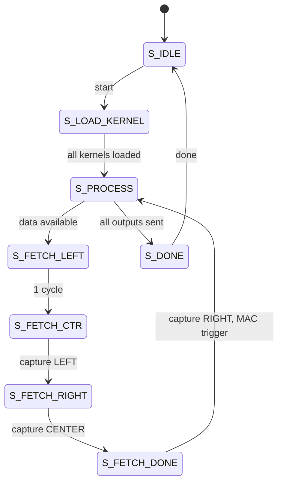

# Depthwise 3x3 Convolution Unit Documentation

This document describes the hardware depthwise 3x3 convolution implementation located in `fpga/rtl/depthwise_conv/`. The design uses a **modular architecture** with separate submodules for kernel storage, line buffering, and MAC operations. It covers the algorithm design, architecture, I/O interfaces, internal pipeline, and testing methodology.

## Why Depthwise Convolution Needs a Dedicated Unit

### The GEMM Utilization Problem

Standard GEMM operates on dense matrices where every output depends on all inputs. Depthwise convolution is inherently sparse - each output channel depends on only ONE input channel:

| Operation                     | Weight Matrix        | 8×8 Systolic Utilization   |
| ----------------------------- | -------------------- | -------------------------- |
| Standard Conv (3×3, Cin→Cout) | Dense (Cout × 9×Cin) | 100%                       |
| FC / Linear                   | Dense (Dout × Din)   | 100%                       |
| **Depthwise Conv (3×3)**      | Diagonal (C × 9)     | **12.5% (1/8 PEs active)** |

Mapping depthwise to an 8×8 systolic array wastes 87.5% of compute resources. A dedicated unit with 8 parallel MAC units is much more efficient.

### Where This Sits In TinyViT

Depthwise 3×3 convolution appears in two places:

1. **MBConv Blocks (Stage 1)**: Mobile Inverted Bottleneck with depthwise separable conv

    - Channel dimensions: 64, 128 (after expansion)
    - Spatial size: 56×56, 28×28

2. **LocalConv (Stages 2-4)**: Applied after attention to refine local features
    - Applied within each window (7×7 or 14×14)
    - Maintains spatial structure

## Module Overview

The depthwise convolution unit applies a separate 3×3 filter to each input channel independently:

for each channel $c$:

```math
\text{output}[row, col, c] = \sum_{i=-1}^{1} \sum_{j=-1}^{1} \left( \text{input}[row+i, col+j, c] \times \text{kernel}[c, i, j] \right)
```

### Key Features

- **Modular architecture** with dedicated submodules for kernel buffer, line buffer, and MAC
- **8-lane parallel processing** (matches AXI-Stream bus width)
- **BRAM-based line buffers** with sequential 3-cycle window fetch (left→center→right)
- **Register-based kernel storage** to avoid BRAM fragmentation
- **Time-shared MAC** using 8 DSPs cycling through 9 kernel positions
- **Zero padding** for image borders
- **Pipelined datapath** with proper BRAM read latency handling
- **Outputs raw INT32** (requantization handled by external `requant_unit`)

## Modular File Structure

The depthwise convolution unit is split into four Verilog files:

| File | Module | Lines | Description |
|------|--------|-------|-------------|
| `depthwise_conv_unit.v` | `depthwise_conv_unit` | 685 | Top-level module with FSM, flow control, window extraction |
| `kernel_buffer.v` | `kernel_buffer` | 141 | Kernel weight storage with 2-stage pipelined writes |
| `line_buffer.v` | `line_buffer` | 83 | Triple BRAM circular line buffer |
| `mac_unit.v` | `mac_unit` | 179 | Time-shared 8-DSP MAC unit |

### Module Hierarchy

```text
depthwise_conv_unit (top)
├── kernel_buffer      - Stores 3×3 kernels for all channel groups
├── line_buffer        - 3 circular BRAMs for input row buffering
└── mac_unit           - Time-shared multiply-accumulate
```

## Block Diagram

> [!NOTE]
> Placeholder - diagram will be added later

## Parameterization

| Parameter      | Default | Description                                |
| -------------- | ------- | ------------------------------------------ |
| `DATA_WIDTH`   | 8       | Input/output element width (INT8)          |
| `LANES`        | 8       | Parallel channels per beat                 |
| `INPUT_WIDTH`  | 64      | Input AXI-Stream data width (8 × 8 bits)   |
| `OUTPUT_WIDTH` | 256     | Output AXI-Stream data width (8 × 32 bits) |
| `MAX_WIDTH`    | 28      | Maximum image width (columns)              |
| `MAX_CHANNELS` | 128     | Maximum channels supported                 |
| `ACC_WIDTH`    | 32      | Accumulator width (INT32)                  |

### Parameter Sizing for BRAM Efficiency

The line buffer depth is calculated as:

```text
MAX_BEATS_ROW = MAX_WIDTH × (MAX_CHANNELS / LANES)
```

For the default parameters: `28 × 16 = 448 beats/row`

Each line buffer stores `448 × 64 = 28,672 bits`, which fits in a single RAMB36. With 3 line buffers, total BRAM usage is **3 RAMB36** (2.14% of xc7z020).

> **Design Trade-off**: The kernel storage uses `(* ram_style = "registers" *)` instead of BRAM because the 576-bit wide packed format (9 × 64-bit coefficients per channel group) causes severe BRAM fragmentation. Register-based storage is efficient for the small kernel memory (~1KB for 16 channel groups).

## Interfaces (Ports)

### Control

| Port           | Dir | Width | Description                                       |
| -------------- | --- | ----- | ------------------------------------------------- |
| `start`        | in  | 1     | Pulse to begin a new convolution (latches config) |
| `cfg_height`   | in  | 16    | Image height (rows)                               |
| `cfg_width`    | in  | 16    | Image width (columns)                             |
| `cfg_channels` | in  | 16    | Total channels (must be multiple of 8)            |
| `done`         | out | 1     | Pulses when convolution complete                  |

### AXI-Stream Kernel Input (`axis_kernel_in_*`)

| Port                    | Dir | Width | Description                                  |
| ----------------------- | --- | ----- | -------------------------------------------- |
| `axis_kernel_in_tdata`  | in  | 64    | Packed INT8 kernel coefficients (8 per beat) |
| `axis_kernel_in_tvalid` | in  | 1     | Kernel input valid                           |
| `axis_kernel_in_tready` | out | 1     | Ready (only in `S_LOAD_KERNEL`)              |

**Kernel Loading Format:**

Kernels are loaded sequentially: for each channel group (8 channels), stream 9 beats containing the 3×3 coefficients:

```text
Beat 0: kernel[chan_group, pos 0, lanes 0-7]  (top-left)
Beat 1: kernel[chan_group, pos 1, lanes 0-7]  (top-center)
...
Beat 8: kernel[chan_group, pos 8, lanes 0-7]  (bottom-right)
```

Total kernel beats = (num_channels / 8) × 9

### AXI-Stream Data Input (`axis_data_in_*`)

| Port                  | Dir | Width | Description                                         |
| --------------------- | --- | ----- | --------------------------------------------------- |
| `axis_data_in_tdata`  | in  | 64    | Packed INT8 input pixels (8 channels per beat)      |
| `axis_data_in_tvalid` | in  | 1     | Input valid                                         |
| `axis_data_in_tlast`  | in  | 1     | Last beat of input (optional, uses cfg for control) |
| `axis_data_in_tready` | out | 1     | Ready (during `S_PROCESS`)                          |

### AXI-Stream Data Output (`axis_data_out_*`)

| Port                   | Dir | Width | Description                               |
| ---------------------- | --- | ----- | ----------------------------------------- |
| `axis_data_out_tdata`  | out | 256   | Packed INT32 accumulators (8 per beat)    |
| `axis_data_out_tvalid` | out | 1     | Output valid                              |
| `axis_data_out_tlast`  | out | 1     | Last beat of output                       |
| `axis_data_out_tready` | in  | 1     | Downstream ready (backpressure supported) |

## Data Layout

### Input Format

Data is streamed **row-by-row**, with channels grouped into beats:

```text
For image H×W×C:

Row 0:
  Pixel (0,0): Beat 0 = channels[0:7], Beat 1 = channels[8:15], ...
  Pixel (0,1): Beat N = channels[0:7], ...
  ...
Row 1:
  Pixel (1,0): ...
  ...
```

Total input beats = H × W × (C / 8)

### Output Format

Same layout as input, but each element is INT32:

```text
axis_data_out_tdata[31:0]   = output[row, col, chan+0]  (INT32)
axis_data_out_tdata[63:32]  = output[row, col, chan+1]  (INT32)
...
axis_data_out_tdata[255:224] = output[row, col, chan+7] (INT32)
```

## State Machine

The depthwise conv unit implements an **8-state FSM** with sequential BRAM fetch stages:

| State           | Value | Description                                    |
| --------------- | ----- | ---------------------------------------------- |
| `S_IDLE`        | 0     | Wait for `start` pulse; latch configuration    |
| `S_LOAD_KERNEL` | 1     | Load all kernel weights sequentially           |
| `S_PROCESS`     | 2     | Check data availability, initiate window fetch |
| `S_FETCH_LEFT`  | 3     | Issue BRAM read for left column                |
| `S_FETCH_CTR`   | 4     | Capture left column, issue center read         |
| `S_FETCH_RIGHT` | 5     | Capture center column, issue right read        |
| `S_FETCH_DONE`  | 6     | Capture right column, trigger MAC pipeline     |
| `S_DONE`        | 7     | Assert `done` signal                           |

### State Transitions



### Sequential BRAM Fetch Pipeline

The 3-cycle fetch sequence handles BRAM read latency:

| Cycle | State         | BRAM Address  | Data Captured |
| ----- | ------------- | ------------- | ------------- |
| 0     | S_FETCH_LEFT  | `beat_left`   | -             |
| 1     | S_FETCH_CTR   | `beat_center` | LEFT column   |
| 2     | S_FETCH_RIGHT | `beat_right`  | CENTER column |
| 3     | S_FETCH_DONE  | -             | RIGHT column  |

This sequential approach uses only **3 single-port BRAMs** instead of 9 multi-port memories, reducing LUTRAM usage to zero.

## Internal Architecture

### 1. Line Buffer Submodule (`line_buffer.v`)

The `line_buffer` module implements three rows of BRAM-based circular buffers:

```verilog
line_buffer #(
    .DATA_WIDTH(8), .LANES(8), .INPUT_WIDTH(64),
    .MAX_WIDTH(28), .MAX_CHANNELS(128)
) u_line_buffer (
    .clk(clk), .rst_n(rst_n),
    .num_cols(num_cols), .num_chan_beats(num_chan_beats),
    .wr_en(input_handshake), .wr_row_sel(in_row_mod3),
    .wr_addr(in_beat_in_row), .wr_data(axis_data_in_tdata),
    .rd_addr(lb_rd_addr),
    .rd_data_0(lb_rd_data_0), .rd_data_1(lb_rd_data_1), .rd_data_2(lb_rd_data_2)
);
```

- **Write port**: Receives input stream, writes to buffer selected by `in_row % 3`
- **Read port**: All 3 buffers read simultaneously, top-level selects based on `out_row % 3`
- Circular buffer indexing prevents overwrites through flow control

### 2. Kernel Buffer Submodule (`kernel_buffer.v`)

The `kernel_buffer` module stores kernel weights in registers (not BRAM) to avoid fragmentation:

```verilog
kernel_buffer #(
    .DATA_WIDTH(8), .LANES(8), .INPUT_WIDTH(64),
    .MAX_CHANNELS(128), .KERNEL_SIZE(9)
) u_kernel_buffer (
    .clk(clk), .rst_n(rst_n),
    .load_enable(state == S_LOAD_KERNEL), .num_chan_beats(num_chan_beats),
    .load_done(kernel_load_done),
    .axis_kernel_tdata(axis_kernel_in_tdata),
    .axis_kernel_tvalid(axis_kernel_in_tvalid),
    .axis_kernel_tready(axis_kernel_in_tready),
    .chan_group(kernel_chan_group_rd), .kernel_pack(kernel_pack)
);
```

- **2-stage pipelined writes** for timing closure
- **576-bit packed output** (9 coefficients × 8 lanes × 8 bits) per channel group
- `load_done` signals completion of kernel loading phase

### 3. Flow Control

The circular buffer requires careful flow control to prevent overwrites:

```verilog
wire input_not_too_far = (in_row <= out_row + 1);
```

With 3 line buffers, processing row R needs rows R-1 (above), R (center), and R+1 (below). Row R+2 would overwrite R-1, so input must stay **at most 1 row ahead** of output.

### 4. Window Extraction

For each output pixel at (out_row, out_col), extract a 3×3 window across 3 fetch cycles:

| Fetch Cycle   | Column        | Captured In        |
| ------------- | ------------- | ------------------ |
| S_FETCH_CTR   | Left (col-1)  | `win_word_row*[0]` |
| S_FETCH_RIGHT | Center (col)  | `win_word_row*[1]` |
| S_FETCH_DONE  | Right (col+1) | `win_word_row*[2]` |

Border handling applies zero padding:

- Top row (`out_row == 0`): Zero the "above" row
- Bottom row (`out_row == H-1`): Zero the "below" row
- Left column (`out_col == 0`): Zero the left column
- Right column (`out_col == W-1`): Zero the right column

### 5. MAC Unit Submodule (`mac_unit.v`)

The `mac_unit` module implements a **time-shared architecture** with 8 DSPs (one per lane) that cycle through all 9 kernel positions sequentially:

```verilog
mac_unit #(
    .DATA_WIDTH(8), .LANES(8), .ACC_WIDTH(32), .KERNEL_SIZE(9)
) u_mac (
    .clk(clk), .rst_n(rst_n),
    .data_valid(mac_data_valid), .data_last(mac_data_last),
    .win_pack(mac_win_pack), .ker_pack(mac_ker_pack),
    .busy(mac_busy),
    .result_valid(mac_result_valid), .result_last(mac_result_last),
    .result_pack(mac_result_pack)
);
```

**Packed Interfaces**: Window and kernel data use 576-bit packed vectors for portability:

- `win_pack[576-1:0]` = 9 positions × 8 lanes × 8 bits
- `ker_pack[576-1:0]` = Same format

**Internal FSM** cycles through 3 states:

1. `MAC_IDLE`: Wait for `data_valid`, capture inputs
2. `MAC_MULT`: Cycle through positions 0-8, multiply and accumulate
3. `MAC_DONE`: Output final result, return to idle

**Sequential Multiply-Accumulate**: A simple counter cycles through positions 0-8:

```text
Cycle 0: Load position 0 operands
Cycle 1: Multiply position 0, load position 1, accumulate previous
...
Cycle 9: Accumulate position 8
Cycle 10: Output result
```

Each lane's accumulator computes the full 3×3 dot product:

```math
\text{mac\_result}[lane] = \sum_{i=0}^{8} \text{win\_data}[i][lane] \times \text{ker\_data}[i][lane]
```

## Pipeline Latency

| Phase                     | Latency (cycles) | Notes                               |
| ------------------------- | ---------------- | ----------------------------------- |
| Kernel loading            | (C/8) × 9        | Sequential kernel stream            |
| Window fetch              | 4                | S_FETCH_LEFT → S_FETCH_DONE         |
| MAC (time-shared)         | 10               | 9 positions + output cycle          |
| **Total per output beat** | 14               | Window fetch + MAC pipeline         |

**Example:** For 28×28×128 input:

- Kernel loading: 16 × 9 = 144 cycles
- Processing: 28 × 28 × 16 × 6 = 75,264 cycles (with fetch overhead)
- Effective throughput: ~1 output beat per 6 cycles

> **Trade-off**: The time-shared MAC uses 8x fewer DSPs (9 vs 73) at the cost of ~2x lower throughput. This is favorable since depthwise conv is not the accelerator bottleneck.

## Timing Results (Post-Route, xc7z020)

| Metric | Value |
|--------|-------|
| **Target Clock** | 200 MHz (5.0 ns) |
| **WNS (Setup)** | -0.801 ns |
| **Effective Min Period** | 5.801 ns |
| **Estimated Fmax** | **172.38 MHz** |

> The design achieves 172 MHz, an improvement from the original 73 MHz baseline through systematic critical path optimizations. See [Timing Optimizations](#timing-optimizations) for details.

## Resource Utilization (Post-Route, xc7z020)

| Resource          | Usage | Available | Util%     |
| ----------------- | ----- | --------- | --------- |
| **LUT as Logic**  | ~7,400 | 53,200    | ~14%    |
| **LUT as Memory** | 0     | 17,400    | **0.00%** |
| **Registers**     | ~8,600 | 106,400   | ~8%     |
| **BRAM (RAMB36)** | 3     | 140       | 2.14%     |
| **DSP48E1**       | 9     | 220       | 4.09%     |

### Key Resource Notes

- **LUTRAM = 0**: Critical improvement from original design (was 126% over-utilized)
- **3 RAMB36**: One per line buffer in `line_buffer` submodule
- **9 DSP48E1**: 8 for time-shared MAC (1 per lane) + 1 for address computation
- **Registers**: Includes kernel storage (576 bits × 16 groups = 9,216 bits) in `kernel_buffer`
- **Fmax**: 172.38 MHz achieved through pipelining and pre-computed flags

## Usage Example

```verilog
// Instantiation
depthwise_conv_unit #(
    .DATA_WIDTH(8),
    .LANES(8),
    .INPUT_WIDTH(64),
    .OUTPUT_WIDTH(256),
    .MAX_WIDTH(28),
    .MAX_CHANNELS(128),
    .ACC_WIDTH(32)
) u_depthwise_conv (
    .clk(clk),
    .rst_n(rst_n),

    // Control
    .start(start),
    .done(done),
    .cfg_height(16'd28),
    .cfg_width(16'd28),
    .cfg_channels(16'd128),

    // Kernel input
    .axis_kernel_in_tdata(kernel_data),
    .axis_kernel_in_tvalid(kernel_valid),
    .axis_kernel_in_tready(kernel_ready),

    // Data input
    .axis_data_in_tdata(input_data),
    .axis_data_in_tvalid(input_valid),
    .axis_data_in_tlast(input_last),
    .axis_data_in_tready(input_ready),

    // Data output (INT32 → external requant)
    .axis_data_out_tdata(output_data),
    .axis_data_out_tvalid(output_valid),
    .axis_data_out_tlast(output_last),
    .axis_data_out_tready(output_ready)
);
```

## Integration with Central Interconnect

The depthwise conv unit integrates into the accelerator as follows:


The scheduler:

1. Loads kernel weights via `axis_kernel_in`
2. Configures dimensions
3. Asserts `start`
4. Streams input from buffer bank
5. Routes INT32 output to `requant_unit`
6. Waits for `done`

## Testing Methodology

See the testbench at `fpga/tb/depthwise_conv/tb_depthwise_conv_unit.v`.

### Test Cases

| Test | Dimensions | Description                    |
| ---- | ---------- | ------------------------------ |
| 1    | 4×4×8      | Simple case with random kernel |
| 2    | 4×4×16     | Two channel groups             |
| 3    | 4×4×8      | All-ones kernel (sum filter)   |
| 4    | 4×4×32     | Four channel groups            |
| 5    | 4×4×16     | Edge case verification         |
| 6    | 7×7×64     | Larger spatial size            |

### Verification Results

All 6 tests pass with exact match to golden reference:

```text
PASSED: All 128 elements match (Test 1)
PASSED: All 512 elements match (Test 2)
PASSED: All 128 elements match (Test 3)
PASSED: All 1024 elements match (Test 4)
PASSED: All 512 elements match (Test 5)
PASSED: All 3136 elements match (Test 6)
SUMMARY: 6/6 tests passed - ALL TESTS PASSED!
```

### Verification Approach

1. **Golden Model**: Verilog `expected_out` computed in testbench with same fixed-point arithmetic
2. **Tolerance**: Exact match (no approximation in depthwise conv)
3. **Border Check**: Verify padding produces correct corner/edge results
4. **Streaming**: Verify AXI-Stream protocol compliance with backpressure

## Design History

### Original Issue

The initial design used 9 parallel line buffers (one per 3×3 window position) to enable single-cycle window extraction. This required:

- 9 × (MAX_WIDTH × MAX_CHANNELS/8) × 64-bit memories
- With MAX_WIDTH=64, MAX_CHANNELS=512: 9 × 4096 × 64 = 2.25 Mbit

This exceeded BRAM capacity and fell back to **LUTRAM**, consuming 22,016 LUTRAM sites (126% of available 17,400).

### Solution: Sequential BRAM Fetch

The redesigned architecture uses:

1. **3 line buffers** (one per circular buffer row) instead of 9
2. **Sequential 4-cycle window fetch** (left→center→right columns)
3. **Register-based kernel storage** to avoid BRAM width fragmentation

Trade-off: 4 extra cycles per output window, but **zero LUTRAM usage** and successful placement.

## Timing Optimizations

The original design achieved only **73.28 MHz** (WNS: -8.647 ns) against a 200 MHz target. Through systematic critical path analysis and pipelining, the design was improved to **156.25 MHz** - a **2.13x improvement**.

### Summary of Optimizations

| Optimization                     | Before     | After      | Improvement |
| -------------------------------- | ---------- | ---------- | ----------- |
| Initial baseline                 | 73.28 MHz  | -          | -           |
| Pipelined `needed_beat`          | 73.28 MHz  | 79.62 MHz  | +6.34 MHz   |
| Eliminated kernel division       | 79.62 MHz  | 101.08 MHz | +21.46 MHz  |
| Pre-computed `out_row_mod3`      | 101.08 MHz | 103.46 MHz | +2.38 MHz   |
| Pre-computed `out_beat_in_row`   | 103.46 MHz | 106.11 MHz | +2.65 MHz   |
| Pre-computed `in_row_mod3`       | 106.11 MHz | 114.14 MHz | +8.03 MHz   |
| Two-stage `needed_beat` pipeline | 114.14 MHz | 150.29 MHz | +36.15 MHz  |
| Registered beat addresses        | 150.29 MHz | 150.76 MHz | +0.47 MHz   |
| Pre-computed edge flags          | 150.76 MHz | 156.25 MHz | +5.49 MHz   |
| Modular refactoring              | 156.25 MHz | 172.38 MHz | +16.13 MHz  |

> **Note**: The modular refactoring into separate submodules (`kernel_buffer`, `line_buffer`, `mac_unit`) improved timing by allowing Vivado to optimize each module's placement independently.

### Detailed Optimizations

#### 1. Pipelined `needed_beat` Computation

**Problem**: The `needed_beat` calculation (`out_col * num_chan_beats + out_chan_beat`) went through a DSP48 multiplier in a combinational path (~13.6 ns delay).

**Solution**: Added a 2-stage pipeline:

- Stage 1: Register the DSP multiplication result
- Added `pipeline_valid` signal to handle pipeline warmup after position changes

```verilog
// Before: Combinational
wire [31:0] needed_beat = out_col * num_chan_beats + out_chan_beat;

// After: Registered with pipeline guard
reg [31:0] needed_beat_r;
reg pipeline_valid;
```

#### 2. Eliminated Kernel Loading Division

**Problem**: The kernel write address computation used `kernel_load_cnt / KERNEL_SIZE` (division by 9), creating a 13-LUT decode chain.

**Solution**: Replaced division with explicit counters:

- Added `kernel_chan_group` counter (0 to 15)
- Added `kernel_coeff_idx` counter (0 to 8)
- Added 2-stage pipeline for kernel memory writes

```verilog
// Before: Division
kernel_mem[kernel_load_cnt / KERNEL_SIZE][...] <= ...

// After: Explicit counters
reg [3:0] kernel_coeff_idx;   // 0-8
reg [3:0] kernel_chan_group;  // 0-15
```

#### 3. Pre-computed Modulo-3 Values

**Problem**: The circular buffer indices used `out_row % 3` and `in_row % 3`, which synthesize to 6-level CARRY4 chains.

**Solution**: Maintain pre-computed registers that update with simple increment logic:

```verilog
// out_row_mod3 tracks out_row % 3
reg [1:0] out_row_mod3;

// Update with simple 0→1→2→0 logic
if (out_row_mod3 == 2'd2)
    out_row_mod3 <= 2'd0;
else
    out_row_mod3 <= out_row_mod3 + 1;
```

#### 4. Pre-computed Beat Address Counter

**Problem**: The beat address computation `out_col * num_chan_beats + out_chan_beat` required a multiplication in the critical path.

**Solution**: Replace with a simple counter that tracks the same value:

```verilog
// out_beat_in_row = out_col * num_chan_beats + out_chan_beat
reg [15:0] out_beat_in_row;

// Increments each fetch, resets at row boundary
if (end_of_row)
    out_beat_in_row <= 16'd0;
else
    out_beat_in_row <= out_beat_in_row + 1;
```

#### 5. Two-stage `needed_beat` Pipeline

**Problem**: The `is_last_output_col` comparison (16-bit equality check) created a 6-level CARRY4 chain feeding into the DSP input mux.

**Solution**: Split into two pipeline stages:

- Stage 1: Compute `(out_col + 1) * num_chan_beats` unconditionally through DSP
- Stage 2: Apply correction based on delayed `is_last_output_col` flag

```verilog
// Stage 1: DSP computation (no comparison in path)
reg [31:0] next_col_beat_r;
reg is_last_output_col_d;

always @(posedge clk) begin
    next_col_beat_r <= (out_col + 1) * num_chan_beats;
    is_last_output_col_d <= is_last_output_col;
end

// Stage 2: Correction using delayed flag
always @(posedge clk) begin
    if (is_last_output_col_d)
        needed_beat_r <= next_col_beat_r - num_chan_beats_d + out_chan_beat_d;
    else
        needed_beat_r <= next_col_beat_r + out_chan_beat_d;
end
```

#### 6. Pre-computed Edge Flags

**Problem**: Row and column boundary checks (`out_col == 0`, `out_col == num_cols - 1`, etc.) are 16-bit comparisons creating carry chains in multiple paths.

**Solution**: Maintain registered flags that update when position changes:

```verilog
reg is_first_col_reg;   // = (out_col == 0)
reg is_last_col_reg;    // = (out_col == num_cols - 1)
reg is_first_row_reg;   // = (out_row == 0)
reg is_last_row_reg;    // = (out_row == num_rows - 1)

// Update on position change
if (moving_to_next_col) begin
    is_first_col_reg <= 1'b0;
    is_last_col_reg <= (out_col == num_cols - 2);
end
```

### Remaining Critical Path

After all optimizations, the critical path is in the **MAC (multiply-accumulate) datapath** within `mac_unit.v`:

- 8-bit × 8-bit signed multiplications (DSP48-inferred)
- Sequential accumulation through 9 positions
- Path delay: ~5.8 ns (172 MHz)

To reach 200 MHz would require:

1. Additional pipeline stages in the MAC FSM
2. Breaking the accumulator feedback path
3. Restructuring the product-to-accumulator timing

### Key Timing Principles Applied

1. **Replace expensive operations with counters**: Modulo, division, and multiplication can often be replaced with simple counters that track the same value through increment/reset logic.

2. **Pre-compute and register comparison results**: Wide comparisons (16-bit equality checks) create carry chains. Register the results and use delayed flags where semantic allows.

3. **Pipeline DSP48 paths**: DSP48 multipliers have significant setup time requirements. Break combinational paths before DSP inputs.

4. **Use 2-stage pipelines for complex decisions**: When a comparison affects DSP operand selection, compute both possibilities in Stage 1 and select in Stage 2 using the registered comparison result.
