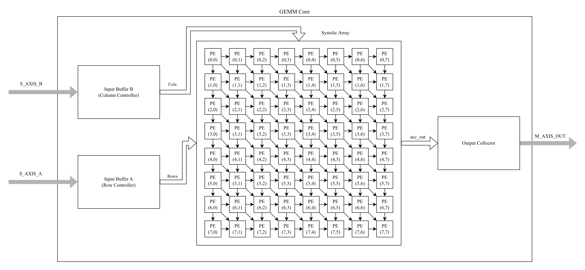
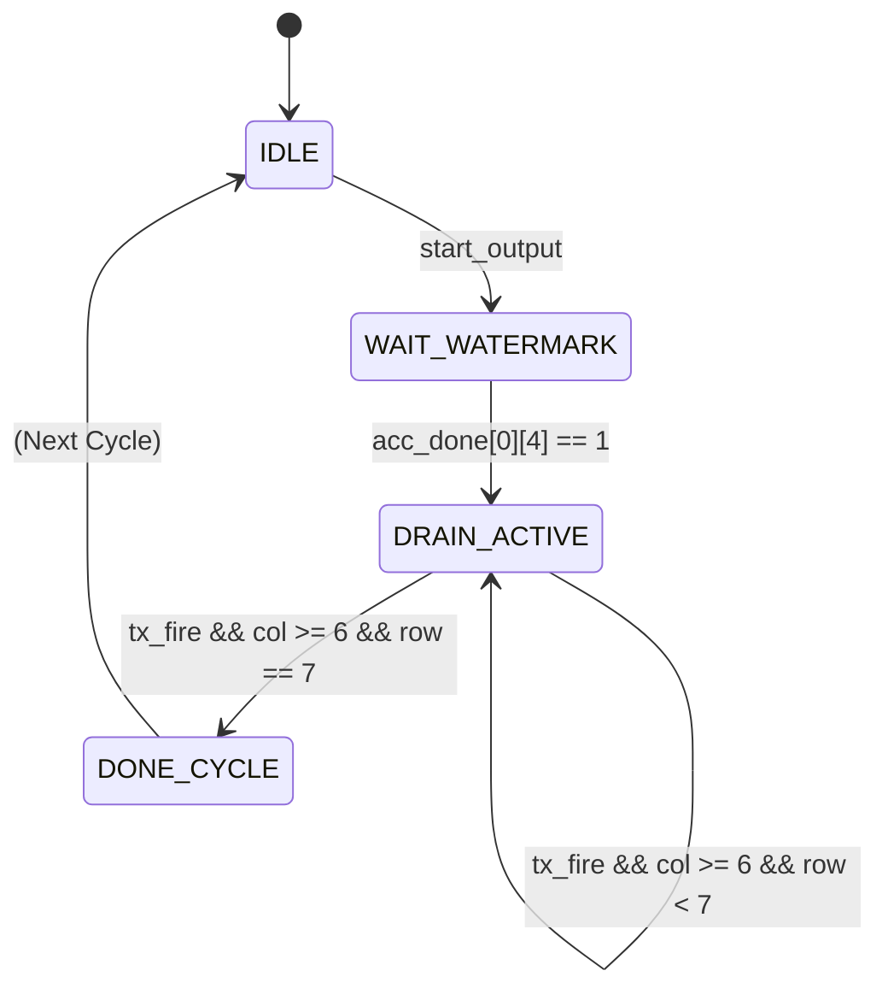
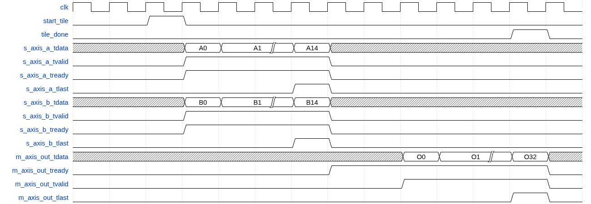

# GEMM Core – 8×8 Systolic Matrix Multiplier

| **Document Information** |                                   |
| ------------------------ | --------------------------------- |
| **Module Name**          | `gemm_core_top`                   |
| **Version**              | 1.0                               |
| **Design Status**        | In development                    |
| **Last Updated**         | January 01 2026                   |
| **Source Location**      | `fpga/rtl/gemm/`                  |
| **Testbench**            | `fpga/tb/gemm/tb_gemm_core_top.v` |
| **Author**               | Le Phuc Khang                     |

## Table of Contents

1. [Overview](#1-overview)
2. [Features Summary](#2-features-summary)
3. [Theory of Operation](#3-theory-of-operation)
4. [Module Architecture](#4-module-architecture)
5. [Parameters](#5-parameters)
6. [Interface Specification](#6-interface-specification)
7. [Data Formats](#7-data-formats)
8. [Finite State Machine](#8-finite-state-machine)
9. [Timing Diagrams](#9-timing-diagrams)
10. [Pipeline Architecture](#10-pipeline-architecture)
11. [Submodule Reference](#11-submodule-reference)
12. [Resource Utilization](#12-resource-utilization)
13. [Timing Analysis](#13-timing-analysis)
14. [Integration Guidelines](#14-integration-guidelines)
15. [Verification](#15-verification)
16. [Design Constraints](#16-design-constraints)
17. [Known Limitations](#17-known-limitations)
18. [Revision History](#18-revision-history)

## 1. Overview

### 1.1 Purpose

The `gemm_core_top` module implements a fully unrolled 8×8 signed integer systolic array for General Matrix-Matrix Multiplication (GEMM). It is a core compute unit within the TinyViT-5M hardware accelerator, designed to accelerate the linear projection operations in transformer self-attention layers, MLP blocks, and patch embedding computations.

### 1.2 Functional Description

The GEMM core computes the matrix product $C = A \times B$ for two 8×8 signed integer matrices. For each output element at position $(i, j)$, the operation computes:

$$
C[i][j] = \sum_{k=0}^{7} A[i][k] \cdot B[k][j]
$$

Where:

- $A$ is an 8×8 signed INT8 matrix (rows propagate horizontally)
- $B$ is an 8×8 signed INT8 matrix (columns propagate vertically)
- $C$ is an 8×8 signed INT32 result matrix

### 1.3 Design Philosophy

The systolic array architecture follows the classical Google TPU v1 design pattern with several optimizations for FPGA implementation:

- **2D Systolic Data Flow**: Data flows horizontally for A-operands and vertically for B-operands, with each processing element (PE) performing multiply-accumulate operations
- **Wavefront Scheduling**: Input data is skewed along anti-diagonals to ensure all PEs receive data in lock-step
- **2-Stage Pipelined MAC**: Each PE uses a pipelined multiply-accumulate unit for high-frequency operation (~196 MHz)
- **Credit-Based Output**: Output collector uses a watermark mechanism to prevent output stream bubbles
- **DSP48E1 Inference**: Synthesis directives ensure multiplies are mapped to dedicated DSP slices

## 2. Features Summary

| Feature                  | Specification                             |
| ------------------------ | ----------------------------------------- |
| **Array Dimensions**     | 8×8 (64 processing elements)              |
| **Input Precision**      | Signed INT8                               |
| **Output Precision**     | Signed INT32 (fully accumulated)          |
| **Parallel MACs**        | 64 per cycle (when fully utilized)        |
| **Throughput**           | One 8×8 tile per 15 input beats           |
| **Output Throughput**    | 2×INT32 results per beat (32 total beats) |
| **AXI-Stream Interface** | Dual input (A, B), single output (C)      |
| **Backpressure Support** | Full backpressure on all AXI-Stream ports |
| **DSP Usage**            | 64 DSP48E1 slices (one per PE)            |
| **Target Frequency**     | 200 MHz (achieved: 196 MHz)               |

## 3. Theory of Operation

### 3.1 Processing Flow

The module operates in a tile-based fashion, processing one 8×8 matrix multiplication per tile:

```text
IDLE -> START_TILE -> STREAM_INPUTS -> DRAIN_OUTPUTS -> TILE_DONE -> IDLE
```

1. **Idle State**: Core awaits `start_tile` pulse; all accumulators are cleared
2. **Input Streaming**: A and B matrices stream via AXI-Stream in wavefront order (15 beats)
3. **Systolic Computation**: PEs perform MAC operations as data flows through the array
4. **Output Collection**: Results are drained in row-major order (32 beats of 2×INT32)
5. **Completion**: `tile_done` pulses when all outputs are transmitted

### 3.2 Wavefront Scheduling Explained

The systolic array requires inputs to be provided in a specific anti-diagonal (wavefront) pattern:

```text
Cycle 0:  A[0][0], B[0][0]
Cycle 1:  A[0][1], A[1][0], B[1][0], B[0][1]
Cycle 2:  A[0][2], A[1][1], A[2][0], B[2][0], B[1][1], B[0][2]
...
Cycle 14: A[7][7], B[7][7]
```

This ensures that at any cycle `t`, all PEs that need data for position `(row, col)` where `row + col == t` receive their inputs simultaneously.

**Wavefront Formula**:

- Stream A, Lane `i` carries `A[i][j]` where `j = cycle - i`
- Stream B, Lane `j` carries `B[i][j]` where `i = cycle - j`
- Lanes outside the valid range are zero-padded
- Total beats required: `2 × ARRAY_SIZE - 1 = 15`

### 3.3 Accumulation and Completion

Each PE maintains:

- An accumulator register (`ACC_WIDTH = 32` bits)
- A MAC counter tracking how many products have been accumulated
- An `acc_done` flag asserted after exactly 8 MAC operations

The output collector monitors all `acc_done` flags and drains results only when they are finalized.

## 4. Module Architecture

### 4.1 Block Diagram



### 4.2 Module Hierarchy

```text
gemm_core_top (top-level)
│
├── input_buffer_controller (×2)  # A and B stream decoupling
│   └── Skid buffer               # 1-beat holding register
│
├── systolic_array                # 8×8 PE grid
│   └── processing_element (×64)  # Individual MAC units
│       ├── Stage 1: Multiplier   # DSP48E1 with registered output
│       └── Stage 2: Accumulator  # 32-bit signed accumulator
│
└── output_collector              # Result serialization
    ├── FSM (row_idx, col_idx)    # Row-major scan
    ├── Watermark gate            # Bubble prevention
    └── Beat packer               # 2×INT32 → 64-bit
```

## 5. Parameters

### 5.1 Top-Level Parameters

| Parameter         | Default | Range    | Description                      |
| ----------------- | ------- | -------- | -------------------------------- |
| `DATA_WIDTH`      | 8       | 4–16     | Input element bit-width (signed) |
| `ACC_WIDTH`       | 32      | 16–64    | Accumulator bit-width            |
| `ARRAY_SIZE`      | 8       | 4, 8, 16 | Systolic array dimension (N×N)   |
| `AXIS_DATA_WIDTH` | 64      | 32–256   | AXI-Stream data bus width        |

### 5.2 Derived Parameters (Computed Internally)

| Parameter         | Formula                                    | Default | Description                  |
| ----------------- | ------------------------------------------ | ------- | ---------------------------- |
| `TOTAL_RESULTS`   | ARRAY_SIZE × ARRAY_SIZE                    | 64      | Total output elements        |
| `VALUES_PER_BEAT` | AXIS_DATA_WIDTH / ACC_WIDTH                | 2       | INT32 values per output beat |
| `TOTAL_BEATS`     | TOTAL_RESULTS / VALUES_PER_BEAT            | 32      | Output beats per tile        |
| `INPUT_BEATS`     | 2 × ARRAY_SIZE - 1                         | 15      | Input beats per tile (A & B) |
| `COUNT_WIDTH`     | $\lceil\log_2(\text{ARRAY\_SIZE}+1)\rceil$ | 4       | MAC counter width            |

### 5.3 Constraints and Requirements

1. **Lane Packing**: `AXIS_DATA_WIDTH` must equal `ARRAY_SIZE × DATA_WIDTH` (64 = 8 × 8)
2. **Output Packing**: `ACC_WIDTH` must evenly divide `AXIS_DATA_WIDTH`
3. **Array Size**: Must be a power of 2 for efficient indexing
4. **Signed Arithmetic**: All operations use signed two's complement representation

## 6. Interface Specification

### 6.1 Port List

#### Clock and Reset

| Port      | Direction | Width | Description                         |
| --------- | --------- | ----- | ----------------------------------- |
| `aclk`    | Input     | 1     | AXI clock (positive-edge triggered) |
| `aresetn` | Input     | 1     | Active-low synchronous reset        |

#### Control Interface

| Port         | Direction | Width | Description                           |
| ------------ | --------- | ----- | ------------------------------------- |
| `start_tile` | Input     | 1     | Pulse to begin new tile computation   |
| `tile_done`  | Output    | 1     | Pulses when tile output fully drained |

#### Stream A Input (AXI-Stream Slave)

| Port              | Direction | Width | Description                |
| ----------------- | --------- | ----- | -------------------------- |
| `s_axis_a_tdata`  | Input     | 64    | Packed A-row data (8×INT8) |
| `s_axis_a_tvalid` | Input     | 1     | Data valid indicator       |
| `s_axis_a_tlast`  | Input     | 1     | End of input stream        |
| `s_axis_a_tready` | Output    | 1     | Ready to accept A data     |

#### Stream B Input (AXI-Stream Slave)

| Port              | Direction | Width | Description                   |
| ----------------- | --------- | ----- | ----------------------------- |
| `s_axis_b_tdata`  | Input     | 64    | Packed B-column data (8×INT8) |
| `s_axis_b_tvalid` | Input     | 1     | Data valid indicator          |
| `s_axis_b_tlast`  | Input     | 1     | End of input stream           |
| `s_axis_b_tready` | Output    | 1     | Ready to accept B data        |

#### Matrix C Output (AXI-Stream Master)

| Port                | Direction | Width | Description                  |
| ------------------- | --------- | ----- | ---------------------------- |
| `m_axis_out_tdata`  | Output    | 64    | Packed output data (2×INT32) |
| `m_axis_out_tvalid` | Output    | 1     | Data valid indicator         |
| `m_axis_out_tlast`  | Output    | 1     | End of output stream         |
| `m_axis_out_tready` | Input     | 1     | Downstream ready to accept   |

### 6.2 AXI-Stream Compliance

All AXI-Stream interfaces comply with ARM AMBA 4 AXI-Stream Protocol Specification:

- **Handshake Protocol**: Data transfer occurs when both `TVALID` and `TREADY` are asserted on the rising edge of `aclk`
- **TVALID Assertion Rules**: Once asserted, `TVALID` remains high until the transfer completes
- **TREADY Behavior**: Input buffers use skid-buffer architecture allowing back-to-back transfers
- **TLAST Semantics**: Asserted on the final beat of each tile (beat 14 for inputs, beat 31 for output)

## 7. Data Formats

### 7.1 Input Stream A Format

Matrix A rows are packed into 64-bit beats with wavefront skewing:

```text
For wavefront cycle c (0 to 14):
    Lane i contains A[i][c-i] if (c-i) is in [0, 7], else 0

Beat layout (64 bits):
  [63:56] = A[row=7][col=c-7] or 0  (signed INT8)
  [55:48] = A[row=6][col=c-6] or 0
  ...
  [ 7: 0] = A[row=0][col=c]   or 0

Example - Cycle 3:
  Lane 0: A[0][3]
  Lane 1: A[1][2]
  Lane 2: A[2][1]
  Lane 3: A[3][0]
  Lanes 4-7: 0 (outside valid range)
```

### 7.2 Input Stream B Format

Matrix B columns are packed with corresponding wavefront skewing:

```text
For wavefront cycle c (0 to 14):
    Lane j contains B[c-j][j] if (c-j) is in [0, 7], else 0

Beat layout (64 bits):
  [63:56] = B[row=c-7][col=7] or 0  (signed INT8)
  [55:48] = B[row=c-6][col=6] or 0
  ...
  [ 7: 0] = B[row=c][col=0]   or 0
```

### 7.3 Output Stream C Format

Output data is serialized in row-major order, 2 INT32 values per beat:

```text
For each row r (0 to 7):
  For each column pair (0,1), (2,3), (4,5), (6,7):
    Beat: [63:32] = C[r][c+1], [31:0] = C[r][c]

Total: 32 beats (8 rows × 4 column-pairs)

Beat ordering:
  Beat  0: C[0][0], C[0][1]
  Beat  1: C[0][2], C[0][3]
  Beat  2: C[0][4], C[0][5]
  Beat  3: C[0][6], C[0][7]
  Beat  4: C[1][0], C[1][1]
  ...
  Beat 31: C[7][6], C[7][7]  ← TLAST asserted

TLAST is asserted on beat 31 (final beat).
```

## 8. Finite State Machine

### 8.1 Output Collector State Diagram



> [!NOTE]
> tx_fire (Transmission Fire) represents the AXI-Stream flow control condition (!m_axis_tvalid || m_axis_tready). This logic indicates that the output register is available to accept a new value in the current clock cycle—either because the register is currently empty, or because the downstream module is successfully accepting the current data (handshake).

### 8.2 State Descriptions

| State            | Description                                                                           |
| ---------------- | ------------------------------------------------------------------------------------- |
| `IDLE`           | Waiting for `start_tile`; all pointers reset to (0, 0)                                |
| `WAIT_WATERMARK` | Waiting for PE[0][4] to complete (half of first row); prevents output bubbles         |
| `DRAIN_ROW`      | Outputting results row-by-row; advances col by 2 per beat, wraps to next row at col=8 |
| `DONE`           | Asserts `tile_done` and `TLAST` on final beat; returns to IDLE                        |

### 8.3 Watermark Mechanism

The output collector implements a "watermark" start condition to prevent output stream bubbles:

```text
Problem without watermark:
  - Collector starts immediately after start_tile
  - PE[0][0] finishes first (after ~10 cycles)
  - Collector outputs C[0][0], C[0][1] but PE[0][2] not done yet
  - Bubble inserted -> reduced throughput

Solution:
  - Wait until PE[0][4] asserts acc_done
  - This ensures the first 4 cells of row 0 are ready
  - Output stream then proceeds without bubbles
```

## 9. Timing Diagrams

### 9.1 Complete Tile Transaction



### 9.2 Pipelined Processing Element Timing

```text
Cycle N:     a_in, b_in arrive at PE
Cycle N+1:   product_r <- a_in × b_in (Stage 1: Multiply)
Cycle N+2:   accumulator <- accumulator + product_r (Stage 2: Accumulate)
             acc_out updated, mac_count incremented

Latency from input to acc_out: 2 cycles per PE
Total propagation through array: variable (wavefront-dependent)
```

> [!NOTE]
> I didn't create a detailed timing diagram image for the PE pipeline here
> Since it's a straightforward 2-stage pipeline, the text description suffices.

## 10. Pipeline Architecture

### 10.1 End-to-End Pipeline Stages

| Stage | Name               | Latency | Description                                   |
| ----- | ------------------ | ------- | --------------------------------------------- |
| 1     | Input Buffer       | 1 cycle | Skid buffer decouples AXI from systolic array |
| 2     | PE Stage 1         | 1 cycle | Multiply (DSP48E1 registered)                 |
| 3     | PE Stage 2         | 1 cycle | Accumulate                                    |
| 4     | Inter-PE Propagate | 1 cycle | Data shifts right (A) or down (B)             |
| 5     | Output Collector   | 1 cycle | Pack results into AXI beats                   |

**PE Pipeline Detail**:

```text
Stage 1: a_in × b_in → product_r (registered in DSP48E1)
Stage 2: accumulator + product_r → accumulator, acc_out
```

### 10.2 MAC Pipeline Implementation

The 2-stage pipeline breaks the critical path for high-frequency operation:

```verilog
// Stage 1: Multiply with DSP inference
(* use_dsp = "yes" *)
wire signed [ACC_WIDTH-1:0] product;
assign product = a_in * b_in;

reg signed [ACC_WIDTH-1:0] product_r;
always @(posedge clk) product_r <= product;

// Stage 2: Accumulate
wire signed [ACC_WIDTH-1:0] next_acc;
assign next_acc = accumulator + product_r;
always @(posedge clk) accumulator <= next_acc;
```

### 10.3 Latency Summary

| Metric                    | Value                     |
| ------------------------- | ------------------------- |
| **First output latency**  | ~18-20 cycles after start |
| **Input beats per tile**  | 15                        |
| **Output beats per tile** | 32                        |
| **Total tile latency**    | ~47-50 cycles typical     |
| **Effective throughput**  | 64 MACs/cycle (peak)      |

## 11. Submodule Reference

### 11.1 input_buffer_controller

**Purpose**: Decouples AXI-Stream timing from the systolic array, providing registered lane outputs.

**Location**: `fpga/rtl/gemm/input_buffer_controller.v`

#### Parameters

| Parameter         | Default | Description            |
| ----------------- | ------- | ---------------------- |
| `DATA_WIDTH`      | 8       | Element width          |
| `ARRAY_SIZE`      | 8       | Number of output lanes |
| `AXIS_DATA_WIDTH` | 64      | AXI-Stream bus width   |

#### Interface

| Port            | Direction | Width | Description                    |
| --------------- | --------- | ----- | ------------------------------ |
| `clk`, `rst_n`  | Input     | 1     | Clock and active-low reset     |
| `s_axis_*`      | Mixed     | -     | AXI-Stream slave interface     |
| `data_out_0..7` | Output    | 8 ea  | Unpacked lane outputs (signed) |
| `data_valid`    | Output    | 1     | All lanes valid this cycle     |
| `enable`        | Input     | 1     | Enable signal                  |

#### Architecture

- **Skid Buffer**: Single-beat holding register allows back-to-back AXI transfers
- **Unpacking**: 64-bit beat split into 8×8-bit signed lanes
- **Flow Control**: `present` and `accept` logic handles simultaneous read/write

### 11.2 processing_element

**Purpose**: Single MAC unit with 2-stage pipeline and inter-PE data propagation.

**Location**: `fpga/rtl/gemm/processing_element.v`

#### Parameters

| Parameter    | Default | Description                   |
| ------------ | ------- | ----------------------------- |
| `DATA_WIDTH` | 8       | Input operand width           |
| `ACC_WIDTH`  | 32      | Accumulator width             |
| `ARRAY_SIZE` | 8       | MAC count target for acc_done |

#### Interface

| Port                   | Direction | Width | Description                |
| ---------------------- | --------- | ----- | -------------------------- |
| `clk`, `rst_n`         | Input     | 1     | Clock and reset            |
| `a_in`, `a_valid_in`   | Input     | 8, 1  | A operand from left        |
| `a_out`, `a_valid_out` | Output    | 8, 1  | A operand to right         |
| `b_in`, `b_valid_in`   | Input     | 8, 1  | B operand from above       |
| `b_out`, `b_valid_out` | Output    | 8, 1  | B operand to below         |
| `clear_acc`            | Input     | 1     | Clear accumulator          |
| `acc_out`              | Output    | 32    | Current accumulator value  |
| `acc_done`             | Output    | 1     | Accumulation complete flag |

#### Architecture

- **2-Stage MAC**: Registered multiply (Stage 1) then accumulate (Stage 2)
- **DSP Inference**: `(* use_dsp = "yes" *)` directive
- **Propagation**: 1-cycle delay for inter-PE data flow

### 11.3 systolic_array

**Purpose**: Instantiates and interconnects 64 processing elements in an 8×8 grid.

**Location**: `fpga/rtl/gemm/systolic_array.v`

#### Parameters

| Parameter    | Default | Description          |
| ------------ | ------- | -------------------- |
| `DATA_WIDTH` | 8       | Element width        |
| `ACC_WIDTH`  | 32      | Accumulator width    |
| `ARRAY_SIZE` | 8       | Grid dimension (N×N) |

#### Interface

| Port              | Direction | Width | Description                      |
| ----------------- | --------- | ----- | -------------------------------- |
| `clk`, `rst_n`    | Input     | 1     | Clock and reset                  |
| `a_in_0..7`       | Input     | 8×8   | A-lane inputs (left edge)        |
| `a_valid_in_0..7` | Input     | 8     | A-lane valid signals             |
| `b_in_0..7`       | Input     | 8×8   | B-lane inputs (top edge)         |
| `b_valid_in_0..7` | Input     | 8     | B-lane valid signals             |
| `clear_acc`       | Input     | 1     | Global accumulator clear         |
| `acc_out_r_c`     | Output    | 64×32 | All accumulator values           |
| `acc_done_r_c`    | Output    | 64    | All completion flags             |
| `array_active`    | Output    | 1     | Any PE performing MAC this cycle |

#### Architecture

- **Grid Generation**: Verilog `generate` loops create 8×8 PE instances
- **Wiring**: Internal wire arrays route A horizontally, B vertically
- **Flattened I/O**: All 64 accumulator outputs exposed as flat ports

### 11.4 output_collector

**Purpose**: Drains 64 accumulated results in row-major order via AXI-Stream.

**Location**: `fpga/rtl/gemm/output_collector.v`

#### Parameters

| Parameter         | Default | Description              |
| ----------------- | ------- | ------------------------ |
| `ACC_WIDTH`       | 32      | Bit width of each result |
| `ARRAY_SIZE`      | 8       | Grid dimension           |
| `AXIS_DATA_WIDTH` | 64      | Output bus width         |
| `VALUES_PER_BEAT` | 2       | Results per beat         |

#### Interface

| Port           | Direction | Width | Description                   |
| -------------- | --------- | ----- | ----------------------------- |
| `clk`, `rst_n` | Input     | 1     | Clock and reset               |
| `acc_in_r_c`   | Input     | 64×32 | Accumulator values from array |
| `acc_done_r_c` | Input     | 64    | Completion flags from array   |
| `start`        | Input     | 1     | Begin output collection       |
| `m_axis_*`     | Mixed     | -     | AXI-Stream master interface   |
| `done`         | Output    | 1     | Final beat transmitted        |

#### Architecture

- **FSM**: Simple state machine with row/col pointers
- **Watermark**: Waits for PE[0][4] completion before starting
- **Packing**: Two consecutive column values packed per beat
- **TLAST**: Asserted when row=7, col≥6

## 12. Resource Utilization

### 12.1 Synthesis Results

**Target Device**: Xilinx Zynq-7020 (xc7z020clg400-1)  
**Tool Version**: Vivado 2025.2  
**Synthesis Mode**: Out-of-Context (OOC)

| Resource            | Used   | Available | Utilization |
| ------------------- | ------ | --------- | ----------- |
| **Slice LUTs**      | ~3,500 | 53,200    | ~6.6%       |
| - LUT as Logic      | ~3,200 | 53,200    | ~6.0%       |
| - LUT as Memory     | ~300   | 17,400    | ~1.7%       |
| **Slice Registers** | ~4,800 | 106,400   | ~4.5%       |
| **F7 Muxes**        | ~500   | 26,600    | ~1.9%       |
| **Block RAM**       | 0      | 140       | 0%          |
| **DSP Slices**      | 64     | 220       | 29.1%       |

### 12.2 Resource Breakdown by Component

| Component               | LUTs (est.) | Registers (est.) | DSPs | Notes                        |
| ----------------------- | ----------- | ---------------- | ---- | ---------------------------- |
| input_buffer_controller | 200         | 150              | 0    | ×2 instances (A and B)       |
| processing_element      | 40          | 60               | 1    | ×64 instances                |
| systolic_array wiring   | 500         | 200              | 0    | Inter-PE routing             |
| output_collector        | 800         | 400              | 0    | Large case statement for MUX |
| Control logic           | 200         | 100              | 0    | FSM, counters                |

### 12.3 DSP48E1 Utilization

Each processing element instantiates one DSP48E1 for the 8×8 → 32-bit signed multiply:

```text
64 PEs × 1 DSP48E1 = 64 DSP slices
```

The `(* use_dsp = "yes" *)` synthesis directive ensures multiplies are mapped to DSP slices rather than LUT fabric.

## 13. Timing Analysis

### 13.1 Timing Summary

| Metric                         | Value               |
| ------------------------------ | ------------------- |
| **Target Clock Period**        | 5.000 ns (200 MHz)  |
| **WNS (Worst Negative Slack)** | -0.096 ns           |
| **Achieved Clock Period**      | 5.096 ns            |
| **Estimated Fmax**             | 196.23 MHz          |
| **Timing Status**              | VIOLATED (marginal) |

### 13.2 Optimization History

The GEMM core underwent several optimization phases:

#### Phase 1: Baseline (138 MHz)

- Single-cycle MAC with LUT-based multiplication
- Critical path: 13 logic levels through multiplier

#### Phase 2: DSP Inference (138 MHz)

- Added `(* use_dsp = "yes" *)` directive
- Reduced logic levels but still single-cycle MAC

#### Phase 3: 2-Stage Pipeline (196 MHz)

- Broke MAC into multiply + accumulate pipeline stages
- Achieved near-target frequency

### 13.3 Critical Path Analysis

Post-optimization critical path:


**Bottleneck**: DSP48E1 A-input setup time requirement limits achievable frequency.

### 13.4 TPU-Style Consideration

An experiment with input capture registers (TPU v1 style) was attempted but yielded no improvement for the 8×8 array size. This optimization would benefit larger arrays (64×64+) where inter-PE routing distances increase.

## 14. Integration Guidelines

### 14.1 System Integration

The GEMM core integrates into larger accelerator pipelines via AXI-Stream

### 14.2 Tiling Strategy for Large Matrices

For matrices larger than 8×8, the host software or tiler hardware must decompose into tiles:

```text
For C = A × B where A is MxK and B is KxN:
  For each (i, j) tile of C:
    C_tile = 0
    For each k tile:
      C_tile += A_tile[i][k] × B_tile[k][j]
```

### 14.3 Typical Usage Sequence

```c
// 1. Prepare input matrices in wavefront format
format_wavefront(A_tile, a_stream, ARRAY_SIZE);
format_wavefront(B_tile, b_stream, ARRAY_SIZE);

// 2. Pulse start_tile
write_reg(GEMM_CTRL, START_BIT);

// 3. Stream A and B simultaneously (15 beats each)
for (cycle = 0; cycle < 15; cycle++) {
    dma_send(A_DMA, a_stream[cycle]);
    dma_send(B_DMA, b_stream[cycle]);
}

// 4. Receive output (32 beats)
for (beat = 0; beat < 32; beat++) {
    c_stream[beat] = dma_recv(C_DMA);
}

// 5. Wait for tile_done
while (!(read_reg(GEMM_STATUS) & DONE_BIT));
```

### 14.4 Clock Domain Crossing

All interfaces are synchronous to `aclk`. For cross-domain integration:

- Use asynchronous FIFOs on AXI-Stream interfaces
- Synchronize `start_tile` with dual-flop synchronizer
- Sample `tile_done` in destination domain

## 15. Verification

### 15.1 Testbench Overview

**Location**: `fpga/tb/gemm/tb_gemm_core_top.v`

The testbench provides comprehensive functional verification with multiple test patterns:

| Test Case | Pattern Description                     | Purpose                  |
| --------- | --------------------------------------- | ------------------------ |
| Test 0    | A = (i+j), B = 2×I                      | Baseline functionality   |
| Test 1    | A = diagonal, B = ramp                  | Identity matrix scaling  |
| Test 2    | A = alternating signs, B = checkerboard | Signed arithmetic stress |
| Test 3    | Pseudo-random signed values             | General coverage         |
| Test 4    | Lower-tri A × Upper-tri B               | Triangular matrix test   |
| Test 5    | Fallback stress pattern                 | Edge case coverage       |

### 15.2 Verification Methodology

1. **Golden Reference**: Software model computes expected C = A × B
2. **Wavefront Generation**: Testbench generates proper anti-diagonal format
3. **Streaming Verification**: Full AXI-Stream handshake with valid/ready
4. **Bit-Exact Comparison**: All 64 output values checked against golden
5. **TLAST Verification**: Final beat TLAST assertion verified
6. **Timeout Protection**: Watchdog timer prevents infinite simulation

### 15.3 Running Simulations

```bash
# Using project Makefile
cd fpga/sim
make all TESTNAME=tb_gemm_core_top
```

### 15.4 Expected Output

```text
========================================
GEMM Core Top-Level Testbench
========================================

=== Test 0: Baseline: (ii+jj) * 2I ===

Matrix A:
  [    0    1    2    3    4    5    6    7 ]
  [    1    2    3    4    5    6    7    8 ]
  ...

Matrix B:
  [    2    0    0    0    0    0    0    0 ]
  [    0    2    0    0    0    0    0    0 ]
  ...

Expected C:
  [    0    2    4    6    8   10   12   14 ]
  ...

Actual C:
  [    0    2    4    6    8   10   12   14 ]
  ...

PASS: All results matched
  Tile latency: 47 cycles (start=12 -> end=59)

========================================
*** ALL TESTS PASSED! ***
========================================
```

## 16. Design Constraints

### 16.1 Timing Constraints (XDC)

**File**: `fpga/constraints/gemm_core.xdc`

```tcl
## Clock constraint - 200 MHz target
create_clock -period 5.000 -name aclk -waveform {0.000 2.500} [get_ports aclk]

## Asynchronous reset - false path
set_false_path -from [get_ports aresetn]

## I/O delays for timing analysis
set_input_delay -clock aclk 1.0 [all_inputs]
set_output_delay -clock aclk 1.0 [all_outputs]
```

### 16.2 Synthesis Directives

Embedded in RTL for proper inference:

```verilog
// In processing_element.v - Force DSP48E1 usage
(* use_dsp = "yes" *)
wire signed [ACC_WIDTH-1:0] product;
assign product = a_in * b_in;
```

### 16.3 Recommended Constraints for Integration

```tcl
## Multicycle paths (if applicable)
# None required - fully synchronous design

## I/O timing for integration
set_input_delay -clock aclk -max 2.0 [get_ports s_axis_*_tdata]
set_input_delay -clock aclk -min 0.5 [get_ports s_axis_*_tdata]
set_output_delay -clock aclk -max 2.0 [get_ports m_axis_*_tdata]
set_output_delay -clock aclk -min 0.5 [get_ports m_axis_*_tdata]
```

## 17. Known Limitations

### 17.1 Functional Limitations

| Limitation            | Impact                              | Workaround                       |
| --------------------- | ----------------------------------- | -------------------------------- |
| Fixed 8×8 tile size   | Larger matrices need tiling         | Host/HW tiler with accumulation  |
| Single tile in-flight | Cannot overlap compute with I/O     | Double-buffering at system level |
| No bias addition      | Post-processing required for biases | Add bias in output pipeline      |
| INT8 inputs only      | Cannot process FP or wider integers | Quantize inputs to INT8          |

### 17.2 Timing Limitations

| Issue                     | Current Status    | Mitigation                        |
| ------------------------- | ----------------- | --------------------------------- |
| Fmax < 200 MHz target     | 196 MHz achieved  | Marginal - may close with effort  |
| DSP setup time bottleneck | Fundamental limit | Use slower target or faster grade |

### 17.3 Scalability Considerations

| Array Size | Recommendation                                             |
| ---------- | ---------------------------------------------------------- |
| 8×8        | Current design optimal                                     |
| 16×16      | May need TPU-style input capture registers                 |
| 32×32+     | Requires significant inter-PE pipelining and floorplanning |

## 18. Revision History

| Version | Date             | Author        | Changes                                    |
| ------- | ---------------- | ------------- | ------------------------------------------ |
| 1.0     | December 31 2025 | Le Phuc Khang | Comprehensive documentation rewrite        |
| 0.9     | December 2025    | Le Phuc Khang | Initial documentation with timing analysis |

---

## Appendix A: Quick Reference Card

### A.1 Port Summary

```verilog
gemm_core_top #(
    .DATA_WIDTH     (8),      // INT8 elements
    .ACC_WIDTH      (32),     // INT32 accumulators
    .ARRAY_SIZE     (8),      // 8x8 systolic array
    .AXIS_DATA_WIDTH(64)      // 64-bit AXI-Stream
) u_gemm (
    .aclk               (aclk),
    .aresetn            (aresetn),
    // Control
    .start_tile         (start_tile),
    .tile_done          (tile_done),
    // A Input AXI-Stream
    .s_axis_a_tdata     (a_tdata),
    .s_axis_a_tvalid    (a_tvalid),
    .s_axis_a_tlast     (a_tlast),
    .s_axis_a_tready    (a_tready),
    // B Input AXI-Stream
    .s_axis_b_tdata     (b_tdata),
    .s_axis_b_tvalid    (b_tvalid),
    .s_axis_b_tlast     (b_tlast),
    .s_axis_b_tready    (b_tready),
    // C Output AXI-Stream
    .m_axis_out_tdata   (c_tdata),
    .m_axis_out_tvalid  (c_tvalid),
    .m_axis_out_tlast   (c_tlast),
    .m_axis_out_tready  (c_tready)
);
```

### A.2 Typical Performance for TinyViT Workloads

| Operation        | Tiles Required | Input Beats | Output Beats | Cycles (est.) |
| ---------------- | -------------- | ----------- | ------------ | ------------- |
| Q/K/V Projection | 8×8            | 15          | 32           | ~50           |
| Attention Scores | 49×49 / 64     | 15          | 32           | ~50 per tile  |
| MLP Layer        | varies         | 15          | 32           | ~50 per tile  |

### A.3 Wavefront Beat Construction (Reference)

```verilog
// For cycle c in [0, 14]:
for (i = 0; i < 8; i++) begin
    j = c - i;
    if (j >= 0 && j < 8)
        a_beat[i*8 +: 8] = A[i][j];
    else
        a_beat[i*8 +: 8] = 8'b0;
end

for (j = 0; j < 8; j++) begin
    i = c - j;
    if (i >= 0 && i < 8)
        b_beat[j*8 +: 8] = B[i][j];
    else
        b_beat[j*8 +: 8] = 8'b0;
end
```

