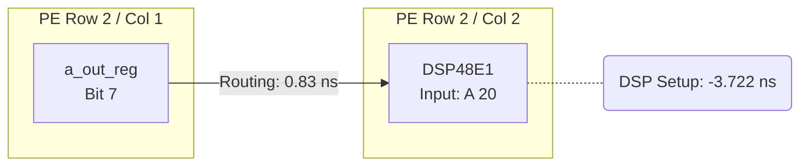
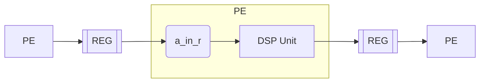

# GEMM Core Documentation

This document describes the GEMM core located under `fpga/rtl/gemm`. It focuses on the tile-level AXI-Stream interfaces, the required wavefront-style input ordering, the produced output stream, and a high-level view of each RTL block.

## Block Purpose

`gemm_core_top` implements an `ARRAY_SIZE x ARRAY_SIZE` signed integer matrix multiplication (`C = A * B`) using a fully unrolled 2-D systolic array of processing elements (PEs). Each tile consumes the entirety of two matrices through AXI-Stream ports and emits the resulting matrix using another AXI-Stream port once the systolic pipeline finishes accumulating.

## Parameterization

- `DATA_WIDTH` – Bit width of `A`/`B` operands on each lane (8-bit signed by default).
- `ACC_WIDTH` – Bit width of the accumulators/outputs (32-bit signed by default).
- `ARRAY_SIZE` – Number of rows/columns (8, yielding a fixed 8x8 grid of PEs in the current RTL).
- `AXIS_DATA_WIDTH` – Bit width of each AXI-Stream beat (64 bits, matching 8 lanes × 8 bits).

These parameters are propagated to all submodules so the array can be resized as long as the stream width and lane packing are updated consistently.

## Control and Handshake Signals

- `aclk` / `aresetn` – Clock and active-low reset shared by all sub-blocks.
- `start_tile` – Pulse high for one cycle to clear accumulators and begin loading a new tile. Should only be asserted when no tile is active.
- `tile_done` – Pulses high when the output collector issues `TLAST` for the final beat of `C`.

The AXI-Stream ports use standard `TVALID/TREADY/TLAST` handshakes. The core is source-synchronous on transmit (`m_axis_out_*`) and sink-synchronous on receive (`s_axis_*`).

## Input Stream Requirements

Each AXI-Stream input beat is 64 bits and packs eight signed `DATA_WIDTH` values. Lane `i` (0 = LSB) corresponds to matrix row `i` for stream A and matrix column `i` for stream B. You must provide data in a wavefront/anti-diagonal schedule so that all rows/columns enter the systolic array in lock step.

### Wavefront Schedule

Let `cycle` be a zero-based counter that increments on every accepted beat. For an `ARRAY_SIZE` = 8 tile:

- **Stream A (rows propagated horizontally):**
  - Lane `i` carries `A[i][j]` where `j = cycle - i`.
  - If `j` falls outside `[0, ARRAY_SIZE-1]`, that lane must be padded with zero.
  - `TLAST` is asserted on the final cycle `cycle = 2*ARRAY_SIZE - 2`.

- **Stream B (columns propagated vertically):**
  - Lane `j` carries `B[i][j]` where `i = cycle - j`.
  - Lanes outside the current wavefront are zero padded.
  - `TLAST` matches stream A on the last cycle.

This pattern naturally walks the anti-diagonals of each matrix. A full `ARRAY_SIZE x ARRAY_SIZE` tile therefore requires exactly `2*ARRAY_SIZE - 1` beats per stream (15 beats for the default 8x8 design). The test bench `fpga/tb/gemm/tb_gemm_core_top.v` shows how to build each beat programmatically.

### Backpressure Behavior

Each stream feeds an `input_buffer_controller` that contains a one-beat skid buffer. The controller only asserts `TREADY` when the tile is enabled and the buffer can accept data. Once a beat is accepted, the controller presents the 8 unpacked lanes (`data_out_[0..7]`) simultaneously to the systolic array, asserting `data_valid` for that cycle. Because A lanes drive rows and B lanes drive columns, both `data_valid` pulses must align for the PEs to perform MAC operations.

## Output Stream Behavior

Outputs are produced as soon as the corresponding accumulators finish. Every processing element counts its own MACs and raises an `acc_done` flag once it has consumed `ARRAY_SIZE` operand pairs. The output collector monitors those flags and only emits a beat when all values packed in that beat are marked done. Because the collector arms itself at `start_tile`, it can begin streaming the top-left entries while the rest of the systolic wave is still propagating, overlapping compute and drain without reading partial sums.

The output collector scans the accumulated matrix `C` in row-major order and packs `VALUES_PER_BEAT = AXIS_DATA_WIDTH / ACC_WIDTH` results per beat (2 × 32-bit values for the default configuration):

- `m_axis_tdata[31:0]` carries `C[row][col]`.
- `m_axis_tdata[63:32]` carries `C[row][col+1]`, zero padded when the row has an odd number of elements.
- The collector advances `col` by 2 each handshake, wrapping to the next row when the row is exhausted.
- `TLAST` is asserted on the beat containing the last valid result (row = `ARRAY_SIZE-1`, `col >= ARRAY_SIZE-VALUES_PER_BEAT`).

`tile_done` reflects the final `TLAST`, enabling the host to latch the completion of the tile.

## Internal Block Overview

### 1. `input_buffer_controller`

- Provides the ready/valid handshake for both `s_axis_a` and `s_axis_b`.
- Captures each 64-bit beat into a holding register, unpacks it into eight signed `DATA_WIDTH` lanes, and asserts `data_valid` for exactly one cycle per beat.
- Acts as a timing-decoupling stage so AXI arrival jitter does not disturb the systolic array.

### 2. `processing_element`

- Each PE performs `acc_out <= acc_out + (a_in * b_in)` whenever both inputs are valid, tracking how many MACs have been observed.
- `a_in` propagates to the right each cycle, `b_in` propagates downward, so every value participates in multiple MACs.
- `clear_acc` synchronous reset is driven by `start_tile` to zero all accumulators and their MAC counters between tiles.
- After `ARRAY_SIZE` accumulations the PE asserts `acc_done`, which stays high until the next tile and guarantees the exposed value will no longer change.

### 3. `systolic_array`

- 8×8 grid created with Verilog `generate` loops.
- Internal wiring arrays route `a` horizontally and `b` vertically, maintaining valid bits alongside data.
- Exposes all 64 accumulator taps (`acc_out_r_c`) and their matching `acc_done_r_c` flags so the collector can read them without additional buffering or speculation.
- Raises `array_active` whenever any PE sees valid A and B operands simultaneously (handy for debug/visibility).

### 4. Tile Control Logic (inside `gemm_core_top`)

- Pulses `start_tile` to clear accumulators and arm both the systolic array and the output collector.
- Relies on each PE’s `acc_done` indicator and the collector’s gating to ensure only finalized values leave the core, so no extra flush or TLAST bookkeeping is required beyond what the AXI sources already provide.

### 5. `output_collector`

- Uses a simple FSM with `(row_idx, col_idx)` pointers and a helper function to address the flattened accumulator wires.
- Issues an AXI beat only when all cells that would be packed into that beat have asserted `acc_done`, so partial sums are never leaked.
- `m_axis_tvalid` remains deasserted during idle/wait periods and asserts immediately once the targeted accumulators finish.
- Drives `done` high alongside the final `TLAST`.

## Example Tile Sequence

1. Assert `start_tile` for one `aclk` cycle while both input streams are idle.
2. Beginning the next cycle, start driving the wavefront-formatted A and B streams. Keep `TVALID` asserted while data is available and monitor `TREADY` for backpressure.
3. Assert `TLAST` together on the final wavefront beat (`cycle = 2*ARRAY_SIZE - 2`).
4. As the systolic wave advances, each PE raises `acc_done` once its column is finalized. The output collector, already armed from step 1, streams any row whose next pair of values is marked done—top rows start draining while lower rows are still computing.
5. Monitor `m_axis_out_tvalid`. Once asserted, accept every beat until `TLAST`. Each beat contains two 32-bit row-major results.
6. When `tile_done` pulses, the tile is complete and the core is ready for another `start_tile` once outputs have been consumed.

## Verification References

- `fpga/tb/gemm/tb_gemm_core_top.v` demonstrates the wavefront generator, handshake behavior, and end-to-end result checking for an 8×8 tile.
- Additional targeted benches (`fpga/tb/gemm/tb_input_buffer_controller.v`, etc.) can be used to understand individual modules in isolation.

## Timing Optimization

This section documents the optimization journey to achieve high-frequency operation on Zynq-7020.

### Target and Constraints

| Parameter | Value |
|-----------|-------|
| Target FPGA | Zynq-7020 (xc7z020clg400-1) |
| Speed Grade | -1 (slowest) |
| Target Frequency | 200 MHz (5.0 ns period) |
| Achieved Frequency | **196.23 MHz** (5.096 ns) |

### Optimization History

#### Phase 1: Baseline Analysis (138 MHz)

The original single-cycle MAC design achieved only ~138 MHz:

```
Critical Path: a_in → DSP multiply → add → accumulator register
Logic Levels: 13 (using LUT-based multiplication)
WNS: -0.742 ns at 125 MHz target
```

**Issue:** Xilinx Vivado was using LUTs instead of dedicated DSP48E1 slices for multiplication.

#### Phase 2: DSP48E1 Inference (138 MHz)

Added synthesis directive to force DSP usage:

```verilog
(* use_dsp = "yes" *)
wire signed [ACC_WIDTH-1:0] product;
assign product = a_in * b_in;
```

**Result:** Logic levels reduced from 13 to 2, but timing only marginally improved because the full MAC operation still happened in one cycle.

#### Phase 3: 2-Stage MAC Pipeline (196 MHz)

Broke the critical path by adding a pipeline register between multiply and accumulate:

```
Stage 1: a_in × b_in → product_r (registered)
Stage 2: accumulator + product_r → accumulator
```

**Implementation in `processing_element.v`:**
```verilog
// Stage 1: Multiply
(* use_dsp = "yes" *)
wire signed [ACC_WIDTH-1:0] product;
assign product = a_in * b_in;

reg signed [ACC_WIDTH-1:0] product_r;
always @(posedge clk) product_r <= product;

// Stage 2: Accumulate  
wire signed [ACC_WIDTH-1:0] next_acc;
assign next_acc = accumulator + product_r;
```

**Result:** Achieved 196.23 MHz (WNS = -0.096 ns)

### Critical Path Analysis

After 2-stage pipeline optimization, the critical path shifted to **inter-PE data routing**:



The DSP48E1's A-input has a strict setup requirement of 3.722 ns, leaving only ~1.3 ns for register propagation and routing.

### TPU-Style Systolic Array Experiment

We investigated whether Google TPU-style inter-PE pipelining could improve timing.

#### TPU Design Pattern

In Google's TPU v1, every inter-PE connection is registered:



Each PE has an **input capture register** (`a_in_r`) that:
1. Provides registered input to DSP (decouples routing from compute)
2. Enables scalability to large arrays without timing degradation

#### Implementation Attempt

Added input capture registers to create 3-stage pipeline:
- Stage 1: Input capture (`a_in → a_in_r`)
- Stage 2: Multiply (`a_in_r × b_in_r → product_r`)
- Stage 3: Accumulate (`product_r + accumulator`)

#### Result: No Improvement (195 MHz)

The TPU-style design achieved **194.70 MHz**, slightly *worse* than the simpler 2-stage design.

**Why it didn't help:**

1. **Same routing distance**: On our small 8×8 array, intra-PE routing (fabric register → DSP) is essentially the same distance as inter-PE routing.

2. **Bottleneck is DSP setup time**: Both designs hit the same fundamental limit:
   ```
   DSP48E1 A-input setup time = -3.722 ns
   Available budget after clock overhead = ~1.3 ns
   ```
   Adding more fabric registers doesn't reduce DSP setup requirements.

3. **Vivado placement is already optimal**: The small array fits compactly, so inter-PE wires are short.

#### When TPU-Style Would Help

| Scenario | TPU-Style Beneficial? |
|----------|----------------------|
| Large array (64×64+) | Yes - inter-PE wires become long |
| Cross-chip routing | Yes - registers break timing domains |
| Manual floorplanning | Yes - if PEs are placed far apart |
| Small array, auto-placed | No - routing is already short |

### Final Design Choice

The **2-stage pipeline** (Stage 1: Multiply → Stage 2: Accumulate) provides the best trade-off:

| Metric | 2-Stage Pipeline |
|--------|------------------|
| Fmax | 196.23 MHz |
| Latency | 2 cycles (input to acc_out) |
| Resource overhead | 1 register per PE (product_r) |
| Scalability | Good for 8×8, may need TPU-style for larger |
