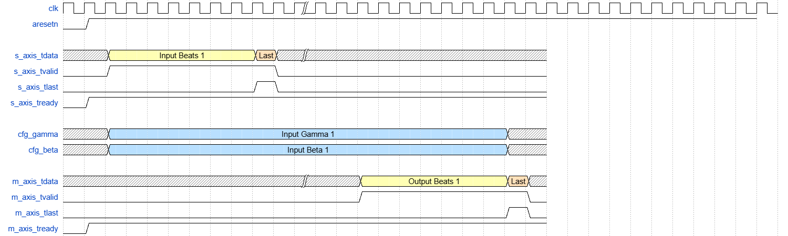
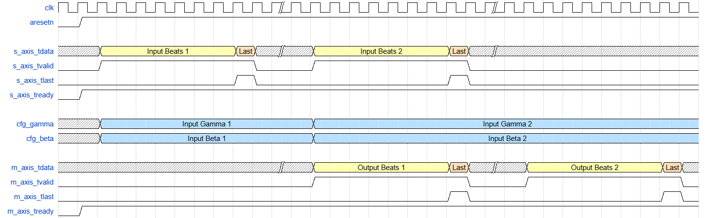
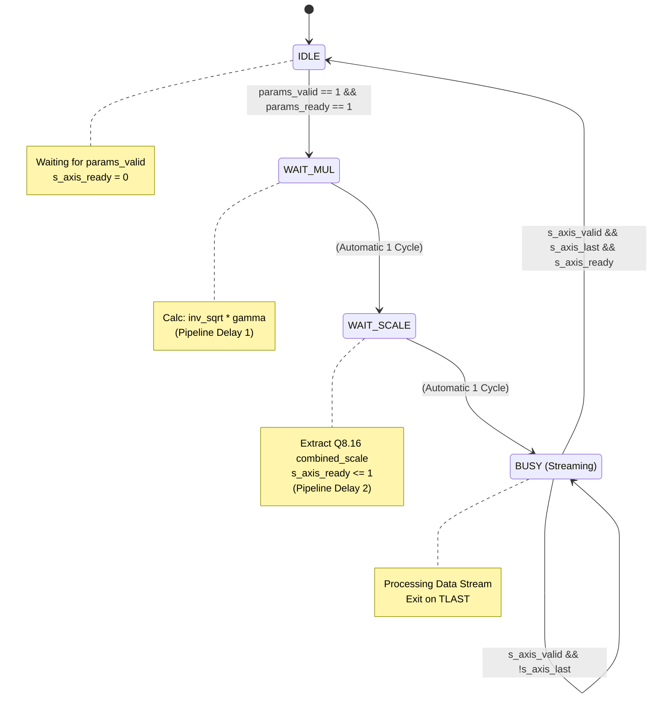

# Layer Normalization

| **Document Information** |                                               |
| ------------------------ | --------------------------------------------- |
| **Module Name**          | layer_norm                                    |
| **Version**              | 1.0                                           |
| **Design Status**        | In development                                |
| **Last Updated**         | January 02 2026                               |
| **Source Location**      | `fpga/rtl/layer_norm/`                        |
| **Testbench**            | `fpga/tb/layer_norm/tb_layer_norm_piplined.v` |
| **Author**               | Nguyen Bui Tuan Anh                           |
## 1. Overview

### 1.1 Purpose

The `layer_norm` module implements a hardware-accelerated Layer Normalization operation, a critical component in Vision Transformers (ViT) and BERT-like architectures. It stabilizes the hidden state dynamics by normalizing input vectors across the feature dimension.

### 1.2 Functional Description

For an input vector $x$ of size $N$, the module computes:

$$y = \frac{x - \mu}{\sqrt{\sigma^2}} \cdot \gamma + \beta$$

Where:

- $\mu = \frac{1}{N}\sum_{i=1}^N x_i$ (Mean)
    
- $\sigma^2 = \frac{1}{N}\sum_{i=1}^N x_i^2 - \mu^2$ (Variance)
    
- $\gamma, \beta$ are learnable affine parameters provided via configuration ports.
    

The module operates on streaming data, buffering the input packet while simultaneously calculating statistics, ensuring high throughput with deterministic latency.

### 1.3 Design Philosophy

The architecture adopts a "Store-and-Forward" strategy with a parallel statistics engine:

- **Dual-Path Processing**: Input data is split into a **Data Beat Path** (FIFO buffered) and a **Statistics Path** (Accumulator/ALU).
    
- **Packet-Based Synchronization**: Statistics ($\mu, \frac{1}{\sqrt{\sigma^2}}$) are computed per packet (beat sequence) and synchronized with the delayed data stream via a Parameter FIFO.
    
- **Pipelined Math**: Complex operations like Inverse Square Root utilize a Peano-curve based approximation with LUTs and Newton-Raphson refinement steps to avoid high-latency dividers.
    
- **Re-quantization**: The final stage optionally re-quantizes the 32-bit internal precision back to 8-bit output, ensuring to be in the range of [-128, 127] to match downstream systolic array requirements.

## 2. Features Summary

| **Feature**            | **Specification**                                                 |
| ---------------------- | ----------------------------------------------------------------- |
| **Input Precision**    | 8 x 8 bit (64-bit beat)                                           |
| **Internal Precision** | 32-bit Fixed Point (Q16.16)                                       |
| **Output Precision**   | Configurable: 8-bit (Re-quantized)                                |
| **Throughput**         | 1 Beat per Clock (after latency)                                  |
| **Packet Support**     | Dynamic lengths (128, 160, 320, 800 supported, can be configured) |
| **Interface**          | AXI4-Stream (Data), Wire (Config)                                 |
| **Backpressure**       | Full backpressure on all AXI-Stream ports                         |
| **DSP Usage**          | 35 DSP slices                                                     |
| **Target Frequency**   | 200 MHz (achieved: 198 MHz)                                       |
## 3. Theory of Operation

This section will focus on 2 main problems when implementing the `layer_norm` module in Verilog, which are the **Processing Flow**, and the **Reciprocal Square Root Approximation**

### 3.1 Processing Flow

The operation is divided into two parallel paths occurring in parallel:

```
    /-> [Accumulator] -> [Avg/Var] -> [RecipSqrt] -\
Input                                       [Params FIFO] -> [Final Norm] -> Output
    \-> [Data FIFO (Delay Buffer)] ---------------------------/
```

1. **Path 1: Statistics Accumulation**
    
    - Input beats stream in.
    - `accumulator` computes $\sum x$ and $\sum x^2$ over the packet.
	- Once the packet ends (`TLAST`), the sums are passed to `Avg/Var` to compute Mean ($\mu$) and Variance ($\sigma^2$)
	- Then Reciprocal Square Root ($\frac{1}{\sqrt{\sigma^2}}$) are computed by `RecipSqrt`
    - These calculated statistics, along with the current $\gamma$ and $\beta$, are pushed to `Params FIFO`.
    
2. **Path 2: Delayed Data Beat**
	
	- Raw data is written to `Data FIFO`
	- These data beats will be pushed to the `Final Norm`
	
3. **The Final Combination:**
    
    - `Final_Norm` reads the statistics from `Params FIFO`.
    - It reads the original data from `Data FIFO`.
    - It applies the normalization formula and streams the result out.

### 3.2 Reciprocal Square Root Approximation

To achieve an efficient hardware implementation of Layer Normalization on the FPGA, we avoid standard division and square root operations, which are computationally expensive and latency-intensive. Instead, we implement the **PEANO** method, which approximates the reciprocal square root term $\frac{1}{\sqrt{Var}}$ using logarithmic identities and bit-level manipulation.

#### 3.2.1 Mathematical Derivation

The core concept relies on transforming the reciprocal square root into the logarithmic domain. Using the identity $log_{2}(\frac{1}{\sqrt{X}}) = -\frac{1}{2}log_{2}(X)$, we can approximate the target value by manipulating the binary representation of the input variance $X$.

Any binary number $X$ can be represented as $X = 2^{k_x}(1+x)$, where $k_x$ represents the position of the leading '1' bit (the integer part magnitude) and $x \in [0, 1)$ represents the remaining fractional bits. Using a linear approximation where $log_2(1+x) \approx x$, we approximate $log_2(X)$ as:

$$log_2(X) \approx k_x + x$$


Substituting this back into the target equation yields the following approximation for the reciprocal square root:

$$\frac{1}{\sqrt{X}} \approx 2^{\frac{-(k_x + x)}{2}}$$

#### 3.2.2 Hardware Algorithm

The implementation calculates the term $2^{\frac{-(k_x + x)}{2}}$ by decomposing the exponent into an integer component $u$ and a fractional component $v$, such that $$2^{\frac{-(k_x + x)}{2}} = 2^u \cdot 2^v$$ which means $$\frac{-(k_x + x)}{2} = u + v$$This is executed in Verilog through the following steps:


1. **Leading One Detection:** Determine $k_x$, the index of the most significant bit of the input variance $Var$.
    
2. **Mantissa Extraction:** Extract the bits immediately following the leading one to form $x$.
    
3. Log Approximation: Calculate the negated, halved exponent. In hardware, dividing by 2 is implemented as a simple arithmetic right shift:
    $$\frac{-(k_x + x)}{2} = -(k_x + x) >>> 1$$
    
4. **Decomposition:**
    
    - **Integer Part ($u$):** The integer portion of $\frac{-(k_x + x)}{2}$ must be negative to guarantee that the fraction part $v$ is positive.
        
    - **Fractional Part ($v$):** The remaining fractional bits which is positive. Then, this component is used to index a small Lookup Table (LUT). which store .
        
        
5. **Table Lookup:** For calculating $2^v$, we can use pre-calculated value in LUT from $2^{0.0_10_20_3...0_m}$ to $2^{0.1_11_21_3...1_m}$, the number of $m$ bit is the parameter `M_BITS`.

The final approximate result is obtained by shifting the LUT output:

$$\frac{1}{\sqrt{X}} \approx 2^v \ll u$$

This method allows us to trade off precision against memory usage by adjusting the parameter $m$ (the number of bits used for the LUT index), effectively balancing accuracy with on-chip resource consumption.

### 4. Module Architecture

## 4.1 Block Diagram 

![[layernorm.png]]
## 4.2 Module Hierarchy
```
layer_norm 
├── beat_fifo       # data for calculating stats
├── beat_fifo       # store raw data for later use
├── accumulator     # adder tree 
├── stats_fifo      # stats buffer 
├── avg_var_calc    # mean and variacne calculator 
├── recip_sqrt      # reciprocal square root approximation
├── beat_fifo       # parameters fifo 
├── final_norm_calc # final normalization 
└── beat_fifo       # output fifo
```

## 5. Parameters

### 5.1 Top-Level Parameters

| Parameter      | Default | Range  | Description                                                  |
| -------------- | ------- | ------ | ------------------------------------------------------------ |
| `DATA_WIDTH`   | 8       | 4–16   | Input element bit-width (signed)                             |
| `PARALLEL_N`   | 8       | 4-32   | Number of elements per beat                                  |
| `BEAT_WIDTH`   | 64      | 32-256 | AXI-Stream data bus width                                    |
| `STAT_WIDTH`   | 32      | 32-64  | Statistics width (avg, var, gamma,...) at fixed-point format |
| `SUM_WIDTH`    | 18      | 18-32  | $\sum x_i$ data width                                        |
| `SUM_SQ_WIDTH` | 24      | 24-32  | $\sum x_i^2$ data width                                      |
| `M_BITS`       | 12      | 8-12   | LUT index width                                              |

### 5.2 Constraints and Requirements

1. **Lane Packing**: `BEAT_WIDTH` must equal `DATA_WIDTH × PARALLEL_N` (64 = 8 × 8)
2. **Signed Arithmetic**: All operations use signed two's complement representation, including LUT data and fixed-point numbers
3. **Optimization**: Should follow the default values, because they were carefully chosen to balance the high Fmax, little resources usage, and precision.

## 6. Interface Specification

### 6.1 Port List

#### Clock and Reset

| Port      | Direction | Width | Description                         |
| --------- | --------- | ----- | ----------------------------------- |
| `clk`     | Input     | 1     | AXI clock (positive-edge triggered) |
| `aresetn` | Input     | 1     | Active-low synchronous reset        |

#### Stream Input (AXI-Stream Slave)

| Port            | Direction | Width | Description                 |
| --------------- | --------- | ----- | --------------------------- |
| `s_axis_tdata`  | Input     | 64    | Input stream beats (8×INT8) |
| `s_axist_valid` | Input     | 1     | Data valid indicator        |
| `s_axis_tlast`  | Input     | 1     | End of input stream         |
| `s_axis_tready` | Output    | 1     | Ready to accept input data  |

####  Learnable Affine Parameters Input

| Port        | Direction | Width      | Description |
| ----------- | --------- | ---------- | ----------- |
| `cfg_gamma` | Input     | STAT_WIDTH | Gamma value |
| `cfg_beta`  | Input     | STAT_WIDTH | Beta value  |

#### Stream Output (AXI-Stream Master)

| Port            | Direction | Width | Description                  |
| --------------- | --------- | ----- | ---------------------------- |
| `m_axis_tdata`  | Output    | 64    | Output stream beats (8xINT8) |
| `m_axis_tvalid` | Output    | 1     | Data valid indicator         |
| `m_axis_tlast`  | Output    | 1     | End of output stream         |
| `m_axis_tready` | Input     | 1     | Downstream ready to accept   |

### 6.2 AXI-Stream Compliance

All AXI-Stream interfaces comply with ARM AMBA 4 AXI-Stream Protocol Specification:

- **Handshake Protocol**: Data transfer occurs when both `TVALID` and `TREADY` are asserted on the rising edge of `clk`
- **TVALID Assertion Rules**: Once asserted, `TVALID` remains high until the transfer completes
- **TREADY Behavior**: Synchronous Parallel-Splitter architecture with aggregated backpressure, allowing continuous back-to-back transfers
- **TLAST Semantics**: Asserted on the final beat of each tile

## 7. Data Formats

### 7.1 Input Stream Format

Input signed INT8 elements are packed in 64-bit data width per beat

```
Beat layout (64 bits):
  [63:56] = 8th INT8  
  [55:48] = 7th INT8
  ...
  [ 7: 0] = 1st INT8
```

### 7.2 Output Stream Format

Output signed INT8 elements are packed in 64-bit data width per beat, ensured clamping to -128 or 127 if out of range.

```
Beat layout (64 bits):
  [63:56] = 8th INT8  
  [55:48] = 7th INT8
  ...
  [ 7: 0] = 1st INT8
```


## 8. Timing Diagram

### 8.1 Normal Operation


Note: the `layer_norm` module has Input and Output FIFO so whenever the FIFO is not empty, the `axis_s_tready` signal is high
### 8.2 Pipelined Operation




Note: the Parameters FIFO stores all of the parameters needed for the final normalization and output, so the (Gamma, Beta) pair of the later beats will not conflict with the former pair and break the output

## 9. Submodule References

### 9.1 `beat_fifo.v` & `stats_fifo.v`

These two modules implement the First-In-First-Out (FIFO) buffering logic required to manage data flow across the pipeline. While they share the same underlying circular buffer architecture, they serve distinct roles in the data and statistics paths.

#### a. `beat_fifo.v` (Data Path Buffer)

This module acts as a delay line for the raw input pixel data. It is critical for synchronization, ensuring the raw data remains available while the statistics engine calculates the global mean and variance for the current packet.

- **Deep Storage:** Typically configured with a large depth (e.g., 512) to store an entire image row or patch sequence ($N$) plus margin.
    
- **Sideband Integrity:** It explicitly stores the `tlast` signal alongside the data beat in the memory array (`{tlast, data}`), preserving packet boundaries through the buffer.
    
- **Memory Inference:** The `RAM_STYLE` parameter allows the user to guide synthesis to use Block RAM ("block") for deep buffers or Distributed RAM ("distributed") for shallow ones.
    

|**Port**|**Direction**|**Description**|
|---|---|---|
|`s_axis_tdata`|Input|Input pixel data beat.|
|`m_axis_tdata`|Output|Delayed pixel data beat.|
|`fifo_count`|Output|Current number of beats stored in the FIFO.|

#### b. `stats_fifo.v` (Statistics Path Buffer)

This module buffers the intermediate statistics produced by the accumulator. Since the accumulator produces one result set per packet (rather than per cycle), this FIFO is generally shallow but wide.

- **Data Packing:** The module concatenates three distinct statistical fields into a single wide storage vector to ensure they stay synchronized:
    
    - **Count (16-bit):** The number of elements processed ($N$).
        
    - **Sum Sq (26-bit):** The accumulated sum of squares ($\sum x^2$).
        
    - **Sum (18-bit):** The accumulated sum ($\sum x$).
        
- **Shallow Depth:** Defaults to 32, as it stores row-level statistics rather than pixel-level data.

### 9.2 `accumulator.v`

The **Accumulator** module is a high-throughput reduction engine designed to calculate the statistical moments of an input stream. It ingests parallel pixel data ("beats") every clock cycle and reduces them into three accumulated values required for the layer normalization process: the sum ($\sum x$), the sum of squares ($\sum x^2$), and the element count ($N$).

#### Key Parameters

|**Parameter**|**Default**|**Description**|
|---|---|---|
|`BEAT_WIDTH`|64|Total width of the AXI-Stream data bus (e.g., 8 pixels $\times$ 8 bits).|
|`NUM_ELEMS`|8|Number of parallel elements (pixels) contained in one beat.|
|`ELEM_WIDTH`|8|Bit width of a single element (signed or unsigned data).|
|`SUM_WIDTH`|18|Bit width allocated for the accumulated sum ($\sum x$).|
|`SUM_SQ_WIDTH`|26|Bit width allocated for the accumulated sum of squares ($\sum x^2$).|

#### I/O Interface

|**Port**|**Direction**|**Width**|**Description**|
|---|---|---|---|
|`s_axis_tdata`|Input|`BEAT_WIDTH`|Packed input data beat containing `NUM_ELEMS` pixels.|
|`s_axis_tvalid`|Input|1|Valid signal for the input stream.|
|`s_axis_tlast`|Input|1|Indicates the last beat of the current packet. Triggers the output of final sums.|
|`s_axis_tready`|Output|1|Always tied high (1'b1); the module does not exert backpressure.|
|`sum_out_int`|Output|`SUM_WIDTH`|The final calculated sum of all elements in the packet.|
|`sum_sq_out_int`|Output|`SUM_SQ_WIDTH`|The final calculated sum of squares of all elements in the packet.|
|`count_out`|Output|16|The total count of elements processed in the packet ($N$).|
|`stats_valid`|Output|1|Pulses high for one cycle when the final sums are valid.|

#### Functional Description

The module utilizes a fixed-latency, 6-stage pipeline to ensure timing closure while processing one beat per clock cycle:

1. **Input Unpacking:** The wide `tdata` bus is sliced into individual element arrays.
    
2. **Parallel Squaring:** DSP blocks calculate the square of every element in parallel.
    
3. **Tree Reduction:** A pipelined Adder Tree reduces the parallel array (Pairwise $\to$ Quad $\to$ Beat) into a single sum and squared sum for the current clock cycle.
    
4. **Global Accumulation:** Per-beat sums are accumulated into running totals for the entire packet.
    
5. **Output Generation:** Upon detecting `tlast`, the module outputs the final accumulated values, asserts `stats_valid`, and resets the internal accumulators for the next packet.

### 9.3 Mean & Variance Engine (`avg_var_calc.v`)

This module computes the statistical mean ($\mu$) and variance ($\sigma^2$) for a given packet using the "one-pass" computational formula:

$$\sigma^2 = E[x^2] - (E[x])^2 = \frac{\sum x^2}{N} - \left( \frac{\sum x}{N} \right)^2$$

It replaces complex hardware division with a look-up table (LUT) based inverse multiplication, enabling high-speed processing for dynamic packet lengths supported by the ViT architecture (e.g., $N=128, 160, 320, 800$).

#### Key Parameters

|**Parameter**|**Default**|**Description**|
|---|---|---|
|`SUM_WIDTH`|18|Width of the input accumulated sum ($\sum x$).|
|`SUM_SQ_WIDTH`|26|Width of the input accumulated sum of squares ($\sum x^2$).|
|`FIXED_WIDTH`|32|Width of the output statistics in Q16.16 fixed-point format.|

#### I/O Interface

|**Port**|**Direction**|**Width**|**Description**|
|---|---|---|---|
|`pkt_len_in`|Input|16|The dynamic packet length $N$ (from Stats FIFO).|
|`sum_int`|Input|`SUM_WIDTH`|Accumulated sum from the current packet.|
|`sum_sq_int`|Input|`SUM_SQ_WIDTH`|Accumulated sum of squares from the current packet.|
|`stats_valid_in`|Input|1|Valid signal from the upstream FIFO.|
|`mean_out`|Output|`FIXED_WIDTH`|Calculated mean ($\mu$) in Q16.16 format.|
|`var_out`|Output|`FIXED_WIDTH`|Calculated variance ($\sigma^2$) in Q16.16 format.|

#### Functional Description

The calculation uses a 6-stage pipeline to ensure high frequency:

- **Inverse Lookup:** Maps the input length `pkt_len_in` to a pre-computed constant $1/N$ (scaled by $2^{18}$), avoiding real-time division.
    
- **Averaging:** Multiplies the input sums ($\sum x$, $\sum x^2$) by the inverse constant to obtain expected values $E[x]$ and $E[x^2]$.
    
- **Mean Squaring:** Computes $(E[x])^2$ using a decomposed multiplication (splitting the 32-bit mean into 16-bit halves) to optimize DSP usage.
    
- **Final Subtraction:** Subtracts the squared mean from the mean of squares to produce the variance `var_out`.

### 9.4 Reciprocal Square Root Engine (`recip_sqrt.v`)

This module calculates the reciprocal square root ($\frac{1}{\sqrt{X}}$) essential for the normalization scaling factor. It implements a high-throughput, pipelined logarithmic approximation method (similar to the fast inverse square root algorithm) to avoid computationally expensive iterative division or root-finding hardware.

#### Key Parameters

|**Parameter**|**Default**|**Description**|
|---|---|---|
|`DATA_WIDTH`|32|Bit width of the input variance.|
|`M_BITS`|12|Logarithm of the LUT depth (determines precision of the mantissa).|
|`OUT_WIDTH`|32|Bit width of the result.|
|`FRAC_BITS`|16|Number of fractional bits in the fixed-point output (Q16.16).|

#### I/O Interface

|**Port**|**Direction**|**Width**|**Description**|
|---|---|---|---|
|`i_var`|Input|32|Input variance ($\sigma^2$) in fixed-point format.|
|`i_var_tvalid`|Input|1|Valid signal for input.|
|`o_recip_sqrt`|Output|32|Result $\frac{1}{\sqrt{var}}$ in Q16.16 format.|
|`o_recip_sqrt_tvalid`|Output|1|Valid signal for output.|

#### Functional Description

The theory of this method is explained at section 3, this part will only show what operations each stage of the module does.

The module utilizes a 6-stage pipeline to transform the input into the log domain, halve it (equivalent to square root), negate it (equivalent to reciprocal), and transform it back.

1. **Leading One Detection (LOD):** Identifies the position of the most significant bit ($k$) to determine the integer magnitude.
    
2. **Normalization:** Uses a barrel shifter to extract the mantissa, normalizing the input value to the range $[1, 2)$.
    
3. **Log-Domain Arithmetic:** Computes the exponent for the result by performing the operation $-\frac{1}{2} \cdot \log_2(X)$ using bitwise manipulation. It separates the result into an integer shift amount (`u`) and a fractional index (`addr`).
    
4. **LUT Access:** Uses the fractional index to retrieve the pre-computed anti-log value ($2^{addr}$) from a Block RAM.
    
5. **Shift Calculation:** Buffers the LUT result and pre-calculates the final shift direction and magnitude based on the integer exponent.
    
6. **Final Scaling:** Performs the final denormalization shift on the LUT value to produce the correct fixed-point result. If the input is zero, the output is clamped to `MAX_OUTPUT`.

### 9.5 Final Normalization Engine (`final_norm_calc.v`)

This module executes the final affine transformation $y = \frac{x - \mu}{\sqrt{\sigma^2}} \cdot \gamma + \beta$. It applies the calculated statistics and learned parameters to the delayed input stream. To maximize throughput, it pre-calculates a combined scaling factor once per packet, reducing the per-pixel operation to a simplified Multiply-Accumulate (MAC).

#### Key Parameters

|**Parameter**|**Default**|**Description**|
|---|---|---|
|`DATA_WIDTH`|8|Input bit width of raw pixel elements.|
|`PARALLEL_N`|8|Number of pixels processed in parallel per clock cycle.|
|`STAT_WIDTH`|32|Bit width of statistics and parameters (Q16.16).|
|`DO_REQUANTIZE`|1|If 1, clamps output to 8-bit signed integer. If 0, outputs full 32-bit precision.|

#### I/O Interface

|**Port**|**Direction**|**Width**|**Description**|
|---|---|---|---|
|`s_axis_data`|Input|`PARALLEL_N*8`|Delayed raw input data from `beat_fifo`.|
|`mean_val`|Input|32|Calculated Mean ($\mu$) for the current packet.|
|`inv_sqrt_val`|Input|32|Calculated Inverse Sqrt ($1/\sigma$) for the current packet.|
|`gamma_val`|Input|32|Learned scaling parameter ($\gamma$).|
|`beta_val`|Input|32|Learned bias parameter ($\beta$).|
|`m_axis_data`|Output|Dynamic|Normalized output data (8-bit clamped or 32-bit full).|

#### Functional Description

1. Parameter Pre-calculation (FSM)

A 4-state control machine (IDLE $\to$ WAIT_MUL $\to$ WAIT_SCALE $\to$ BUSY) pauses the data stream at the start of every packet to compute combined_scale = inv_sqrt_val * gamma_val. This optimization collapses two multiplications into one pre-computed coefficient.



2. Data Pipeline

Once the scale is ready, the module processes pixels in a continuous pipeline:

- **Centering:** Subtracts the global mean from every pixel ($x - \mu$).
    
- **Scaling:** Multiplies the result by `combined_scale` using a split-multiplication architecture to map efficiently to DSP slices.
    
- **Offset:** Adds the bias parameter $\beta$ (plus a rounding constant `0x8000` if requantizing).
    
- **Requantization:** If enabled, the result is right-shifted and clamped to the 8-bit signed range `[-128, 127]` to ensure valid output formatting.

## 10. Verification

The `tb_layer_norm_pipelined` module acts as a self-checking verification environment. It uses a **Driver-Monitor** architecture where the driver pushes random data packets of varying lengths into the RTL, and the monitor compares the output against a high-precision floating-point "Golden Model."

### 1. The Golden Model & Rounding Verification

The core verification logic relies on a software task that replicates the layer normalization math using `real` (double-precision) variables. This isolates hardware bugs from precision issues.

**Key Logic:**

- **High-Precision Math:** Calculates Mean and Variance using floating-point to get the "ideal" result.
    
- **Rounding Equivalency:** The testbench explicitly models the hardware's "Round Half Up" logic using `$floor(val + 0.5)`. This ensures that the software expectation matches the hardware's `(x + 0.5) >>> 16` bit-exact operation.
    
- **Clamping:** It simulates the hardware's saturation to 8-bit signed range (-128 to 127).
    


```verilog
// Helper: Matches RTL "Add 0.5 and Truncate" logic
function integer round_half_up(input real val);
    begin
        // Software equivalent of hardware's: (val + 0.5) >>> 16
        round_half_up = $floor(val + 0.5);
    end
endfunction

// Helper: Matches RTL 8-bit saturation
function signed [7:0] clamp_to_int8(input integer val);
    if (val > 127) clamp_to_int8 = 127;
    else if (val < -128) clamp_to_int8 = -128;
    else clamp_to_int8 = val[7:0];
endfunction

// Golden Model Task
task calc_golden_model(input integer id, input integer len);
    // ... (Mean and Variance calculation variables) ...
    begin
        // 1. Calculate ideal stats using floating point
        mean = sum / len;
        var  = (sum_sq / len) - (mean * mean);
        inv_std = 1.0 / $sqrt(var);

        // 2. Compute expected output per pixel
        for (i=0; i<len; i=i+1) begin
            val = $itor(input_buffer[i]);
            
            // Ideal Affine Transform
            norm = (val - mean) * inv_std * r_gamma + r_beta;
            
            // 3. Apply Hardware Constraints (Round & Clamp)
            expected_buffer[i] = clamp_to_int8(round_half_up(norm));
        end
    end
endtask
```

### 2. Dynamic Packet Generation (Driver)

The driver allows testing multiple ViT stages by configuring an array of packet lengths. It generates random data, stores a copy in `history_buffer` for the Golden Model, and drives the AXI-Stream interface.


```verilog
// Configuration for dynamic length testing
packet_lengths[0] = 320; // Test Stage 1 length
packet_lengths[1] = 320; // Test Stage 2 length
packet_lengths[2] = 320; // Test Stage 3 length

task driver_thread;
    // ...
    for (pkt_id = 0; pkt_id < NUM_PACKETS; pkt_id = pkt_id + 1) begin
        // 1. Generate Random Data
        for (beat_idx = 0; beat_idx < num_beats; beat_idx = beat_idx + 1) begin
             r_data = {$random, $random};
             // Store specific byte for verification later
             history_buffer[pkt_id][global_idx] = r_data[...]; 
        end
        
        // 2. Drive AXI Stream (Valid/Last/Data)
        s_axis_tvalid <= 1;
        // ... drive beats ...
        s_axis_tlast  <= (beat_idx == num_beats - 1);
    end
endtask
```

### 3. Monitor & Tolerance Check

The monitor captures the hardware output and compares it to the expected buffer populated by the Golden Model.

**Tolerance Strategy:**

- The testbench allows a deviation of **$\pm 1$ LSB**.
    
- This tolerance is necessary because the RTL uses a LUT-based approximation for Inverse Square Root, while the Golden Model uses the perfect floating-point `$sqrt()`. Small precision differences in the statistical calculation may result in a rounded integer difference of exactly 1.
    

```verilog
task monitor_thread;
    // ...
    // Calculate Golden Model based on the Input History we stored
    calc_golden_model(pkt_id, current_len); 

    // Compare Pixel-by-Pixel
    for (elem_idx = 0; elem_idx < 8; elem_idx = elem_idx + 1) begin
        rtl_val = $signed(m_axis_tdata[...]); // Actual Hardware Output
        exp_val = expected_buffer[global_idx]; // Golden Model Output
        
        diff = rtl_val - exp_val;
        if (diff < 0) diff = -diff; // Absolute difference
        
        // FAIL Condition: Error > 1 LSB
        if (diff > 1) begin 
            $display("[FAIL] Pkt%0d Idx%0d: Exp=%d, Act=%d", ...);
            err_cnt = err_cnt + 1;
        end
    end
    // ...
endtask
```

## 11. Resource Utilization and Timing Analysis

### 11.1 Resource Utilization

**Target Device**: Xilinx Zynq-7020 (xc7z020clg400-1)  
**Tool Version**: Vivado 2024.2  
**Synthesis Mode**: Out-of-Context (OOC)

| Resource            | Used   | Available | Utilization |
| ------------------- | ------ | --------- | ----------- |
| **Slice LUTs**      | ~4,303 | 53,200    | ~8.09%      |
| - LUT as Logic      | ~2,109 | 53,200    | ~3.96%      |
| - LUT as Memory     | ~2,194 | 17,400    | ~12.61%     |
| **Slice Registers** | ~2,551 | 106,400   | ~2.40%      |
| **F7 Muxes**        | ~305   | 26,600    | ~1.15%      |
| **Block RAM**       | 4      | 140       | 2.86%       |
| **DSP Slices**      | 35     | 220       | 15.9%       |

### 11.2 Timing Analysis & Optimization

To achieve high-frequency operation (targeting 200MHz+ on Artyz7 20 FPGA), the Layer Norm design employs several critical timing optimization techniques. These methods focus on breaking down long combinational paths, utilizing hardened DSP resources efficiently, and removing complex logic from the high-speed data path.

| Metric                         | Value               |
| ------------------------------ | ------------------- |
| **Target Clock Period**        | 5.000 ns (200 MHz)  |
| **WNS (Worst Negative Slack)** | -0.042 ns           |
| **Achieved Clock Period**      | 5.042 ns            |
| **Estimated Fmax**             | 198.33 MHz          |
| **Timing Status**              | VIOLATED (marginal) |
### 1. Deep Pipelining & Register Retiming

The design rejects "single-cycle" monolithic logic in favor of deep pipelines. Every submodule is broken into 5–6 register stages. This ensures that the logic depth between any two registers is minimal (typically limited to a single adder, multiplier, or multiplexer), effectively reducing the critical path delay.

- **Accumulator:** 6 Stages (Input $\to$ Square $\to$ Pair Add $\to$ Quad Add $\to$ Beat Add $\to$ Accumulate).
    
- **Reciprocal Sqrt:** 6 Stages (LOD $\to$ Normalize $\to$ Log $\to$ LUT $\to$ Shift Calc $\to$ Denormalize).
    
- **Final Norm:** 5 Stages (Subtract $\to$ Split Mult $\to$ Sum $\to$ Offset $\to$ Clamp).
    

### 2. Parallel Adder Tree (Accumulator)

A naive accumulation of 8 parallel pixels would require a daisy-chain of 7 adders in a single cycle ($a+b+c+...$), creating a massive critical path.

- **Optimization:** The `accumulator.v` module uses a **Binary Reduction Tree**.
    
    - **Stage 2:** Adds pairs (8 elements $\to$ 4 sums).
        
    - **Stage 3:** Adds results from Stage 2 (4 sums $\to$ 2 sums).
        
    - **Stage 4:** Adds results from Stage 3 (2 sums $\to$ 1 sum).
        
- **Result:** The logic depth is reduced from $O(N)$ to $O(\log_2 N)$, significantly improving timing closure for the parallel accumulation.
    

### 3. Split Multiplication (DSP Optimization)

In `final_norm_calc.v`, the scaling operation requires multiplying a 32-bit centered pixel value by a 24-bit scale factor. A direct 32x24 multiplication often exceeds the width of a single DSP slice (e.g., DSP48E1 is 25x18), forcing the synthesizer to cascade DSPs, which hurts timing.

- **Optimization:** The multiplication is explicitly split into **High** and **Low** segments in the RTL
    
    ```verilog
    // Stage 2: Split Logic
    st2_prod_hi <= diff[31:17] * scale; // Fits in DSP
    st2_prod_lo <= diff[16:0]  * scale; // Fits in DSP
    
    // Stage 3: Recombination
    total = (st2_prod_hi << 17) + st2_prod_lo;
    ```

- **Result:** This forces the synthesis tool to use parallel DSP slices followed by a registered adder, preserving the maximum toggle rate of the DSP blocks.
    
The `(* use_dsp = "yes" *)` synthesis directive is also used to ensures multiplies are mapped to DSP slices rather than LUT fabric.
### 4. Constant Pre-calculation (Critical Path Reduction)

The normalization formula is $y = (x - \mu) \cdot (1/\sigma) \cdot \gamma + \beta$.

Implementing two sequential multiplications (* inv_sqrt then * gamma) inside the pixel pipeline would double the latency and resource usage per pixel.

- Optimization: The final_norm_calc.v FSM pauses the stream briefly at the start of each packet to compute a Combined Scale Factor: $$\text{Combined Scale} = \text{inv\\_sqrt} \times \gamma$$
    
- **Result:** The high-speed pixel pipeline only performs **one** multiplication ($y = (x-\mu) \cdot \text{scale} + \beta$). This removes an entire multiplier from the critical path of the data stream.

