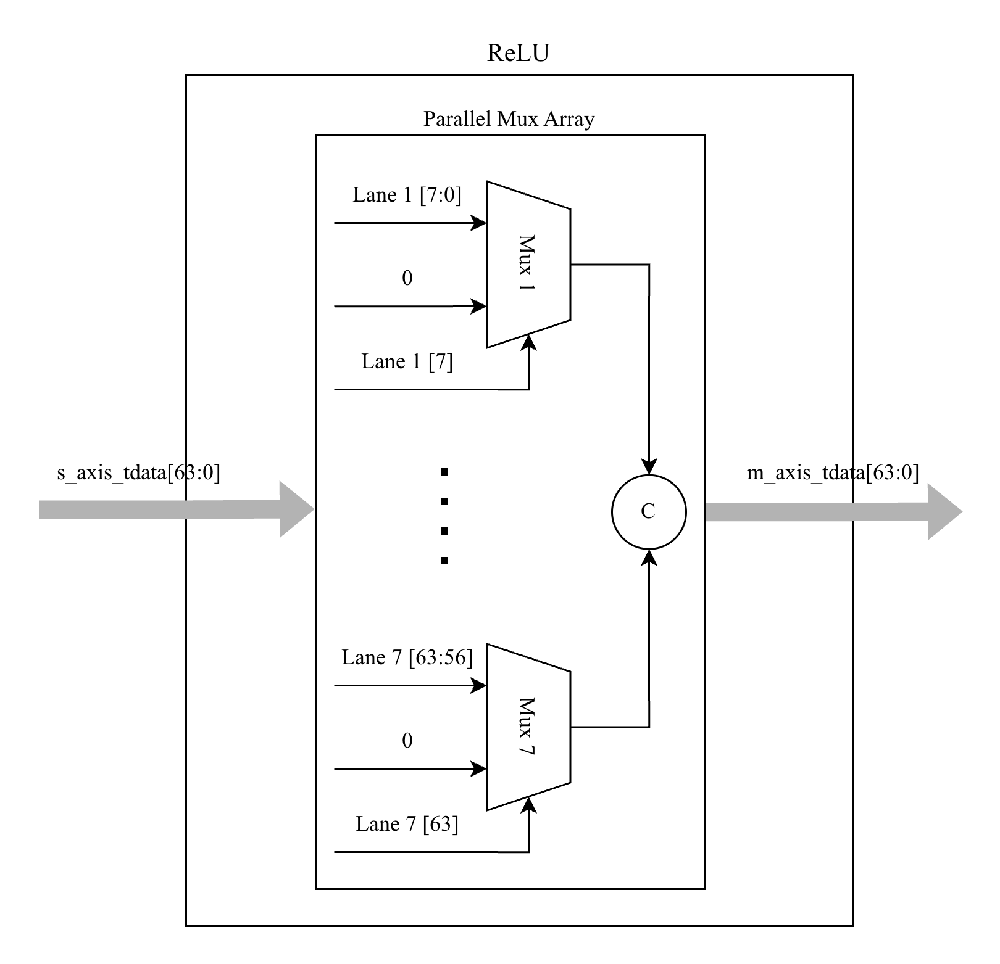

# ReLU Unit – Parallel INT8 Activation Function

| **Document Information** |                               |
| ------------------------ | ----------------------------- |
| **Module Name**          | `relu`                        |
| **Version**              | 1.0                           |
| **Design Status**        | In development                |
| **Last Updated**         | January 06 2026               |
| **Source Location**      | `fpga/rtl/relu/`              |
| **Testbench**            | `fpga/tb/relu/tb_relu_unit.v` |
| **Author**               | Nguyen Bui Tuan Anh           |

## Table of Contents

1. [Overview](#1-overview)
2. [Features Summary](#2-features-summary)
3. [Theory of Operation](#3-theory-of-operation)
4. [Module Architecture](#4-module-architecture)
5. [Parameters](#5-parameters)
6. [Interface Specification](#6-interface-specification)
7. [Data Formats](#7-data-formats)
8. [Pipeline Architecture](#8-pipeline-architecture)
9. [Resource Utilization](#9-resource-utilization)
10. [Verification](#10-verification)
11. [Design Constraints](#11-design-constraints)
12. [Known Limitations](#12-known-limitations)
13. [Revision History](#13-revision-history)

## 1. Overview

### 1.1 Purpose

The `relu` module implements a fully combinational Rectified Linear Unit (ReLU) activation function for parallel signed INT8 data lanes. It is designed for use in the TinyViT-5M accelerator's quantized inference pipeline, providing the nonlinear activation required between linear layers in neural networks.

### 1.2 Functional Description

ReLU is one of the most common activation functions in deep learning. For each signed input value `x`, the operation is defined as:

$$
\text{ReLU}(x) = \max(0, x) = \begin{cases} x & \text{if } x \geq 0 \\ 0 & \text{if } x < 0 \end{cases}
$$

This module applies the ReLU function independently to each of the 8 parallel INT8 lanes, preserving positive values and zeroing negative values.

### 1.3 Design Philosophy

The ReLU unit follows these design principles:

- **Purely Combinational**: Zero-latency pass-through with no pipeline registers
- **Parallel Lane Processing**: All 8 INT8 elements processed simultaneously
- **AXI-Stream Compliant**: Standard handshaking for seamless pipeline integration
- **Minimal Resource Usage**: Simple sign-bit checking logic, no multipliers or complex arithmetic
- **Transparent Flow Control**: Direct backpressure propagation without buffering

## 2. Features Summary

| Feature                  | Specification                             |
| ------------------------ | ----------------------------------------- |
| **Input Precision**      | Signed INT8 (per lane)                    |
| **Output Precision**     | Signed INT8 (per lane)                    |
| **Parallel Lanes**       | 8 (configurable via DATA_WIDTH/DATA_TYPE) |
| **Latency**              | 0 cycles (fully combinational)            |
| **Throughput**           | 1 beat/cycle                              |
| **AXI-Stream Interface** | Slave input, master output                |
| **Backpressure Support** | Direct pass-through                       |
| **Resource Usage**       | ~8 LUTs (mux per lane)                    |

## 3. Theory of Operation

### 3.1 ReLU in Quantized Neural Networks

In quantized inference pipelines, ReLU serves as the nonlinear activation function between linear operations (GEMM, convolution). For symmetric INT8 quantization:

- Input range: [-128, 127]
- Output range: [0, 127] (negative values clamped to 0)

The ReLU function preserves the quantization scale since it does not modify positive values.

### 3.2 Sign-Bit Detection

For two's complement signed integers, the most significant bit (MSB) indicates the sign:

- MSB = 0: Non-negative value → pass through unchanged
- MSB = 1: Negative value → output zero

This allows implementing ReLU with simple multiplexer logic:

```text
For each INT8 lane:
    if (input[7] == 1)    // Negative (MSB is sign bit)
        output = 8'b0000_0000
    else                  // Non-negative
        output = input
```

### 3.3 Processing Flow

Since the module is purely combinational, data flows directly from input to output:

```text
s_axis_tdata ─────┬─────────────────────────► m_axis_tdata
                  │
              [ReLU ×8]
              (per lane)
```

No state machine or FSM is required.

## 4. Module Architecture

### 4.1 Block Diagram



### 4.2 Internal Logic

The module consists of:

1. **Generate Loop**: Creates 8 parallel ReLU operations
2. **Per-Lane Mux**: Selects between zero and input based on sign bit
3. **Control Pass-Through**: Directly connects valid, last, and ready signals

```verilog
genvar i;
generate
    for (i = 0; i < NUM_ELEMENTS; i = i + 1) begin : relu_calc_loop
        assign m_axis_tdata[(i*DATA_TYPE) +: DATA_TYPE] =
            (s_axis_tdata[(i+1)*DATA_TYPE-1] == 1'b1) ?
                {DATA_TYPE{1'b0}} :
                s_axis_tdata[(i*DATA_TYPE) +: DATA_TYPE];
    end
endgenerate
```

## 5. Parameters

### 5.1 Top-Level Parameters

| Parameter    | Default | Range       | Description                     |
| ------------ | ------- | ----------- | ------------------------------- |
| `DATA_WIDTH` | 64      | 32, 64, 128 | Total AXI-Stream data bus width |
| `DATA_TYPE`  | 8       | 8, 16, 32   | Bit-width per element (signed)  |

### 5.2 Derived Parameters (Computed Internally)

| Parameter      | Formula                | Default | Description              |
| -------------- | ---------------------- | ------- | ------------------------ |
| `NUM_ELEMENTS` | DATA_WIDTH / DATA_TYPE | 8       | Number of parallel lanes |

### 5.3 Parameter Constraints

1. **Divisibility**: `DATA_WIDTH` must be evenly divisible by `DATA_TYPE`
2. **Power of 2**: Both parameters should be powers of 2 for efficient implementation
3. **Signed Elements**: Elements are interpreted as signed two's complement integers

## 6. Interface Specification

### 6.1 Port List

#### Data Input (AXI-Stream Slave)

| Port            | Direction | Width      | Description                |
| --------------- | --------- | ---------- | -------------------------- |
| `s_axis_tdata`  | Input     | DATA_WIDTH | Packed input data (8×INT8) |
| `s_axis_tvalid` | Input     | 1          | Data valid indicator       |
| `s_axis_tlast`  | Input     | 1          | End of packet/frame        |
| `s_axis_tready` | Output    | 1          | Ready to accept data       |

#### Data Output (AXI-Stream Master)

| Port            | Direction | Width      | Description                 |
| --------------- | --------- | ---------- | --------------------------- |
| `m_axis_tdata`  | Output    | DATA_WIDTH | Packed output data (8×INT8) |
| `m_axis_tvalid` | Output    | 1          | Data valid indicator        |
| `m_axis_tlast`  | Output    | 1          | End of packet/frame         |
| `m_axis_tready` | Input     | 1          | Downstream ready to accept  |

> [!NOTE]
> This module has no clock or reset ports since it is purely combinational.

### 6.2 AXI-Stream Compliance

The module provides full AXI-Stream compliance with transparent signal pass-through:

| Signal   | Behavior                                           |
| -------- | -------------------------------------------------- |
| `TVALID` | Directly propagated: m_axis_tvalid = s_axis_tvalid |
| `TLAST`  | Directly propagated: m_axis_tlast = s_axis_tlast   |
| `TREADY` | Directly propagated: s_axis_tready = m_axis_tready |
| `TDATA`  | Modified: ReLU applied to each lane                |

## 7. Data Formats

### 7.1 Input Data Format

Eight signed INT8 values packed into a 64-bit word:

```text
  [63:56] = lane[7]  (signed INT8)
  [55:48] = lane[6]  (signed INT8)
  [47:40] = lane[5]  (signed INT8)
  [39:32] = lane[4]  (signed INT8)
  [31:24] = lane[3]  (signed INT8)
  [23:16] = lane[2]  (signed INT8)
  [15: 8] = lane[1]  (signed INT8)
  [ 7: 0] = lane[0]  (signed INT8)
```

### 7.2 Output Data Format

Same packing as input, with negative values replaced by zero:

```text
For each lane i:
  output[i] = (input[i] < 0) ? 0 : input[i]
```

### 7.3 Value Transformation Examples

| Input (INT8) | Output (INT8) | Notes                       |
| ------------ | ------------- | --------------------------- |
| 127          | 127           | Maximum positive, unchanged |
| 1            | 1             | Positive, unchanged         |
| 0            | 0             | Zero, unchanged             |
| -1           | 0             | Negative, clamped to zero   |
| -127         | 0             | Negative, clamped to zero   |
| -128         | 0             | Minimum negative, clamped   |

## 8. Pipeline Architecture

### 8.1 Timing Characteristics

| Metric                  | Value         |
| ----------------------- | ------------- |
| **Latency**             | 0 cycles      |
| **Initiation Interval** | 1 cycle       |
| **Throughput**          | 8 INT8/cycle  |
| **Combinational Depth** | 1 level (MUX) |

### 8.2 Critical Path

The critical path consists of:

1. Sign bit extraction: `s_axis_tdata[(i+1)*DATA_TYPE-1]`
2. Multiplexer selection: Choose between 0 or input value

This is extremely short, enabling very high clock frequencies.

### 8.3 Flow Control

Since there is no buffering, flow control is transparent:

- When `m_axis_tready` deasserts, `s_axis_tready` immediately deasserts
- Data is held stable by the upstream module
- No data loss or reordering occurs

## 9. Resource Utilization

### 9.1 Estimated Resource Usage

**Target Device**: Xilinx Zynq-7020 (xc7z020clg400-1)

| Resource            | Estimated | Notes                    |
| ------------------- | --------- | ------------------------ |
| **Slice LUTs**      | 8–16      | One 2:1 MUX per lane     |
| **Slice Registers** | 0         | Purely combinational     |
| **Block RAM**       | 0         | No storage required      |
| **DSP Slices**      | 0         | No arithmetic operations |

### 9.2 Resource Breakdown

| Component            | LUTs | Description             |
| -------------------- | ---- | ----------------------- |
| Lane MUX (×8)        | 8    | 8-bit 2:1 mux per lane  |
| Control pass-through | 0    | Direct wire connections |

> [!TIP]
> Due to its minimal resource usage, multiple ReLU units can be instantiated as needed without significant area impact.

## 10. Verification

### 10.1 Testbench Overview

**Location**: `fpga/tb/relu/tb_relu_unit.v`

The testbench provides comprehensive functional verification:

| Test Case | Description                              | Purpose                     |
| --------- | ---------------------------------------- | --------------------------- |
| Test 1    | Corner cases (0, 127, -128, alternating) | Boundary value verification |
| Test 2    | Random stream (20 beats)                 | General functional coverage |
| Test 3    | Backpressure check                       | Flow control verification   |

### 10.2 Verification Methodology

1. **Per-Lane Verification**: Each byte compared against expected ReLU result
2. **Golden Reference**: Simple software model: `(in < 0) ? 0 : in`
3. **Boundary Testing**: Explicit tests for 0, 127, -128
4. **Backpressure**: Verify `s_axis_tready` follows `m_axis_tready`

### 10.3 Running Simulations

```bash
# Using project Makefile
cd fpga/sim
make all TESTNAME=tb_relu_unit

# View waveforms
make wave TESTNAME=tb_relu_unit
```

### 10.4 Expected Output

```text
=== START EXTENDED SIMULATION ===

--- Test Case 1: Corner Cases ---
[PASS] Input Hex: 0000000000000000 -> Output Hex: 0000000000000000
[PASS] Input Hex: 7f7f7f7f7f7f7f7f -> Output Hex: 7f7f7f7f7f7f7f7f
[PASS] Input Hex: 8080808080808080 -> Output Hex: 0000000000000000
[PASS] Input Hex: 01ff01ff01ff01ff -> Output Hex: 0100010001000100

--- Test Case 2: Random Stream (20 Beats) ---
[PASS] Input Hex: ... -> Output Hex: ...
...

--- Test Case 3: Back-pressure Check ---
[PASS] Back-pressure propagated successfully.

=== SIMULATION FINISHED ===
```

## 11. Design Constraints

### 11.1 Timing Constraints

Since the module is purely combinational, no clock constraints are directly applied. However, when integrated into a clocked design:

```tcl
## Ensure combinational path timing is met
# The ReLU path should be included in the overall timing budget
# of the surrounding logic
```

### 11.2 Maximum Frequency

The combinational delay is minimal (single MUX level), so this module should not be on the critical path in typical designs.

**Estimated Combinational Delay**: < 0.5 ns

## 12. Known Limitations

### 12.1 Functional Limitations

| Limitation            | Impact                                 | Workaround                     |
| --------------------- | -------------------------------------- | ------------------------------ |
| No Leaky ReLU support | Cannot implement α·x for x < 0         | Use separate module if needed  |
| No parametric (PReLU) | Fixed slope of 0 for negatives         | Implement with DSP if needed   |
| No ReLU6 clamping     | Does not clamp positive values at 6    | Add comparator for upper bound |
| INT8 only (default)   | Other data types need parameter change | Set DATA_TYPE appropriately    |

### 12.2 Integration Considerations

| Issue                 | Impact                           | Mitigation                             |
| --------------------- | -------------------------------- | -------------------------------------- |
| No pipeline registers | May impact timing in long chains | Add register stage if on critical path |
| No output buffering   | Direct backpressure propagation  | Upstream must handle stalls            |

## 13. Revision History

| Version | Date            | Author        | Changes                             |
| ------- | --------------- | ------------- | ----------------------------------- |
| 1.0     | January 06 2026 | Le Phuc Khang | Initial comprehensive documentation |

## Appendix A: Quick Reference Card

### A.1 Port Summary

```verilog
relu #(
    .DATA_WIDTH (64),    // 64-bit AXI-Stream bus
    .DATA_TYPE  (8)      // 8-bit signed elements
) u_relu (
    // Input
    .s_axis_tdata   (in_tdata),
    .s_axis_tvalid  (in_tvalid),
    .s_axis_tlast   (in_tlast),
    .s_axis_tready  (in_tready),
    // Output
    .m_axis_tdata   (out_tdata),
    .m_axis_tvalid  (out_tvalid),
    .m_axis_tlast   (out_tlast),
    .m_axis_tready  (out_tready)
);
```

### A.2 Truth Table Summary

| Input Sign Bit (MSB) | Output      |
| -------------------- | ----------- |
| 0 (non-negative)     | Input value |
| 1 (negative)         | 0           |
