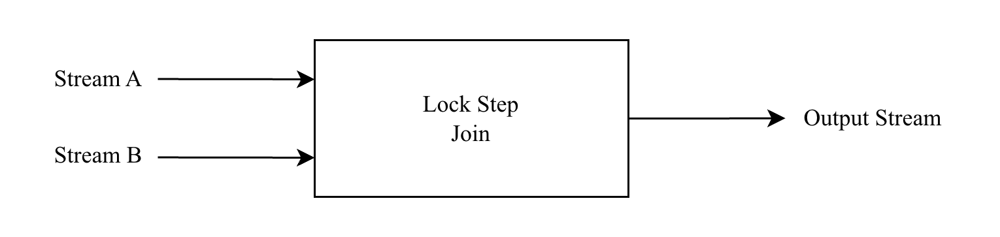
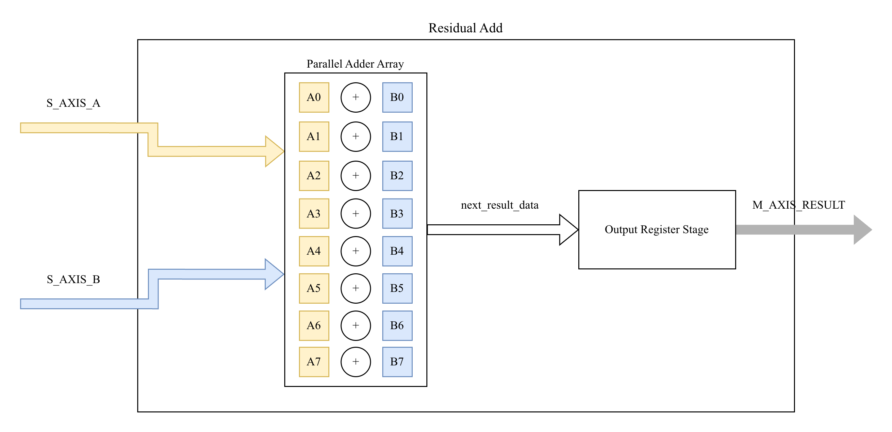
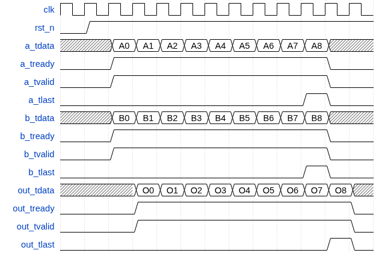
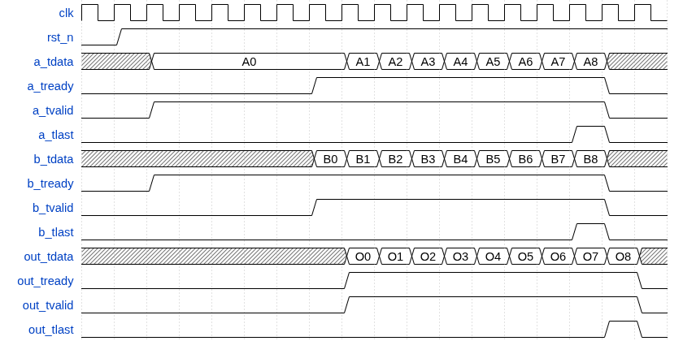
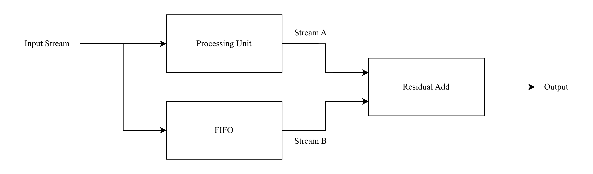

# Residual Add Unit

| **Document Information** |                                      |
| ------------------------ | ------------------------------------ |
| **Module Name**          | `residual_add`                       |
| **Version**              | 1.0                                  |
| **Design Status**        | In development                       |
| **Last Updated**         | January 03 2026                      |
| **Source Location**      | `fpga/rtl/residual/`                 |
| **Testbench**            | `fpga/tb/residual/tb_residual_add.v` |
| **Author**               | Le Phuc Khang                        |

## Table of Contents

1. [Overview](#1-overview)
2. [Features Summary](#2-features-summary)
3. [Theory of Operation](#3-theory-of-operation)
4. [Module Architecture](#4-module-architecture)
5. [Parameters](#5-parameters)
6. [Interface Specification](#6-interface-specification)
7. [Data Formats](#7-data-formats)
8. [Timing Diagrams](#8-timing-diagrams)
9. [Pipeline Architecture](#9-pipeline-architecture)
10. [Resource Utilization](#10-resource-utilization)
11. [Integration Guidelines](#11-integration-guidelines)
12. [Verification](#12-verification)
13. [Design Constraints](#13-design-constraints)
14. [Known Limitations](#14-known-limitations)

## 1. Overview

### 1.1 Purpose

The `residual_add` module implements a **lock-step dual-stream element-wise addition** with saturation arithmetic, designed for residual (skip) connections in the TinyViT-5M hardware accelerator. It is a fundamental building block that enables the identity shortcuts found in transformer attention blocks and MLP layers.

### 1.2 Functional Description

The residual add unit performs element-wise addition of two INT8 vectors arriving via separate AXI-Stream interfaces. For each lane `i` of a beat, the operation computes:

$$
\text{out}[i] = \text{sat\_add}(A[i], B[i]) = \text{clamp}(A[i] + B[i], -128, +127)
$$

Where:

- $A$ and $B$ are signed INT8 input vectors (8 elements per beat with default parameters)
- The result is clamped to prevent overflow using saturating arithmetic
- Both streams must present valid data simultaneously for consumption (lock-step join)

### 1.3 Design Philosophy

Residual connections are critical for gradient flow in deep networks, but their hardware implementation must carefully handle:

- **Stream Synchronization**: The two input streams (main path and skip connection) may arrive at different rates due to upstream pipeline latencies
- **Overflow Prevention**: INT8 addition can overflow; saturating arithmetic preserves signal integrity
- **Backpressure Propagation**: The module must stall gracefully when the downstream consumer is not ready

This module uses a **lock-step join** strategy where both inputs must be valid before either is consumed, ensuring frame alignment without buffering.

### 1.4 Transformer Context

In Vision Transformers, residual connections appear in two key locations:

1. **Post-Attention Residual**: `x = x + Attention(LayerNorm(x))`
2. **Post-MLP Residual**: `x = x + MLP(LayerNorm(x))`

The `residual_add` unit handles both cases by adding the skip path (`x`) with the processed output (`Attention(...)` or `MLP(...)`).

## 2. Features Summary

| Feature                  | Specification                        |
| ------------------------ | ------------------------------------ |
| **Operation**            | Element-wise saturating addition     |
| **Input Precision**      | Signed INT8                          |
| **Output Precision**     | Signed INT8 (saturated)              |
| **Parallel Lanes**       | 8 elements per beat (configurable)   |
| **Input Streams**        | 2 × AXI-Stream slave                 |
| **Output Stream**        | 1 × AXI-Stream master                |
| **Synchronization**      | Lock-step join (both valid required) |
| **Saturation**           | Symmetric clamp to [-128, +127]      |
| **Backpressure Support** | Full backpressure on all ports       |
| **TLAST Semantics**      | Output TLAST = A_TLAST AND B_TLAST   |
| **Pipeline Latency**     | 1 cycle                              |
| **Throughput**           | 1 beat per cycle (sustained)         |

## 3. Theory of Operation

### 3.1 Processing Flow

The module operates as a continuous dataflow element with no explicit FSM states. Data flows through whenever the join conditions are met:



1. **Wait for Both Valid**: The module waits until both `s_axis_a_tvalid` and `s_axis_b_tvalid` are asserted
2. **Check Output Ready**: Output stage must be empty or being consumed (`ready_for_inputs`)
3. **Consume and Compute**: Both inputs are consumed simultaneously; saturating add applied per lane
4. **Emit Result**: Output valid is asserted with the computed sum

### 3.2 Lock-Step Join Semantics

The lock-step join ensures both streams are consumed together:

```verilog
// Ready logic for lock-step synchronization
assign s_axis_a_tready = ready_for_inputs && s_axis_b_tvalid;
assign s_axis_b_tready = ready_for_inputs && s_axis_a_tvalid;
```

This guarantees:

- **Aligned Consumption**: Both streams advance by one beat atomically
- **No Partial Reads**: Stream A cannot advance without Stream B (and vice versa)
- **Frame Synchronization**: TLAST from both streams is ANDed, ensuring aligned frame boundaries

### 3.3 Saturating Arithmetic

The saturation function prevents INT8 overflow by clamping results:

```text
sat_add(a, b):
    sum_ext = sign_extend(a, 9 bits) + sign_extend(b, 9 bits)

    if overflow_detected (MSB ≠ MSB-1):
        if positive_overflow:
            return +127 (0x7F)
        else:
            return -128 (0x80)
    else:
        return sum_ext[7:0]
```

**Overflow Detection**: The 9-bit extended sum overflows if bit[8] differs from bit[7]:

- `sum_ext[8] = 0, sum_ext[7] = 1` → Positive overflow → Clamp to +127
- `sum_ext[8] = 1, sum_ext[7] = 0` → Negative overflow → Clamp to -128

### 3.4 TLAST Handling

The output `m_axis_tlast` is the logical AND of both input TLAST signals:

```verilog
m_axis_tlast <= s_axis_a_tlast & s_axis_b_tlast;
```

This ensures:

- Frame boundaries are only marked when **both** input streams indicate end-of-frame
- Misaligned TLAST (e.g., A=1, B=0) does not propagate a false frame boundary
- Upstream logic must ensure stream lengths are matched

## 4. Module Architecture

### 4.1 Block Diagram



### 4.2 Module Hierarchy

```text
residual_add (top-level)
│
├── Lock-Step Join Logic
│   ├── ready_for_inputs   # Output empty or being consumed
│   ├── s_axis_a_tready    # Gated by B valid
│   └── s_axis_b_tready    # Gated by A valid
│
├── Saturating Adder Array
│   └── sat_add function   # Instantiated per lane (combinational)
│       ├── Sign extension (8→9 bits)
│       ├── 9-bit addition
│       ├── Overflow detection
│       └── Saturation mux
│
└── Output Stage Register
    ├── m_axis_tdata       # Registered sum result
    ├── m_axis_tvalid      # Set on valid join, cleared on consume
    └── m_axis_tlast       # AND of both input TLAST signals
```

## 5. Parameters

### 5.1 Top-Level Parameters

| Parameter    | Default | Range  | Description                     |
| ------------ | ------- | ------ | ------------------------------- |
| `DATA_WIDTH` | 64      | 32–512 | Total AXI-Stream data bus width |
| `ELEM_WIDTH` | 8       | 4–16   | Element bit-width (signed)      |

### 5.2 Derived Parameters (Computed Internally)

| Parameter | Formula                 | Default Value | Description                |
| --------- | ----------------------- | ------------- | -------------------------- |
| `LANES`   | DATA_WIDTH / ELEM_WIDTH | 8             | Parallel elements per beat |

### 5.3 Constraints and Requirements

1. **Data Width Alignment**: `DATA_WIDTH` must be an integer multiple of `ELEM_WIDTH`
2. **Power of Two Lanes**: For efficient synthesis, `LANES` should be a power of 2
3. **Signed Arithmetic**: All elements are treated as signed two's complement integers

## 6. Interface Specification

### 6.1 Port List

#### Clock and Reset

| Port    | Direction | Width | Description                            |
| ------- | --------- | ----- | -------------------------------------- |
| `clk`   | Input     | 1     | System clock (positive-edge triggered) |
| `rst_n` | Input     | 1     | Active-low asynchronous reset          |

#### Stream A Input (AXI-Stream Slave)

| Port              | Direction | Width      | Description                |
| ----------------- | --------- | ---------- | -------------------------- |
| `s_axis_a_tdata`  | Input     | DATA_WIDTH | Packed A elements (signed) |
| `s_axis_a_tvalid` | Input     | 1          | Data valid indicator       |
| `s_axis_a_tlast`  | Input     | 1          | End of frame marker        |
| `s_axis_a_tready` | Output    | 1          | Ready to accept A data     |

#### Stream B Input (AXI-Stream Slave)

| Port              | Direction | Width      | Description                |
| ----------------- | --------- | ---------- | -------------------------- |
| `s_axis_b_tdata`  | Input     | DATA_WIDTH | Packed B elements (signed) |
| `s_axis_b_tvalid` | Input     | 1          | Data valid indicator       |
| `s_axis_b_tlast`  | Input     | 1          | End of frame marker        |
| `s_axis_b_tready` | Output    | 1          | Ready to accept B data     |

#### Result Output (AXI-Stream Master)

| Port            | Direction | Width      | Description                  |
| --------------- | --------- | ---------- | ---------------------------- |
| `m_axis_tdata`  | Output    | DATA_WIDTH | Packed sum elements (signed) |
| `m_axis_tvalid` | Output    | 1          | Data valid indicator         |
| `m_axis_tlast`  | Output    | 1          | End of frame marker          |
| `m_axis_tready` | Input     | 1          | Downstream ready to accept   |

### 6.2 AXI-Stream Compliance

All AXI-Stream interfaces comply with ARM AMBA 4 AXI-Stream Protocol Specification:

- **Handshake Protocol**: Data transfer occurs when both `TVALID` and `TREADY` are asserted on the rising edge of `clk`
- **TVALID Assertion Rules**: Once asserted, `TVALID` remains high until the transfer completes (handshake occurs)
- **TREADY Behavior**: Input TREADY signals are conditionally asserted based on lock-step join logic
- **TLAST Semantics**: Output TLAST is the logical AND of both input TLAST signals

### 6.3 Lock-Step Join Protocol

The lock-step join creates a **rendezvous point** for the two input streams:

| Stream A Valid | Stream B Valid | Output Ready | A Ready | B Ready | Action              |
| -------------- | -------------- | ------------ | ------- | ------- | ------------------- |
| 0              | X              | X            | 0       | 0       | Wait for A          |
| X              | 0              | X            | 0       | 0       | Wait for B          |
| 1              | 1              | 0            | 0       | 0       | Wait for downstream |
| 1              | 1              | 1            | 1       | 1       | Transfer occurs     |

## 7. Data Formats

### 7.1 Input Data Format (Stream A and B)

Both input streams carry packed signed INT8 elements:

```text
Beat layout (64 bits, 8 lanes):
  [ 63:56] = element[7]  (signed INT8)
  [ 55:48] = element[6]
  ...
  [ 15: 8] = element[1]
  [  7: 0] = element[0]

Each element represents a channel value from the feature tensor.
```

### 7.2 Output Data Format

The output carries the element-wise saturated sum:

```text
Beat layout (64 bits, 8 lanes):
  [ 63:56] = sat_add(A[7], B[7])  (signed INT8)
  [ 55:48] = sat_add(A[6], B[6])
  ...
  [ 15: 8] = sat_add(A[1], B[1])
  [  7: 0] = sat_add(A[0], B[0])

TLAST is asserted only when both A_TLAST and B_TLAST are high.
```

### 7.3 Example Saturation Cases

| A Value | B Value | Raw Sum | Saturated Result | Notes             |
| ------- | ------- | ------- | ---------------- | ----------------- |
| +100    | +50     | +150    | +127             | Positive overflow |
| -100    | -50     | -150    | -128             | Negative overflow |
| +64     | +32     | +96     | +96              | Normal addition   |
| -30     | +25     | -5      | -5               | Normal addition   |
| +127    | +1      | +128    | +127             | Edge case clamp   |
| -128    | -1      | -129    | -128             | Edge case clamp   |

## 8. Timing Diagrams

### 8.1 Normal Operation (Both Streams Aligned)



### 8.2 Stream B Delayed (Lock-Step Wait)



## 9. Pipeline Architecture

### 9.1 Pipeline Stages

| Stage | Name            | Latency | Description                      |
| ----- | --------------- | ------- | -------------------------------- |
| 1     | Join & Compute  | 0 cycle | Combinational: sat_add per lane  |
| 2     | Output Register | 1 cycle | Registered: tdata, tvalid, tlast |

**Total Pipeline Latency**: 1 cycle from input handshake to output valid

**Throughput**: 1 beat per cycle (sustained, when both inputs available)

### 9.2 Saturating Adder Implementation

The `sat_add` function is implemented as a combinational block per lane:

```verilog
function [ELEM_WIDTH-1:0] sat_add;
    input signed [ELEM_WIDTH-1:0] a;
    input signed [ELEM_WIDTH-1:0] b;
    reg signed [ELEM_WIDTH:0] a_ext, b_ext, sum_ext;
    begin
        // Sign-extend to ELEM_WIDTH+1 bits
        a_ext = {a[ELEM_WIDTH-1], a};
        b_ext = {b[ELEM_WIDTH-1], b};
        sum_ext = a_ext + b_ext;

        // Overflow detection: MSB != MSB-1
        if (sum_ext[ELEM_WIDTH] != sum_ext[ELEM_WIDTH-1]) begin
            if (sum_ext[ELEM_WIDTH] == 1'b0)
                sat_add = {1'b0, {(ELEM_WIDTH-1){1'b1}}};  // +127
            else
                sat_add = {1'b1, {(ELEM_WIDTH-1){1'b0}}};  // -128
        end else begin
            sat_add = sum_ext[ELEM_WIDTH-1:0];
        end
    end
endfunction
```

### 9.3 Backpressure Behavior

The output stage uses a simple "empty or consumed" model:

```verilog
wire ready_for_inputs = (!m_axis_tvalid) || m_axis_tready;
```

When `m_axis_tready` deasserts:

1. Output register retains current value (`m_axis_tvalid` stays high)
2. `ready_for_inputs` becomes false
3. Input `tready` signals deassert (both A and B)
4. Upstream sources stall
5. When `m_axis_tready` reasserts, pipeline resumes

## 10. Resource Utilization

### 10.1 Estimated Utilization

**Target Device**: Xilinx Zynq-7020 (xc7z020clg400-1)

| Resource            | Used (est.) | Available | Utilization |
| ------------------- | ----------- | --------- | ----------- |
| **Slice LUTs**      | ~200        | 53,200    | < 0.5%      |
| - LUT as Logic      | ~200        | 53,200    | < 0.5%      |
| - LUT as Memory     | 0           | 17,400    | 0%          |
| **Slice Registers** | ~150        | 106,400   | < 0.2%      |
| **Block RAM**       | 0           | 140       | 0%          |
| **DSP Slices**      | 0           | 220       | 0%          |

### 10.2 Resource Breakdown by Component

| Component              | LUTs (est.) | Registers (est.) | Notes                       |
| ---------------------- | ----------- | ---------------- | --------------------------- |
| Lock-step join logic   | ~10         | 0                | Combinational AND/OR gates  |
| Saturating adders (×8) | ~80         | 0                | ~10 LUTs per lane           |
| Output register stage  | ~20         | ~70              | DATA_WIDTH + 2 control bits |
| Ready logic            | ~10         | 0                | Combinational               |

### 10.3 Resource Optimization Notes

1. **No DSP Usage**: Simple 8-bit addition does not warrant DSP48E1 mapping
2. **No BRAM Usage**: No buffering required due to lock-step join architecture
3. **LUT Efficiency**: Saturation logic synthesizes to efficient carry chain + mux
4. **Minimal Routing**: Simple datapath with localized connectivity

## 11. Integration Guidelines

### 11.1 System Integration

The residual add unit connects between a bypass path and a processing path:



### 11.2 Stream Alignment Considerations

The lock-step join requires both streams to have the same beat count per frame. Alignment strategies:

1. **Matched Pipeline Latency**: If processing unit has fixed latency, use delay register chain for skip path
2. **FIFO Buffering**: Use async FIFO on skip path if processing latency is variable
3. **Frame Size Matching**: Both streams must have identical element counts per frame

### 11.3 Typical Instantiation

```verilog
residual_add #(
    .DATA_WIDTH (64),     // 64-bit bus (8 INT8 elements)
    .ELEM_WIDTH (8)       // INT8 elements
) u_residual (
    .clk             (clk),
    .rst_n           (rst_n),
    // Skip path (delayed input)
    .s_axis_a_tdata  (skip_tdata),
    .s_axis_a_tvalid (skip_tvalid),
    .s_axis_a_tlast  (skip_tlast),
    .s_axis_a_tready (skip_tready),
    // Main processing path output
    .s_axis_b_tdata  (proc_tdata),
    .s_axis_b_tvalid (proc_tvalid),
    .s_axis_b_tlast  (proc_tlast),
    .s_axis_b_tready (proc_tready),
    // Combined output
    .m_axis_tdata    (out_tdata),
    .m_axis_tvalid   (out_tvalid),
    .m_axis_tlast    (out_tlast),
    .m_axis_tready   (out_tready)
);
```

### 11.4 Clock Domain Crossing

All interfaces are synchronous to `clk`. For cross-domain integration:

- Use asynchronous FIFOs on AXI-Stream interfaces
- Ensure both input streams are in the same clock domain before the residual add

## 12. Verification

### 12.1 Testbench Overview

**Location**: `fpga/tb/residual/tb_residual_add.v`

The testbench provides comprehensive functional verification with multiple test patterns:

| Test Case | Description              | Purpose                                    |
| --------- | ------------------------ | ------------------------------------------ |
| Test 1    | Base 64-bit AXI stream   | Basic functionality                        |
| Test 2    | Saturation extremes      | Overflow/underflow clamping                |
| Test 3    | Saturation edge cases    | Boundary behavior at ±128                  |
| Test 4    | Zero vs random           | Basic data variation                       |
| Test 5    | Alternating sign vectors | Mixed positive/negative values             |
| Test 6    | Input valid skew         | Lock-step join behavior with skewed valids |
| Test 7    | Stream B delayed         | Lock-step wait with delayed second stream  |
| Test 8    | TLAST mismatch scenario  | AND semantics verification                 |

### 12.2 Verification Methodology

1. **Golden Reference Generation**: Testbench `sat_add` function computes expected outputs
2. **Scoreboard Architecture**: Expected beats queued and compared against actual outputs
3. **Streaming Interface Testing**: AXI-Stream handshaking with valid/ready behavior
4. **Saturation Coverage**: Positive/negative overflow and boundary edge cases tested
5. **TLAST Verification**: Ensures AND semantics when inputs have mismatched TLAST
6. **Skewed Input Testing**: One-side valid lead cycles verify lock-step gating
7. **Timeout Protection**: Watchdog timer prevents infinite simulation

### 12.3 Running Simulations

```bash
# Using project Makefile
cd fpga/sim
make all TESTNAME=tb_residual_add

# View waveforms
make wave TESTNAME=tb_residual_add
```

### 12.4 Expected Output

```text
========================================
Residual Add Testbench
========================================

=== Base 64-bit AXI stream ===
[...] Beat 0: A=0807060504030201 B=0101010101010101 LAST=0 (gap 0 cycles)
[...] Beat 1: A=100F0E0D0C0B0A09 B=0202020202020202 LAST=0 (gap 0 cycles)
[...] Beat 2: A=1817161514131211 B=0303030303030303 LAST=0 (gap 0 cycles)
[...] Beat 3: A=201F1E1D1C1B1A19 B=0404040404040404 LAST=1 (gap 0 cycles)

=== Saturation extremes ===
[...] Output: exp=7F7F7F7F7F7F7F7F got=7F7F7F7F7F7F7F7F (positive clamp)
[...] Output: exp=8080808080808080 got=8080808080808080 (negative clamp)

=== TLAST mismatch scenario ===
[...] TLAST exp=0 got=0 (AND semantics verified)

========================================
*** residual_add: ALL TESTS PASSED! ***
========================================
```

## 13. Design Constraints

### 13.1 Timing Constraints (XDC)

```tcl
## Clock constraint - 200 MHz target
create_clock -period 5.000 -name clk -waveform {0.000 2.500} [get_ports clk]

## Asynchronous reset - false path
set_false_path -from [get_ports rst_n]
```

### 13.2 Recommended Constraints for Integration

```tcl
## Input delay constraints
set_input_delay -clock clk -max 2.0 [get_ports s_axis_*_tdata]
set_input_delay -clock clk -max 2.0 [get_ports s_axis_*_tvalid]
set_input_delay -clock clk -max 2.0 [get_ports s_axis_*_tlast]
set_input_delay -clock clk -min 0.5 [get_ports s_axis_*_tdata]

## Output delay constraints
set_output_delay -clock clk -max 2.0 [get_ports m_axis_*]
set_output_delay -clock clk -min 0.5 [get_ports m_axis_*]
```

### 13.3 Timing Performance

Results from `fpga/scripts/run_timing_residual_add.tcl` (run via `make timing_residual_add`):

| Metric               | Result               |
| -------------------- | -------------------- |
| Target Clock         | 5.000 ns (200.0 MHz) |
| WNS (Setup)          | 0.780 ns             |
| Effective Min Period | 4.220 ns             |
| Estimated Fmax       | 236.97 MHz           |
| Status               | Timing met           |

Note: This is an out-of-context (OOC) run without top-level clock source or pin placement, so clock skew and I/O path delays are estimated.

## 14. Known Limitations

### 14.1 Functional Limitations

| Limitation          | Impact                                     | Workaround                          |
| ------------------- | ------------------------------------------ | ----------------------------------- |
| Fixed element width | Cannot mix INT8 and INT16 in same instance | Instantiate separate units          |
| No accumulation     | Cannot sum more than 2 streams             | Cascade multiple residual_add units |
| Lock-step only      | Both streams must have same beat count     | Use FIFOs to match stream lengths   |
| TLAST AND semantics | Mismatched TLAST suppresses output TLAST   | Ensure aligned frame boundaries     |

### 14.2 Performance Limitations

| Issue                  | Current Status                | Mitigation                          |
| ---------------------- | ----------------------------- | ----------------------------------- |
| No deep buffering      | Stalls if one stream delayed  | Add input FIFOs for rate matching   |
| Single output register | Cannot hide downstream stalls | Increase output FIFO depth upstream |

### 14.3 Integration Considerations

| Consideration          | Recommendation                                        |
| ---------------------- | ----------------------------------------------------- |
| Stream synchronization | Ensure processing path latency is deterministic       |
| Skip path delay        | Match delay to processing path latency                |
| Frame length matching  | Both streams must emit same number of beats per frame |

## Appendix A: Quick Reference Card

### A.1 Port Summary

```verilog
residual_add #(
    .DATA_WIDTH (64),      // 64-bit bus
    .ELEM_WIDTH (8)        // INT8 elements
) u_residual (
    .clk              (clk),
    .rst_n            (rst_n),
    // Stream A (e.g., skip path)
    .s_axis_a_tdata   (a_tdata),
    .s_axis_a_tvalid  (a_tvalid),
    .s_axis_a_tlast   (a_tlast),
    .s_axis_a_tready  (a_tready),
    // Stream B (e.g., processed path)
    .s_axis_b_tdata   (b_tdata),
    .s_axis_b_tvalid  (b_tvalid),
    .s_axis_b_tlast   (b_tlast),
    .s_axis_b_tready  (b_tready),
    // Output Stream
    .m_axis_tdata     (out_tdata),
    .m_axis_tvalid    (out_tvalid),
    .m_axis_tlast     (out_tlast),
    .m_axis_tready    (out_tready)
);
```

### A.2 Typical Dimensions for TinyViT

| Stage           | Sequence Length | Channels | Beats per Frame | Residual Location   |
| --------------- | --------------- | -------- | --------------- | ------------------- |
| Stage 1 (56×56) | 3136            | 64       | 12,544          | Post-Attention, MLP |
| Stage 2 (28×28) | 784             | 128      | 6,272           | Post-Attention, MLP |
| Stage 3 (14×14) | 196             | 160      | 1,960           | Post-Attention, MLP |
| Stage 4 (7×7)   | 49              | 320      | 980             | Post-Attention, MLP |

### A.3 Saturation Quick Reference

```text
sat_add(a, b):
    If a + b > +127:  return +127
    If a + b < -128:  return -128
    Otherwise:        return a + b
```
