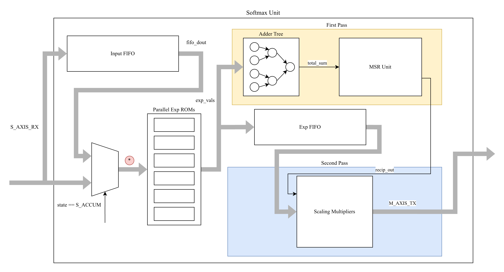
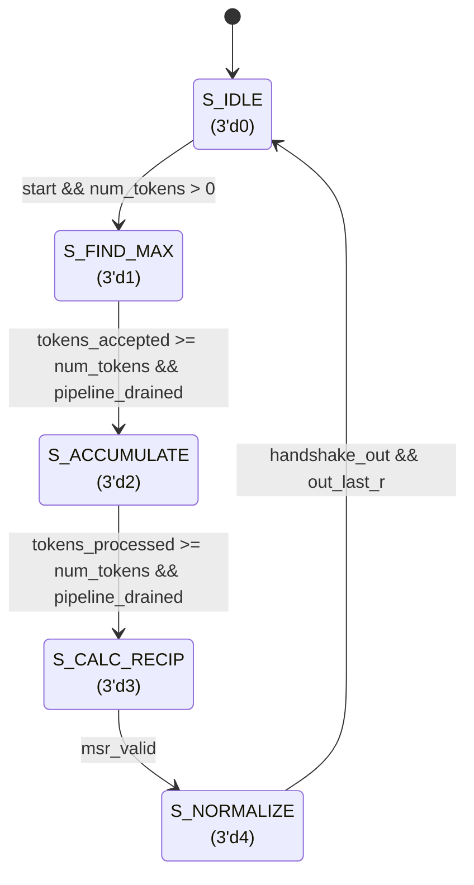

# Softmax Unit

| **Document Information** |                                     |
| ------------------------ | ----------------------------------- |
| **Module Name**          | `softmax_unit`                      |
| **Version**              | 1.2                                 |
| **Design Status**        | In development                      |
| **Last Updated**         | January 03 2026                     |
| **Source Location**      | `fpga/rtl/softmax/`                 |
| **Testbench**            | `fpga/tb/softmax/tb_softmax_unit.v` |
| **Author**               | Le Phuc Khang                       |

## Table of Contents

1. [Overview](#1-overview)
2. [Features Summary](#2-features-summary)
3. [Theory of Operation](#3-theory-of-operation)
4. [Module Architecture](#4-module-architecture)
5. [Parameters](#5-parameters)
6. [Interface Specification](#6-interface-specification)
7. [Data Formats](#7-data-formats)
8. [Finite State Machine](#8-finite-state-machine)
9. [Timing Diagrams](#9-timing-diagrams)
10. [Pipeline Architecture](#10-pipeline-architecture)
11. [Submodule Reference](#11-submodule-reference)
12. [Resource Utilization](#12-resource-utilization)
13. [Timing Analysis](#13-timing-analysis)
14. [Integration Guidelines](#14-integration-guidelines)
15. [Verification](#15-verification)
16. [Design Constraints](#16-design-constraints)
17. [Known Limitations](#17-known-limitations)

- [Appendix A: Quick Reference Card](#appendix-a-quick-reference-card)

## 1. Overview

### 1.1 Purpose

The `softmax_unit` module implements a **fully-pipelined softmax accelerator** using a three-pass algorithm with max-subtraction for numerical stability. It is a critical component of the TinyViT-5M hardware accelerator, designed to compute attention probabilities from query-key dot products in transformer self-attention layers.

### 1.2 Functional Description

The softmax function converts a vector of logits into a probability distribution. For each output element at position $i$, the operation computes:

$$
\text{softmax}(x_i) = \frac{e^{x_i - \max(x)}}{\sum_{j} e^{x_j - \max(x)}}
$$

Where:

- $x$ is the input vector of signed INT8 logits
- Max-subtraction ensures numerical stability by preventing exp overflow
- The output is a UINT8 probability (0-255, representing 0.0 to 1.0)

### 1.3 Design Philosophy

Hardware softmax is challenging due to:

- **Exponential computation**: Requires expensive math or LUT approximation
- **Division**: Normalization requires 1/sum computation
- **Dynamic range**: Attention logits can span wide ranges

This module addresses these challenges with:

- **LUT-based exp()**: 256-entry ROM for Q4.16 fixed-point exponentials
- **MSR reciprocal**: Multiply-Shift-Round approximation eliminates division hardware
- **Three-pass algorithm**: Enables max-subtraction without double buffering
- **8-lane parallelism**: Processes 8 tokens per cycle for high throughput

### 1.4 Where This Sits In TinyViT

In TinyViT window attention, softmax is applied over the **key dimension** for each query:

- Stage 1 & 3 window: `7×7 = 49` tokens (per head, per query row)
- Stage 2 window: `14×14 = 196` tokens (per head, per query row)

In hardware, `softmax_unit` is invoked **per query-row** of the attention-score matrix (e.g. for a `49×49` score tile, it runs 49 times). Because the datapath is `8 lanes/beat`, query rows are padded to a multiple of 8 tokens:

- 49 → 56 tokens (7 beats)
- 196 → 200 tokens (25 beats)

Padding tokens represent “masked” keys and should be driven with a low logit so their probability is ~0.

## 2. Features Summary

| Feature                  | Specification                             |
| ------------------------ | ----------------------------------------- |
| **Algorithm**            | Three-pass with max-subtraction           |
| **Input Precision**      | Signed INT8                               |
| **Output Precision**     | Unsigned UINT8 (0-255)                    |
| **Internal Precision**   | Q4.16 fixed-point (20-bit exp)            |
| **Parallel Lanes**       | 8 tokens per beat                         |
| **Max Sequence Length**  | 2048 tokens (configurable via FIFO_DEPTH) |
| **AXI-Stream Interface** | Input (logits), Output (probabilities)    |
| **Backpressure Support** | Full backpressure on output stream        |
| **Division-Free**        | MSR approximation for 1/sum               |
| **Target Frequency**     | 200 MHz (achieved: 170 MHz)               |

## 3. Theory of Operation

### 3.1 Three-Pass Algorithm

The module operates in three sequential phases:

```text
S_IDLE -> S_FIND_MAX -> S_ACCUMULATE -> S_CALC_RECIP -> S_NORMALIZE -> S_IDLE
```

| Pass       | State          | Description                                                  |
| ---------- | -------------- | ------------------------------------------------------------ |
| **Pass 0** | `S_FIND_MAX`   | Stream logits, find global max, buffer raw inputs in FIFO    |
| **Pass 1** | `S_ACCUMULATE` | Compute exp(x - max), sum all exp values, buffer exp in FIFO |
| **Pass 2** | `S_NORMALIZE`  | Compute 1/sum via MSR, multiply buffered exp values, output  |

This approach provides:

- **Numerical stability**: Max-subtraction ensures exp inputs are ≤ 0
- **No division hardware**: Multiply-shift-round (MSR) approximation for 1/sum
- **Efficient streaming**: 8 elements processed per cycle

### 3.2 Processing Flow

The softmax unit computes the softmax function over a sequence of tokens using a **three-pass algorithm** with max-subtraction for numerical stability:

$$
\text{softmax}(x_i) = \frac{e^{x_i - \max(x)}}{\sum_{j} e^{x_j - \max(x)}}
$$

### 3.3 Pass Details

**Pass 0 - Find Maximum (`S_FIND_MAX`)**:

1. Accept input logits via AXI-Stream (8 lanes per beat)
2. Compute per-beat maximum using pipelined reduction tree
3. Update global maximum across all beats
4. Write raw input data to `input_fifo` for reuse

**Pass 1 - Accumulate Exponentials (`S_ACCUMULATE`)**:

1. Read logits back from `input_fifo`
2. Compute `shifted = logit - global_max` (always ≤ 0)
3. Look up `exp(shifted)` in ROM (Q4.16 fixed-point)
4. Accumulate sum of all exp values using pipelined adder tree
5. Write exp values to `exp_fifo` for normalization

**Pass 2 - Normalize (`S_NORMALIZE`)**:

1. Compute reciprocal `1/global_sum` using MSR unit
2. Pop exp values from `exp_fifo`
3. Multiply: `result = exp × recip`
4. Shift and saturate to UINT8 (0-255)
5. Stream results via AXI-Stream output

### 3.4 Numerical Stability

The max-subtraction trick ensures all exp() inputs are ≤ 0:

```text
For any logit x_i:
    shifted_i = x_i - max(x) ≤ 0
    exp(shifted_i) ≤ 1.0
```

This prevents exponential overflow and keeps all intermediate values in a reasonable range.

## 4. Module Architecture

### 4.1 Block Diagram



### 4.2 Module Hierarchy

```text
softmax_unit (top-level)
│
├── input_fifo (softmax_fifo)     # Buffer raw logits during S_FIND_MAX
│   └── mem[256][64]               # 256 × 64-bit (LUTRAM/BRAM)
│
├── Max Reduction Tree (pipelined)
│   ├── Stage 1: 8→4 reduction     # 4× signed comparators
│   └── Stage 2: 4→1 reduction     # 3× signed comparators
│
├── exp_rom (×8 instances)         # Exponential lookup
│   └── rom[256][20]               # 256 × Q4.16 entries
│
├── Sum Adder Tree (pipelined)
│   ├── Stage 1: 8→4 pairwise add  # 4× 21-bit adders
│   └── Stage 2: 4→1 final sum     # 2× 22-bit adders
│
├── exp_fifo (softmax_fifo)        # Buffer exp values for normalization
│   └── mem[256][160]              # 256 × 160-bit (8 lanes × 20 bits)
│
├── msr_unit                       # Reciprocal approximation (pipelined)
│   ├── Priority encoder           # Find MSB position
│   └── recip_lut[64][16]          # 64 × Q1.15 entries
│
└── Normalization Datapath (3-stage pipeline)
    ├── Stage 0: FIFO read → exp_pop_r
    ├── Stage 1: Multiply (8× DSP48E1)
    └── Stage 2: Shift + Saturate → output
```

## 5. Parameters

### 5.1 Top-Level Parameters

| Parameter         | Default                   | Range   | Description                                      |
| ----------------- | ------------------------- | ------- | ------------------------------------------------ |
| `AXIS_DATA_WIDTH` | 64                        | 32–256  | AXI-Stream data width (8 lanes × 8 bits)         |
| `DATA_WIDTH`      | 8                         | 4–16    | Input/output element width (INT8/UINT8)          |
| `EXP_WIDTH`       | 20                        | 16–24   | Exponential LUT output width (Q4.16 fixed-point) |
| `SUM_WIDTH`       | 32                        | 24–48   | Accumulator width for exp sum                    |
| `RECIP_WIDTH`     | 16                        | 12–20   | Reciprocal approximation width (Q1.15)           |
| `FIFO_DEPTH`      | 256                       | 64–1024 | Maximum tokens (256 × 8 = 2048 elements)         |
| `EXP_INIT_FILE`   | `lut/exp_table_q4_16.hex` | -       | Exponential LUT initialization file              |
| `RECIP_INIT_FILE` | `lut/recip_lut.hex`       | -       | Reciprocal LUT initialization file               |

### 5.2 Derived Parameters (Computed Internally)

| Parameter       | Formula                    | Default Value | Description                    |
| --------------- | -------------------------- | ------------- | ------------------------------ |
| `LANES`         | AXIS_DATA_WIDTH/DATA_WIDTH | 8             | Parallel tokens per beat       |
| `FIFO_WIDTH`    | LANES × EXP_WIDTH          | 160           | Exp FIFO data width            |
| `COUNTER_WIDTH` | 12 (fixed)                 | 12            | Token counter width (max 4096) |
| `PAIR_WIDTH`    | EXP_WIDTH + 1              | 21            | Pairwise sum width             |

### 5.3 Constraints and Requirements

1. **Token Alignment**: `num_tokens` must be a multiple of `LANES` (8 by default)
2. **Token Limit**: `num_tokens` ≤ `FIFO_DEPTH × LANES` (2048 default)
3. **Counter Width**: Maximum 4096 tokens with 12-bit counters
4. **LUT Files**: Must be valid hex files accessible at synthesis time

## 6. Interface Specification

### 6.1 Port List

#### Clock and Reset

| Port    | Direction | Width | Description                            |
| ------- | --------- | ----- | -------------------------------------- |
| `clk`   | Input     | 1     | System clock (positive-edge triggered) |
| `rst_n` | Input     | 1     | Active-low asynchronous reset          |

#### Control Interface

| Port         | Direction | Width | Description                                                                     |
| ------------ | --------- | ----- | ------------------------------------------------------------------------------- |
| `start`      | Input     | 1     | Pulse in `S_IDLE` to begin a new softmax transaction (also clears FIFOs)        |
| `num_tokens` | Input     | 32    | Number of tokens in this softmax vector (must be multiple of 8 in current flow) |
| `done`       | Output    | 1     | Pulses when the final output beat is accepted                                   |

#### AXI4-Stream Input (`s_axis_*`)

| Port            | Direction | Width             | Description                                                                                                                         |
| --------------- | --------- | ----------------- | ----------------------------------------------------------------------------------------------------------------------------------- |
| `s_axis_tdata`  | Input     | `AXIS_DATA_WIDTH` | Packed INT8 logits, `LANES = AXIS_DATA_WIDTH/DATA_WIDTH` lanes (default 8). Lane `i` is `s_axis_tdata[i*DATA_WIDTH +: DATA_WIDTH]`. |
| `s_axis_tvalid` | Input     | 1                 | Input valid                                                                                                                         |
| `s_axis_tready` | Output    | 1                 | Input ready (asserted only in `S_FIND_MAX` while accepting beats)                                                                   |
| `s_axis_tlast`  | Input     | 1                 | Present for AXI compliance; not used for control (the design uses `num_tokens`)                                                     |

#### AXI4-Stream Output (`m_axis_*`)

| Port            | Direction | Width             | Description                                                                                                                                          |
| --------------- | --------- | ----------------- | ---------------------------------------------------------------------------------------------------------------------------------------------------- |
| `m_axis_tdata`  | Output    | `AXIS_DATA_WIDTH` | Packed UINT8 probabilities (0..255), `LANES = AXIS_DATA_WIDTH/DATA_WIDTH` lanes (default 8). Lane `i` is `m_axis_tdata[i*DATA_WIDTH +: DATA_WIDTH]`. |
| `m_axis_tvalid` | Output    | 1                 | Output valid                                                                                                                                         |
| `m_axis_tready` | Input     | 1                 | Output ready (backpressure supported)                                                                                                                |
| `m_axis_tlast`  | Output    | 1                 | Asserted on the final output beat for this transaction                                                                                               |

### 6.2 AXI-Stream Compliance

All AXI-Stream interfaces comply with ARM AMBA 4 AXI-Stream Protocol Specification:

- **Handshake Protocol**: Data transfer occurs when both `TVALID` and `TREADY` are asserted on the rising edge of `clk`
- **TVALID Assertion Rules**: Once asserted, `TVALID` remains high until the transfer completes
- **TREADY Behavior**: Input TREADY is only asserted during `S_FIND_MAX` state
- **TLAST Semantics**: Output TLAST is asserted on the final beat of each transaction

### 6.3 Transaction Protocol

1. Assert `start` for one cycle when in `S_IDLE` state
2. `num_tokens` must be valid and stable when `start` is asserted
3. Stream input data via `s_axis_*` during `S_FIND_MAX` (total beats = `num_tokens / LANES`)
4. Wait for output data via `m_axis_*` during `S_NORMALIZE`
5. `done` pulses when the last output beat is accepted

## 7. Data Formats

### 7.1 Input Data Format

Input logits are packed as signed INT8 values:

```text
Beat layout (64 bits, 8 lanes):
  [63:56] = logit[7]  (signed INT8, range: -128 to +127)
  [55:48] = logit[6]
  ...
  [15: 8] = logit[1]
  [ 7: 0] = logit[0]

Total Input Beats = num_tokens / 8
```

### 7.2 Output Data Format

Output probabilities are packed as unsigned UINT8 values:

```text
Beat layout (64 bits, 8 lanes):
  [63:56] = prob[7]  (unsigned UINT8, range: 0 to 255)
  [55:48] = prob[6]
  ...
  [15: 8] = prob[1]
  [ 7: 0] = prob[0]

TLAST is asserted on the final output beat.
Output value 255 represents probability ≈ 1.0, value 0 represents ≈ 0.0
```

### 7.3 Fixed-Point Number Formats

| Value       | Format               | Bits | Range                  |
| ----------- | -------------------- | ---- | ---------------------- |
| Input logit | INT8                 | 8    | -128 to +127           |
| exp(logit)  | Q4.16 (unsigned)     | 20   | 0.0 to ~15.99          |
| global_sum  | Q?.16 (sum of Q4.16) | 32   | Depends on token count |
| Reciprocal  | Q1.15                | 16   | 0.0 to ~1.99           |
| Product     | Q5.31                | 36   | exp × recip            |
| Output      | UINT8                | 8    | 0 to 255 (0.0 to 1.0)  |

For TinyViT attention rows, `exp(x-max) ≤ 1`, so `Σ exp ≤ num_tokens`. With `num_tokens ≤ 2048`, `global_sum` fits comfortably in 32 bits.

## 8. Finite State Machine

### 8.1 State Diagram



### 8.2 State Descriptions

| State          | Encoding | Duration       | Entry Condition               | Exit Condition                             | Actions                                                |
| -------------- | -------- | -------------- | ----------------------------- | ------------------------------------------ | ------------------------------------------------------ |
| `S_IDLE`       | 3'd0     | -              | Reset or S_NORMALIZE complete | `start` with valid num_tokens              | Clear FIFOs, reset counters, init tokens_remaining     |
| `S_FIND_MAX`   | 3'd1     | N/8 + 1 cycles | `start` accepted              | All tokens accepted, max pipeline drained  | Accept inputs, compute max, buffer to input_fifo       |
| `S_ACCUMULATE` | 3'd2     | N/8 + 3 cycles | Max finding complete          | All tokens processed, sum pipeline drained | Compute exp(x-max), accumulate sum, buffer to exp_fifo |
| `S_CALC_RECIP` | 3'd3     | 2 cycles       | Accumulation complete         | `msr_valid` asserted                       | Trigger MSR, capture reciprocal and shift              |
| `S_NORMALIZE`  | 3'd4     | N/8 + 3 cycles | MSR result ready              | Final output beat accepted                 | Pop exp_fifo, multiply, shift, output                  |

### 8.3 Transaction Rules

- `start` is sampled in `S_IDLE`; a `start` pulse clears internal FIFOs and begins a new softmax transaction
- `num_tokens` defines the vector length; the current RTL assumes **beat-aligned** token counts (multiple of 8). In the accelerator flow, attention rows are padded accordingly (49→56, 196→200)
- `s_axis_tlast` is not used for control; completion is determined from `num_tokens`
- `done` asserts when the **final output beat** is accepted (`m_axis_tvalid && m_axis_tready && m_axis_tlast`)

### 8.4 Per-State Behavior (Detailed)

- `S_IDLE`: Clears counters/flags; waits for `start`. Initializes `tokens_remaining` down-counter.
- `S_FIND_MAX`: Accepts `LANES` logits per beat, updates `global_max` via pipelined max-reduction tree, and writes each beat into `input_fifo`. Waits for pipeline to drain before transitioning.
- `S_ACCUMULATE`: Reads beats back from `input_fifo`, computes `exp(x - global_max)` via `exp_rom`, accumulates `global_sum` via pipelined adder tree, and writes the per-lane exp values into `exp_fifo`. Waits for pipeline to drain.
- `S_CALC_RECIP`: Triggers `msr_unit` to compute `msr_mult_r` and `msr_shift_r` from `global_sum`. Waits 2 cycles for pipelined MSR result.
- `S_NORMALIZE`: Pops `exp_fifo` only when the output register is free (backpressure-safe), computes `(exp * msr_mult_r) >> msr_shift_r >> 7`, saturates to `8'hFF`, and streams results to `m_axis_*` with `m_axis_tlast` on the final beat.

## 9. Timing Diagrams

### 9.1 Complete Transaction

```text
         ┌───┐   ┌───┐   ┌───┐   ┌───┐   ┌───┐   ┌───┐   ┌───┐
clk      ┘   └───┘   └───┘   └───┘   └───┘   └───┘   └───┘   └───

              ┌───┐
start    ─────┘   └───────────────────────────────────────────────

state    ──IDLE───┼─────── S_FIND_MAX ─────────┼─── S_ACCUMULATE...

                  ┌───────────────────────────┐
s_tvalid ─────────┘                           └───────────────────
                  ┌───────────────────────────┐
s_tready ─────────┘                           └───────────────────
                  ┌───────┬───────┬───────────┐
s_tdata  ─────────┤ Beat0 │ Beat1 │ ... │BeatN├───────────────────
                  └───────┴───────┴───────────┘
```

### 9.2 Output Streaming (S_NORMALIZE)

```text
         ┌───┐   ┌───┐   ┌───┐   ┌───┐   ┌───┐   ┌───┐   ┌───┐
clk      ┘   └───┘   └───┘   └───┘   └───┘   └───┘   └───┘   └───

state    ─────────────────── S_NORMALIZE ─────────────────────────

                      ┌───────────────────────────────────────────┐
m_tvalid ─────────────┘                                           └─
                      ┌───────┬───────┬───────┬───────────────────┐
m_tdata  ─────────────┤ Out0  │ Out1  │ ...   │ OutN (last)       ├─
                      └───────┴───────┴───────┴───────────────────┘
                                                      ┌───────────┐
m_tlast  ─────────────────────────────────────────────┘           └─

m_tready ─────────────────────────────────────────────────────────

                                                              ┌───┐
done     ─────────────────────────────────────────────────────┘   └─
```

## 10. Pipeline Architecture

### 10.1 End-to-End Pipeline Stages

| Phase            | Stage | Name                  | Latency | Description                            |
| ---------------- | ----- | --------------------- | ------- | -------------------------------------- |
| **S_FIND_MAX**   | 1     | Max Tree Stage 1      | 1 cycle | 8→4 reduction (registered)             |
|                  | 2     | Max Tree Stage 2      | 1 cycle | 4→1 reduction + global_max update      |
| **S_ACCUMULATE** | 1     | FIFO Read + Register  | 1 cycle | Capture input_fifo output              |
|                  | 2     | Exp ROM Lookup        | 1 cycle | Synchronous BRAM read                  |
|                  | 3     | Adder Stage 1         | 1 cycle | 8→4 pairwise addition (registered)     |
|                  | 4     | Adder Stage 2         | 1 cycle | 4→1 final sum (registered)             |
|                  | 5     | Global Sum Accumulate | 1 cycle | Add to global_sum                      |
| **S_CALC_RECIP** | 1     | MSR Stage 1           | 1 cycle | Priority encoder + shift calc          |
|                  | 2     | MSR Stage 2           | 1 cycle | LUT lookup                             |
| **S_NORMALIZE**  | 1     | FIFO Pop + Register   | 1 cycle | Capture exp_fifo output (DSP retiming) |
|                  | 2     | Multiply              | 1 cycle | exp × recip (DSP48E1)                  |
|                  | 3     | Shift + Saturate      | 1 cycle | Scale to UINT8                         |

### 10.2 Latency Summary

| Phase                       | Latency (cycles) | Notes                            |
| --------------------------- | ---------------- | -------------------------------- |
| Input to exp_out            | 2                | FIFO read + ROM latency          |
| FIFO read to exp_out valid  | 2                | input_fifo capture + ROM latency |
| CALC_RECIP                  | 2                | MSR 2-stage pipeline             |
| FIFO pop to output          | 3                | Register + Multiply + shift/sat  |
| **Total Pass 0 (Find Max)** | N/8 + 2          | N = number of tokens             |
| **Total Pass 1 (Accum)**    | N/8 + 4          | Extra cycles for pipelined adder |
| **Total Pass 2 (Norm)**     | N/8 + 3          | 3-stage normalization pipeline   |

**Example:** For 200 tokens (Stage 2 window):

- Pass 0: 25 + 2 = 27 cycles
- Pass 1: 25 + 4 = 29 cycles
- Pass 2: 25 + 3 = 28 cycles + 2 (MSR)
- Total: ~86 cycles

### 10.3 Pipelined Max-Finding Tree

The 8-lane max reduction is split into a 2-stage pipeline:

```text
Stage 1 (combinational, then registered):
    max_01 = max(lane[0], lane[1])
    max_23 = max(lane[2], lane[3])
    max_45 = max(lane[4], lane[5])
    max_67 = max(lane[6], lane[7])
    → register: max_01_r, max_23_r, max_45_r, max_67_r

Stage 2 (combinational):
    max_0123 = max(max_01_r, max_23_r)
    max_4567 = max(max_45_r, max_67_r)
    beat_max = max(max_0123, max_4567)
    → compare with global_max
```

### 10.4 Pipelined Adder Tree

The 8-lane exp sum is split into a 2-stage pipeline:

```text
Stage 1 (combinational, then registered):
    pair_01 = exp_out[0] + exp_out[1]  (21 bits)
    pair_23 = exp_out[2] + exp_out[3]
    pair_45 = exp_out[4] + exp_out[5]
    pair_67 = exp_out[6] + exp_out[7]
    → register: pair_01_r, pair_23_r, pair_45_r, pair_67_r

Stage 2 (combinational, then registered):
    quad_0123 = pair_01_r + pair_23_r  (22 bits)
    quad_4567 = pair_45_r + pair_67_r
    exp_sum = quad_0123 + quad_4567    (32 bits)
    → register: exp_sum_r
    → add to global_sum
```

### 10.5 Normalization Datapath (3-Stage Pipeline)

```text
Stage 0: FIFO read → exp_pop_r (breaks FIFO→DSP critical path)
Stage 1: exp_pop_r × msr_mult_r → prod_reg (DSP48E1, 36 bits)
Stage 2: (prod_reg >> msr_shift_r >> 7) → saturate → out_data_r
```

Each stage uses handshake-based flow control for backpressure support.

## 11. Submodule Reference

### 11.1 Exponential ROM (`exp_rom.v`)

**Purpose**: Converts signed INT8 logits to fixed-point exponential values via lookup table.

**Location**: `fpga/rtl/softmax/exp_rom.v`

#### Parameters

| Parameter    | Default                   | Description                     |
| ------------ | ------------------------- | ------------------------------- |
| `ADDR_WIDTH` | 8                         | Address width (256 entries)     |
| `DATA_WIDTH` | 20                        | Output width (Q4.16 format)     |
| `INIT_FILE`  | `lut/exp_table_q4_16.hex` | Hex file for ROM initialization |

#### Interface

| Port   | Direction | Width      | Description                           |
| ------ | --------- | ---------- | ------------------------------------- |
| `clk`  | Input     | 1          | Clock                                 |
| `addr` | Input     | 8 (signed) | Lookup address (max-subtracted logit) |
| `dout` | Output    | 20         | Q4.16 fixed-point exp value           |

#### Architecture

- **Storage**: 256-entry ROM (inferred as BRAM)
- **Latency**: 1 cycle (synchronous read)
- **Format**: Q4.16 (4 integer bits + 16 fractional bits)

**Fixed-Point Format:**

```text
Q4.16: 4 integer bits + 16 fractional bits
Range: 0.0 to 15.9999...
For max-subtracted inputs (always ≤ 0): exp outputs in [0, 1]
```

### 11.2 Multiply-Shift-Round Unit (`msr_unit.v`)

**Purpose**: Computes an approximation of `1/global_sum` without division hardware using a 2-stage pipeline.

**Location**: `fpga/rtl/softmax/msr_unit.v`

#### Parameters

| Parameter     | Default             | Description                     |
| ------------- | ------------------- | ------------------------------- |
| `SUM_WIDTH`   | 32                  | Input sum width                 |
| `RECIP_WIDTH` | 16                  | Output reciprocal width (Q1.15) |
| `LUT_ADDR_W`  | 6                   | LUT address width (64 entries)  |
| `INIT_FILE`   | `lut/recip_lut.hex` | Hex file for LUT initialization |

#### Interface

| Port          | Direction | Width | Description                         |
| ------------- | --------- | ----- | ----------------------------------- |
| `clk`         | Input     | 1     | Clock                               |
| `rst_n`       | Input     | 1     | Active-low reset                    |
| `start`       | Input     | 1     | Pulse to begin computation          |
| `sum_in`      | Input     | 32    | Input sum value                     |
| `valid`       | Output    | 1     | Output valid (2 cycles after start) |
| `recip_out`   | Output    | 16    | Q1.15 reciprocal multiplier         |
| `shift_alpha` | Output    | 5     | Shift amount for post-multiply      |

#### Algorithm

1. **Stage 1**: Priority encoder finds MSB position of sum_in
2. **Stage 1**: Compute shift amount to normalize to 6-bit mantissa
3. **Stage 2**: Use normalized mantissa as LUT index
4. **Stage 2**: Output reciprocal and shift amount

```text
leading_one_pos = find_msb(sum_in)
shift = (leading_one_pos > 5) ? (leading_one_pos - 5) : 0
lut_index = sum_in >> shift
recip_out = recip_lut[lut_index]
shift_alpha = shift
```

### 11.3 Softmax FIFO (`softmax_fifo.v`)

**Purpose**: Simple synchronous FIFO for buffering intermediate values.

**Location**: `fpga/rtl/softmax/softmax_fifo.v`

#### Parameters

| Parameter | Value        | Description                 |
| --------- | ------------ | --------------------------- |
| `WIDTH`   | Configurable | Data width (64 or 160 bits) |
| `DEPTH`   | 256 entries  | Supports up to 2048 tokens  |

#### Interface

| Port    | Direction | Width | Description               |
| ------- | --------- | ----- | ------------------------- |
| `clk`   | Input     | 1     | Clock                     |
| `rst_n` | Input     | 1     | Active-low reset          |
| `clr`   | Input     | 1     | Synchronous clear         |
| `wr_en` | Input     | 1     | Write enable              |
| `din`   | Input     | WIDTH | Write data                |
| `rd_en` | Input     | 1     | Read enable               |
| `dout`  | Output    | WIDTH | Read data (combinational) |
| `full`  | Output    | 1     | FIFO full flag            |
| `empty` | Output    | 1     | FIFO empty flag           |

#### Architecture

- **Storage**: Inferred as LUTRAM or BRAM (auto style)
- **Read Output**: Combinational (read-through)
- **Write Latency**: 1 cycle
- **Clear**: Resets pointers on `clr` assertion

## 12. Resource Utilization

### 12.1 Estimated Utilization

**Target Device**: Xilinx Zynq-7020 (xc7z020clg400-1)

| Resource            | Estimated Usage | Notes                                     |
| ------------------- | --------------- | ----------------------------------------- |
| **Slice LUTs**      | ~800-1200       | FSM, datapath, control, adder trees       |
| **Slice Registers** | ~600-800        | Pipeline registers, counters              |
| **Block RAM**       | 2-4             | exp_rom (8×) + input_fifo + exp_fifo      |
| **DSP Slices**      | 8               | Multipliers in normalization (1 per lane) |

### 12.2 Resource Breakdown by Component

| Component              | LUTs (est.) | Registers (est.) | BRAM | DSP | Notes                       |
| ---------------------- | ----------- | ---------------- | ---- | --- | --------------------------- |
| exp_rom (×8 instances) | ~50         | ~20              | 1-2  | 0   | Shared or replicated ROM    |
| input_fifo             | ~100        | ~30              | 0-1  | 0   | 256×64-bit (LUTRAM or BRAM) |
| exp_fifo               | ~150        | ~30              | 1    | 0   | 256×160-bit (BRAM)          |
| msr_unit               | ~100        | ~50              | 0    | 0   | Priority encoder + LUT      |
| Max reduction tree     | ~80         | ~40              | 0    | 0   | 2-stage pipelined           |
| Sum adder tree         | ~120        | ~100             | 0    | 0   | 2-stage pipelined           |
| Normalization datapath | ~200        | ~400             | 0    | 8   | 3-stage pipeline + DSP48E1  |
| FSM + Control          | ~150        | ~100             | 0    | 0   | State machine, counters     |

### 12.3 DSP48E1 Utilization

Each normalization lane uses one DSP48E1 for the 20×16 → 36-bit multiply:

```text
8 lanes × 1 DSP48E1 = 8 DSP slices
```

The multiplication `exp_pop_r[k] * msr_mult_r` is mapped to dedicated DSP slices.

## 13. Timing Analysis

### 13.1 Timing Summary

| Metric                         | Value               |
| ------------------------------ | ------------------- |
| **Target Clock Period**        | 5.000 ns (200 MHz)  |
| **WNS (Worst Negative Slack)** | -0.877 ns           |
| **Achieved Clock Period**      | 5.877 ns            |
| **Estimated Fmax**             | 170.15 MHz          |
| **Timing Status**              | VIOLATED (marginal) |

### 13.2 Timing Optimization History

The softmax unit underwent extensive timing optimization to improve Fmax:

### 13.3 Timing Analysis Methodology

The softmax unit uses **Out-of-Context (OOC)** synthesis for timing analysis, consistent with the GEMM core methodology. This enables accurate internal timing characterization without I/O routing constraints.

**Key Files:**

| File                             | Purpose                                |
| -------------------------------- | -------------------------------------- |
| `constraints/softmax_unit.xdc`   | OOC timing constraints (200MHz target) |
| `scripts/run_timing_softmax.tcl` | Vivado batch timing script             |

**Running Timing Analysis:**

```bash
cd fpga
vivado -mode batch -source scripts/run_timing_softmax.tcl
# Results written to build/softmax_post_route_fmax.txt
```

**Fmax Calculation:**

```text
Effective Period = Clock Period - WNS (Worst Negative Slack)
Fmax = 1000 / Effective Period  (in MHz)
```

### 13.4 Optimization Summary

| Optimization                | Fmax           | WNS           | Change           |
| --------------------------- | -------------- | ------------- | ---------------- |
| Baseline (pre-optimization) | 126.61 MHz     | -2.898 ns     | -                |
| + Pipelined Max Tree        | 140.02 MHz     | -2.142 ns     | +13.4 MHz        |
| + Pipelined MSR Unit        | ~140 MHz       | ~-2.1 ns      | (fixed MSR path) |
| + DSP Input Retiming        | 156.37 MHz     | -1.395 ns     | +16.4 MHz        |
| + Control Path              | 158.91 MHz     | -1.293 ns     | +2.5 MHz         |
| + Pipelined Accumulator     | 163.13 MHz     | -1.130 ns     | +4.2 MHz         |
| **+ Pipelined Adder Tree**  | **170.15 MHz** | **-0.877 ns** | **+7.0 MHz**     |

**Total Improvement:** 126.61 → 170.15 MHz (+43.5 MHz, +34.4%)

**Total Latency Impact:** +6-7 cycles across all optimizations

### 13.5 Optimization Details

#### Optimization 1: Pipelined Max-Finding Tree

**Problem:** The original 8-way max reduction tree created a long combinational path from input to `beat_max_r` register with 10 logic levels (4 CARRY4 + 6 LUTs), resulting in a data path delay of ~7.8ns.

**Original Critical Path:**

```text
s_axis_tdata → lane unpack → max_01/23/45/67 → max_0123/4567 → beat_max → beat_max_r
                              (8→4 compare)     (4→2 compare)  (2→1 compare)
```

**Solution:** Split the tree into a 2-stage pipeline with intermediate registers after the 8→4 reduction.

**Pipelined Implementation:**

```verilog
// Stage 1: 8 → 4 reduction (combinational)
wire signed [DATA_WIDTH-1:0] max_01 = (lane_in[0] > lane_in[1]) ? lane_in[0] : lane_in[1];
wire signed [DATA_WIDTH-1:0] max_23 = (lane_in[2] > lane_in[3]) ? lane_in[2] : lane_in[3];
wire signed [DATA_WIDTH-1:0] max_45 = (lane_in[4] > lane_in[5]) ? lane_in[4] : lane_in[5];
wire signed [DATA_WIDTH-1:0] max_67 = (lane_in[6] > lane_in[7]) ? lane_in[6] : lane_in[7];

// Pipeline registers for Stage 1 results
reg signed [DATA_WIDTH-1:0] max_01_r, max_23_r, max_45_r, max_67_r;
reg max_stage1_valid;

always @(posedge clk or negedge rst_n) begin
    if (!rst_n) begin
        max_01_r <= 0; max_23_r <= 0; max_45_r <= 0; max_67_r <= 0;
        max_stage1_valid <= 1'b0;
    end else if (accept_axi_input) begin
        max_01_r <= max_01; max_23_r <= max_23;
        max_45_r <= max_45; max_67_r <= max_67;
        max_stage1_valid <= 1'b1;
    end else begin
        max_stage1_valid <= 1'b0;
    end
end

// Stage 2: 4 → 1 reduction (from registered values)
wire signed [DATA_WIDTH-1:0] max_0123 = (max_01_r > max_23_r) ? max_01_r : max_23_r;
wire signed [DATA_WIDTH-1:0] max_4567 = (max_45_r > max_67_r) ? max_45_r : max_67_r;
wire signed [DATA_WIDTH-1:0] beat_max = (max_0123 > max_4567) ? max_0123 : max_4567;
```

**State Machine Update:**

The S_FIND_MAX→S_ACCUMULATE transition now waits for the pipeline to drain:

```verilog
S_FIND_MAX: begin
    // Wait for pipeline to drain before transitioning
    if (tokens_accepted >= num_tokens && !max_stage1_valid && !beat_max_valid)
        next_state = S_ACCUMULATE;
end
```

**Results:**

| Metric  | Before     | After         | Improvement |
| ------- | ---------- | ------------- | ----------- |
| WNS     | -2.898 ns  | -2.142 ns     | +0.756 ns   |
| Fmax    | 126.61 MHz | 140.02 MHz    | +13.4 MHz   |
| Latency | N/8 cycles | N/8 + 1 cycle | +1 cycle    |

**Trade-off:** The optimization adds 1 extra cycle to the S_FIND_MAX phase.

### Optimization 2: Pipelined MSR Unit

**Problem:** The MSR (Multiply-Shift-Round) unit computes `1/global_sum` using a fully combinational priority encoder, creating an 8-level LUT chain from `global_sum` to `msr_mult_r`.

**Original Critical Path:**

```
global_sum_reg → priority encoder (32-bit scan) → shift calculation → LUT lookup → msr_mult_r_reg
```

**Solution:** Split `msr_unit.v` into a 2-stage pipeline:

| Cycle       | Operation                                       |
| ----------- | ----------------------------------------------- |
| **Stage 1** | Priority encoder + shift calculation → register |
| **Stage 2** | LUT lookup → output valid                       |

**Pipelined Implementation:**

```verilog
// Stage 1: Priority Encoder (combinational)
always @(*) begin : find_msb
    leading_one_pos = 0;
    for (idx = SUM_WIDTH - 1; idx >= 0; idx = idx - 1) begin
        if (sum_in[idx]) begin leading_one_pos = idx[5:0]; disable find_msb; end
    end
end

// Pipeline Registers (Stage 1 → Stage 2)
always @(posedge clk or negedge rst_n) begin
    if (!rst_n) begin
        stage1_valid <= 1'b0;
    end else begin
        stage1_valid <= start;
        if (start) begin
            sum_in_r     <= sum_in;
            calc_shift_r <= calc_shift;
        end
    end
end

// Stage 2: LUT Lookup (from registered values)
always @(posedge clk or negedge rst_n) begin
    if (!rst_n) begin
        valid <= 1'b0;
    end else begin
        valid <= stage1_valid;
        if (stage1_valid) begin
            recip_out   <= recip_lut[lut_index];
            shift_alpha <= calc_shift_r;
        end
    end
end
```

**State Machine Update:**

S_CALC_RECIP now waits for MSR valid signal:

```verilog
S_CALC_RECIP: begin
    if (msr_valid) next_state = S_NORMALIZE;
end
```

### Optimization 3: DSP Input Retiming

**Problem:** The ExpFIFO → DSP48 path has distributed RAM with combinational read output feeding directly into DSP48 A-port, which has ~3.7ns setup time.

**Original Critical Path:**

```
u_exp_fifo/rptr_reg → RAMD64E → LUT6 mux → DSP48E1/A[]
Data path: 3.8ns (only 1.3ns allowed for FIFO+routing)
```

**Solution:** Add explicit pipeline registers (`exp_pop_r`) between FIFO output and DSP multiply, creating a 3-stage normalization pipeline.

**3-Stage Normalization Pipeline:**

```
Stage 0: FIFO read → exp_pop_r (register to break critical path)
Stage 1: exp_pop_r × msr_mult_r → prod_reg
Stage 2: shift/saturate → out_data_r
```

**Implementation:**

```verilog
// Stage 0 registers: capture FIFO output to break FIFO→DSP critical path
reg [EXP_WIDTH-1:0] exp_pop_r[0:LANES-1];
reg                 exp_pop_valid;

S_NORMALIZE: begin
    // Stage 0: FIFO → exp_pop_r
    if (can_pop_fifo) begin
        for (k = 0; k < LANES; k = k + 1) exp_pop_r[k] <= exp_pop[k];
        exp_pop_valid <= 1'b1;
    end else if (exp_pop_valid && !prod_valid) begin
        exp_pop_valid <= 1'b0;
    end

    // Stage 1: exp_pop_r × msr_mult_r → prod_reg
    if (exp_pop_valid && !prod_valid) begin
        for (k = 0; k < LANES; k = k + 1) prod_reg[k] <= exp_pop_r[k] * msr_mult_r;
        prod_valid <= 1'b1;
    end

    // Stage 2: prod_reg → shift/saturate → out_data_r
    if (prod_valid && out_ready_for_new) begin
        out_data_r <= shift_data;
        // ...
    end
end
```

**Results:**

| Metric  | Before     | After      | Improvement |
| ------- | ---------- | ---------- | ----------- |
| WNS     | -2.583 ns  | -1.395 ns  | +1.188 ns   |
| Fmax    | 131.87 MHz | 156.37 MHz | +24.5 MHz   |
| Latency | N/8 + 2    | N/8 + 3    | +1 cycle    |

### Optimization 4: Control Path

**Problem:** The `tokens_sent -> 32-bit adder -> compare -> out_last_r` path had 12 logic levels.

**Solution:** Applied three optimizations:

1. **Reduced counter width**: Changed from 32-bit to 12-bit counters (supports up to 4096 tokens)
2. **Down-counter**: Replaced `tokens_sent` with `tokens_remaining` that counts down
3. **Simple compare**: `is_last_beat = (tokens_remaining <= LANES)` instead of `tokens_sent + LANES >= num_tokens`

```verilog
// Before: 32-bit up-counter with complex compare
wire last_for_output = (tokens_sent + LANES >= num_tokens);

// After: 12-bit down-counter with simple compare
localparam COUNTER_WIDTH = 12;
reg [COUNTER_WIDTH-1:0] tokens_remaining;  // Counts DOWN
wire is_last_beat = (tokens_remaining <= LANES);
```

**Results:** 156.37 -> 158.91 MHz (+2.5 MHz)

### Optimization 5: Pipelined Accumulator

**Problem:** The `global_sum` accumulation combined 8-lane exp_sum addition + 32-bit accumulator add in one cycle (12 logic levels).

**Solution:** Register `exp_sum` before adding to `global_sum`, creating a 2-stage accumulation pipeline.

```verilog
// Pipeline register for exp_sum
reg [SUM_WIDTH-1:0] exp_sum_r;
reg                 exp_sum_valid;

S_ACCUMULATE: begin
    // Stage 1: Register 8-lane sum
    if (exp_out_valid_d2) begin
        exp_sum_r     <= exp_sum;
        exp_sum_valid <= 1'b1;
    end else begin
        exp_sum_valid <= 1'b0;
    end

    // Stage 2: Add to global_sum (pipelined)
    if (exp_sum_valid) begin
        global_sum <= global_sum + exp_sum_r;
    end
end
```

**Results:** 158.91 -> 163.13 MHz (+4.2 MHz)

### Optimization 6: Pipelined Adder Tree

**Problem:** The 8-lane exp_sum adder tree was still the critical path (10 logic levels, 7 CARRY4 + 3 LUTs).

**Solution:** Split the 8-way combinational sum into a 2-stage pipelined tree:

```
Stage 1: 8 -> 4 pairwise additions (registered)
         pair_01 = exp_out[0] + exp_out[1]
         pair_23 = exp_out[2] + exp_out[3]
         pair_45 = exp_out[4] + exp_out[5]
         pair_67 = exp_out[6] + exp_out[7]

Stage 2: 4 -> 1 final sum (combinational, then registered)
         quad_0123 = pair_01_r + pair_23_r
         quad_4567 = pair_45_r + pair_67_r
         exp_sum = quad_0123 + quad_4567
```

**Implementation:**

```verilog
// Stage 1: Pairwise sums (combinational)
wire [PAIR_WIDTH-1:0] pair_01 = {1'b0, exp_out[0]} + {1'b0, exp_out[1]};
wire [PAIR_WIDTH-1:0] pair_23 = {1'b0, exp_out[2]} + {1'b0, exp_out[3]};
// ... (similar for pair_45, pair_67)

// Stage 1 registers
reg [PAIR_WIDTH-1:0] pair_01_r, pair_23_r, pair_45_r, pair_67_r;
reg sum_stage1_valid;

// Stage 2: Final sum from registered pairs
wire [SUM_WIDTH-1:0] exp_sum = quad_0123 + quad_4567;
```

**S_ACCUMULATE now has 3 stages:**

1. Capture pairwise sums (8→4)
2. Capture final exp_sum (4→1)
3. Add to global_sum

**Results:** 163.13 -> 170.15 MHz (+7 MHz)

### 13.6 Overall Optimization Summary

| Optimization                | Fmax           | WNS           | Change           |
| --------------------------- | -------------- | ------------- | ---------------- |
| Baseline (pre-optimization) | 126.61 MHz     | -2.898 ns     | -                |
| + Pipelined Max Tree        | 140.02 MHz     | -2.142 ns     | +13.4 MHz        |
| + Pipelined MSR Unit        | ~140 MHz       | ~-2.1 ns      | (fixed MSR path) |
| + DSP Input Retiming        | 156.37 MHz     | -1.395 ns     | +16.4 MHz        |
| + Control Path              | 158.91 MHz     | -1.293 ns     | +2.5 MHz         |
| + Pipelined Accumulator     | 163.13 MHz     | -1.130 ns     | +4.2 MHz         |
| **+ Pipelined Adder Tree**  | **170.15 MHz** | **-0.877 ns** | **+7.0 MHz**     |

**Total Improvement:** 126.61 → 170.15 MHz (+43.5 MHz, +34.4%)

**Total Latency Impact:** +6-7 cycles across all optimizations

### 13.7 Remaining Critical Path

After all optimizations, the critical path is the **I/O path** (OOC constraint artifact):

```
tokens_accepted_reg -> s_axis_tready (output port)
```

- 6 logic levels (4 CARRY4 + 2 LUTs)
- This is a virtual constraint from OOC synthesis, not a real internal bottleneck

**Potential future optimizations to reach 200 MHz:**

- Register s_axis_tready output
- Adjust OOC I/O constraints
- Use faster speed grade (-2 or -3 instead of -1)

## 14. Integration Guidelines

### 14.1 LUT File Generation

The `lut/lut_generator.py` script generates the lookup tables:

```bash
cd fpga/rtl/softmax/lut
python lut_generator.py
```

This produces:

- `exp_table_q4_16.hex` - 256-entry exp(x) table
- `recip_lut.hex` - 64-entry 1/x approximation table

### 14.2 Instantiation Template

```verilog
softmax_unit #(
    .DATA_WIDTH     (8),                // INT8 inputs
    .OUT_WIDTH      (8),                // UINT8 probabilities
    .LANES          (8),                // 8 parallel lanes
    .EXP_LUT_FILE   ("exp_table_q4_16.hex"),
    .RECIP_LUT_FILE ("recip_lut.hex")
) u_softmax (
    .clk            (clk),
    .rst_n          (rst_n),

    // Control
    .start          (softmax_start),
    .num_tokens     (sequence_length),
    .done           (softmax_done),

    // Input AXI-Stream (64-bit: 8×INT8)
    .s_axis_tdata   (logits_tdata),
    .s_axis_tvalid  (logits_tvalid),
    .s_axis_tready  (logits_tready),
    .s_axis_tlast   (logits_tlast),

    // Output AXI-Stream (64-bit: 8×UINT8)
    .m_axis_tdata   (probs_tdata),
    .m_axis_tvalid  (probs_tvalid),
    .m_axis_tready  (probs_tready),
    .m_axis_tlast   (probs_tlast)
);
```

### 14.3 Connection Guidelines

1. **Clock Domain**: All interfaces must be in the same clock domain
2. **Reset**: Assert `rst_n` low for at least 2 cycles before operation
3. **Start Pulse**: Assert `start` for exactly 1 cycle when data is ready
4. **num_tokens**: Must be stable before `start` and remain stable until `done`
5. **Backpressure**: The module supports AXI-Stream backpressure on output

## 15. Verification

### 15.1 Test Structure

The softmax unit is verified using a comprehensive Verilog testbench located at `fpga/tb/softmax/tb_softmax_unit.v`.

### Test Structure

```
fpga/
├── tb/softmax/
│   └── tb_softmax_unit.v          # Main testbench
└── sim/
    └── Makefile                    # Simulation runner (QuestaSim)
```

### 15.2 Running Tests

```bash
make -C fpga/sim clean build run TB_NAME=tb_softmax_unit
```

### 15.3 Test Cases

The testbench exercises both:

- **Single-beat correctness** (8-token vectors) with hand-computable distributions.
- **TinyViT-realistic attention rows** (49/196 valid tokens padded to 56/200) with patterns that mimic relative-position bias and sparsity.

All expected outputs are computed by a **hardware-matching golden model** inside the testbench using the _same LUT files_ (`$readmemh`).

#### A. 8-token distribution tests (1 beat)

| Test | Distribution Type | Input Pattern                           | Expected Behavior                 |
| ---- | ----------------- | --------------------------------------- | --------------------------------- |
| 1    | **Normal**        | [12, 5, -3, 8, -7, 3, 10, 0]            | Token 0 dominates (~89%)          |
| 2    | **One-Hot**       | [-10, -10, -10, 50, -10, -10, -10, -10] | Token 3 gets 100% (255)           |
| 3    | **Two Competing** | [-10, 30, -10, 30, -10, -10, -10, -10]  | Tokens 1,3 split 50/50 (128 each) |
| 4    | **All Same**      | [10, 10, 10, 10, 10, 10, 10, 10]        | Uniform 12.5% each (32)           |
| 5    | **All Negative**  | [-5, -10, -15, -3, -20, -8, -12, -7]    | Max-subtraction handles correctly |
| 6    | **Bimodal**       | [-20, -25, -22, -18, 20, 25, 22, 18]    | High group dominates              |
| 7    | **High Variance** | [-60, 50, -40, 30, -20, 10, 0, 60]      | Largest value dominates           |
| 8    | **Low Variance**  | [0, 1, 2, 3, 1, 0, 2, 1]                | Smooth distribution               |

#### B. Corner-case smoke tests

These are quick “doesn’t hang” checks (not full golden comparisons):

- Single token transaction (exercise `start`/FSM behavior)
- All-zero logits (flat distribution)
- Max-ish logits (saturation/path sanity)

#### C. TinyViT window-size attention tests (IDs 9–16)

These run the softmax on **padded attention rows**:

- `Stage 1/3`: 49 valid tokens padded to 56
- `Stage 2`: 196 valid tokens padded to 200

Each test samples **three query rows** (`query_idx` = 0, mid, last) to mimic per-query invocation.

| Test ID | Window          | `num_tokens` | Valid | Pattern         |
| ------- | --------------- | ------------ | ----- | --------------- |
| 9       | 7×7 (Stage 1/3) | 56           | 49    | Self-focus      |
| 10      | 7×7 (Stage 1/3) | 56           | 49    | Local attention |
| 11      | 7×7 (Stage 1/3) | 56           | 49    | Sparse peak     |
| 12      | 7×7 (Stage 1/3) | 56           | 49    | Uniform         |
| 13      | 14×14 (Stage 2) | 200          | 196   | Self-focus      |
| 14      | 14×14 (Stage 2) | 200          | 196   | Local attention |
| 15      | 14×14 (Stage 2) | 200          | 196   | Sparse peak     |
| 16      | 14×14 (Stage 2) | 200          | 196   | Uniform         |

Pattern types:

- **Self-focus**: peak at the query’s own position, falloff with 2D distance
- **Local attention**: smooth distance falloff (relative-position bias-like)
- **Sparse peak**: one dominant key token + weak neighbors
- **Uniform**: all valid logits equal

#### D. Scaled distribution tests (IDs 17–19)

These repeat an 8-token base pattern across a full row (56 or 200 tokens) and pad the remainder with `PADDING_VALUE` to validate:

- correct accumulation over large `num_tokens`
- correct handling of padded lanes (probability near 0)
- stable behavior across beat boundaries

| Test ID | Description               | `num_tokens` | Valid | Base pattern |
| ------- | ------------------------- | ------------ | ----- | ------------ |
| 17      | One-hot @ Stage 1/3       | 56           | 49    | Test 2       |
| 18      | Bimodal @ Stage 2         | 200          | 196   | Test 6       |
| 19      | High variance @ Stage 1/3 | 56           | 49    | Test 7       |

### 15.4 Verification Approach

1. **Golden Model Comparison**: Each test computes expected output using a software model with the same max-subtraction algorithm
2. **Tolerance Check**: Allows ±1 difference for fixed-point approximation errors
3. **X/Z Detection**: Uses a portable reduction-XOR check (`^token === 1'bx`) to fail on unknown outputs
4. **AXI-Stream Protocol**: Verifies `tvalid`, `tready`, `tlast` handshaking

### 15.5 Testbench Key Functions

| Function                           | Description                                                                         |
| ---------------------------------- | ----------------------------------------------------------------------------------- |
| `reset_dut()`                      | Applies reset and initializes all signals                                           |
| `generate_test_vector()`           | Creates random INT8 test inputs                                                     |
| `compute_expected_output()`        | Software golden model with max-subtraction                                          |
| `drive_input_stream()`             | Sends test data via AXI-Stream slave interface                                      |
| `monitor_output_stream()`          | Captures output and compares against expected                                       |
| `run_distribution_test()`          | Runs a single 8-token distribution test                                             |
| `run_corner_cases()`               | Tests boundary conditions                                                           |
| `generate_vit_attention_pattern()` | Generates TinyViT-like attention score rows (2D window distance patterns + padding) |
| `run_vit_stage_test()`             | Runs padded-window tests (56/200 tokens), sampling multiple query rows              |
| `run_scaled_distribution_test()`   | Scales 8-token patterns to 56/200 token rows + padding                              |

### 15.6 Software Golden Model

The testbench matches the RTL datapath, including the LUT-based reciprocal approximation:

```verilog
// 1) Find global max
global_max = -128;
for (i = 0; i < num_tokens; i = i + 1)
  if ($signed(input_logits[i]) > global_max) global_max = $signed(input_logits[i]);

// 2) Compute sum of exp(x-max) using exp_rom LUT
fixed_sum = 0;
for (i = 0; i < num_tokens; i = i + 1) begin
  shifted = $signed(input_logits[i]) - global_max;
  idx = (shifted < 0) ? (shifted + 256) : shifted;
  fixed_exp[i] = exp_rom[idx];
  fixed_sum = fixed_sum + fixed_exp[i];
end

// 3) MSR reciprocal approximation (matches msr_unit)
shift_amount = leading_one_pos(fixed_sum) > 5 ? (leading_one_pos(fixed_sum) - 5) : 0;
lut_index = fixed_sum >> shift_amount;  // clamp to 0..63
recip_val = recip_lut[lut_index];

// 4) Normalize each exp to UINT8 (matches softmax_unit shift path)
for (i = 0; i < num_tokens; i = i + 1) begin
  prod = fixed_exp[i] * recip_val;
  scaled = (prod >> shift_amount) >> 7;
  expected_output[i] = (scaled > 255) ? 255 : scaled[7:0];
end
```

## 16. Design Constraints

### 16.1 Timing Constraints

The timing constraints are defined in `fpga/constraints/softmax_unit.xdc`:

```tcl
# Primary Clock: 200 MHz (5.0 ns period)
create_clock -period 5.000 -name clk [get_ports clk]

# I/O Delays (Out-of-Context synthesis)
set_input_delay  -clock clk 0.5 [get_ports -filter {DIRECTION == IN  && NAME !~ "clk"}]
set_output_delay -clock clk 0.5 [get_ports -filter {DIRECTION == OUT}]
```

### 16.2 Physical Constraints

None required for this module. BRAM and DSP placement is left to the tool.

### 16.3 Memory Initialization

LUT files must be present at synthesis time:

```tcl
# Ensure LUT files are in the search path
set_property SCOPED_TO_REF softmax_unit [get_files exp_table_q4_16.hex]
set_property SCOPED_TO_REF softmax_unit [get_files recip_lut.hex]
```

## 17. Known Limitations

### 17.1 Current Limitations

| Limitation          | Description                          | Workaround                                                 |
| ------------------- | ------------------------------------ | ---------------------------------------------------------- |
| **Sequence Length** | Maximum 4096 tokens (12-bit counter) | Increase `COUNTER_WIDTH` parameter                         |
| **I/O Path**        | Critical path is output ready signal | Register `s_axis_tready` if needed                         |
| **Target Fmax**     | 170 MHz achieved vs 200 MHz target   | Use faster speed grade or further pipelining               |
| **Fixed LUT Depth** | 256-entry exp table, 64-entry recip  | Regenerate with `lut_generator.py` for different precision |

### 17.2 Numerical Precision

| Issue                        | Impact                                | Mitigation                                    |
| ---------------------------- | ------------------------------------- | --------------------------------------------- |
| **Reciprocal Approximation** | ±1 LSB error in output                | Verified acceptable for transformer attention |
| **Exp LUT Quantization**     | Small error for large negative inputs | Conservative table generation                 |
| **Saturation**               | Values > 255 clamp to 255             | Proper max-subtraction prevents in practice   |

### 17.3 Future Improvements

1. **Variable Precision**: Configurable Q format for exp LUT
2. **Multi-Row Pipelining**: Process multiple attention rows simultaneously
3. **200 MHz Target**: Register I/O paths for higher frequency
4. **Streaming Accumulation**: Online max-finding for lower latency

## Appendix A: Quick Reference Card

### Port Summary

| Category    | Signal          | Dir | Width | Description           |
| ----------- | --------------- | --- | ----- | --------------------- |
| Clock/Reset | `clk`           | I   | 1     | System clock          |
|             | `rst_n`         | I   | 1     | Active-low reset      |
| Control     | `start`         | I   | 1     | Begin softmax         |
|             | `num_tokens`    | I   | 12    | Sequence length       |
|             | `done`          | O   | 1     | Operation complete    |
| Input       | `s_axis_tdata`  | I   | 64    | 8×INT8 logits         |
|             | `s_axis_tvalid` | I   | 1     | Input valid           |
|             | `s_axis_tready` | O   | 1     | Ready for input       |
|             | `s_axis_tlast`  | I   | 1     | Last beat marker      |
| Output      | `m_axis_tdata`  | O   | 64    | 8×UINT8 probabilities |
|             | `m_axis_tvalid` | O   | 1     | Output valid          |
|             | `m_axis_tready` | I   | 1     | Downstream ready      |
|             | `m_axis_tlast`  | O   | 1     | Last beat marker      |

### TinyViT Softmax Dimensions

| Stage | Window | Heads | Tokens  | Beats | Rows per Head |
| ----- | ------ | ----- | ------- | ----- | ------------- |
| 1     | 7×7    | 2     | 49→56   | 7     | 49            |
| 2     | 14×14  | 4     | 196→200 | 25    | 196           |
| 3     | 7×7    | 8     | 49→56   | 7     | 49            |
