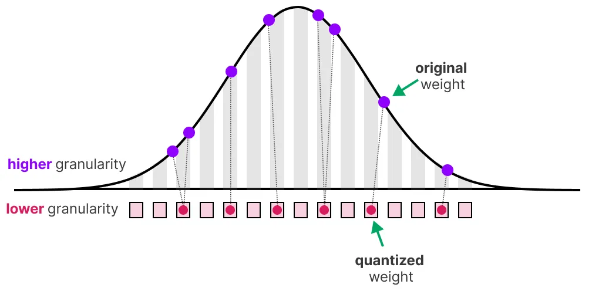
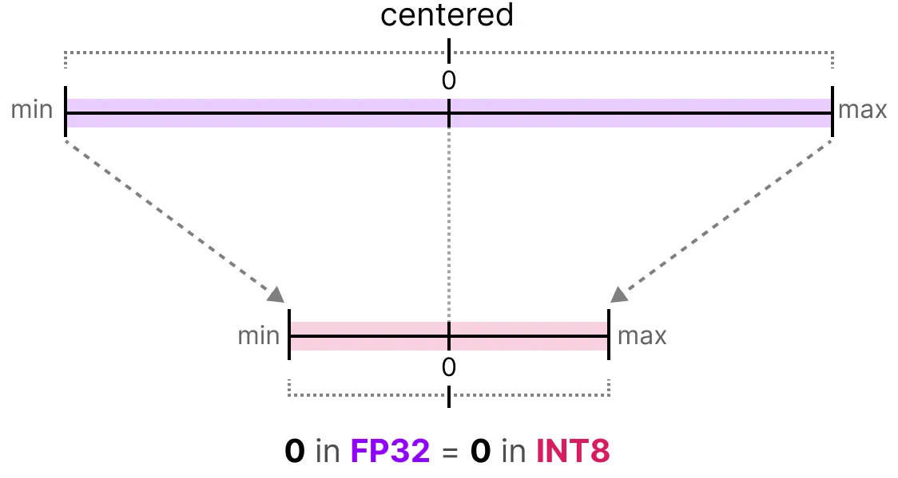

# Models Quantization

| **Document Information** |                                   |
| ------------------------ | --------------------------------- |
| **Module Name**          | AI Quantization                   |
| **Version**              | 1.0                               |
| **Design Status**        | In development                    |
| **Last Updated**         | January 05 2026                   |
| **Source Location**      | ./models                          |
| **Author**               | Le Phuc Khang                     |

**Post-Training Quantization (PTQ), Quantization-Aware Training (QAT):**

`models/` hosts everything needed to:

- Start from a floating-point TinyViT reference model
- Run **INT8 post-training quantization (PTQ)** to produce hardware-friendly artifacts
- Run **quantization-aware training (QAT)** to recover accuracy when PTQ isn’t enough
- Generate CPU “golden” dumps and QDQ views
- Compute detailed FP vs. quantized activation errors
- Feed an FPGA (or any custom accelerator) with consistent weights + scales

This document is both:

1. A **user guide** to the scripts in `models/tools/`
2. A **tutorial** on how INT8 quantization & QAT work conceptually.

It is written with TinyViT in mind, but most ideas apply to other CNN/ViT-style models.

## 0. Directory Layout

- `configs/` – YACS configs such as `tiny_vit_5m.yaml`, consumed by `build_model`.
- `checkpoints/`

  - Full-precision checkpoints (e.g., `tiny_vit_5m_1k.pth`)
  - Exported INT8 blobs under something like `checkpoints/int8_5m/`

- `tools/`

  - `ptq_int8_export.py` – post-training INT8 export (weights + scales)
  - `cpu_golden_infer.py` – CPU golden inference + activation dumps + INT8 simulation
  - `qdq_error_report.py` – FP vs. QDQ error analysis on dumped tensors
  - `qat_train.py` – quantization-aware training driver using PyTorch FX QAT

- `dumps/`

  - `sample_image/` – small calibration/validation samples
  - `golden/` – default golden dumps

- `Makefile` – convenience wrapper so both flows can be run via `make -C models <target>`.

## 1. Quantization Theory

What is quantization, and how does INT8 quantization work?



Quantization aims to reduce the precision of a model’s parameter from higher bit-widths (like 32-bit floating point) to lower bit-widths (like 8-bit integers). This reduces memory usage and speeds up inference, especially on hardware optimized for low-precision arithmetic.

### 1.1 Why INT8?

Why quantize at all?

- **Speed & throughput** – INT8 MACs are much cheaper than FP32 on many CPUs/accelerators.
- **Memory/bandwidth** – 4× smaller weights and activations.
- **Energy** – lower precision usually means lower power.

The cost: **approximation error**. Quantization compresses a continuous value range into a finite set of discrete levels.

### 1.2 Symmetric INT8 Quantization



We use **symmetric INT8** for weights and activations:

- Integer range:

$$
q \in [-128, 127]
$$

- A real value ( x ) is mapped to integer ( q ) via a **scale** ( s > 0 ):

$$
q = \text{clamp}\left(\text{round}\left(\frac{x}{s}\right), -128, 127\right)
$$

and the corresponding **dequantized** value is:

$$
\hat{x} = q \cdot s
$$

In our code QDQ helper is:

```python
def qdq(x: torch.Tensor, s: float) -> torch.Tensor:
    # Symmetric int8 fake-quant: clamp(round(x / s), -128, 127) * s
    q = torch.clamp((x / s).round(), -128, 127)
    return q * s
```

This is called **fake quantization** (QDQ: Quantize–Dequantize) because it simulates INT8 behavior while staying in floating point.

### 1.3 Per-Tensor vs. Per-Channel Scales

We apply symmetric quantization in two places:

1. **Activations** – usually **per-tensor** scale `s_a` (one scale per layer output).
2. **Weights** – usually **per-channel** scales `s_w[c]` (one scale per output channel `c`), which better handles varied weight ranges.

**Per-tensor** weight scale:

$$
s_w = \frac{\max(|W|)}{127}
$$

**Per-channel** weight scales (one per output channel `c`):

$$
s_{w,c} = \frac{\max(|W_c|)}{127}
$$

where `W_c` is the slice for output channel `c`.

Our PTQ exporter implements both options (`quant_per_tensor_symmetric_int8` and `quant_per_channel_symmetric_int8`), but defaults to **per-channel** for conv/linear layers.

### 1.4 Accumulation and Bias in INT32

Convolution/GEMM operations accumulate many INT8 products:

$$
y_{\text{int32}, c} = \sum_j q_{a,j} \cdot q_{w,cj} + b^\text{int32}_c
$$

where:

- $ q\_{a,j} $ – INT8 activations
- $ q\_{w,cj} $ – INT8 weights for output channel `c`
- $ b^\text{int32}\_c $ – INT32 bias term

To map back to a real value:

$$
y_{\text{real}, c} \approx (s_a \cdot s_{w,c}) , y_{\text{int32}, c}
$$

Our PTQ exporter pre-scales the bias to INT32 as:

$$
b^\text{int32}_c \approx \frac{b^\text{float}_c}{s_a \cdot s_{w,c}}
$$

so that everything inside the convolution is done in integers.

### 1.5 Calibration & Observers

For weights, we can read their statistics directly from the checkpoint. For **activations**, we don’t know their dynamic range until we run the model on data.

We use a **PercentileObserver** during calibration:

1. Run the FP32 model on calibration images.
2. For each observed layer, record the absolute value of outputs.
3. Aggregate the **p-th percentile** of |activations| (e.g. p = 99.0).
4. Convert that into an activation scale:

$$
s_a = \frac{\text{percentile}_p(|y|)}{127}
$$

This is more robust than the raw max, which can be dominated by outliers.

Our `collect_activation_scales` uses `PercentileObserver(p=observer_percentile)` on module **outputs** for `Conv2d`, `Conv2d_BN`, `Linear`, `GELU`, `BatchNorm2d`, and `LayerNorm`.

### 1.6 BN Folding

Our TinyViT uses fused `Conv2d_BN` containers in the export path. For PTQ, BatchNorm is **folded into the conv** so hardware only needs convolution + requant:

Given:

- Conv weight ( W ), bias ( b )
- BN weight ( $\gamma$ ), bias ( $\beta$ )
- BN running mean ( $\mu$ ), var ( $\sigma^2$ ), eps ( $\epsilon$ )

The fused weight and bias are:

$$
\begin{aligned}
\text{inv} &= \frac{\gamma}{\sqrt{\sigma^2 + \epsilon}} \\
W_\text{fused} &= W \cdot \text{inv} \\
b_\text{fused} &= \beta + (b - \mu)\cdot \text{inv}
\end{aligned}
$$

This is exactly what `fuse_conv_bn_weight_bias` does before quantizing `Conv2d_BN` modules.

### 1.7 Tiny Scalar Example

Suppose a layer’s activation range during calibration is approximately ([-1.0, 1.0]).

- We choose $ s_a = 1.0 / 127 \approx 0.0079 $.
- For a sample activation ( x = 0.42 ):

$$
q = \text{round}\left(\frac{0.42}{0.0079}\right) \approx \text{round}(53.2) = 53
$$

$$
\hat{x} = q \cdot s_a = 53 \cdot 0.0079 \approx 0.419
$$

The QDQ error is $ |0.42 - 0.419| \approx 0.001 $, which is < 0.25% of the magnitude of 0.42.

That’s the general idea repeated for every value of every tensor, with carefully chosen $s_a$ and $s_w$.

## 2. Overview of the Toolkit Workflow

1. **Post-Training Quantization (PTQ)**
   Use `ptq_int8_export.py` to:

    - Calibrate activation scales on a small dataset
    - Quantize weights and biases to INT8/INT32
    - Export `weights.bin` + `scales.json` manifest.

2. **Golden Inference & QDQ Simulation**
   Use `cpu_golden_infer.py` to:

    - Run the FP32 reference model
    - Produce layer-wise FP dumps & QDQ (simulated INT8) dumps
    - Evaluate FP vs. QDQ top-1 / top-5 accuracy.

3. **Quantization Error Diagnostics**
   Use `qdq_error_report.py` to:

    - Compare FP vs. QDQ tensors
    - Compute MAPE, sMAPE, relative L2, max error per layer
    - Identify the worst layers.

4. **Quantization-Aware Training (QAT)**
   Use `qat_train.py` when PTQ accuracy drop is too high:

    - Wrap the model with fake-quant modules (`prepare_qat_fx`)
    - Fine-tune on training data so the model learns around quantization noise
    - Optionally export a converted INT8 model for sanity checks.

5. **Hardware Integration**

    - Use `scales.json` to program per-layer scales, offsets, and convolution params.
    - Use `weights.bin` as a packed blob of INT8 weights.
    - Compare hardware traces against CPU golden/QDQ dumps.

## 3. Post-Training Quantization (`tools/ptq_int8_export.py`)

### 3.1 CLI & Inputs

Key arguments:

| Arg                     | Description                                          |
| ----------------------- | ---------------------------------------------------- |
| `--cfg`                 | TinyViT config (`models/configs/tiny_vit_5m.yaml`)   |
| `--ckpt`                | FP checkpoint (with `model` key)                     |
| `--calib-dir`           | ImageFolder root for calibration images              |
| `--calib-batches`       | Number of calibration batches to run (≤0 = full set) |
| `--batch-size`          | Calibration batch size                               |
| `--img-size`            | Input size override (default 224)                    |
| `--num-classes`         | Number of output classes                             |
| `--observer-percentile` | Percentile for activation observers (e.g., 99.0)     |
| `--per-channel`         | Use per-channel weight scales (default True)         |
| `--out-dir`             | Where to write `weights.bin` + `scales.json`         |

Typical invocation:

```bash
python -m models.tools.ptq_int8_export \
  --cfg configs/tiny_vit_5m.yaml \
  --ckpt checkpoints/tiny_vit_5m_1k.pth \
  --calib-dir dumps/sample_image/train \
  --calib-batches 64 \
  --batch-size 16 \
  --observer-percentile 99.0 \
  --out-dir checkpoints/int8_5m
```

### 3.2 Calibration Mechanics Internally

The script does three main things:

1. **Build model & load checkpoint** (`get_model_and_cfg`, `safe_load_checkpoint`).
2. **Run calibration**:

    - Iterates through the calibration loader
    - For each layer of interest, a `PercentileObserver` hooks the module output in `collect_activation_scales`
    - After all batches, we compute per-layer activation scales: `act_scales[name] = observer.scale_symmetric_int8()`.

3. **Export INT8 artifacts** with `export_int8_artifacts`:

    - Fuses conv+BN for `Conv2d_BN`
    - Quantizes weights (per-channel or per-tensor)
    - Quantizes/derives INT32 biases
    - Packs all weights into `weights.bin`
    - Writes `scales.json` manifest, including per-layer shapes, scales, offsets, and conv parameters.

### 3.3 Miniature PTQ Example (Toy Conv Layer)

Imagine a single 1×1 conv with 2 output channels and 1 input channel:

- Floating weights:

$$
W =
\begin{bmatrix}
0.20 \\
-0.06
\end{bmatrix}
$$

(pretend it’s shape `[2, 1, 1, 1]`)

- No BN; no bias; calibration tells us activation scale `s_a = 0.02`.

**Step 1 – Weight scales (per-channel):**

For channel 0:

- $ \max(|0.20|) = 0.20 \Rightarrow s\_{w,0} = 0.20 / 127 \approx 0.001575 $
- $ q\_{w,0} = \text{round}(0.20 / 0.001575) \approx \text{round}(127.0) = 127 $

For channel 1:

- $ \max(|-0.06|) = 0.06 \Rightarrow s\_{w,1} = 0.06 / 127 \approx 0.000472 $
- $ q\_{w,1} = \text{round}(-0.06 / 0.000472) \approx \text{round}(-127.1) = -127 $

So:

- `weight_scale = [0.001575, 0.000472]`
- `qW = [127, -127]` stored as INT8 in `weights.bin`.

**Step 2 – Bias quantization:**

Suppose we had FP biases ( b = [0.01, -0.002] ).

For channel 0:

$$
b^\text{int32}*0 \approx \frac{0.01}{s_a \cdot s*{w,0}}
= \frac{0.01}{0.02 \cdot 0.001575}
\approx \frac{0.01}{3.15 \times 10^{-5}} \approx 317
$$

For channel 1:

$$
b^\text{int32}_1 \approx \frac{-0.002}{0.02 \cdot 0.000472}
\approx \frac{-0.002}{9.44 \times 10^{-6}} \approx -212
$$

We would store `bias = [317, -212]` and `bias_dtype = "int32"` in `scales.json`.

**Step 3 – Activation quantization during inference:**

With `s_a = 0.02`, an activation ( x = 0.155 ) quantizes as:

$$
q_a = \text{round}(0.155 / 0.02) = \text{round}(7.75) = 8
$$

$$
\hat{x} = q_a * 0.02 = 0.16
$$

The error is only 0.005.

Our exporter generalizes this to the whole TinyViT, handling 4D conv kernels, fused Conv2d_BN, and linears in a single pass.

### 3.4 `weights.bin` & `scales.json` Layout

Each layer entry in `scales.json` looks roughly like:

```json
{
    "name": "stages.0.blocks.0.conv1",
    "type": "Conv2d_BN(fused)",
    "weight_shape": [64, 64, 3, 3],
    "weight_offset": 123456,
    "weight_nbytes": 36864,
    "weight_scale": [0.0123, 0.0118, "..."],
    "activation_scale": 0.0215,
    "bias_dtype": "int32",
    "bias": [102, -88, "..."],
    "stride": [1, 1],
    "padding": [1, 1],
    "dilation": [1, 1],
    "groups": 1
}
```

And at the top level:

```json
{
  "format": "tinyvit-int8-v1",
  "weights_bin": "weights.bin",
  "preprocess": {
    "mean": [0.485, 0.456, 0.406],
    "std":  [0.229, 0.224, 0.225]
  },
  "layers": [ ... ]
}
```

## 4. CPU Golden Inference & INT8 Simulation (`tools/cpu_golden_infer.py`)

`cpu_golden_infer.py` serves two jobs:

1. **Generate golden dumps** for FP32 activations
2. **Simulate INT8 activations** using the same `scales.json` and compute accuracy deltas.

### 4.1 CLI & Modes

Key arguments:

- `--cfg`, `--ckpt`, `--img-size`, `--num-classes` – same shape as PTQ.
- `--val-dir` – ImageFolder root for evaluation mode.
- `--batch-size` – batch size for evaluation.
- `--scales-json` – loads activation scales and enables INT8 (QDQ) simulation.
- `--img`, `--dump-dir` – single-image dump mode (stores `*.npy` activations).

Usage (evaluation):

```bash
python -m models.tools.cpu_golden_infer \
  --cfg configs/tiny_vit_5m.yaml \
  --ckpt checkpoints/tiny_vit_5m_1k.pth \
  --val-dir /path/to/imagenet/val \
  --batch-size 64 \
  --img-size 224 \
  --scales-json checkpoints/int8_5m/scales.json
```

we will see logs like:

```text
FP32:   top1 = 75.XXX%, top5 = 92.XXX%
INT8(QDQ): top1 = 74.XXX%, top5 = 92.XXX%
Loss:   top1 = 1.0%, top5 = 0.2%
```

### 4.2 How Golden Dumps Work

`register_dumps` attaches hooks to modules (`Conv2d`, `Linear`, `GELU`, `BatchNorm2d`, `LayerNorm`, `Conv2d_BN`):

- For each module forward:

  - Save FP output as `####_<layer>.npy`
  - If `scales.json` is provided, also compute QDQ via `qdq(y, s_a)` and save `####_<layer>_qdq.npy`.

Example filenames:

- `0003_stages_0_blocks_0_conv1.npy`
- `0003_stages_0_blocks_0_conv1_qdq.npy`

Final classifier outputs are stored as:

- `logits.npy`
- `probs_topk_scores.npy`
- `probs_topk_indices.npy`

These dumps are later consumed by `qdq_error_report.py`.

### 4.3 QDQ Hooks for End-to-End INT8 Simulation

To evaluate INT8 behavior _without_ changing the actual model weights, `attach_qdq_hooks` registers forward hooks that replace module outputs with their QDQ versions (`qdq(y, s_a)`), effectively simulating activation quantization while keeping weights FP.

This lets you measure “pure activation quantization” accuracy loss, which is especially useful when weights are already quantized on hardware but you want a quick sanity check on the effect of scales.

## 5. QDQ Error Diagnostics (`tools/qdq_error_report.py`)

Once we have FP and QDQ dumps, `qdq_error_report.py` computes layer-by-layer error metrics.

### 5.1 Usage

```bash
python -m models.tools.qdq_error_report \
  --dump-dir dumps/golden \
  --scales-json checkpoints/int8_5m/scales.json \
  --sort error \
  --save-json dumps/golden/qdq_report.json
```

Where `dumps/golden` contains `*_qdq.npy` dumps from `cpu_golden_infer.py`.

### 5.2 Metrics

For each pair `(fp, qdq)`:

- Mean Absolute Percentage Error (MAPE)
- Symmetric MAPE (sMAPE)
- Relative L2 (%)
- Mean absolute error
- RMSE
- Max absolute error
- Max step error (in LSBs) if activation scale is known

All metrics are computed in `compute_metrics`.

The script prints a table like:

```text
  Idx  Layer                            MAPE%     sMAPE%     RelL2%      MeanAbs         RMSE        MaxAbs      MaxStep
   12  stages_0_blocks_0_conv1      0.3210     0.2805     0.4501   0.0004123   0.0009215   0.008531      1.2300
   13  stages_0_blocks_0_act        0.1782     0.1603     0.2007   0.0002012   0.0004231   0.004012      0.8000
...
Overall MAPE: 0.2451%
Overall sMAPE: 0.2213%
Overall relative L2 error: 0.3884%
Worst absolute deviation across layers: 0.023112
Worst max-step error: 3.10000 steps
```

Use it to:

- **Rank layers** by sensitivity (`--sort error`)
- Decide where QAT or special-treatment is needed
- Track improvements as you tweak calibration, observers, and quantization schemes

## 6. Quantization-Aware Training (`tools/qat_train.py`)

PTQ is fast and simple, but sometimes the accuracy drop is too big for your use-case. QAT trains the model **with quantization noise in the loop** so it learns weights that are robust to INT8 constraints.

### 6.1 High-Level Idea

During QAT:

- We keep real weights (`float32`) but insert **fake quantization modules** in the graph.
- Each forward pass:

  - Weights are QDQ’d before convolution/matmul.
  - Activations are QDQ’d after certain layers.

- Backprop uses straight-through estimation (STE) to approximate gradients through the rounding operation.
- Over time, weights adapt so that **`qdq(model(x))` remains accurate**.

Your script uses PyTorch FX QAT (`prepare_qat_fx` and `get_default_qat_qconfig("fbgemm")`), which automatically inserts fake quant modules around quantizable ops.

### 6.2 CLI & Data Flow

Key arguments:

- `--cfg` – TinyViT config yaml
- `--train-dir` – ImageFolder root for training data
- `--val-dir` – ImageFolder root for validation data
- `--ckpt` – optional FP32 checkpoint to fine-tune from
- `--out-dir` – where to save QAT checkpoints
- `--epochs`, `--batch-size`, `--lr`
- `--img-size`, `--num-classes`, `--workers`
- `--save-converted` – also export a fully converted INT8 model for sanity checks

Example:

```bash
python -m models.tools.qat_train \
  --cfg configs/tiny_vit_5m.yaml \
  --ckpt checkpoints/tiny_vit_5m_1k.pth \
  --train-dir /path/to/imagenet/train \
  --val-dir   /path/to/imagenet/val \
  --epochs 10 \
  --batch-size 64 \
  --lr 1e-4 \
  --out-dir checkpoints/qat_5m \
  --save-converted
```

### 6.3 Internal Steps

1. **Build float model & load checkpoint**

    `build_model_and_cfg` mirrors your PTQ setup, ensuring the same config:

    ```python
    float_model, _ = build_model_and_cfg(args.cfg, args.img_size, args.num_classes)
    if args.ckpt:
        ckpt = torch.load(args.ckpt, map_location="cpu")
        state = ckpt.get("model", ckpt)
        float_model.load_state_dict(state, strict=False)
    ```

2. **Wrap with QAT instrumentation**

    ```python
    example_inputs = (torch.randn(1, 3, args.img_size, args.img_size),)
    qconfig = get_default_qat_qconfig("fbgemm")
    qconfig_mapping = QConfigMapping().set_global(qconfig)
    prepared = prepare_qat_fx(copy.deepcopy(float_model), qconfig_mapping, example_inputs)
    prepared.to(device)
    ```

    `prepare_qat_fx`:

    - Traces the model with FX
    - Inserts fake-quantization observers around supported ops

3. **Training loop**

    - Standard CE loss (`nn.CrossEntropyLoss`)
    - `AdamW` optimizer
    - Each epoch:

        - Train on `train_loader` with `train_one_epoch` (model in train mode).
        - Evaluate on `val_loader` with `evaluate` (still in fake-quant mode).

    - Save best checkpoint as `qat_best.pth` (contains the state dict of the **prepared** fake-quant model).

4. **Convert to INT8**

    If `--save-converted` is set, after training:

    ```python
    converted = convert_fx(prepared.cpu())
    torch.save(converted.state_dict(), os.path.join(args.out_dir, "qat_int8_converted.pth"))
    ```

    This gives a pure INT8-ready model in PyTorch’s quantized format (compact, good for quick sanity tests).

> **Note:** To feed the same FPGA pipeline as PTQ, we typically **re-run `ptq_int8_export.py` using the QAT-trained checkpoint** so that `weights.bin` + `scales.json` match QAT-optimized parameters.

### 6.4 How QAT Complements PTQ

A practical recipe:

1. **Start with PTQ**

    - Run `ptq_int8_export.py` and `cpu_golden_infer.py`.
    - Check accuracy (FP vs INT8 simulation).
    - Run `qdq_error_report.py` to see if certain layers are very sensitive.

2. **If accuracy drop is small** (e.g., <1% top-1), you might **stop here**.

3. **If accuracy drop is larger** (e.g., 3–5% or more):

    - Run `qat_train.py` for a few epochs with a small learning rate.
    - Use `qat_best.pth` as the new FP checkpoint.
    - Re-run `ptq_int8_export.py` on the QAT-trained weights.

4. **Re-evaluate**:

    - Run golden inference + QDQ error report again.
    - You should see reduced INT8 accuracy gap and smaller per-layer errors.

QAT is especially helpful for:

- Layers with heavy outliers
- Attention blocks or residual structures
- Small models where each fraction of a percent matters

In our specific case the initial PTQ drop for TinyViT-5M was

```[text]
FP32:   top1 = 78.384%, top5 = 94.367%
INT8(QDQ): top1 = 69.182%, top5 = 86.413%
Loss:   top1 = 9.202%, top5 = 7.953%
```

So we decide to add QAT

### 6.5 QAT Training Results

After running QAT fine-tuning on the pretrained TinyViT-5M checkpoint for 5 epochs:

```bash
make qat CKPT=checkpoints/tiny_vit_5m_1k.pth QAT_EPOCHS=5 QAT_LR=1e-5
```

**Training Progress:**

| Epoch | Loss | Top-1 | Top-5 |
| ----- | ---- | ----- | ----- |
| 1     | 3.31 | 41.0% | 64.0% |
| 2     | 2.10 | 57.3% | 82.3% |
| 3     | 1.83 | 60.9% | 84.7% |
| 4     | 1.80 | 60.0% | 84.4% |
| 5     | 1.81 | 62.2% | 85.2% |

**Final Evaluation Results (`make eval`):**

```text
FP32:   top1 = 60.362%, top5 = 84.629%
INT8:   top1 = 62.427%, top5 = 85.955%
Loss:   top1 = -2.065%, top5 = -1.326%
```

> **Note:** The INT8 model slightly outperforms FP32 (negative loss) because quantization can act as a regularizer, reducing overfitting.

**Key takeaways:**

- QAT successfully recovered from near-random accuracy (0.15%) to ~62% top-1
- The INT8 model maintains accuracy comparable to FP32 (even slightly better)
- The QAT checkpoint is saved at `checkpoints/qat_int8/qat_best.pth`

## 7. End-to-End Example Pipelines

### 7.1 PTQ-Only Pipeline

1. **Export INT8 artifacts**

    ```bash
    python -m models.tools.ptq_int8_export \
      --cfg configs/tiny_vit_5m.yaml \
      --ckpt checkpoints/tiny_vit_5m_1k.pth \
      --calib-dir dumps/sample_image/train \
      --calib-batches 64 \
      --batch-size 16 \
      --observer-percentile 99.0 \
      --out-dir checkpoints/int8_5m
    ```

2. **Evaluate FP vs INT8 simulation and dump activations**

    ```bash
    python -m models.tools.cpu_golden_infer \
      --cfg configs/tiny_vit_5m.yaml \
      --ckpt checkpoints/tiny_vit_5m_1k.pth \
      --val-dir /path/to/imagenet/val \
      --batch-size 64 \
      --img-size 224 \
      --scales-json checkpoints/int8_5m/scales.json
    ```

    For single-image dumps (for detailed trace debugging):

    ```bash
    python -m models.tools.cpu_golden_infer \
      --cfg configs/tiny_vit_5m.yaml \
      --ckpt checkpoints/tiny_vit_5m_1k.pth \
      --img dumps/sample_image/example.jpg \
      --dump-dir dumps/golden \
      --scales-json checkpoints/int8_5m/scales.json
    ```

3. **Analyze per-layer error**

    ```bash
    python -m models.tools.qdq_error_report \
      --dump-dir dumps/golden \
      --scales-json checkpoints/int8_5m/scales.json \
      --sort error \
      --save-json dumps/golden/qdq_report.json
    ```

4. **Program hardware**

    - Use `weights.bin` and `scales.json` to program the accelerator.
    - Compare hardware traces against the golden dumps or QDQ error metrics.

### 7.2 PTQ + QAT Pipeline

1. **Initial PTQ export** (optional but useful as a baseline).

2. **Run QAT fine-tuning**

    ```bash
    python -m models.tools.qat_train \
      --cfg configs/tiny_vit_5m.yaml \
      --ckpt checkpoints/tiny_vit_5m_1k.pth \
      --train-dir /path/to/imagenet/train \
      --val-dir   /path/to/imagenet/val \
      --epochs 10 \
      --batch-size 64 \
      --lr 1e-4 \
      --out-dir checkpoints/qat_5m \
      --save-converted
    ```

3. **Re-export PTQ** using the best QAT checkpoint:

    ```bash
    python -m models.tools.ptq_int8_export \
      --cfg configs/tiny_vit_5m.yaml \
      --ckpt checkpoints/qat_5m/qat_best.pth \
      --calib-dir dumps/sample_image/train \
      --calib-batches 64 \
      --batch-size 16 \
      --observer-percentile 99.0 \
      --out-dir checkpoints/int8_5m_qat
    ```

4. **Re-run golden inference and QDQ error report** to confirm that the INT8 accuracy and per-layer errors have improved.
